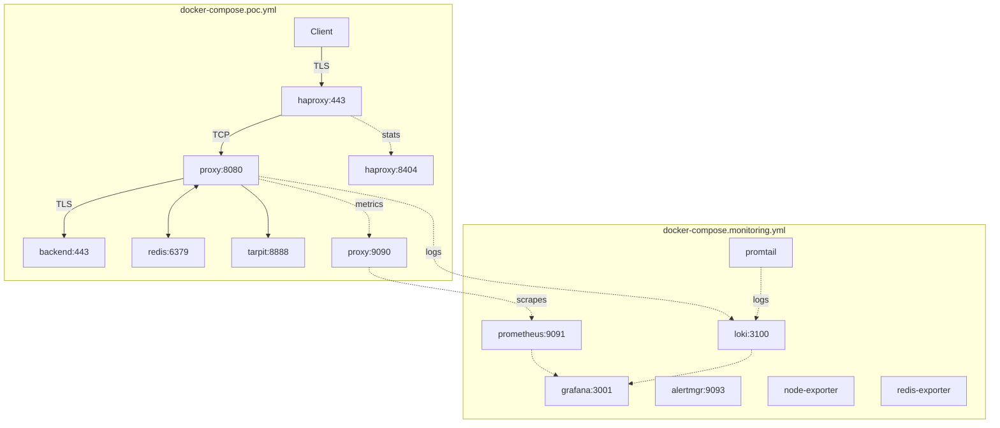

# JA4proxy — TLS Fingerprinting Security Proxy

A security proxy that extracts [JA4 TLS fingerprints](https://github.com/FoxIO-LLC/ja4) from the plaintext ClientHello and blocks malicious traffic before it reaches your backend — without decrypting TLS.

> **Status:** POC ✅ Ready for demo &nbsp;|&nbsp; Production ⚠️ Requires hardening  
> **Security:** Auto-generated secrets, localhost-only ports, read-only containers. See [Security Checklist](docs/security/SECURITY_CHECKLIST.md).

## How It Works

Everything runs in Docker. Two Compose files manage the stack:



1. Client sends a TLS ClientHello (plaintext, before encryption)
2. JA4proxy reads the ClientHello, extracts the JA4 fingerprint
3. **Security pipeline** decides: allow, tarpit, block, or ban
4. Allowed traffic is forwarded unchanged — TLS handshake completes client↔backend
5. The proxy never decrypts, never holds keys

## Quick Start

```bash
# Start everything (proxy + monitoring + Grafana)
make start

# Generate test traffic (60s, 10% legitimate, 20 workers)
./scripts/generate-tls-traffic.sh 60 10 20

# Open Grafana dashboard
xdg-open http://localhost:3001  # Linux
# open http://localhost:3001    # macOS

# Reset security state between test runs (keeps whitelist/blacklist)
make flush-redis
```

**That's it.** The dashboard shows allowed vs blocked traffic, JA4 fingerprint names, action distribution, and logs. See [Performance](#performance) for measured results.

### First-time setup on a new machine

`.env` must exist before any `make` target runs (copy from `.env.example` and set `BACKEND_HOST`). After that:

```bash
make rebuild          # wipe everything, rebuild all images from scratch, start stack
make update-geoip     # download IP2Location LITE country database (required for GeoIP blocking)
make go-build         # build Go proxy binary — only needed if using the Go proxy
```

`make rebuild` is also the right command after pulling major changes that affect Docker images.

## Security Pipeline

Connections pass through layers in order. Bypass checks short-circuit the pipeline — connection is allowed or blocked immediately without reaching the scorer.

| Layer | Check | Action |
|-------|-------|--------|
| 0 | **IP trust & normalisation** | Extract real client IP from PROXY protocol; normalise IPv4/IPv6 |
| 0b | **Static IP allowlist** | IP in configured allowlist → ALLOW immediately (no scoring) |
| 0c | **GeoIP country block** | Static (IP2Location LITE) + Redis-backed country blacklist → BLOCK |
| 0d | **CIDR block** | Redis-backed subnet blocks (e.g. `/24`) — refreshed every 30s → BLOCK |
| 0e | **Spamhaus DROP/EDROP** | Known-bad CIDR feed (in-process trie) → BLOCK immediately |
| 1 | **ALPN browser bypass** | `h2`/`h1` ALPN = modern browser → ALLOW immediately (never scored) |
| 1b | **JA4 whitelist bypass** | Known-good fingerprint → ALLOW immediately |
| 1c | **mTLS client cert** | Valid client certificate → ALLOW immediately |
| 2 | **JA4 blacklist** | Known-bad fingerprint → BLOCK immediately (TCP RST) |
| 3 | **TLS enforcement** | TLS 1.0/1.1/SSLv3 → BLOCK; weak ciphers → scored signal |
| 4–8 | **Signal collection** | TLS version, SNI, TCP behaviour, ASN/datacenter, FCrDNS, rate limiting → risk signals |
| 9 | **Attacker Attribution** | Stable fingerprinting (JA4+JA4X+JA4T); cross-IP correlation → risk escalation |
| 10 | **Behavioral Analysis** | Sequential probing, coordinated bursts, and fingerprint drift detection → risk signals |
| 11 | **Risk scorer** | Aggregates all signals (with confidence weighting) → score 0–100 |
| 12 | **Action decider (dial)** | Score × dial setting → allow / flag / rate_limit / tarpit / block / ban |

Blocking actions escalate with TTL: **suspicious → tarpit → block → ban** (default 5-min TTL; self-healing).
At dial=0 (default): all traffic passes, everything scored and logged — monitor mode only.

## Kubernetes Deployment (Helm)

```bash
# Add the chart and install
helm install ja4proxy ./deploy/helm/ja4proxy \
  --set secrets.redisPassword="<password>" \
  --set secrets.abuseipdbApiKey="<key>" \
  --set proxy.backendHost="backend.internal" \
  --namespace ja4proxy --create-namespace

# Upgrade in-place
helm upgrade ja4proxy ./deploy/helm/ja4proxy \
  --reuse-values \
  --set proxy.dialSetting=50

# Validate the chart
helm lint deploy/helm/ja4proxy/
helm template ja4proxy deploy/helm/ja4proxy/ | kubectl apply --dry-run=client -f -
```

Key values (see `deploy/helm/ja4proxy/values.yaml`):

| Key | Default | Description |
|-----|---------|-------------|
| `proxy.dialSetting` | `0` | Monitor mode (0) to full blocking (100) |
| `proxy.replicas` | `2` | Pod count (HPA overrides when enabled) |
| `hpa.enabled` | `true` | Horizontal pod autoscaler |
| `hpa.minReplicas` | `2` | Minimum pods |
| `hpa.maxReplicas` | `20` | Maximum pods |
| `monitoring.enabled` | `false` | Create Prometheus ServiceMonitor |
| `redis.external` | `true` | Use external Redis (false = bundle dev Redis) |
| `secrets.create` | `true` | Create Secret resource; use Vault/ESO in prod |

## Services

| Service | URL | Notes |
|---------|-----|-------|
| HAProxy (LB) | `https://localhost:443` | TLS passthrough, PROXY protocol v2 |
| HAProxy stats | `http://localhost:8404/stats` | |
| JA4proxy | `http://localhost:8080` | Proxy + metrics on :9090 |
| Backend | `https://localhost:8443` | Protected HTTPS server |
| Tarpit | `http://localhost:8888` | 1 byte/sec slow drain |
| Prometheus | `http://localhost:9091` | |
| Grafana | `http://localhost:3001` | admin / see .env |
| Loki | `http://localhost:3100` | Centralized container logs (internal only) |
| Alertmanager | `http://localhost:9093` | |
| Management UI | *(Phase 13 — in refactor)* | Lightweight FastAPI backend + React dashboard |

## Configuration

All config is in [`config/proxy.yml`](config/proxy.yml). Key sections:

### Country Filtering (GeoIP)

```yaml
geoip:
  country_whitelist_enabled: true     # Only allow listed countries
  country_whitelist:
    - "IE"  # Ireland
    - "GB"  # United Kingdom
    - "IM"  # Isle of Man
    - "US"  # United States

  country_blacklist_enabled: true     # Block listed countries
  country_blacklist:
    - "KP"  # North Korea
    - "RU"  # Russia
```

### JA4 Fingerprint Lists

```yaml
security:
  whitelist:
    - "t13d1516h2_8daaf6152771_02713d6af862"  # Chrome

  whitelist_patterns:
    - "h2"  # HTTP/2 ALPN — modern browser (Chrome, Firefox, Safari, Edge)
    - "h1"  # HTTP/1.1 ALPN — older browser or browser in HTTP/1.1 fallback mode

  blacklist:
    - "t13d190900_9dc949149365_97f8aa674fd9"  # Sliver C2
```

### Rate Limiting

```yaml
security:
  # Requires 2 of 3 strategies to agree before blocking (eliminates single-strategy false positives)
  multi_strategy_policy: "majority"   # options: any | majority | all

  rate_limit_strategies:
    by_ip:
      thresholds:
        suspicious: 50   # connections/sec from one IP
        block: 200
        ban: 500
      action: "tarpit"
      ban_duration: 300  # seconds (5 min; self-healing)
    by_ja4:
      thresholds:
        suspicious: 20   # connections/sec sharing a fingerprint
        block: 100
        ban: 200
      action: "block"
      ban_duration: 300
    by_ip_ja4_pair:
      thresholds:
        suspicious: 20   # connections/sec from same IP+fingerprint
        block: 50
        ban: 100
      action: "tarpit"
      ban_duration: 300
```

## JA4 Fingerprint Names

The proxy decodes JA4 fingerprints into human-readable names automatically:

| JA4 Prefix | Classification | Example |
|------------|---------------|---------|
| `*h2*` | Browser (TLS 1.3) | Chrome, Firefox, Safari |
| `t13d*00*` | Tool/Bot (TLS 1.3) | Sliver C2, Evilginx |
| `t12d*00*` | Tool/Bot (TLS 1.2) | CobaltStrike, Python bot |

Names appear in logs, Prometheus metrics (`fingerprint_name` label), and Grafana panels.

Known fingerprints can be mapped to specific names in `config/proxy.yml` → `fingerprint_labels`.

## Logs

All container logs flow to **Loki** and are visible in Grafana. Proxy log format:

```
ALLOWED:  172.19.0.10 | Country: IE | JA4: t13d1113h2_... | Name: Browser (TLS 1.3) | TLS: TLS 1.3
BLOCKED:  185.220.0.1 | Country: RU | JA4: t13d0912...   | Name: Tool/Bot (TLS 1.3) | Reason: Banned for 604800s
```

View logs:
```bash
docker compose -f docker-compose.poc.yml logs -f proxy    # Proxy decisions
docker compose -f docker-compose.poc.yml logs -f backend   # Backend requests
docker compose -f docker/docker-compose.monitoring.yml logs -f  # Monitoring stack
```

## Performance

Measured with 200 concurrent workers (300s run, 15% legitimate traffic):

| Metric | Result |
|--------|--------|
| **False positive rate** | **0%** — all browser connections whitelisted, none blocked |
| **Malicious traffic blocked** | **94–99%** depending on load |
| **Block TTL** | **300s** (5 min) — false positives self-heal automatically |
| **Throughput (single instance, Python)** | ~350 conn/s with Redis; ~550 conn/s in-process only |
| **Throughput (4 instances, Python)** | ~1,400 conn/s (`./scale-proxies.sh 4`) |
| **Throughput (Go proxy, target)** | 10–50× Python — see [Go Proxy](#running-the-go-proxy) |

Browser connections (Chrome, Firefox, Safari) are matched by `h1`/`h2` ALPN pattern whitelist and bypass rate limiting entirely — they can never be blocked by rate rules regardless of volume.

## Traffic Generator

Generates realistic TLS traffic with distinct fingerprints per client profile:

```bash
./scripts/generate-tls-traffic.sh <duration_secs> <legit_percent> <workers>

# Examples
./scripts/generate-tls-traffic.sh 60 10 20    # 60s, 10% good, 20 workers (quick demo)
./scripts/generate-tls-traffic.sh 300 15 50   # 5-min assessment run

# Reset Redis state between runs (preserves whitelist/blacklist config)
make flush-redis
```

Profiles: Chrome, Firefox, Safari (legitimate) + Sliver C2, CobaltStrike, Evilginx, Python bot, Credential stuffer (malicious).

After the run, the script prints a clean summary table:

```
Requests by fingerprint + action:
  Browser (TLS 1.3)              allowed    2728
  Tool/Bot (TLS 1.2)             blocked    40018

Blocked requests by action type:
  ban          90654
  tarpit       14
  ─────────────────────
  Total blocked  90668
```

## Documentation

**📖 [Documentation Index](docs/INDEX.md)** — **Start here** — All documentation organized by your role (Operator, Architect, Developer, Auditor)

**Getting started and operations:**
- **[POC Quick Start](docs/POC_QUICKSTART.md)** — 5-minute setup guide
- **[SecOps Operations Guide](docs/SECOPS_OPERATIONS.md)** — Backend config, passwords, start/stop, maintenance
- **[Incident Response Runbook](docs/INCIDENT_RESPONSE.md)** — Step-by-step attack response
- **[Quick Reference](docs/QUICK_REFERENCE.md)** — Command cheat sheet
- **[FAQ](docs/FAQ.md)** — Common operational questions

**Security and compliance:**
- **[Security Audit](docs/security/COMPREHENSIVE_SECURITY_AUDIT.md)** — Vulnerability assessment
- **[Security Checklist](docs/security/SECURITY_CHECKLIST.md)** — Pre-deployment validation
- **[Redis Security](docs/REDIS_SECURITY_REVIEW.md)** — POC status and production hardening
- **[GDPR Compliance](docs/compliance/GDPR_COMPLIANCE.md)** — Data handling and retention
- **[DMZ Deployment Readiness](docs/DMZ_DEPLOYMENT_READINESS.md)** — Security gap analysis

**Reference:**
- **[Monitoring Setup](docs/MONITORING_SETUP.md)** — Prometheus, Grafana, Loki, Alertmanager
- **[TLS Traffic Generator](docs/TLS_TRAFFIC_GENERATOR.md)** — Test traffic profiles
- **[Performance Benchmark](docs/reports/PERFORMANCE_BENCHMARK.md)** — Throughput and scaling data
- **[Architecture](docs/architecture/system-architecture.md)** — Target enterprise architecture
- **[Changelog](CHANGELOG.md)** — Version history

## Scaling

The POC runs a single proxy instance (~210 conn/s). To scale up:

```bash
./scripts/scale-proxies.sh 4    # Scale to 4 proxy instances (~840 conn/s)
./scripts/scale-proxies.sh 1    # Reset to single instance
```

This automatically scales containers and reconfigures HAProxy for round-robin. All instances share Redis, so bans are enforced cluster-wide. See [Performance Benchmark](docs/reports/PERFORMANCE_BENCHMARK.md) for throughput data.

## Codebase

| Category | Lines | What |
|---|---:|---|
| **Python proxy core** | ~26,087 | `proxy.py` + `src/security/` + `src/cache/` + `src/config/` — TLS parsing, JA4 fingerprinting, all signal modules, pipeline, rate limiting |
| **Go proxy core** | ~4,966 | `cmd/proxy/` + `internal/` — high-throughput replacement; in active development (Phase 15) |
| **Tests** | ~60,581 | 1,600 tests — unit, integration, chaos, adversarial, performance (1.2× test-to-code ratio) |
| **Supporting services** | ~12,624 | Tarpit server, mock backend, performance tools |
| **Infrastructure** | ~4,399 | Dockerfiles, Compose files, shell scripts |
| **Total** | **~108,657** | |

Plus: ~48,400 lines of documentation across 106 files (architecture, runbooks, phase plans, security audit, compliance).

## Stopping Services

```bash
make stop              # Stop everything (keep Redis data)
make stop-clean        # Stop and wipe all volumes (fresh slate)
make rebuild           # Full clean rebuild from scratch — wipe volumes + images, rebuild, start
./scripts/stop-all.sh          # same as make stop
./scripts/stop-all.sh --clean  # same as make stop-clean
```

## Running the Go Proxy

The Go proxy is a drop-in replacement for `proxy.py`, targeting 10–50× higher throughput by removing the Python GIL.

> **Status (Phase 15 — in progress):** Core pipeline, JA4 fingerprinting, bypass checks, and Redis integration are complete. Signal modules (SNI, ASN, beaconing, AbuseIPDB, etc.) are being ported. Until Phase 15 is complete the Go proxy always scores 0 → allow, making it suitable for shadow/parallel validation but not standalone blocking.

### Build

```bash
GOROOT=/snap/go/current go build -o bin/ja4proxy ./cmd/proxy
```

### Parallel Validation (Recommended)

Run Go proxy on port 8082 alongside the Python proxy on 8080:

```bash
docker compose -f docker-compose.poc.yml -f docker-compose.go.yml up -d go-proxy
```

Verify health:
```bash
curl http://localhost:9092/health
# {"redis":"ok","status":"ok"}
```

Check metrics:
```bash
curl -s http://localhost:9092/metrics | grep ja4proxy_connections_total
```

Run integration tests:
```bash
python3 -m pytest tests/integration/test_go_python_parity.py -v
```

### HAProxy Switching

Once validated, switch HAProxy to point to the Go proxy:

```haproxy
backend ja4proxy
    server go-proxy ja4proxy-go:8080 check
    # server python-proxy ja4proxy:8080 check backup
```

### Rollback

Restore the Python proxy in HAProxy config and reload. The Python proxy is kept in
place and can be re-enabled within seconds.

See `docs/runbooks/go_proxy_migration.md` for the full step-by-step procedure.

### Benchmarking Go vs Python

A comprehensive benchmark suite compares throughput, latency, cache effects, and adversarial
behaviour across both proxy implementations.

```bash
# Full benchmark (starts Docker services automatically, ~25–35 min)
make bench

# Quick sanity run, 10 s per scenario (~8–12 min; both proxies must be running)
make bench-quick

# Go proxy only, extended sustained-load test
make bench-go ARGS="--scenarios sustained_load --duration-long 120"

# Pass arbitrary flags
make bench ARGS="--scenarios peak_throughput,throughput_scaling --max-threads 64"
```

Reports are written to `reports/benchmark/YYYY-MM-DD_HH-MM-SS/`:

| File | Contents |
|------|----------|
| `report.md` | Human-readable Markdown: executive summary, per-scenario tables, ASCII charts, Phase 15 gate check |
| `raw_results.json` | Full JSON data for all scenarios |
| `scenarios/NN_name.json` | Per-scenario breakdown |
| `benchmark.log` | Full console output |
| `sysinfo.txt` | Host CPU, RAM, OS, binary versions |

Ten scenario groups are run against both proxies in sequence:
`baseline_latency`, `throughput_scaling`, `peak_throughput`, `mixed_traffic`,
`sustained_load`, `warm_cache`, `cold_cache`, `burst_load`, `adversarial_tls`,
`latency_percentiles`.

