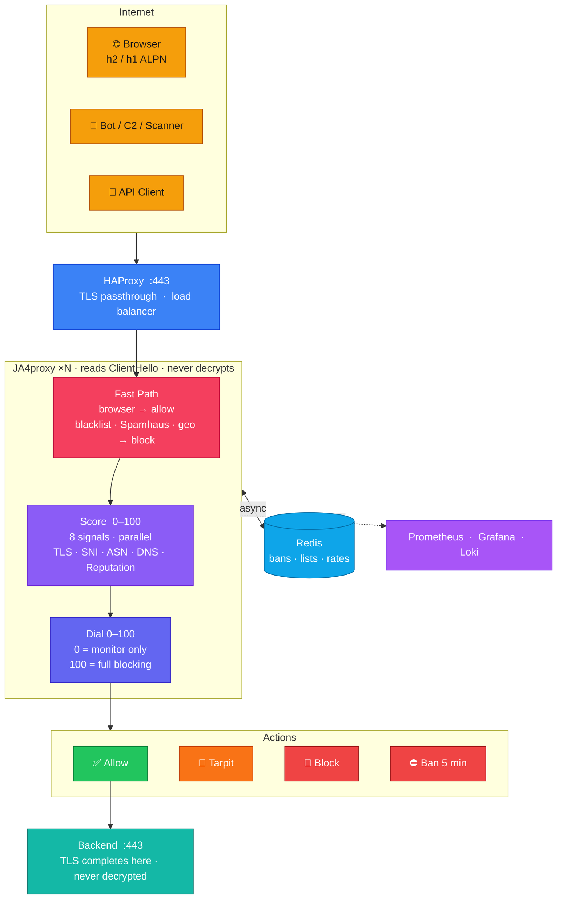

# JA4proxy

**Blocks bots, C2 frameworks, and scanners in the TLS layer — without decrypting a single byte.**

The TLS ClientHello is sent in plaintext before encryption begins. It contains enough metadata — cipher suites, extensions, ALPN, elliptic curves — to distinguish a real browser from a C2 implant, even when both connect from the same IP range. JA4proxy computes a [JA4 fingerprint](https://github.com/FoxIO-LLC/ja4) from that metadata, runs it through a multi-signal scoring pipeline, and makes its allow/block decision before the TLS handshake completes. Clean connections are forwarded byte-for-byte unchanged.

Measured: **0% false positive rate** on browser traffic. **94–99% of malicious traffic blocked** across all test runs. The 0% is an architectural guarantee: browser traffic matches the `h2`/`h1` ALPN bypass and never reaches the scorer. Blocking a real browser is structurally impossible regardless of traffic volume.

> **Status:** POC — functional and tested, not production-hardened.
> Production gaps are documented in [DMZ Deployment Readiness](docs/DMZ_DEPLOYMENT_READINESS.md).

---

## Why This Approach

Most bot-blocking happens at the HTTP layer — after TLS terminates, after a load balancer decrypts the traffic, after the request reaches application code. That means running SSL inspection infrastructure, holding private keys in a proxy, and dealing with the compliance exposure that comes with it.

JA4proxy works earlier. The JA4 fingerprint is computed from the ClientHello. The proxy never terminates TLS, never sees the decrypted payload, and never holds your keys. The backend sees a normal TLS connection — the proxy is transparent to both ends.

**Will it cause an outage on day one?** No. The default dial is **0 (monitor only)**. The proxy scores every connection and logs everything, but blocks nothing until you raise the dial. Deploy in front of live traffic on day one, build confidence in the scores, then enable blocking incrementally. All bans carry a 5-minute TTL — any false positive self-heals automatically.

When external feeds are unreachable (AbuseIPDB, Spamhaus), the proxy fails open and logs the failure. There is no daily management burden: fingerprint lists, country blocks, and thresholds hot-reload on SIGHUP without restart.

---

## Architecture



The **fast-path** handles known-good and known-bad traffic without scoring. For everything else, eight signal checks run in parallel and feed a confidence-weighted scorer; the dial translates score to action.

Multiple proxy instances share Redis, so a ban on one instance is enforced cluster-wide within milliseconds.

---

## Quick Start

Requires Docker and Make.

```bash
cp .env.example .env        # set BACKEND_HOST to your backend
make start                  # proxy + monitoring stack
make update-geoip           # download IP2Location country database
```

Then generate some test traffic and watch the Grafana dashboard:

```bash
./scripts/generate-tls-traffic.sh 60 10 20    # 60s, 10% legit, 20 workers
open http://localhost:3001                     # macOS
xdg-open http://localhost:3001                # Linux
```

The dashboard shows allowed vs blocked traffic, JA4 fingerprint names, action distribution, and logs in real time. For a full first-run walkthrough, see the [POC Quick Start guide](docs/POC_QUICKSTART.md).

### New machine setup

```bash
cp .env.example .env        # required before any make target
make rebuild                # clean rebuild — wipes volumes and images, then starts
make update-geoip           # country database (needed for GeoIP blocking)
make go-build               # only if running the Go proxy
```

`make rebuild` is the right command after pulling changes that touch Dockerfiles or Compose files.

---

## Security Pipeline

Connections pass through layers in order. Bypass checks short-circuit the pipeline — no scorer is reached.

| Layer | Check | Action |
|-------|-------|--------|
| 0 | **IP trust & normalisation** | Extract real client IP from PROXY protocol; normalise IPv4/IPv6 |
| 0b | **Static IP allowlist** | IP in configured allowlist → ALLOW (no scoring) |
| 0c | **GeoIP country block** | IP2Location LITE + Redis country blacklist → BLOCK |
| 0d | **CIDR block** | Redis-backed subnet blocks, refreshed every 30s → BLOCK |
| 0e | **Spamhaus DROP/EDROP** | Known-bad CIDR feed, in-process trie → BLOCK |
| 1 | **ALPN browser bypass** | `h2`/`h1` ALPN → ALLOW (never scored, cannot be blocked) |
| 1b | **JA4 whitelist** | Known-good fingerprint → ALLOW |
| 1c | **mTLS client cert** | Valid client certificate → ALLOW |
| 2 | **JA4 blacklist** | Known-bad fingerprint → BLOCK (TCP RST) |
| 3 | **TLS enforcement** | TLS 1.0/1.1/SSLv3 → BLOCK; weak ciphers → scored signal |
| 4–8 | **Signal collection** | TLS, SNI, TCP behaviour, ASN/datacenter, FCrDNS, rate limiting → risk signals |
| 9 | **Attacker attribution** | JA4+JA4X+JA4T fingerprinting; cross-IP correlation → risk escalation |
| 10 | **Behavioural analysis** | Sequential probing, coordinated bursts, fingerprint drift → risk signals |
| 11 | **Risk scorer** | Confidence-weighted signal aggregation → score 0–100 |
| 12 | **Action decider** | Score × dial → allow / flag / rate-limit / tarpit / block / ban |

Blocking escalates: suspicious → tarpit → block → ban, each with a 5-minute TTL that self-heals. At dial=0, everything passes through — scoring and logging only.

Every bypass condition is independently configurable. Disabling an ALLOW bypass (e.g. ALPN browser bypass) routes that traffic through the scorer instead — useful if you need to score specific API clients. Disabling a BLOCK bypass (e.g. Spamhaus) downgrades it to a scored signal rather than an immediate drop, useful for investigating traffic from listed ranges. The proxy emits a startup warning for every high-risk bypass that is disabled.

---

## Configuration

All configuration is in [`config/proxy.yml`](config/proxy.yml). Changes hot-reload on SIGHUP — no restart required.

### Country filtering

```yaml
geoip:
  country_whitelist_enabled: true
  country_whitelist: ["IE", "GB", "IM", "US"]

  country_blacklist_enabled: true
  country_blacklist: ["KP", "RU"]
```

### JA4 fingerprint lists

```yaml
security:
  whitelist:
    - "t13d1516h2_8daaf6152771_02713d6af862"   # Chrome
  whitelist_patterns:
    - "h2"    # HTTP/2 ALPN — any modern browser
    - "h1"    # HTTP/1.1 ALPN
  blacklist:
    - "t13d190900_9dc949149365_97f8aa674fd9"   # Sliver C2
```

### Rate limiting

Three strategies run in parallel — by IP, by JA4, and by IP+JA4 pair. The default `majority` policy requires two of three to agree before blocking, which eliminates single-strategy false positives from NAT gateways or shared egress IPs.

```yaml
security:
  multi_strategy_policy: "majority"   # any | majority | all

  rate_limit_strategies:
    by_ip:
      thresholds: {suspicious: 50, block: 200, ban: 500}   # conn/sec
      action: "tarpit"
      ban_duration: 300
    by_ja4:
      thresholds: {suspicious: 20, block: 100, ban: 200}
      action: "block"
      ban_duration: 300
    by_ip_ja4_pair:
      thresholds: {suspicious: 20, block: 50, ban: 100}
      action: "tarpit"
      ban_duration: 300
```

---

## Deployment

### Docker (recommended for POC and staging)

```bash
make start                          # start the full stack
make stop                           # stop, keep Redis state
make stop-clean                     # stop + wipe volumes
./scripts/scale-proxies.sh 4        # run 4 instances (~1,400 conn/s)
./scripts/scale-proxies.sh 1        # back to single instance
```

All instances share Redis — bans are enforced cluster-wide. See the [Scaling Guide](docs/SCALING_GUIDE.md) for capacity planning.

### Kubernetes (Helm)

```bash
helm install ja4proxy ./deploy/helm/ja4proxy \
  --set secrets.redisPassword="<password>" \
  --set secrets.abuseipdbApiKey="<key>" \
  --set proxy.backendHost="backend.internal" \
  --namespace ja4proxy --create-namespace

# Upgrade in-place (e.g. raise the dial)
helm upgrade ja4proxy ./deploy/helm/ja4proxy \
  --reuse-values --set proxy.dialSetting=50
```

Key values (full list in `deploy/helm/ja4proxy/values.yaml`):

| Key | Default | Notes |
|-----|---------|-------|
| `proxy.dialSetting` | `0` | 0 = monitor only, 100 = full blocking |
| `proxy.replicas` | `2` | HPA overrides this when enabled |
| `hpa.minReplicas` / `hpa.maxReplicas` | `2` / `20` | |
| `redis.external` | `true` | Set to false to bundle a dev Redis |
| `secrets.create` | `true` | Use Vault/ESO in production |

---

## Observability

All container logs ship to **Loki**. All metrics go to **Prometheus**. Both are visualised in **Grafana** at `http://localhost:3001`.

Proxy decision log format:

```
ALLOWED:  172.19.0.10 | Country: IE | JA4: t13d1113h2_... | Name: Browser (TLS 1.3) | TLS: TLS 1.3
BLOCKED:  185.220.0.1 | Country: RU | JA4: t13d0912...   | Name: Tool/Bot (TLS 1.3) | Reason: Banned for 604800s
```

JA4 fingerprints are decoded to human-readable names in both logs and Prometheus metric labels:

| JA4 prefix | Classification | Examples |
|------------|---------------|---------|
| `*h2*` | Browser (TLS 1.3) | Chrome, Firefox, Safari |
| `t13d*00*` | Tool/Bot (TLS 1.3) | Sliver C2, Evilginx |
| `t12d*00*` | Tool/Bot (TLS 1.2) | CobaltStrike, Python bot |

Custom name mappings go in `config/proxy.yml` → `fingerprint_labels`. See [Monitoring Setup](docs/MONITORING_SETUP.md) for the full Prometheus/Grafana/Loki/Alertmanager stack.

---

## Performance

Tested with 200 concurrent workers (300s run, 15% legitimate traffic):

| Metric | Result |
|--------|--------|
| False positive rate | **0%** — by design; `h2`/`h1` ALPN bypasses the scorer entirely |
| Malicious traffic blocked | **94–99%** |
| Ban TTL | **300s** — false positives self-heal automatically |
| Single instance (Python) | ~350 conn/s with Redis; ~550 conn/s in-process only |
| 4 instances (Python) | ~1,400 conn/s |
| Go proxy (Phase 15, in progress) | 10–50× Python — target, not yet measured end-to-end |

See [Performance Benchmark](docs/reports/PERFORMANCE_BENCHMARK.md) for full methodology and per-scenario data.

### Traffic generator

The included traffic generator produces realistic TLS fingerprints per client profile — Chrome, Firefox, Safari (legitimate) plus Sliver C2, CobaltStrike, Evilginx, Python bot, and credential stuffer (malicious).

```bash
./scripts/generate-tls-traffic.sh 60 10 20    # 60s, 10% legit, 20 workers
./scripts/generate-tls-traffic.sh 300 15 50   # 5-min assessment
make flush-redis                               # reset state between runs
```

See [TLS Traffic Generator](docs/TLS_TRAFFIC_GENERATOR.md) for profile details and interpreting results.

---

## Go Proxy

**Use the Python proxy for production today.** The Go proxy is under active development (Phase 15) and not yet suitable for standalone blocking.

`cmd/proxy/` is a Go rewrite targeting 10–50× higher throughput by eliminating the Python GIL. JA4 fingerprinting, bypass checks, and Redis integration are complete; signal modules are in progress. Until Phase 15 is complete, the Go proxy scores everything as 0 → allow — run it in parallel with the Python proxy to validate parity, not as a replacement.

```bash
make go-build
docker compose -f docker-compose.poc.yml -f docker-compose.go.yml up -d go-proxy
curl http://localhost:9092/health
python3 -m pytest tests/integration/test_go_python_parity.py -v
```

Benchmark both implementations:
```bash
make bench          # full suite, ~25–35 min
make bench-quick    # 10s per scenario, ~8–12 min
```

For the full migration procedure and HAProxy switching steps, see the [Go Proxy Migration Runbook](docs/runbooks/go_proxy_migration.md).

**When to switch:** once Phase 15 is complete, use Python for staging and single-instance deployments; switch to Go if you need more than two instances or sub-millisecond hot-path latency.

---

## Documentation

**[Documentation Index](docs/INDEX.md)** — all docs organised by role (operator, architect, developer, auditor).

| Audience | Doc | What's in it |
|----------|-----|--------------|
| First run | [POC Quick Start](docs/POC_QUICKSTART.md) | Step-by-step from zero to traffic flowing |
| SecOps operators | [SecOps Operations Guide](docs/SECOPS_OPERATIONS.md) | Start/stop, config, managing lists and bans day-to-day |
| Incident response | [Incident Response Runbook](docs/INCIDENT_RESPONSE.md) | Step-by-step playbooks for active attack scenarios |
| Production readiness | [DMZ Deployment Readiness](docs/DMZ_DEPLOYMENT_READINESS.md) | Documented gaps between POC and production hardening |
| Security evaluators | [Comprehensive Security Audit](docs/security/COMPREHENSIVE_SECURITY_AUDIT.md) | Vulnerability assessment, pentest findings, mitigations |
| Security evaluators | [Threat Model](docs/security/threat-model.md) | Attack surface analysis, trust boundaries, adversarial assumptions |
| Pre-deployment | [Security Checklist](docs/security/SECURITY_CHECKLIST.md) | Go/no-go checklist before putting traffic through the proxy |
| Compliance | [GDPR Compliance](docs/compliance/GDPR_COMPLIANCE.md) | What data is logged, how long it's retained, DSAR handling |
| Monitoring | [Monitoring Setup](docs/MONITORING_SETUP.md) | Prometheus metrics, Grafana dashboards, Loki, Alertmanager rules |
| Capacity planning | [Scaling Guide](docs/SCALING_GUIDE.md) | HAProxy tuning, instance scaling, Redis sizing |
| Architects | [System Architecture](docs/architecture/system-architecture.md) | Target enterprise architecture, component responsibilities |
| All | [CHANGELOG](CHANGELOG.md) | Version history and per-phase changes |

---

## Services

All ports are localhost-only. Running locally after `make start`:

| Service | URL |
|---------|-----|
| HAProxy | `https://localhost:443` — TLS passthrough, PROXY protocol v2 |
| HAProxy stats | `http://localhost:8404/stats` |
| JA4proxy | `http://localhost:8080` — metrics on `:9090` |
| Backend | `https://localhost:8443` |
| Tarpit | `http://localhost:8888` |
| Prometheus | `http://localhost:9091` |
| Grafana | `http://localhost:3001` — credentials in `.env` |
| Loki | `http://localhost:3100` |
| Alertmanager | `http://localhost:9093` |
