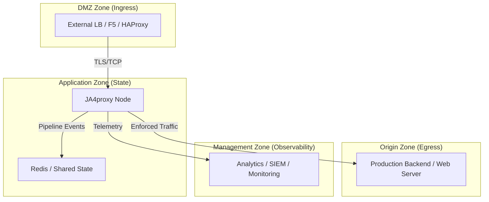

# Multi-Agent Isolation & Security Model

## Overview

JA4proxy is designed for high-security environments where the proxy node, the load balancer, and the backend origin servers reside in separate logical security zones. In the development environment, we mirror this topology using Docker network isolation and host-level loopback partitioning to allow multiple AI agents (Gemini, Claude, etc.) to work concurrently without interference or lateral security risk.

## Logical Architecture (Production Mirror)

The environment is divided into four distinct security zones. Only the **Proxy Node** is dual-homed across all zones, acting as a secure gateway.



## Isolation Layers

### 1. Network Layer (Docker-Internal)

Every agent project (e.g., `ja4_gemini`) uses a set of private bridge networks. These are strictly isolated using the `internal: true` flag where appropriate to prevent unauthorized egress.

- **`ja4proxy-dmz`**: Only HAProxy and Proxy. No external internet access.
- **`ja4proxy-data`**: Only Proxy and Redis. **`internal: true`**. No internet, no ingress.
- **`ja4proxy-origin`**: Only Proxy and Mockbackend. **`internal: true`**. No internet, no ingress.
- **`ja4proxy-mgmt`**: Proxy and Analytics. Standard bridge for telemetry egress.

### 2. Interface Layer (Host-Level)

To prevent lateral movement between agents sharing the same i9-9900K, each agent binds its services to a unique loopback IP address in the `127.0.0.x` range.

| Agent | Loopback IP | Surface Area |
| :--- | :--- | :--- |
| Gemini | `127.0.0.10` | 443 (Ingress), 8080 (Analytics) |
| Claude | `127.0.0.11` | 443 (Ingress), 8080 (Analytics) |
| Ollama | `127.0.0.12` | 443 (Ingress), 8080 (Analytics) |
| Mistral | `127.0.0.13` | 443 (Ingress), 8080 (Analytics) |

**Result**: An attacker in the Gemini container cannot reach Claude's services via `localhost` because Claude is not listening on `127.0.0.10`.

### 3. Compute Layer (CPU Partitioning)

We use `cpuset` to pin agents to specific logical cores on the i9-9900K. This prevents a "noisy neighbor" (or a rogue bot running an infinite loop) from performing a CPU-based Denial of Service on other agents.

### 4. Storage Layer (Quota Enforcement)

- **Log Rotation**: Docker `json-file` logging driver is capped at 300MB per container.
- **Volume Isolation**: Each agent project uses distinct named volumes (e.g., `ja4_gemini_redis_data`).

## Red Team Attack Surface Analysis

| Attack Vector | Countermeasure | Effectiveness |
| :--- | :--- | :--- |
| **Lateral Movement** | Loopback IP Partitioning (`127.0.0.x`) | High |
| **Data Exfiltration** | `internal: true` on Data/Origin networks | High |
| **CPU Starvation** | `cpuset` pinning per agent | High |
| **Disk Exhaustion** | Strict log quotas and max-file caps | Medium |
| **Container Escape** | Non-root users (`1000:1000`) and no Docker socket | High |
| **Port Collision** | Structured Base Port + Loopback IP | High |

## Implementation for Agents

### Local state files

Two gitignored files track per-agent state in the repo root:

| File | Contents | Written by |
|------|----------|-----------|
| `.env.<agent>` | Agent secrets, IP, CPU set, passwords | `scripts/agent-env.sh` |
| `.current-agent` | One line: the active agent name (e.g. `claude`) | `make agent-up` |

### Quickstart

```bash
# First time — generate env file and start
make agent-up NAME=claude

# Subsequent commands — .current-agent is used automatically, no NAME= needed
./scripts/ja4-admin.sh status
./scripts/ja4-admin.sh top 10
./scripts/ja4-admin.sh block-ip 1.2.3.4

# Stop (reads .current-agent, clears it on success)
make agent-down

# Run a second agent alongside the first
make agent-up NAME=gemini
# Now .current-agent = gemini. To target claude explicitly:
./scripts/ja4-admin.sh --agent claude status

# See all running agents
make agent-status
```

### Manual workflow (without make)

```bash
# Generate env file (once per agent, safe to re-run with -f to rotate secrets)
./scripts/agent-env.sh claude

# Start
docker compose -f deploy/docker/docker-compose.poc.yml --project-name ja4_claude --env-file .env.claude up -d

# Admin (explicit --agent flag required without .current-agent)
./scripts/ja4-admin.sh --agent claude status

# Stop
docker compose -f deploy/docker/docker-compose.poc.yml --project-name ja4_claude --env-file .env.claude down
```

### Agent resolution priority in `ja4-admin.sh`

| Condition | Env file | Redis container | Metrics URL |
|-----------|----------|-----------------|-------------|
| `--agent claude` passed | `.env.claude` | `ja4_claude-redis-1` | `127.0.0.11:9090` |
| `.current-agent` = `claude` | `.env.claude` | `ja4_claude-redis-1` | `127.0.0.11:9090` |
| Neither | `.env` | `ja4proxy-redis` | `localhost:9090` |

## Verifying Isolation

Run the automated audit script after any agent stack is started:

```bash
# Uses .current-agent automatically
./scripts/check-isolation.sh

# Explicit agent
./scripts/check-isolation.sh --agent claude
```

The script performs five check categories:

| Category | What is verified |
|----------|----------------|
| **Host port surface** | Only 443, 8080, 8404, 9090 open on the agent's bind IP; Redis/backend/tarpit not exposed |
| **Docker socket** | `/var/run/docker.sock` not accessible inside proxy or redis containers |
| **Network zones** | `ja4proxy-data` and `ja4proxy-origin` have no internet egress; HAProxy cannot reach Redis; Analytics cannot reach Backend; Proxy can reach both Redis and Backend |
| **IPC namespace** | `/dev/shm` inodes differ between containers (not shared) |
| **Cross-agent** | Proxy container cannot reach other agents' bind IPs on port 443 |

Exit code 0 = all checks pass. Exit code 1 = one or more failures.
