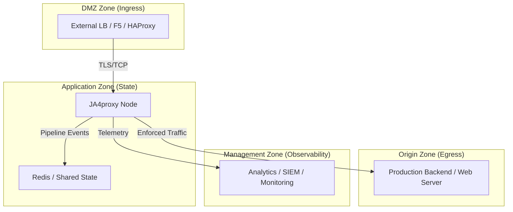

# Multi-Agent Isolation & Security Model

## Overview

JA4proxy is designed for high-security environments where the proxy node, the load balancer, and the backend origin servers reside in separate logical security zones. In the development environment, we mirror this topology using Docker network isolation and host-level loopback partitioning to allow multiple AI agents (Gemini, Claude, etc.) to work concurrently without interference or lateral security risk.

## Logical Architecture (Production Mirror)

The environment is divided into four distinct security zones. Only the **Proxy Node** is dual-homed across all zones, acting as a secure gateway.



## Isolation Layers

### 1. Network Layer (Docker-Internal)

Every agent project (e.g., `ja4_gemini`) uses a set of private bridge networks. These are strictly isolated using the `internal: true` flag where appropriate to prevent unauthorized egress.

- **`dmz_net`**: Only HAProxy and Proxy. No external internet access.
- **`data_net`**: Only Proxy and Redis. **`internal: true`**. No internet, no ingress.
- **`origin_net`**: Only Proxy and Mockbackend. **`internal: true`**. No internet, no ingress.
- **`mgmt_net`**: Proxy and Analytics. Standard bridge for telemetry egress.

### 2. Interface Layer (Host-Level)

To prevent lateral movement between agents sharing the same i9-9900K, each agent binds its services to a unique loopback IP address in the `127.0.0.x` range.

| Agent | Loopback IP | Surface Area |
| :--- | :--- | :--- |
| Gemini | `127.0.0.10` | 443 (Ingress), 8080 (Analytics) |
| Claude | `127.0.0.11` | 443 (Ingress), 8080 (Analytics) |
| Ollama | `127.0.0.12` | 443 (Ingress), 8080 (Analytics) |
| Mistral | `127.0.0.13` | 443 (Ingress), 8080 (Analytics) |

**Result**: An attacker in the Gemini container cannot reach Claude's services via `localhost` because Claude is not listening on `127.0.0.10`.

### 3. Compute Layer (CPU Partitioning)

We use `cpuset` to pin agents to specific logical cores on the i9-9900K. This prevents a "noisy neighbor" (or a rogue bot running an infinite loop) from performing a CPU-based Denial of Service on other agents.

### 4. Storage Layer (Quota Enforcement)

- **Log Rotation**: Docker `json-file` logging driver is capped at 300MB per container.
- **Volume Isolation**: Each agent project uses distinct named volumes (e.g., `ja4_gemini_redis_data`).

## Red Team Attack Surface Analysis

| Attack Vector | Countermeasure | Effectiveness |
| :--- | :--- | :--- |
| **Lateral Movement** | Loopback IP Partitioning (`127.0.0.x`) | High |
| **Data Exfiltration** | `internal: true` on Data/Origin networks | High |
| **CPU Starvation** | `cpuset` pinning per agent | High |
| **Disk Exhaustion** | Strict log quotas and max-file caps | Medium |
| **Container Escape** | Non-root users (`1000:1000`) and no Docker socket | High |
| **Port Collision** | Structured Base Port + Loopback IP | High |

## Implementation for Agents

Agents should initialize their environment using the `scripts/agent-env.sh` utility. This script ensures that the `.env` file is populated with the correct isolated IP, CPU set, and project name before `docker compose up` is executed.

```bash
./scripts/agent-env.sh <agent_name>
docker compose --env-file .env.<agent_name> up -d
```
