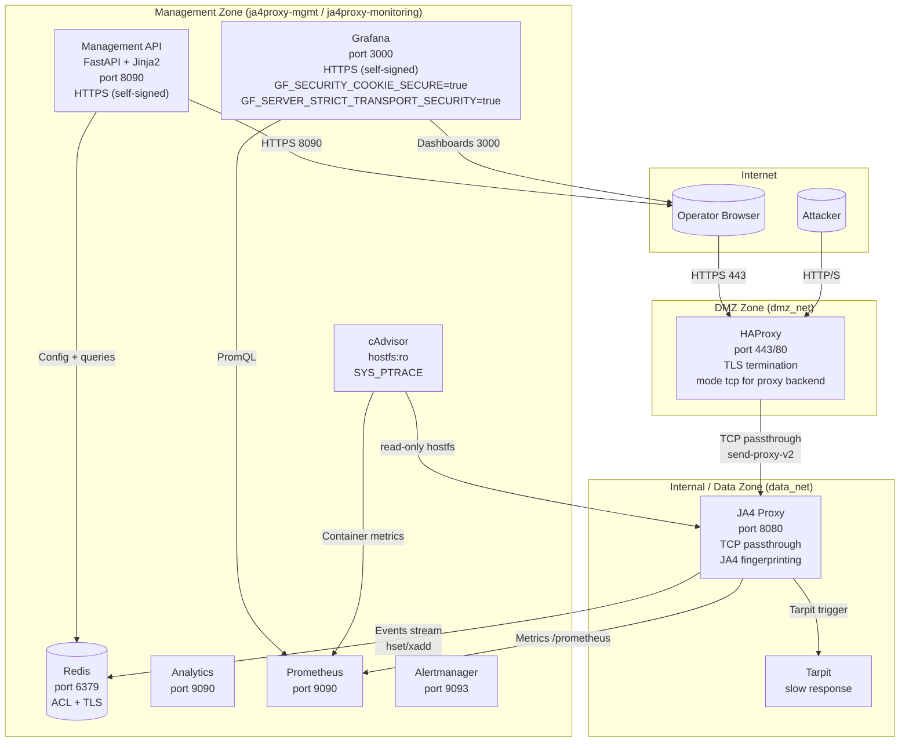

# Network Architecture

## Zone Model

JA4proxy uses a three-zone network model to isolate external traffic from internal
management and data-plane services.

## TLS Termination Boundaries

| Service | TLS | Cert | Port | Zone |
|---------|-----|------|------|------|
| HAProxy | External TLS termination (terminates browser TLS, forwards via TCP) | Public or Let's Encrypt | 443 | DMZ |
| Management API | Self-signed HTTPS | Generated per-install | 8090 | Management |
| Grafana | Self-signed HTTPS | `deploy/docker/certs/grafana/` | 3000 | Management |
| Redis | Optional TLS (ACL-enforced) | Config-dependent | 6379 | Data / Management |

## Key Design Decisions

### HAProxy TCP Mode
HAProxy uses `mode tcp` (not `mode http`) when forwarding to the JA4 proxy backend.
This preserves the raw TLS ClientHello record so the proxy can compute JA4, JA4S,
and JA4X fingerprints. If HAProxy terminated TLS, the proxy would see only encrypted
bytes and all TLS fingerprinting would be blind.

Grafana and the Management API serve HTTPS directly with self-signed certificates —
they are on the management network and must not route through the DMZ HAProxy.

### cAdvisor Isolation
cAdvisor mounts `/:/rootfs:ro` and uses `SYS_PTRACE` + `DAC_READ_SEARCH` capabilities.
It is isolated on the internal monitoring bridge network with `no-new-privileges:true`
and all other capabilities dropped. See `docs/security/CONTAINER_THREAT_MODEL.md`.
