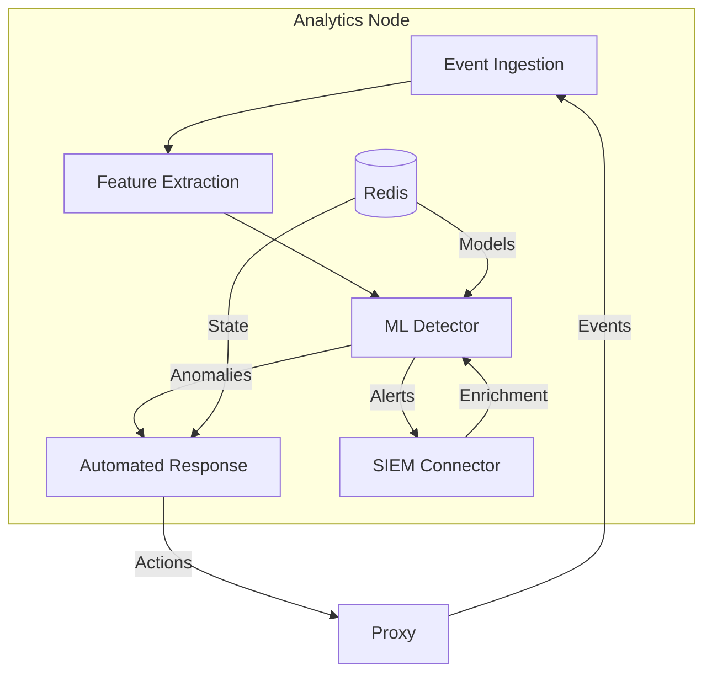
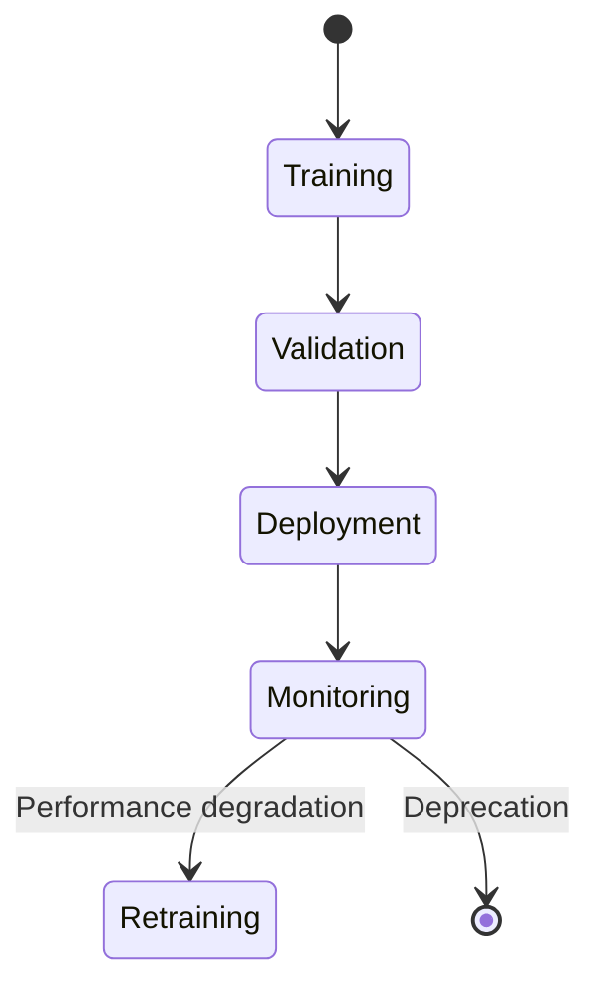
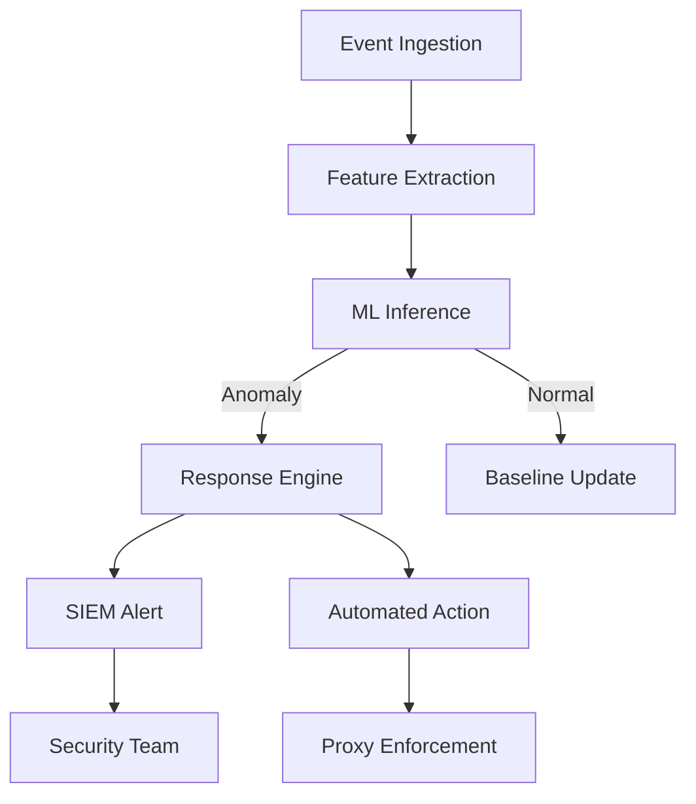
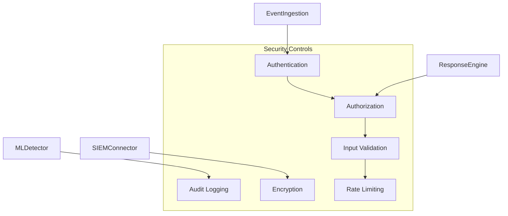

# Analytics Node Architecture

## Overview

The JA4Proxy Analytics Node provides advanced threat intelligence, machine learning-based anomaly detection, and automated response capabilities. This document describes the architecture of Phase 12 components.

## Architecture Principles

### Machine Learning First
- Real-time ML inference with <50ms latency targets
- Model versioning and lifecycle management
- Explainable AI for security operations

### Automated Response
- Playbook-driven incident response
- Safety-first automation with manual approval gates
- Complete audit trails for all automated actions

### Enterprise Integration
- SIEM/SOAR platform compatibility
- Standardized threat intelligence formats
- Bi-directional security ecosystem integration

## System Components

### Analytics Node Architecture



## Component Architecture

### 1. Event Ingestion Pipeline

**Redis Stream Configuration:**
- Stream key: `ja4proxy:events`
- Max length: 500,000 entries with auto-trim
- Consumer group: `analytics` with replay capability
- Batch processing: 1000 events/batch, 100ms intervals

**Event Schema:**
```json
{
  "timestamp": "2024-03-10T19:03:01Z",
  "proxy_id": "proxy-01",
  "fingerprint": {
    "ja4": "t13d1234h2_1234_1234",
    "score": 75.5,
    "extensions": ["server_name", "supported_groups"],
    "ciphers": ["TLS_AES_256_GCM_SHA384"]
  },
  "action": "allow",
  "client_ip": "192.168.1.100"
}
```

### 2. Feature Extraction Engine

**Feature Vector (20+ features):**
- Score metrics: raw score, normalized score
- Protocol features: TLS version, cipher count, extension count
- Temporal features: event rate, time since last seen
- Behavioral features: session duration, packet size distribution
- Contextual features: geolocation risk, ASN reputation

**Implementation:**
```python
class FeatureExtractor:
    def extract(self, fingerprint: Dict) -> List[float]:
        return [
            fingerprint['score'],
            len(fingerprint.get('extensions', [])),
            len(fingerprint.get('ciphers', [])),
            # 17+ additional features...
        ]
```

### 3. Machine Learning Detector

**Model Architecture:**
- Initial implementation: Threshold-based anomaly detection
- Future upgrade: Isolation Forest (scikit-learn)
- Performance target: <50ms inference time
- Memory footprint: <100MB per model

**Model Lifecycle:**


**Versioning:**
- Semantic versioning: `v1.0.0` format
- Redis storage: `analytics:ml:model:v{version}`
- Rollback capability: Previous 3 versions retained

### 4. Automated Response Engine

**Playbook System:**
```yaml
# playbooks/ddos_mitigation.yaml
name: ddos_mitigation
triggers:
  - anomaly_score > 0.95
  - event_rate > 1000/min
actions:
  - name: block_ip
    type: manual_approval
    params:
      duration: 3600
  - name: notify_security
    type: automatic
    params:
      channel: slack
      severity: high
```

**Action Library:**
- **Automatic Actions:** Notify, Log, Enrich
- **Manual Approval Required:** Block IP, Quarantine, Rate Limit
- **Audit Trail:** Complete logging of all actions with timestamps

### 5. SIEM/SOAR Integration

**Supported Platforms:**
- Splunk (HTTP Event Collector)
- Elasticsearch (REST API)
- QRadar (Syslog + REST)
- Microsoft Sentinel (CEF + REST)

**Data Formats:**
- **Alerts:** CEF (Common Event Format)
- **Threat Intelligence:** STIX 2.1
- **Metrics:** Prometheus format
- **Logs:** RFC 5424 syslog

## Data Flow

### Event Processing Pipeline



### Performance Characteristics

| Component | Latency Target | Throughput | Memory Usage |
|-----------|---------------|------------|--------------|
| Event Ingestion | <10ms | 10,000 EPS | 50MB |
| Feature Extraction | <5ms | 10,000 EPS | 20MB |
| ML Inference | <50ms | 1,000 EPS | 100MB |
| Response Engine | <20ms | 500 EPS | 30MB |
| SIEM Integration | <100ms | 500 EPS | 40MB |

## Security Architecture

### Threat Model Mitigations

**1. Event Poisoning Prevention:**
- Cryptographic event signing (HMAC-SHA256)
- Event validation against schema
- Rate limiting per proxy instance

**2. Model Tampering Protection:**
- Model checksum verification
- Secure model storage in Redis
- Role-based access control for model updates

**3. Automated Action Safety:**
- Manual approval for destructive actions
- Action timeout and rollback mechanisms
- Comprehensive audit logging

### Security Controls



## Monitoring and Observability

### Prometheus Metrics

**ML Detector Metrics:**
```prometheus
# HELP ja4proxy_analytics_ml_detection_duration Duration of ML anomaly detection
# TYPE ja4proxy_analytics_ml_detection_duration histogram
ja4proxy_analytics_ml_detection_duration_bucket{le="0.01"} 100
ja4proxy_analytics_ml_detection_duration_bucket{le="0.05"} 250
ja4proxy_analytics_ml_detection_duration_bucket{le="0.1"} 300

# HELP ja4proxy_analytics_ml_anomalies_detected Number of anomalies detected by ML model
# TYPE ja4proxy_analytics_ml_anomalies_detected gauge
ja4proxy_analytics_ml_anomalies_detected 42

# HELP ja4proxy_analytics_ml_model_version Current ML model version
# TYPE ja4proxy_analytics_ml_model_version gauge
ja4proxy_analytics_ml_model_version{version="1.0.0"} 1
```

### Alerting Rules

**Critical Alerts:**
- ML model inference latency > 100ms (5 minutes)
- Anomaly detection failure rate > 10% (1 minute)
- Automated action execution failure (immediate)

**Warning Alerts:**
- Model version mismatch across instances (10 minutes)
- SIEM integration latency > 500ms (15 minutes)
- Feature extraction errors > 1% (5 minutes)

## Deployment Architecture

### Container Specification

**Analytics Node Container:**
```dockerfile
FROM python:3.10-slim

# Dependencies
RUN pip install numpy pandas scipy scikit-learn prometheus-client

# Resource Limits
HEALTHCHECK --interval=30s --timeout=3s \
  CMD curl -f http://localhost:8080/health || exit 1

# Security
USER analytics:analytics
VOLUME /var/lib/analytics/models
```

**Resource Requirements:**
- CPU: 2 cores minimum, 4 cores recommended
- Memory: 2GB minimum, 4GB recommended
- Storage: 10GB for model storage and logs

### Scaling Strategy

**Horizontal Scaling:**
- Multiple analytics nodes can subscribe to same event stream
- Consumer group partitioning for load distribution
- Stateless design enables easy scaling

**Vertical Scaling:**
- Model complexity increases with available memory
- Batch size increases with available CPU
- Connection pooling based on Redis capacity

## Compliance Architecture

### Data Protection

**GDPR Compliance:**
- Pseudonymization of client IPs in long-term storage
- Automatic data retention policies (30-day default)
- Right to erasure implementation (`gdpr-delete` command)

**PCI-DSS Compliance:**
- Encryption of sensitive data at rest and in transit
- Role-based access control for security operations
- Comprehensive audit logging (immutable for 1 year)

### Audit Trail

**Audit Log Schema:**
```json
{
  "timestamp": "2024-03-10T19:03:01.123456Z",
  "action": "block_ip",
  "actor": "automated_response",
  "target": "192.168.1.100",
  "status": "approved",
  "approved_by": "security-admin",
  "playbook": "ddos_mitigation_v1",
  "evidence": {
    "anomaly_score": 0.98,
    "event_rate": 1250
  }
}
```

**Retention Policy:**
- Real-time audit logs: 30 days (hot storage)
- Archived audit logs: 1 year (cold storage)
- Security incident logs: 7 years (compliance storage)

## Future Evolution

### Roadmap

**v1.1 (Current):**
- Threshold-based anomaly detection
- Basic playbook automation
- SIEM alerting integration

**v1.2 (Next):**
- Isolation Forest ML model
- Graph-based correlation engine
- SOAR platform integration

**v2.0 (Future):**
- Deep learning anomaly detection
- Predictive threat intelligence
- Autonomous response capabilities

## References

- [Phase 12a Planning](phases/PHASE_12A.md)
- [Phase 12b Planning](phases/PHASE_12B.md)
- [Phase 12c Planning](phases/PHASE_12C.md)
- [Phase 12d Planning](phases/PHASE_12D.md)
- [Phase 12e Planning](../phases/PHASE_12E.md)
- [Security Architecture](../security/threat-model.md)
- [Testing Strategy](../developer/testing-analysis.md)