# JA4 Proxy System Architecture

## Overview

JA4 Proxy is an enterprise-grade TLS fingerprinting proxy that provides real-time traffic analysis, security filtering, and compliance monitoring. The system is designed with security-first principles, implementing defense-in-depth strategies and maintaining full compliance with GDPR, PCI-DSS, and SOC 2 requirements.

## Architecture Principles

### Security First
- Zero-trust network architecture
- Defense-in-depth security controls
- Least privilege access model
- Security by design and default

### High Availability
- Horizontal scaling capabilities
- Fault-tolerant design
- Automatic failover mechanisms
- Load balancing and redundancy

### Compliance Ready
- GDPR data protection by design
- PCI-DSS security controls
- SOC 2 audit trail compliance
- Immutable audit logging

### Performance Optimized
- Asynchronous I/O architecture
- Connection pooling and reuse
- Intelligent caching strategies
- Resource-aware processing

## System Components

### Core Components

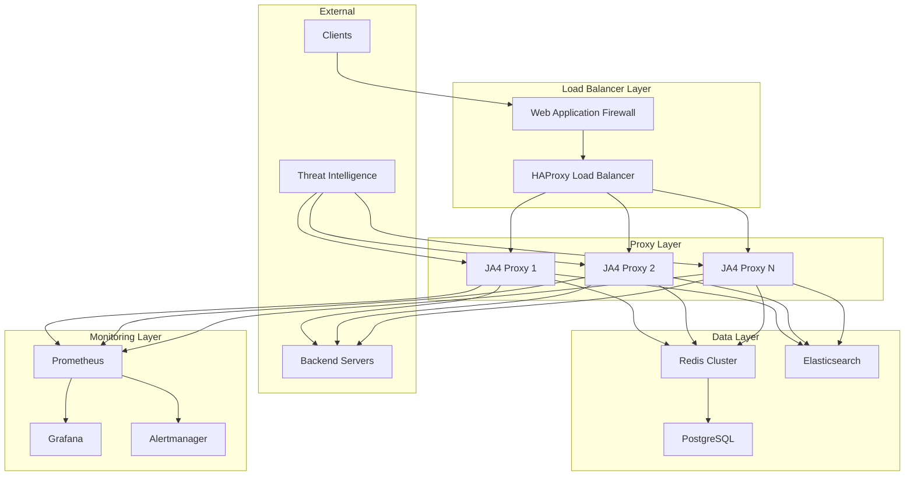

### Component Responsibilities

#### JA4 Proxy Instances
- **Primary Function**: TLS fingerprint generation and analysis
- **Security**: Request validation and filtering
- **Performance**: Asynchronous connection handling
- **Compliance**: Audit logging and data minimization

#### Redis Cluster
- **Primary Function**: Distributed caching and session storage
- **Security Lists**: Whitelist/blacklist management
- **Rate Limiting**: Distributed rate limit counters
- **Session State**: Connection and authentication state

#### Monitoring Stack
- **Prometheus**: Metrics collection and alerting
- **Grafana**: Visualization and dashboards
- **Elasticsearch**: Log aggregation and search
- **Alertmanager**: Incident response coordination

## Data Flow Architecture

### TLS Fingerprinting Flow

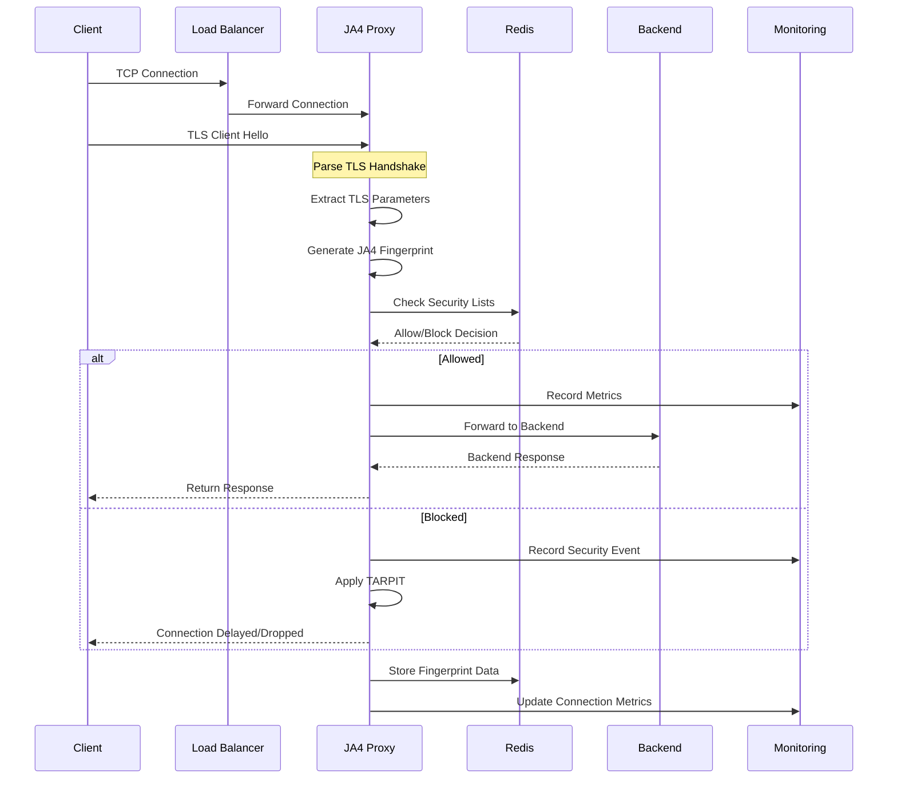

### Security Validation Flow

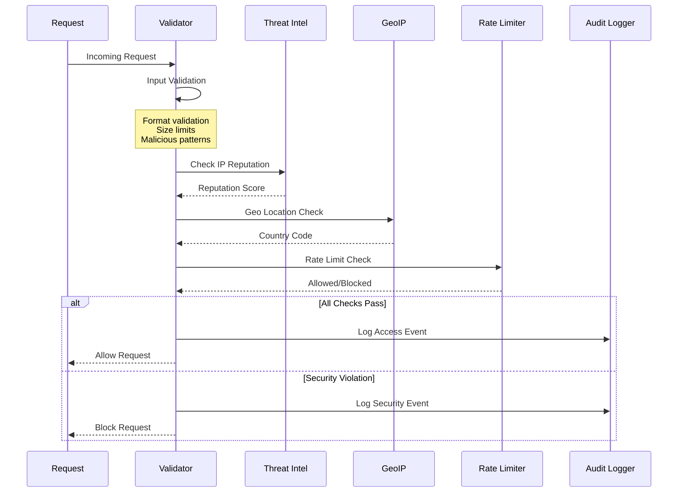

### Audit and Compliance Flow

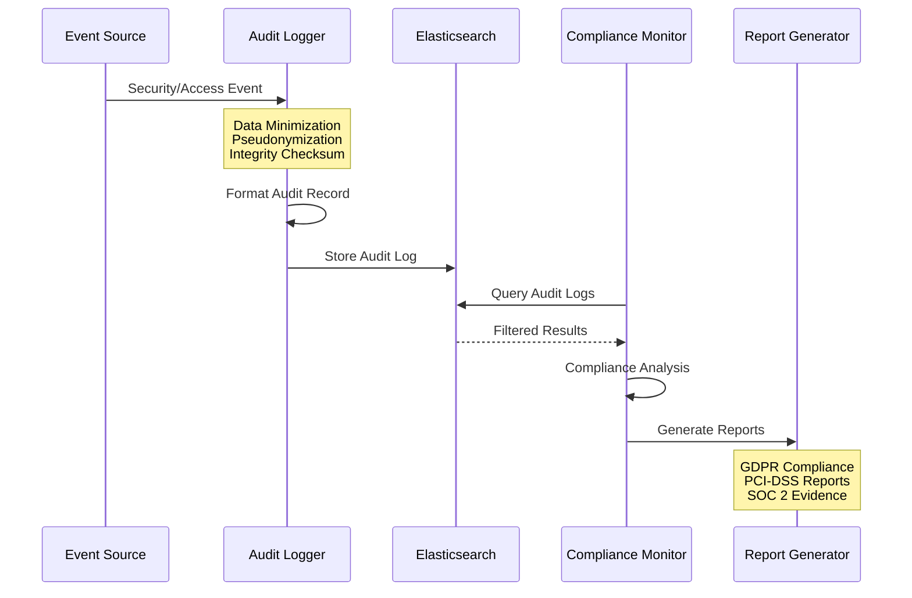

## Security Architecture

### Network Security

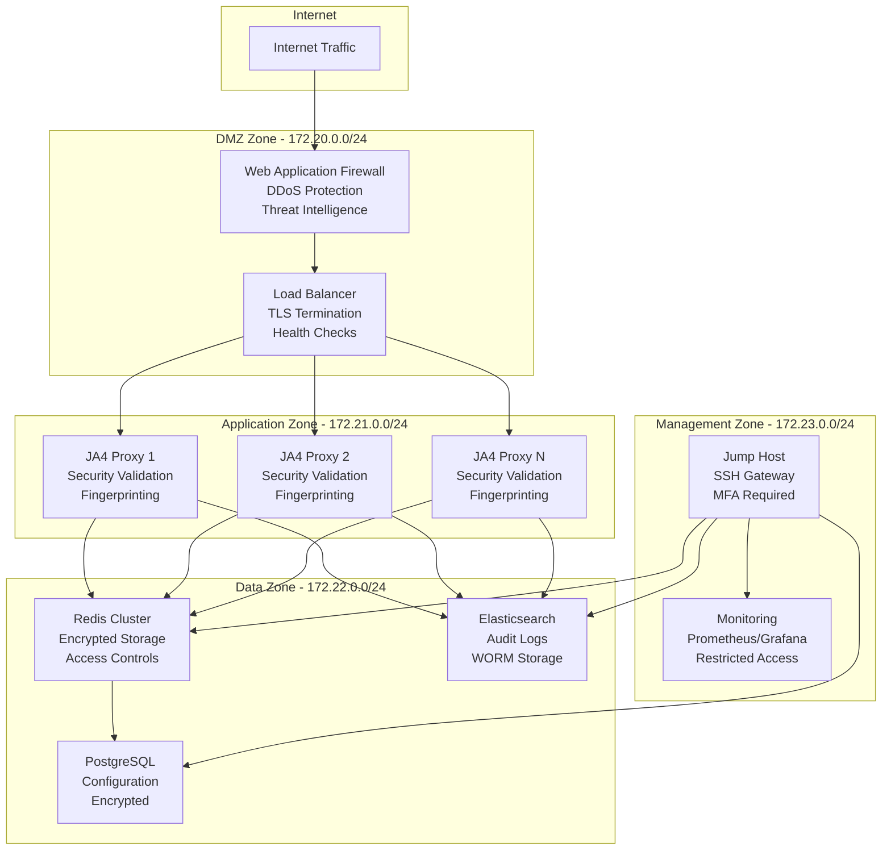

### Access Control Matrix

| Zone | Component | Inbound Ports | Outbound | Access Control |
|------|-----------|---------------|-----------|----------------|
| DMZ | WAF | 80,443 | App Zone:8080 | Public + DDoS Protection |
| DMZ | Load Balancer | 8404 (stats) | App Zone:8080 | Internal + Admin |
| App | JA4 Proxy | 8080,9090 | Data Zone:6379,9200 | Internal Only |
| Data | Redis | 6379,6380 | None | Cluster + mTLS |
| Data | Elasticsearch | 9200,9300 | None | Internal + Auth |
| Mgmt | Monitoring | 3000,9091 | Data Zone | VPN + MFA |

### Encryption Standards

#### Data in Transit
- **TLS 1.2+ Only**: Minimum version enforcement
- **Perfect Forward Secrecy**: ECDHE key exchange
- **Strong Cipher Suites**: AES-GCM, ChaCha20-Poly1305
- **Certificate Pinning**: For internal communications
- **mTLS**: For service-to-service communication

#### Data at Rest
- **AES-256-GCM**: For sensitive data encryption
- **Key Management**: HashiCorp Vault integration
- **Database Encryption**: Transparent data encryption
- **Backup Encryption**: Encrypted backup storage
- **Key Rotation**: Automatic key rotation policies

## High Availability Design

### Scaling Architecture

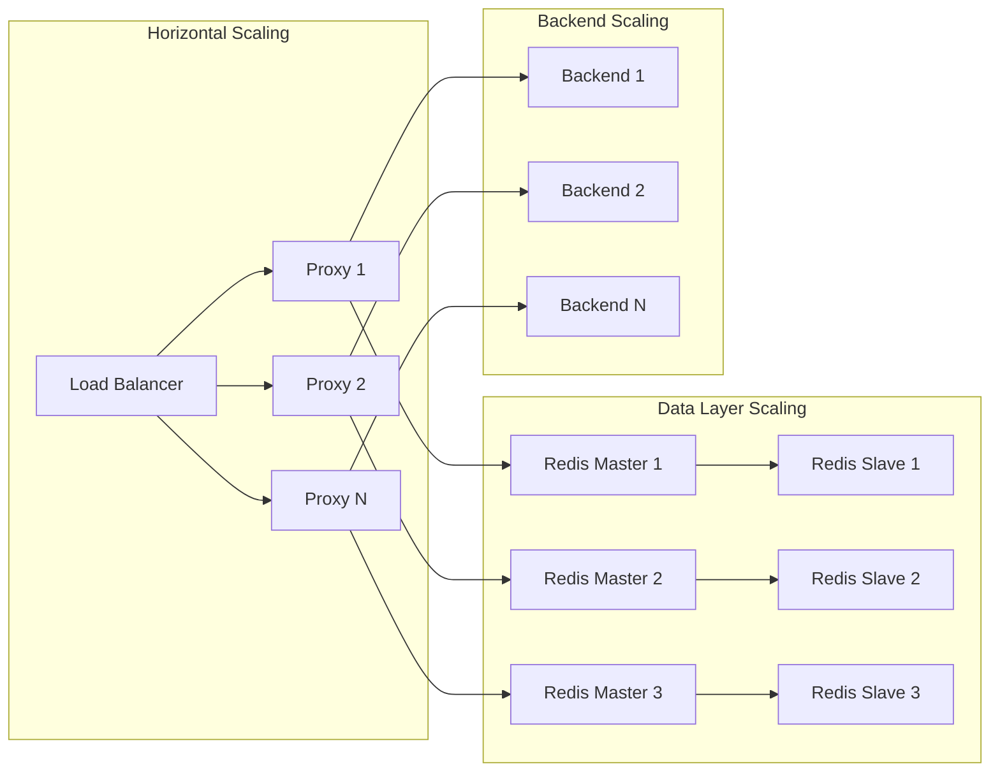

### Failover Mechanisms

#### Load Balancer Failover
- **Health Checks**: Continuous service health monitoring
- **Automatic Failover**: Failed instance removal
- **Session Persistence**: Redis-based session storage
- **Graceful Degradation**: Partial service availability

#### Database Failover
- **Redis Sentinel**: Automatic master failover
- **Read Replicas**: Distributed read operations
- **Data Replication**: Multi-zone data redundancy
- **Backup Restoration**: Point-in-time recovery

## Performance Architecture

### Asynchronous Processing

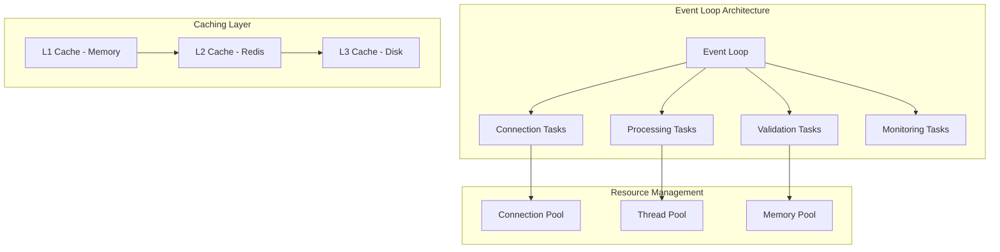

### Performance Optimizations

#### Connection Management
- **Keep-Alive Connections**: Persistent backend connections
- **Connection Pooling**: Shared connection resources
- **Async I/O**: Non-blocking operations
- **Buffer Optimization**: Efficient memory usage

#### Caching Strategy
- **Multi-Level Caching**: Memory → Redis → Disk
- **Cache Warming**: Proactive cache population
- **TTL Management**: Intelligent expiration policies
- **Cache Invalidation**: Consistency mechanisms

## Monitoring and Observability

### Metrics Architecture

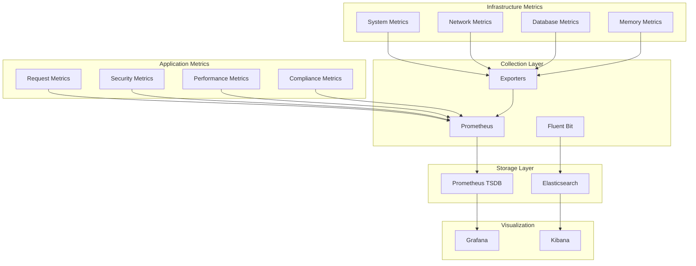

### Key Performance Indicators (KPIs)

#### Security KPIs
- **Threat Detection Rate**: Percentage of threats identified
- **False Positive Rate**: Invalid security blocks
- **Response Time**: Time to threat mitigation
- **Coverage Metrics**: Security control effectiveness

#### Performance KPIs
- **Request Throughput**: Requests per second
- **Response Latency**: P50, P95, P99 percentiles
- **Connection Success Rate**: Successful connections percentage
- **Resource Utilization**: CPU, memory, network usage

#### Compliance KPIs
- **Audit Trail Completeness**: Percentage of events logged
- **Data Retention Compliance**: Retention policy adherence
- **Access Control Effectiveness**: Unauthorized access attempts
- **Encryption Coverage**: Percentage of encrypted data

## Deployment Architecture

### Container Orchestration

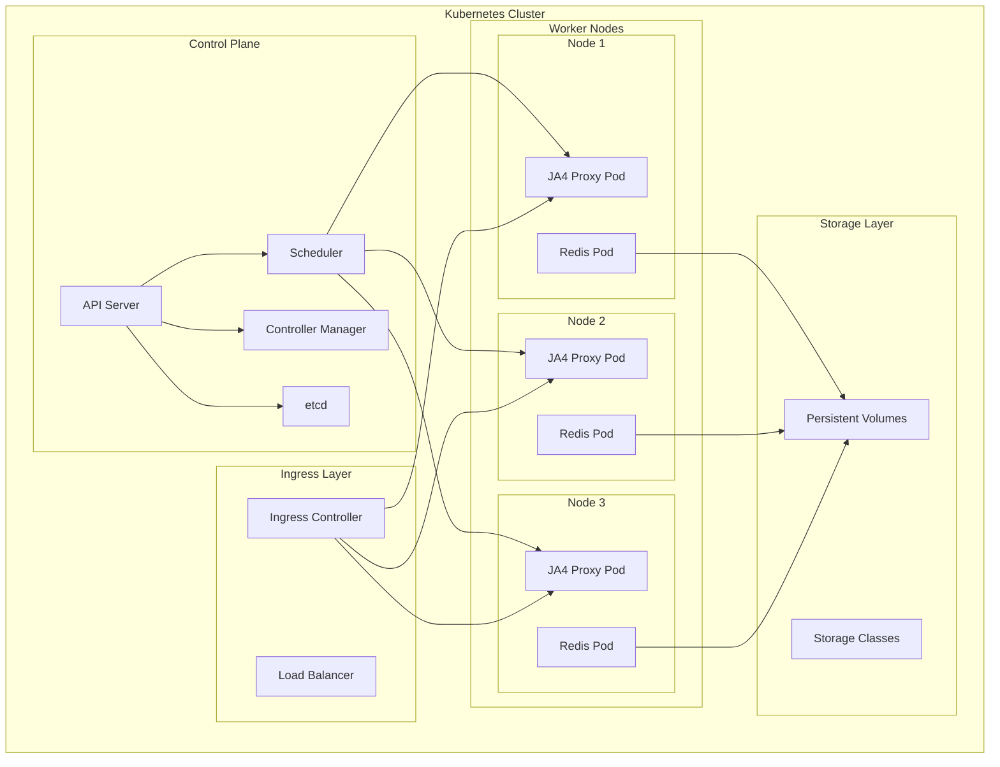

### CI/CD Pipeline Architecture

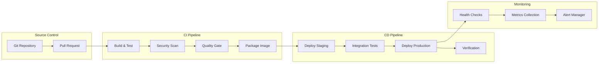

## Data Models

### JA4 Fingerprint Data Model

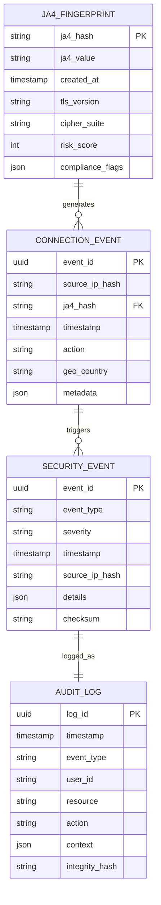

### Configuration Data Model

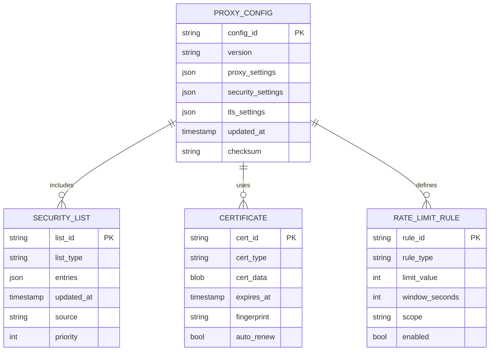

## Compliance Architecture

### GDPR Data Protection

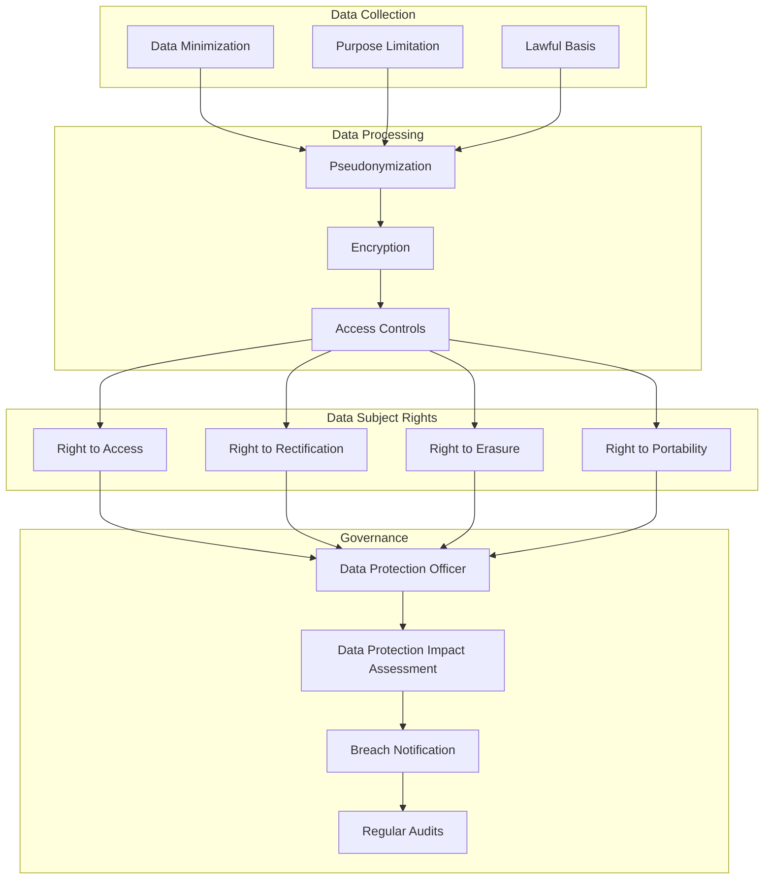

This comprehensive architecture provides the foundation for a secure, scalable, and compliant JA4 Proxy system that meets enterprise requirements while maintaining high performance and availability.