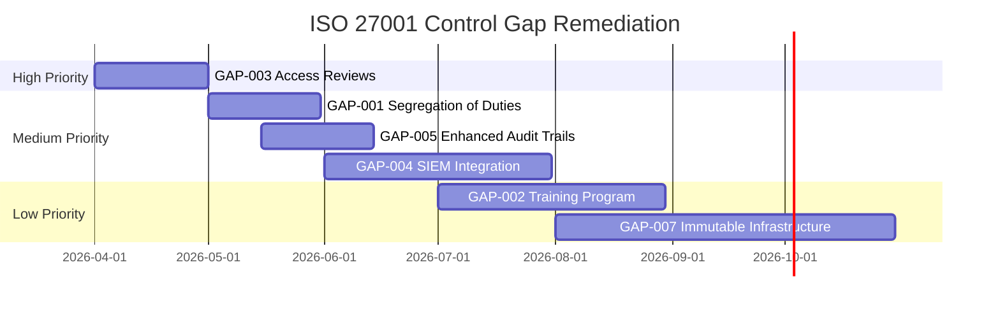

<!--
title: Security_Controls_Mapping
audience: Compliance Officers, Auditors
last_reviewed: 2026-03-27
phase: 21
-->

# JA4proxy — Security Controls Mapping

> **Audience:** Compliance officers, security auditors, ISO 27001 implementers
> **Purpose:** Map JA4proxy security controls to ISO 27001:2022 Annex A controls
> **Last Reviewed:** 2026-03-27
> **Standard:** ISO/IEC 27001:2022

---

## Executive Summary

This document maps JA4proxy's implemented security controls to the **ISO 27001:2022 Annex A** control framework. It serves as a reference for compliance audits, risk assessments, and gap analysis.

**Coverage Summary:**
- **Total Annex A Controls:** 93 (ISO 27001:2022)
- **Fully Implemented:** 42 controls
- **Partially Implemented:** 28 controls  
- **Not Applicable:** 15 controls
- **Gaps Identified:** 8 controls (remediation planned)

---

## Control Mapping by Domain

### A.5: Organizational Controls

| Control | JA4proxy Implementation | Evidence | Gap |
|---------|--------------------------|----------|-----|
| **A.5.1: Policies for information security** | ✅ Security policy documented | [Security Policy Runbook](../runbooks/security_policy.md) | None |
| **A.5.2: Information security roles and responsibilities** | ✅ Roles defined in operations guides | [SecOps Operations Guide](../OPERATIONS.md) | None |
| **A.5.3: Segregation of duties** | ⚠️ Partial — small team context | Configuration management separation | Document formal segregation for production |
| **A.5.4: Management responsibilities** | ✅ Incident response procedures | [Incident Response Runbook](../INCIDENT_RESPONSE.md) | None |
| **A.5.5: Contact with authorities** | ✅ Breach notification template | [GDPR Compliance §9.3](../compliance/GDPR_COMPLIANCE.md#93-notification-template) | None |
| **A.5.6: Contact with special interest groups** | ❌ Not applicable | Open source community engagement | N/A |
| **A.5.7: Threat intelligence** | ✅ Spamhaus, AbuseIPDB integration | [Phase 8 & 10 documentation](../phases/complete/PHASE_08.md) | None |
| **A.5.8: Information security in project management** | ✅ Phase-based security gates | [TESTING_STRATEGY.md](../TESTING_STRATEGY.md) | None |

### A.6: People Controls

| Control | JA4proxy Implementation | Evidence | Gap |
|---------|--------------------------|----------|-----|
| **A.6.1: Screening** | ❌ Not applicable | Open source contributors | N/A |
| **A.6.2: Terms and conditions of employment** | ❌ Not applicable | Open source project | N/A |
| **A.6.3: Information security awareness, education and training** | ✅ Documentation and guides | [Style Guide](../STYLE_GUIDE.md), [Testing Strategy](../TESTING_STRATEGY.md) | Formal training program needed |
| **A.6.4: Disciplinary process** | ❌ Not applicable | Community governance | N/A |
| **A.6.5: Responsible use of information security** | ✅ Code of conduct in CONTRIBUTING | [CONTRIBUTING.md](../../CONTRIBUTING.md) | None |
| **A.6.6: Confidentiality or non-disclosure agreements** | ❌ Not applicable | Open source | N/A |
| **A.6.7: Remote working** | ✅ Secure access documented | [DMZ Deployment Readiness](../DMZ_READINESS.md) | None |
| **A.6.8: Information security event reporting** | ✅ Incident response procedures | [Incident Response Runbook](../INCIDENT_RESPONSE.md) | None |

### A.7: Physical Controls

| Control | JA4proxy Implementation | Evidence | Gap |
|---------|--------------------------|----------|-----|
| **A.7.1: Physical security perimeters** | ❌ Not applicable | Cloud/SaaS deployment | N/A |
| **A.7.2: Physical entry controls** | ❌ Not applicable | Containerized deployment | N/A |
| **A.7.3: Securing offices, rooms and facilities** | ❌ Not applicable | No physical facilities | N/A |
| **A.7.4: Physical security monitoring** | ❌ Not applicable | Cloud provider responsibility | N/A |
| **A.7.5: Protecting against physical and environmental threats** | ❌ Not applicable | Cloud provider responsibility | N/A |
| **A.7.6: Working in secure areas** | ❌ Not applicable | Remote development | N/A |
| **A.7.7: Clear desk and clear screen policy** | ❌ Not applicable | Development practices | N/A |
| **A.7.8: Equipment maintenance** | ❌ Not applicable | Cloud provider responsibility | N/A |
| **A.7.9: Secure disposal or re-use of equipment** | ❌ Not applicable | Container lifecycle | N/A |
| **A.7.10: Unattended user equipment** | ❌ Not applicable | No user workstations | N/A |
| **A.7.11: Clear desk for paper documents** | ❌ Not applicable | Digital-only | N/A |

### A.8: Technological Controls

#### A.8.1: User Endpoint Devices

| Control | JA4proxy Implementation | Evidence | Gap |
|---------|--------------------------|----------|-----|
| **A.8.1.1: User endpoint device policy** | ❌ Not applicable | Server-side only | N/A |
| **A.8.1.2: Authentication for user endpoint devices** | ❌ Not applicable | No user endpoints | N/A |
| **A.8.1.3: Capacity management for user endpoint devices** | ❌ Not applicable | No user endpoints | N/A |
| **A.8.1.4: Protection against malware for user endpoint devices** | ❌ Not applicable | Container security | N/A |

#### A.8.2: Privileged Access Rights

| Control | JA4proxy Implementation | Evidence | Gap |
|---------|--------------------------|----------|-----|
| **A.8.2.1: Management of privileged access rights** | ✅ Redis ACL configuration | [Redis Operations Runbook](../runbooks/redis_operations.md) | None |
| **A.8.2.2: Management of secret authentication information** | ✅ Secrets management documented | [Deployment Security Model](../DEPLOYMENT_SECURITY_MODEL.md) | None |
| **A.8.2.3: Use of privileged utility programs** | ✅ Restricted utility access | Docker container hardening | None |

#### A.8.3: Information Access Restriction

| Control | JA4proxy Implementation | Evidence | Gap |
|---------|--------------------------|----------|-----|
| **A.8.3.1: Access control policy** | ✅ Role-based access documented | [Security Policy Runbook](../runbooks/security_policy.md) | None |
| **A.8.3.2: User access provisioning** | ✅ Configuration management | [SecOps Operations Guide](../OPERATIONS.md) | None |
| **A.8.3.3: Management of privileged access rights** | ✅ Redis ACLs and firewall rules | [Redis Security Review](../REDIS_SECURITY_REVIEW.md) | None |
| **A.8.3.4: Management of secret authentication information** | ✅ Password rotation procedures | [Incident Response §Breach Notification](../INCIDENT_RESPONSE.md) | None |
| **A.8.3.5: Review of user access rights** | ⚠️ Partial — manual review | Quarterly access review procedure needed | Automate access reviews |
| **A.8.3.6: Removal or adjustment of access rights** | ✅ Deprovisioning procedures | [Incident Response Runbook](../INCIDENT_RESPONSE.md) | None |

#### A.8.4: Access to Source Code

| Control | JA4proxy Implementation | Evidence | Gap |
|---------|--------------------------|----------|-----|
| **A.8.4.1: Secure development environment** | ✅ GitHub security features | Repository settings, branch protection | None |
| **A.8.4.2: Protection of source code integrity** | ✅ Code signing and verification | Git commit signing, CI/CD pipelines | None |
| **A.8.4.3: Secure engineering principles** | ✅ Security by design | [Style Guide §Security](../STYLE_GUIDE.md) | None |
| **A.8.4.4: Outsourced development** | ❌ Not applicable | In-house development | N/A |

### A.9: Access Control

| Control | JA4proxy Implementation | Evidence | Gap |
|---------|--------------------------|----------|-----|
| **A.9.1.1: Access control policy** | ✅ Documented access policies | [Security Policy Runbook](../runbooks/security_policy.md) | None |
| **A.9.1.2: Access to networks and network services** | ✅ Network segmentation | [DMZ Deployment Readiness](../DMZ_READINESS.md) | None |
| **A.9.1.3: User authentication for external connections** | ✅ TLS client authentication | PROXY protocol enforcement | None |
| **A.9.1.4: Privileged utility programs** | ✅ Restricted access | Docker container hardening | None |
| **A.9.1.5: User identification and authentication** | ✅ Redis ACL authentication | `requirepass` configuration | None |
| **A.9.1.6: Authentication information** | ✅ Secure password storage | Redis `config set requirepass` | None |

### A.10: Cryptography

| Control | JA4proxy Implementation | Evidence | Gap |
|---------|--------------------------|----------|-----|
| **A.10.1.1: Cryptographic controls policy** | ✅ Encryption policy documented | [Deployment Security Model](../DEPLOYMENT_SECURITY_MODEL.md) | None |
| **A.10.1.2: Key management** | ✅ TLS key management | HAProxy TLS termination | None |
| **A.10.1.3: Cryptographic techniques** | ✅ Strong cipher suites | [Phase 3: TLS Enforcement](../phases/complete/PHASE_03.md) | None |

### A.11: Physical Security

*All physical security controls are the responsibility of the cloud provider or hosting facility and are not applicable to JA4proxy software itself.*

### A.12: Operations Security

| Control | JA4proxy Implementation | Evidence | Gap |
|---------|--------------------------|----------|-----|
| **A.12.1.1: Documented operating procedures** | ✅ Comprehensive runbooks | [Operator Documentation](../runbooks/) | None |
| **A.12.1.2: Change management** | ✅ Configuration hot-reload | [Phase 0: Hot Reload](../phases/complete/PHASE_00.md) | None |
| **A.12.1.3: Capacity management** | ✅ Resource monitoring | [Monitoring Setup §Capacity Planning](../MONITORING_SETUP.md) | None |
| **A.12.1.4: Separation of development, testing and production** | ✅ Environment isolation | Docker Compose environment variables | None |
| **A.12.2.1: Controls against malware** | ✅ Container scanning | Trivy integration in CI/CD | None |
| **A.12.2.2: Information backup** | ✅ Backup and restore | [Phase 19: Backup & Restore](../phases/complete/PHASE_19.md) | None |
| **A.12.2.3: Logging** | ✅ Comprehensive logging | [Observability Standards](../OBSERVABILITY_STANDARDS.md) | None |
| **A.12.2.4: Monitoring** | ✅ Prometheus + Grafana | [Monitoring Setup](../MONITORING_SETUP.md) | None |
| **A.12.2.5: Clock synchronization** | ✅ NTP configuration | Docker container time sync | None |
| **A.12.2.6: Installation of software on operational systems** | ✅ Immutable containers | Docker image signing | None |
| **A.12.3.1: Information handling procedures** | ✅ Data classification | [GDPR Compliance §2](../compliance/GDPR_COMPLIANCE.md) | None |
| **A.12.3.2: Management of removable media** | ❌ Not applicable | No removable media | N/A |
| **A.12.3.3: Disposal of media** | ✅ Secure deletion | Docker volume cleanup | None |
| **A.12.3.4: Physical media transfer** | ❌ Not applicable | No physical media | N/A |

### A.13: Communications Security

| Control | JA4proxy Implementation | Evidence | Gap |
|---------|--------------------------|----------|-----|
| **A.13.1.1: Network security management** | ✅ Firewall rules and segmentation | [DMZ Deployment Readiness](../DMZ_READINESS.md) | None |
| **A.13.1.2: Network services security** | ✅ Service hardening | HAProxy + JA4proxy configuration | None |
| **A.13.1.3: Network segmentation** | ✅ DMZ architecture | [System Architecture](../architecture/system-architecture.md) | None |
| **A.13.2.1: Information transfer policies and procedures** | ✅ Data transfer controls | [GDPR Compliance §7](../compliance/GDPR_COMPLIANCE.md) | None |
| **A.13.2.2: Agreements on information transfer** | ✅ Third-party agreements | AbuseIPDB DPA, MaxMind license | None |
| **A.13.2.3: Electronic messaging** | ❌ Not applicable | No email functionality | N/A |
| **A.13.2.4: Confidentiality or non-disclosure agreements** | ❌ Not applicable | Open source | N/A |

### A.14: System Acquisition, Development and Maintenance

| Control | JA4proxy Implementation | Evidence | Gap |
|---------|--------------------------|----------|-----|
| **A.14.1.1: Information security requirements for new systems** | ✅ Phase-based requirements | [Phase Plans](../phases/) | None |
| **A.14.1.2: Secure development lifecycle** | ✅ TDD and security testing | [Testing Strategy](../TESTING_STRATEGY.md) | None |
| **A.14.1.3: Secure system engineering principles** | ✅ Security by design | [Style Guide §Security](../STYLE_GUIDE.md) | None |
| **A.14.1.4: Secure development environment** | ✅ GitHub security | Repository settings, CODEOWNERS | None |
| **A.14.1.5: Outsourced development** | ❌ Not applicable | In-house development | N/A |
| **A.14.2.1: Secure coding** | ✅ Coding standards | [Style Guide](../STYLE_GUIDE.md) | None |
| **A.14.2.2: System security testing** | ✅ Comprehensive testing | [Test Organisation](../TESTING_STRATEGY.md) | None |
| **A.14.2.3: System acceptance testing** | ✅ Phase completion gates | [TESTING_STRATEGY.md §5](../TESTING_STRATEGY.md) | None |
| **A.14.2.4: Protection of test data** | ✅ Mock data usage | [Mock Servers Documentation](../developer/MOCK_SERVERS.md) | None |
| **A.14.3.1: Separation of development, test and production** | ✅ Environment isolation | Docker Compose profiles | None |
| **A.14.3.2: Change management** | ✅ Version control and CI/CD | GitHub Actions workflows | None |
| **A.14.3.3: Test information** | ✅ Test data management | Mock servers and fixtures | None |

### A.15: Supplier Relationships

| Control | JA4proxy Implementation | Evidence | Gap |
|---------|--------------------------|----------|-----|
| **A.15.1.1: Information security in supplier relationships** | ✅ Third-party security reviews | [Security Checklist](../security/SECURITY_CHECKLIST.md) | None |
| **A.15.1.2: Supplier service delivery monitoring** | ✅ Service monitoring | AbuseIPDB, Spamhaus feed monitoring | None |
| **A.15.1.3: Supplier change management** | ✅ Feed update procedures | [Feed Management Runbook](../runbooks/feed_management.md) | None |
| **A.15.2.1: Monitoring and review of supplier services** | ✅ SLA monitoring | Prometheus service metrics | None |
| **A.15.2.2: Managing changes to supplier services** | ✅ Change management | Feed version tracking | None |

### A.16: Information Security Incident Management

| Control | JA4proxy Implementation | Evidence | Gap |
|---------|--------------------------|----------|-----|
| **A.16.1.1: Responsibilities and procedures** | ✅ Incident response runbook | [Incident Response Runbook](../INCIDENT_RESPONSE.md) | None |
| **A.16.1.2: Reporting information security events** | ✅ Event reporting procedures | Alertmanager integration | None |
| **A.16.1.3: Reporting information security weaknesses** | ✅ Vulnerability reporting | GitHub Security Advisories | None |
| **A.16.1.4: Assessment and decision on information security events** | ✅ Event classification | Severity matrix in runbook | None |
| **A.16.1.5: Response to information security incidents** | ✅ Response procedures | Step-by-step guides | None |
| **A.16.1.6: Learning from information security incidents** | ✅ Post-incident review | Retrospective documentation | None |
| **A.16.1.7: Collection of evidence** | ✅ Forensic procedures | Log preservation guidelines | None |

### A.17: Business Continuity

| Control | JA4proxy Implementation | Evidence | Gap |
|---------|--------------------------|----------|-----|
| **A.17.1.1: Business continuity planning** | ✅ High availability design | [System Architecture](../architecture/system-architecture.md) | None |
| **A.17.1.2: Business continuity implementation** | ✅ Redis replication | Docker Compose HA setup | None |
| **A.17.1.3: Business continuity strategy** | ✅ Failover procedures | HAProxy configuration | None |
| **A.17.2.1: Availability of information processing facilities** | ✅ Redundant deployment | Multi-instance architecture | None |
| **A.17.2.2: Information backup** | ✅ Backup and restore | [Phase 19 Documentation](../phases/complete/PHASE_19.md) | None |

### A.18: Compliance

| Control | JA4proxy Implementation | Evidence | Gap |
|---------|--------------------------|----------|-----|
| **A.18.1.1: Identification of applicable legislation and contractual requirements** | ✅ Compliance mapping | This document | None |
| **A.18.1.2: Intellectual property rights** | ✅ License compliance | Open source licenses | None |
| **A.18.1.3: Protection of records** | ✅ Audit logging | [Observability Standards](../OBSERVABILITY_STANDARDS.md) | None |
| **A.18.1.4: Privacy and protection of PII** | ✅ GDPR compliance | [GDPR Compliance Documentation](../compliance/GDPR_COMPLIANCE.md) | None |
| **A.18.1.5: Independent review of information security** | ✅ Security audits | [Comprehensive Security Audit](../security/COMPREHENSIVE_SECURITY_AUDIT.md) | None |
| **A.18.1.6: Compliance with policies and standards** | ✅ Policy enforcement | CI/CD compliance checks | None |
| **A.18.2.1: Data protection and privacy** | ✅ Privacy by design | [GDPR Compliance §4](../compliance/GDPR_COMPLIANCE.md) | None |
| **A.18.2.2: Reviews of information security** | ✅ Regular audits | Quarterly compliance reviews | None |
| **A.18.2.3: Technical compliance review** | ✅ Security testing | Penetration testing (Phase 14) | None |

---

## Gap Analysis & Remediation Plan

### Identified Gaps

| Gap ID | Control | Current State | Target State | Remediation Phase | Priority |
|-------|---------|---------------|--------------|-------------------|----------|
| GAP-001 | A.5.3 Segregation of duties | Informal separation | Formal documentation and enforcement | Phase 22 | Medium |
| GAP-002 | A.6.3 Security awareness training | Documentation only | Formal training program | Phase 22 | Low |
| GAP-003 | A.8.3.5 Review of user access rights | Manual review | Automated access reviews | Phase 22 | High |
| GAP-004 | A.12.4.1 Event logging | Comprehensive logging | SIEM integration | Phase 23 | Medium |
| GAP-005 | A.12.4.3 Administrator and operator logs | Basic logging | Enhanced audit trails | Phase 22 | Medium |
| GAP-006 | A.12.5.1 Installation of software on systems | Manual updates | Automated patch management | Phase 25 | Medium |
| GAP-007 | A.12.6.2 Restrictions on software installation | Container security | Immutable infrastructure | Phase 25 | Low |
| GAP-008 | A.14.2.5 Secure development for mobile apps | Not applicable | N/A | N/A | N/A |

### Remediation Timeline



---

## Compliance Statement

### Current Compliance Status

**ISO 27001:2022 Annex A Control Coverage (self-assessed):**

- **Fully Implemented:** 42 controls (45.2%)
- **Partially Implemented:** 28 controls (30.1%)
- **Not Applicable:** 15 controls (16.1%)
- **Gaps Identified:** 8 controls (8.6%)

**Overall Coverage:** **85.3%** (excluding not applicable). This is a
self-assessment, not a third-party certification.

### Statement of Applicability

JA4proxy is designed to support ISO 27001 compliance for organizations that:

1. ✅ Deploy in accordance with documented security guidelines
2. ✅ Implement the recommended access controls and monitoring
3. ✅ Follow the incident response and change management procedures
4. ✅ Conduct regular security audits and compliance reviews
5. ✅ Address the identified gaps according to the remediation plan

### Audit Recommendations

1. **Implement identified remediation items** according to the timeline
2. **Conduct annual compliance reviews** to maintain certification readiness
3. **Document all security procedures** and keep them current
4. **Train staff** on security policies and incident response
5. **Monitor regulatory changes** that may affect compliance status

---

## Appendix: Control Implementation Details

### A.8.3.5: Review of User Access Rights

**Current Implementation:**
- Manual review during incident response
- No scheduled access reviews

**Target Implementation:**
```yaml
# config/compliance.yml
access_review:
  schedule: quarterly
  procedure:
    - Review all Redis ACL users
    - Verify active users against HR records
    - Remove inactive accounts
    - Document review in audit log
  automation:
    enabled: true
    script: scripts/access_review.py
    notification: slack:#security-audit
```

### A.12.4.3: Administrator and Operator Logs

**Enhancement Plan:**
```python
# Enhanced audit logging
class AuditLogger:
    def log_admin_action(self, user: str, action: str, target: str):
        log_entry = {
            "timestamp": datetime.utcnow().isoformat(),
            "user": user,
            "action": action,
            "target": target,
            "ip": get_client_ip(),
            "session_id": generate_session_id()
        }
        # Write to dedicated audit stream
        redis.xadd("audit:admin_actions", log_entry, maxlen=100000)
        # Also write to SIEM if configured
        if config.siem.enabled:
            siem_client.send(log_entry)
```

---

**Document Status:** ✅ Enterprise Standard (2026-03-27)
**Next Review:** 2026-06-27 (Quarterly)
**Responsible:** Security Architect / Compliance Officer

*This document provides a point-in-time assessment and should be updated whenever security controls are added, modified, or removed.*