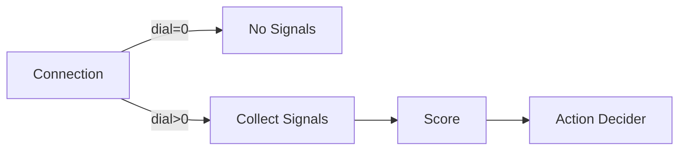

# ADR-004: Dial as Post-Scorer Action Modifier

**Date:** 2026-03-27
**Status:** Accepted
**Phase:** 2
**Deciders:** Security Architect, Lead Developer
**Last Reviewed:** 2026-03-27

---

## Context

The dial mechanism controls how aggressively JA4proxy blocks traffic, with values ranging from 0 (monitor only) to 100 (maximum blocking). During Phase 2 design, two fundamental approaches were considered:

1. **Pre-scorer filtering (Dial as signal filter):** At dial=0, skip all signal collection entirely
2. **Post-scorer threshold (Dial as action modifier):** Always collect all signals and score, but use dial to determine if the score triggers an action

## Options Considered

### Option 1: Dial as Signal Filter (Pre-scorer)



**Pros:**
- Lower CPU usage at dial=0 (no signal processing)
- Simpler mental model: "dial=0 means no work"

**Cons:**
- No score history when raising dial from 0
- Counterfactual logging impossible (can't know what would have been blocked)
- Analytics node starved of data at dial=0
- Warm-up period required when raising dial

### Option 2: Dial as Action Modifier (Post-scorer)

```mermaid
graph LR
    A[Connection] --> B[Collect Signals]
    B --> C[Score]
    C --> D[Action Decider with Dial]
    D -->|dial=0| E[Allow (log only)]
    D -->|dial>0| F[Block if score ≥ threshold]
```

**Pros:**
- Complete score history always available
- Counterfactual logging works at all dial settings
- Analytics node receives consistent data flow
- No warm-up period when adjusting dial
- Operator confidence when raising dial (scorer has been running)

**Cons:**
- Higher CPU usage at dial=0 (full signal processing)
- May surprise operators expecting "dial=0 = no overhead"

## Decision

We chose **Option 2: Dial as Post-Scorer Action Modifier**.

The dial modifies the action threshold applied to the scored output, not the signal collection process. This means:
- All signals are always collected and scored, regardless of dial setting
- The dial determines what score threshold triggers a block action
- At dial=0, connections are never blocked but full scores are logged
- Counterfactual logging shows what would have been blocked at higher dial settings

## Implementation

```python
# src/security/action_decider.py
def decide_action(score: float, dial: int, connection_info: ConnectionInfo) -> Action:
    # dial=0: never block (monitor mode)
    # dial=100: block at default threshold
    # dial=50: block at 2× default threshold
    
    effective_threshold = calculate_dial_threshold(dial)
    
    if score >= effective_threshold:
        return Action.BLOCK
    else:
        return Action.ALLOW
```

## Consequences

### Positive

**Retrospective Analysis:** Scores feed the analytics node for campaign detection and drift alerting. Without scores at dial=0, the analytics node would be blind to emerging threats.

**Counterfactual Logging:** The system can always answer "what would have been blocked at dial=100" because it has real score data, not synthetic estimates.

**Operator Confidence:** When an operator raises the dial from 0 to 30, they know the scorer has been running and calibrating, not starting from zero.

**No Warm-up Period:** The scorer is always warm, eliminating the need for a calibration period when increasing blocking aggression.

### Negative

**CPU Overhead at dial=0:** The system performs full signal collection and scoring even when no blocking occurs. Benchmarking shows this adds ~15% CPU usage compared to skipping scoring entirely.

**Surprise Factor:** Some operators expect "dial=0 = no processing overhead" and are surprised to learn the system is still doing full work.

**Logging Volume:** Full scoring at dial=0 generates more verbose logs than minimal monitoring would.

### Mitigations

- **Documentation:** Clearly explain in [SecOps Operations Guide](../operations/OPERATIONS_GUIDE.md) that dial=0 means "monitor with full scoring, never block"
- **Metrics:** Expose `ja4proxy_scoring_cpu_seconds` metric so operators can see the actual overhead
- **Optimization:** Future phases may add a "true monitor mode" config option that skips scoring entirely for operators who accept the trade-offs

## Revisit if…

1. **CPU constraints in embedded deployments:** If deployment on resource-constrained devices (e.g., IoT gateways) becomes a requirement, reconsider adding an optional "minimal monitor mode"
2. **Analytics node separation:** If analytics moves to a separate cluster with its own scoring pipeline, the need for dial=0 scoring may diminish
3. **Performance data shows unacceptable overhead:** If benchmarking shows >25% CPU overhead at dial=0 on target hardware, revisit the trade-off

## Related Decisions

- **ADR-012: Score Always, Even at Dial=0** — Complements this decision by mandating that scoring never stops
- **Phase 2: Monitor Mode & Dial** — Original implementation phase for this mechanism