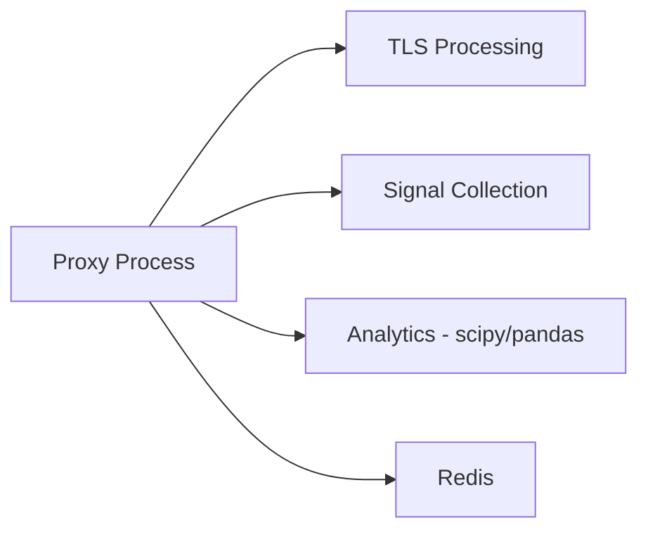
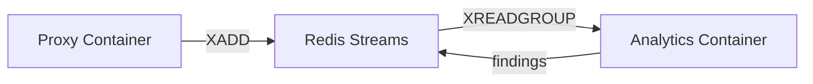

# ADR-006: Analytics Node as Separate Container

**Date:** 2026-03-27
**Status:** Accepted
**Phase:** 12
**Deciders:** Architect, DevOps Engineer, Data Scientist
**Last Reviewed:** 2026-03-27

---

## Context

The analytics node (Phase 12) performs cross-instance statistical analysis, campaign detection, and drift alerting. During design, we considered whether to:

1. **Embed analytics in the proxy process** — Single binary, shared memory space
2. **Separate analytics into its own container** — Independent process, separate scaling

## Options Considered

### Option 1: Embedded Analytics (Single Process)



**Pros:**
- Simpler deployment (one container)
- Shared memory access to connection data
- No inter-process communication overhead
- Atomic updates (no eventual consistency)

**Cons:**
- **Bloat:** scipy, pandas, numpy add ~300MB to container image
- **Crash risk:** scipy/pandas OOM or segfault takes down entire proxy
- **Scaling mismatch:** Analytics needs different resources than proxy
- **Lifecycle coupling:** Analytics failures require proxy restart
- **Language constraint:** Ties analytics to proxy language (Python)

### Option 2: Separate Container with Redis Streams



**Pros:**
- **Fault isolation:** Analytics crash doesn't affect proxy
- **Independent scaling:** Run 1 analytics node for N proxy instances
- **Resource specialization:** Analytics gets memory-heavy instance, proxy gets CPU-heavy
- **Language flexibility:** Analytics can use R, Julia, or specialized ML frameworks
- **Replayability:** Redis Streams persist events for post-mortem analysis
- **Decoupled lifecycle:** Can upgrade analytics without proxy restart

**Cons:**
- **Complexity:** Two containers to manage instead of one
- **Eventual consistency:** Short delay between event and analysis
- **Redis dependency:** Analytics requires Redis connectivity
- **Stream management:** Need consumer group management and trimming

### Option 3: Separate Container with Pub/Sub

Similar to Option 2 but using Redis Pub/Sub instead of Streams.

**Pros:**
- Lower latency than Streams
- Simpler to implement

**Cons:**
- **No persistence:** Events lost if analytics node is down
- **No replay:** Cannot re-process historical events
- **No acknowledgment:** No way to track which events were processed

## Decision

We chose **Option 2: Separate Container with Redis Streams**.

The analytics node runs as an independent container that consumes events from Redis Streams, with these characteristics:

- **Transport:** Redis Streams with consumer group
- **Persistence:** 7-day retention (configurable)
- **Processing:** Batch processing with acknowledgment
- **Output:** Findings written back to Redis for proxy consumption

## Implementation

```yaml
# docker-compose.yml
services:
  proxy:
    image: ja4proxy:latest
    # ... proxy config
  
  analytics:
    image: ja4proxy-analytics:latest
    depends_on:
      - redis
    environment:
      - REDIS_HOST=redis
      - STREAM_KEY=analytics:events
      - CONSUMER_GROUP=analytics-workers
```

```python
# analytics/main.py
async def process_streams():
    while True:
        # Claim pending messages (from other consumers that crashed)
        messages = await redis.xreadgroup(
            group_name="analytics-workers",
            consumer_name="worker-1",
            streams={"analytics:events": ">"},
            count=100,
            block=5000
        )
        
        for stream, messages in messages:
            for message_id, message_data in messages:
                try:
                    process_message(message_data)
                    await redis.xack(stream, "analytics-workers", message_id)
                except Exception as e:
                    logger.error(f"Failed to process {message_id}: {e}")
                    # Message will be re-delivered after timeout
```

## Consequences

### Positive

**Fault Isolation:** A memory leak in pandas or scipy OOM doesn't affect the proxy's ability to process connections

**Independent Scaling:** Can run 1 analytics node for 10 proxy instances, or scale analytics independently during attacks

**Specialized Resources:** Analytics gets instances optimized for memory and ML workloads

**Replayability:** Can reprocess historical events for algorithm tuning or incident investigation

**Decoupled Deployment:** Can update analytics algorithms without proxy downtime

**Language Flexibility:** Future analytics could use R, Julia, or Go without affecting proxy

### Negative

**Operational Complexity:** Two containers to monitor, log, and manage instead of one

**Eventual Consistency:** ~1-5 second delay between event and analysis result

**Redis Load:** Analytics reads add to Redis load (though mostly sequential XREADGROUP)

**Stream Management:** Need to manage consumer groups, trims, and monitor lag

### Mitigations

- **Monitoring:** Dedicated Grafana dashboard for stream lag and processing time
- **Alerting:** Alert if stream lag > 30 seconds or consumer group stalled
- **Documentation:** Comprehensive runbook for stream management
- **Testing:** Chaos tests for Redis failures and consumer crashes

## Why Not Pub/Sub?

We explicitly rejected Pub/Sub (Option 3) because:

1. **No Persistence:** Events are fire-and-forget; if analytics is down, events are lost forever
2. **No Replay:** Cannot reprocess historical data for algorithm tuning
3. **No Acknowledgement:** No way to track which events were successfully processed
4. **No Consumer Groups:** Multiple analytics instances would compete for the same events

Redis Streams solves all these problems while adding minimal overhead.

## Revisit if…

1. **Stream management becomes burdensome:** If operator feedback shows stream management is too complex, consider a managed queue service (Kafka, SQS)
2. **Latency requirements tighten:** If analytics needs <100ms latency, reconsider embedding or using a different transport
3. **Resource constraints:** If target environments cannot run two containers, reconsider embedding
4. **Analytics becomes stateless:** If future analytics can be stateless and scale horizontally, Pub/Sub might become viable

## Related Decisions

- **ADR-002: Redis Streams for Cross-Instance Events** — Complements this with transport-level rationale
- **ADR-009: Redis Streams vs Pub/Sub** — Detailed comparison of the two approaches
- **Phase 12: Analytics Node** — Original implementation phase