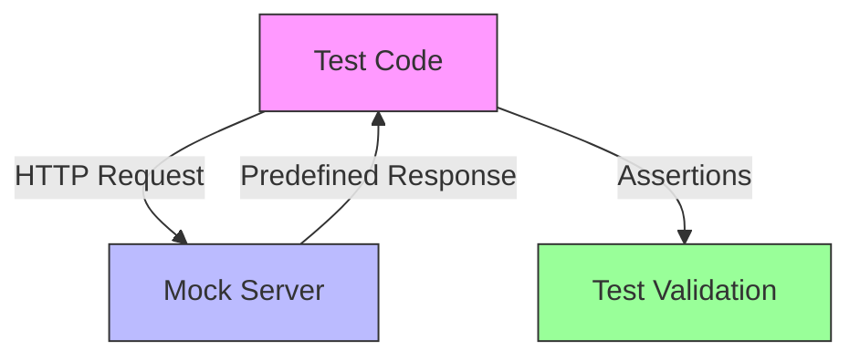

<!--
title: Mock_Servers
audience: Developers
last_reviewed: 2026-03-27
phase: 21
-->

# JA4proxy — Mock Servers Documentation

> **Audience:** Test authors, contributing developers
> **Purpose:** Comprehensive guide to test mock infrastructure
> **Last Reviewed:** 2026-03-27
> **Status:** Enterprise standard
> **Related:** [Testing Strategy](../TESTING_STRATEGY.md) · [Test Organisation](../TESTING_STRATEGY.md)

---

## Executive Summary

JA4proxy uses **mock servers** for all external service calls in tests. This ensures:

✅ **No real API calls** — Tests never hit production services
✅ **Deterministic behavior** — Mocks return consistent responses
✅ **Failure mode testing** — Chaos tests verify fail-open behavior
✅ **Fast execution** — No network latency in CI/CD
✅ **Offline testing** — No internet required

---

## Mock Server Architecture



### Key Components

| Component | Location | Purpose |
|-----------|----------|---------|
| **Mock Servers** | `tests/mocks/` | HTTP servers simulating external APIs |
| **Fixtures** | `tests/fixtures/` | Test data (ClientHello binaries, etc.) |
| **Test Helpers** | `tests/conftest.py` | Pytest fixtures for mock management |
| **Chaos Tests** | `tests/chaos/` | Verify fail-open behavior |

---

## Available Mock Servers

### 1. AbuseIPDB Mock

**File:** `tests/mocks/abuseipdb_mock.py`

**Simulates:** AbuseIPDB v2 `/check` endpoint

**Usage:**
```python
# In conftest.py
@pytest.fixture
def abuseipdb_mock():
    """Start AbuseIPDB mock server."""
    from tests.mocks.abuseipdb_mock import AbuseIPDBMock
    mock = AbuseIPDBMock()
    mock.start()
    yield mock
    mock.stop()

# In test
def test_abuseipdb_integration(abuseipdb_mock):
    # Configure mock response
    abuseipdb_mock.set_response(ip="1.2.3.4", score=100)
    
    # Run code that calls AbuseIPDB
    # Assertions...
```

**Endpoints:**
- `POST /api/v2/check` — IP reputation check
- `GET /health` — Health check

**Response Format:**
```json
{
  "data": {
    "ipAddress": "1.2.3.4",
    "abuseConfidenceScore": 100,
    "countryCode": "US",
    "usageType": "Data Center",
    "isp": "Amazon Technologies",
    "domain": "amazon.com",
    "hostnames": ["ec2-1-2-3-4.compute-1.amazonaws.com"],
    "totalReports": 15,
    "lastReportedAt": "2026-03-27T14:30:00+00:00"
  }
}
```

**Chaos Scenarios:**
- Connection refused
- Timeout (5s delay)
- HTTP 500 error
- Malformed JSON response
- Rate limit (HTTP 429)

---

### 2. RDAP Mock

**File:** `tests/mocks/rdap_mock.py`

**Simulates:** IANA bootstrap and RIR RDAP endpoints

**Usage:**
```python
@pytest.fixture
def rdap_mock():
    """Start RDAP mock server."""
    from tests.mocks.rdap_mock import RDAPMock
    mock = RDAPMock()
    mock.start()
    yield mock
    mock.stop()

def test_rdap_enrichment(rdap_mock):
    # Setup mock response
    rdap_mock.set_response(
        ip="1.2.3.4",
        asn=1234,
        country="US",
        org="Amazon Technologies"
    )
    
    # Test RDAP enrichment
```

**Endpoints:**
- `GET /ip/{ip}` — IP lookup
- `GET /autnum/{asn}` — ASN lookup
- `GET /entity/{handle}` — Entity lookup

**Response Format:**
```json
{
  "objectClassName": "ip network",
  "handle": "1.2.3.0/24",
  "startAddress": "1.2.3.0",
  "endAddress": "1.2.3.255",
  "ipVersion": "v4",
  "name": "AMAZON-2011L",
  "type": "DIRECT ALLOCATION",
  "country": "US",
  "parentHandle": "1.0.0.0/8",
  "status": ["active"],
  "entities": [
    {
      "objectClassName": "entity",
      "handle": "AMAZON-2",
      "vcardArray": ["vcard", [
        ["version", {}, "text", "4.0"],
        ["fn", {}, "text", "Amazon Technologies Inc."]
      ]],
      "roles": ["registrant"],
      "status": ["active"]
    }
  ]
}
```

---

### 3. DNS Mock

**File:** `tests/mocks/dns_mock.py`

**Simulates:** DNS resolution (PTR, A, AAAA records)

**Usage:**
```python
@pytest.fixture
def dns_mock():
    """Start DNS mock server."""
    from tests.mocks.dns_mock import DNSMock
    mock = DNSMock()
    mock.start()
    yield mock
    mock.stop()

def test_dns_enrichment(dns_mock):
    # Setup PTR record
    dns_mock.add_ptr("1.2.3.4", "ec2-1-2-3-4.compute-1.amazonaws.com")
    
    # Test DNS resolution
```

**Features:**
- PTR lookups (IP → hostname)
- A/AAAA lookups (hostname → IP)
- Configurable TTLs
- NXDOMAIN simulation
- Timeout simulation

---

### 4. Spamhaus DROP Mock

**File:** `tests/mocks/spamhaus_mock.py`

**Simulates:** Spamhaus DROP/EDROP feed downloads

**Usage:**
```python
@pytest.fixture
def spamhaus_mock():
    """Start Spamhaus mock server."""
    from tests.mocks.spamhaus_mock import SpamhausMock
    mock = SpamhausMock()
    mock.start()
    yield mock
    mock.stop()

def test_spamhaus_blocklist(spamhaus_mock):
    # Add CIDR to blocklist
    spamhaus_mock.add_cidr("1.2.3.0/24")
    
    # Test blocklist download
```

**Endpoints:**
- `GET /drop.txt` — DROP feed (text format)
- `GET /edrop.txt` — EDROP feed (text format)
- `GET /drop.json` — DROP feed (JSON format)

**Response Format (text):**
```
; Spamhaus DROP List
; Last Updated: 2026-03-27 14:30:00 UTC
;
1.2.3.0/24 ; Amazon
2.3.4.0/24 ; Bad Hosting
```

---

### 5. MaxMind GeoIP Mock

**File:** `tests/mocks/geoip_mock.py`

**Simulates:** MaxMind GeoIP2 database lookups

**Usage:**
```python
@pytest.fixture
def geoip_mock():
    """Start GeoIP mock server."""
    from tests.mocks.geoip_mock import GeoIPMock
    mock = GeoIPMock()
    mock.start()
    yield mock
    mock.stop()

def test_geoip_lookup(geoip_mock):
    # Add IP mapping
    geoip_mock.add_mapping(
        ip="1.2.3.4",
        country="US",
        city="Ashburn",
        asn=1234,
        org="Amazon"
    )
    
    # Test GeoIP lookup
```

**Note:** The actual implementation uses local database files, so this mock simulates the database query interface rather than HTTP endpoints.

---

## Creating a New Mock Server

### Step 1: Create Mock Server

```bash
# Create new mock file
touch tests/mocks/new_service_mock.py
```

**Template:**
```python
# tests/mocks/new_service_mock.py
from aiohttp import web
import asyncio
import logging
from typing import Optional, Dict, Any

logger = logging.getLogger(__name__)

class NewServiceMock:
    """Mock server for [Service Name] API."""
    
    def __init__(self, host: str = "127.0.0.1", port: int = 8080):
        self.host = host
        self.port = port
        self.server = None
        self.app = web.Application()
        self._setup_routes()
        
    def _setup_routes(self):
        """Configure API endpoints."""
        self.app.router.add_get("/health", self.health_handler)
        self.app.router.add_post("/api/v1/endpoint", self.main_handler)
        # Add more endpoints as needed
    
    async def health_handler(self, request: web.Request) -> web.Response:
        """Health check endpoint."""
        return web.json_response({"status": "ok"}, status=200)
    
    async def main_handler(self, request: web.Request) -> web.Response:
        """Main API endpoint."""
        try:
            data = await request.json()
            # Process request
            response = self._generate_response(data)
            return web.json_response(response, status=200)
            
        except Exception as e:
            logger.error(f"Mock error: {e}")
            return web.json_response({"error": str(e)}, status=500)
    
    def _generate_response(self, request_data: Dict) -> Dict:
        """Generate mock response based on request."""
        # Implement response logic
        return {
            "status": "success",
            "data": request_data
        }
    
    def start(self):
        """Start the mock server."""
        self.server = web.run_app(self.app, host=self.host, port=self.port)
        logger.info(f"NewServiceMock started on {self.host}:{self.port}")
    
    def stop(self):
        """Stop the mock server."""
        if self.server:
            self.server.close()
            logger.info("NewServiceMock stopped")

# For testing without async
def run_mock_sync():
    """Run mock server synchronously (for manual testing)."""
    mock = NewServiceMock()
    try:
        web.run_app(mock.app, host=mock.host, port=mock.port)
    except KeyboardInterrupt:
        pass

if __name__ == "__main__":
    run_mock_sync()
```

### Step 2: Add to Conftest

**Edit `tests/conftest.py`:**
```python
@pytest.fixture
def new_service_mock():
    """Start [Service Name] mock server."""
    from tests.mocks.new_service_mock import NewServiceMock
    mock = NewServiceMock()
    mock.start()
    yield mock
    mock.stop()
```

### Step 3: Write Chaos Tests

**Edit `tests/chaos/test_external_dependencies.py`:**
```python
def test_new_service_failure(new_service_mock):
    """System should fail-open when [Service] is unavailable."""
    # Simulate connection error
    new_service_mock.simulate_connection_error()
    
    # Run code that uses the service
    # Assert it doesn't crash and returns safe defaults
    
    # Verify fail-open behavior
    assert some_value == expected_safe_value

def test_new_service_timeout(new_service_mock):
    """System should fail-open when [Service] times out."""
    new_service_mock.simulate_timeout()
    
    # Test timeout handling
    # Assertions...

def test_new_service_malformed_response(new_service_mock):
    """System should fail-open on malformed responses."""
    new_service_mock.simulate_malformed_response()
    
    # Test malformed response handling
    # Assertions...
```

### Step 3: Add Chaos Methods

**Extend your mock class:**
```python
class NewServiceMock:
    # ... existing methods ...
    
    def simulate_connection_error(self):
        """Simulate connection refused error."""
        # Replace handler with error handler
        async def error_handler(request):
            raise ConnectionError("Connection refused")
        self.app.router.add_post("/api/v1/endpoint", error_handler)
    
    def simulate_timeout(self):
        """Simulate request timeout."""
        async def slow_handler(request):
            await asyncio.sleep(10)  # Longer than client timeout
            return web.Response(status=200)
        self.app.router.add_post("/api/v1/endpoint", slow_handler)
    
    def simulate_http_error(self, status=500):
        """Simulate HTTP error response."""
        async def error_handler(request):
            return web.Response(status=status)
        self.app.router.add_post("/api/v1/endpoint", error_handler)
    
    def simulate_malformed_response(self):
        """Simulate malformed JSON response."""
        async def bad_handler(request):
            return web.Response(
                body=b"not json",
                content_type="application/json"
            )
        self.app.router.add_post("/api/v1/endpoint", bad_handler)
```

---

## Mock Server Best Practices

### 1. Match Real API Behavior

**Do:**
- ✅ Use real API response formats
- ✅ Simulate real latency (when appropriate)
- ✅ Include all required fields
- ✅ Handle same edge cases as real API

**Don't:**
- ❌ Return simplified responses
- ❌ Ignore required headers
- ❌ Assume perfect input
- ❌ Skip error cases

### 2. Make Chaos Tests Realistic

**Test these failure modes:**
- Connection refused (service down)
- Timeout (service slow)
- HTTP 500 (server error)
- HTTP 429 (rate limited)
- Malformed JSON
- Unexpected content type
- Empty response
- Network partition

### 3. Keep Mocks Fast

**Optimizations:**
- Use in-memory responses (no disk I/O)
- Avoid complex computations
- Reuse objects where possible
- Minimize allocations

### 4. Document Mock Behavior

**Add to mock file header:**
```python
"""
NewService Mock Server

Purpose:
    Simulate [Service Name] API for testing

Endpoints:
    POST /api/v1/endpoint - Main API endpoint
    GET /health - Health check

Response Formats:
    Success: {"status": "success", "data": {...}}
    Error: {"error": "message"}

Chaos Modes:
    - connection_error() - Simulate connection refused
    - timeout() - Simulate 10s delay
    - http_error(status) - Return HTTP error code
    - malformed_response() - Return invalid JSON

Usage:
    >>> mock = NewServiceMock()
    >>> mock.start()
    >>> # Run tests
    >>> mock.stop()
"""
```

### 5. Test the Mocks

**Add mock self-tests:**
```python
def test_new_service_mock():
    """Verify mock server behaves correctly."""
    mock = NewServiceMock(port=8888)
    mock.start()
    
    try:
        # Test health endpoint
        resp = requests.get("http://localhost:8888/health")
        assert resp.status_code == 200
        assert resp.json()["status"] == "ok"
        
        # Test main endpoint
        resp = requests.post(
            "http://localhost:8888/api/v1/endpoint",
            json={"test": "data"}
        )
        assert resp.status_code == 200
        assert "data" in resp.json()
        
        # Test error simulation
        mock.simulate_http_error(500)
        resp = requests.post("http://localhost:8888/api/v1/endpoint", json={})
        assert resp.status_code == 500
        
    finally:
        mock.stop()
```

---

## Testing Strategy with Mocks

### Unit Tests

**Isolate component with mocks:**
```python
def test_signal_with_mock(abuseipdb_mock):
    """Test signal module with mocked AbuseIPDB."""
    # Setup mock response
    abuseipdb_mock.set_response(ip="1.2.3.4", score=100)
    
    # Create signal with mock client
    from src.security.abuseipdb_enricher import AbuseIPDBEnricher
    from tests.mocks.abuseipdb_mock import AbuseIPDBMockClient
    
    enricher = AbuseIPDBEnricher(
        config={"abuseipdb": {"enabled": True}},
        redis_client=MagicMock(),
        http_client=AbuseIPDBMockClient()  # Use mock client
    )
    
    # Test signal detection
    conn = ConnectionInfo(ip="1.2.3.4")
    signal = enricher.get_signal(conn)
    
    assert signal is not None
    assert signal.score == 100
```

### Integration Tests

**Test component interactions:**
```python
def test_pipeline_with_mocks(
    abuseipdb_mock,
    rdap_mock,
    dns_mock
):
    """Test full pipeline with all mocks."""
    # Setup all mocks
    abuseipdb_mock.set_response(ip="1.2.3.4", score=85)
    rdap_mock.set_response(ip="1.2.3.4", country="CN")
    dns_mock.add_ptr("1.2.3.4", "bad-host.example.com")
    
    # Create pipeline
    from src.security.pipeline import Pipeline
    pipeline = Pipeline(config, redis_client, logger)
    
    # Test full processing
    conn = ConnectionInfo(ip="1.2.3.4")
    result = pipeline.analyze(conn)
    
    # Verify composite score
    assert result.score > 80  # Should combine signals
```

### Chaos Tests

**Verify fail-open behavior:**
```python
def test_fail_open_on_abuseipdb_failure(abuseipdb_mock):
    """Pipeline should fail-open when AbuseIPDB unavailable."""
    abuseipdb_mock.simulate_connection_error()
    
    # Create pipeline
    pipeline = Pipeline(config, redis_client, logger)
    conn = ConnectionInfo(ip="1.2.3.4")
    
    # Should not crash, should return low/medium score
    result = pipeline.analyze(conn)
    assert result.score < 50  # No AbuseIPDB penalty
    
    # Verify logged
    # (Check logs for warning)
```

### Performance Tests

**Benchmark with mocks:**
```python
def test_pipeline_performance_with_mocks(
    abuseipdb_mock,
    rdap_mock,
    benchmark
):
    """Pipeline should process <10ms with mocks."""
    # Setup mocks for fast responses
    abuseipdb_mock.set_response(ip="1.2.3.4", score=0)  # Clean
    rdap_mock.set_response(ip="1.2.3.4", country="US")
    
    pipeline = Pipeline(config, redis_client, logger)
    conn = ConnectionInfo(ip="1.2.3.4")
    
    def process():
        return pipeline.analyze(conn)
    
    result = benchmark(process)
    
    # Should be fast with mocks
    assert result < 0.010  # <10ms
```

---

## Mock Server Maintenance

### Updating Mocks

**When real API changes:**
1. Update mock response format
2. Add new endpoints if needed
3. Update chaos test scenarios
4. Verify all tests still pass

### Adding New Endpoints

```python
# Add to mock class
def _setup_routes(self):
    # ... existing routes ...
    self.app.router.add_get("/api/v1/new_endpoint", self.new_endpoint_handler)

async def new_endpoint_handler(self, request):
    """Handle new endpoint."""
    # Implement response
    return web.json_response({"new": "data"})
```

### Deprecating Mocks

**When service is removed:**
1. Mark mock as deprecated
2. Update tests to not use it
3. Remove after 1 release cycle

```python
class DeprecatedMock:
    """
    DEPRECATED: This service was removed in vX.Y.Z
    
    This mock is retained for reference but should not be used
    in new tests. The service functionality has been replaced by [NewService].
    """
    # ... implementation ...
```

---

## Troubleshooting Mocks

### Common Issues

| Issue | Diagnosis | Solution |
|-------|-----------|----------|
| **Port conflict** | `Address already in use` | Change port or kill existing process |
| **Mock not starting** | No error, but not responding | Check logs, verify asyncio event loop |
| **Tests hanging** | Mock not responding | Add timeout to test requests |
| **Response mismatch** | Test fails unexpectedly | Compare mock response with real API |
| **Chaos test not working** | Mock not simulating error | Verify chaos method is called |

### Debugging Tips

**Log mock requests:**
```python
async def main_handler(self, request):
    # Log incoming request
    data = await request.json()
    logger.debug(f"Mock received: {data}")
    
    # Log response
    response = {"status": "ok", "data": data}
    logger.debug(f"Mock responding: {response}")
    
    return web.json_response(response)
```

**Test with curl:**
```bash
# Test mock directly
curl -v http://localhost:8080/health

# Test with JSON
curl -X POST http://localhost:8080/api/v1/endpoint \
  -H "Content-Type: application/json" \
  -d '{"test": "data"}'
```

**Check running mocks:**
```bash
# List running mocks
ps aux | grep "mock.py"

# Check ports
ss -tulnp | grep 808
```

---

## Mock Server Index

| Service | Mock File | Port | Status |
|---------|-----------|------|--------|
| **AbuseIPDB** | `abuseipdb_mock.py` | 8081 | ✅ Active |
| **RDAP** | `rdap_mock.py` | 8082 | ✅ Active |
| **DNS** | `dns_mock.py` | 8083 | ✅ Active |
| **Spamhaus** | `spamhaus_mock.py` | 8084 | ✅ Active |
| **GeoIP** | `geoip_mock.py` | 8085 | ✅ Active |
| **New Service** | `new_service_mock.py` | 8086 | 📝 Planned |

---

**Document Status:** ✅ Enterprise Standard (2026-03-27)
**Next Review:** 2026-06-27 (Quarterly)
**Maintainer:** Testing Team

*Contribute: Add new mock servers as needed — keep this documentation current!*