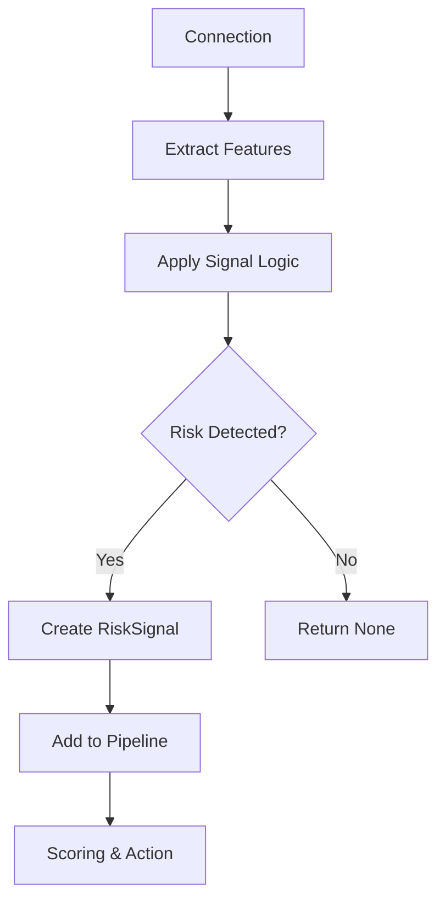

# JA4proxy — Signal Development Guide

> **Audience:** Contributing developers, signal module authors
> **Purpose:** Comprehensive guide for developing new risk signal modules
> **Last Reviewed:** 2026-03-27
> **Related:** [Contributing Guide](../../CONTRIBUTING.md) · [Style Guide](../../STYLE_GUIDE.md) · [Testing Strategy](../../TESTING_STRATEGY.md)

---

## Quick Start

**Want to add a new signal fast?** Follow this 10-step checklist:

```bash
# 1. Create signal module
cp src/security/template_signal.py src/security/my_signal.py

# 2. Implement get_signal() method
# 3. Register in pipeline.py

# 4. Add config to config/proxy.yml
# 5. Add Prometheus metrics

# 6. Write unit tests (20+ tests)
# 7. Write chaos test

# 8. Add to FP corpus test
# 9. Update REDIS_SCHEMA.md

# 10. Document in phase file
```

---

## Signal Architecture

### RiskSignal Data Model

```python
@dataclass
class RiskSignal:
    # Unique identifier for this signal type
    name: str = "my_signal"
    
    # Risk score contribution (0-100)
    score: float = 0.0
    
    # Human-readable explanation
    reason: str = ""
    
    # Confidence in this signal (0-100)
    confidence: int = 80
    
    # Evidence data (structured)
    evidence: dict = field(default_factory=dict)
    
    # Bypass flag (if applicable)
    should_bypass: bool = False
```

**Score Calibration Guide:**

| Score Range | Interpretation | Example Use Cases |
|-------------|----------------|-------------------|
| **0-10** | Informational | Logging, analytics only |
| **11-30** | Low risk | Suspicious but likely legitimate |
| **31-60** | Medium risk | Probably malicious, block at dial=50+ |
| **61-90** | High risk | Clearly malicious, block at dial=30+ |
| **91-100** | Critical risk | Extreme threat, block at any dial |

### Signal Collection Flow



---

## Developing a New Signal Module

### Step 1: Create Module Skeleton

```bash
# Start from template
cp src/security/template_signal.py src/security/my_signal.py

# Or create new file
touch src/security/my_signal.py
```

**Template Structure:**
```python
# src/security/my_signal.py
from dataclasses import dataclass, field
from typing import Optional, List
from src.security.models import RiskSignal, ConnectionInfo
import logging

logger = logging.getLogger(__name__)

@dataclass
class MySignal:
    """
    Detects [brief description of what this signal detects].
    
    Configuration:
    - my_signal.enabled: Enable/disable this signal
    - my_signal.threshold: Minimum score threshold
    - my_signal.ttl: Cache TTL for signal results
    """
    
    def __init__(self, config: dict):
        self.config = config
        self.enabled = config.get("my_signal", {}).get("enabled", True)
        self.threshold = config.get("my_signal", {}).get("threshold", 75)
        
    def get_signal(self, conn: ConnectionInfo) -> Optional[RiskSignal]:
        """
        Analyze connection and return RiskSignal if threat detected.
        
        Args:
            conn: ConnectionInfo with all connection details
            
        Returns:
            RiskSignal if threat detected, None otherwise
            
        Raises:
            Exception: Only in unrecoverable errors (violates fail-open)
        """
        if not self.enabled:
            return None
            
        try:
            # Implement detection logic here
            if self._is_malicious(conn):
                return RiskSignal(
                    name="my_signal",
                    score=self.threshold,
                    reason=f"Detected [threat] from {conn.ip}",
                    confidence=90,
                    evidence={
                        "ip": conn.ip,
                        "ja4": conn.ja4,
                        "detail": "[specific evidence]"
                    }
                )
            return None
            
        except Exception as e:
            logger.error(f"MySignal error for {conn.ip}: {e}")
            # Fail-open: return None on error
            return None
    
    def _is_malicious(self, conn: ConnectionInfo) -> bool:
        """Implementation-specific detection logic."""
        # Your detection algorithm here
        return False
```

### Step 2: Register in Pipeline

**Edit `src/security/pipeline.py`:**
```python
# Add import
from src.security.my_signal import MySignal

# Add to _collect_signals method
def _collect_signals(self, conn: ConnectionInfo) -> List[RiskSignal]:
    signals = []
    
    # Existing signals...
    
    # Add your new signal
    if self.config.get("my_signal", {}).get("enabled", True):
        my_signal = MySignal(self.config)
        if signal := my_signal.get_signal(conn):
            signals.append(signal)
    
    return signals
```

### Step 3: Add Configuration

**Edit `config/proxy.yml`:**
```yaml
signals:
  # ... existing signals ...
  
  my_signal:
    enabled: true
    threshold: 75  # Score to assign if detected
    cache_ttl: 3600  # Cache duration in seconds
    
    # Signal-specific configuration
    sensitivity: "medium"  # low/medium/high
    whitelist: []  # List of IPs to exclude
```

### Step 4: Add Prometheus Metrics

**Edit `src/security/my_signal.py`:**
```python
from prometheus_client import Counter, Histogram

# Module-level metrics
MY_SIGNAL_DETECTED = Counter(
    "ja4proxy_my_signal_detected_total",
    "Number of connections with my_signal detected",
    ["action"]  # block/allow/monitor
)

MY_SIGNAL_PROCESSING_TIME = Histogram(
    "ja4proxy_my_signal_processing_seconds",
    "Time spent processing my_signal",
    buckets=[0.001, 0.01, 0.1, 0.5, 1.0]
)

# Update get_signal method
@MY_SIGNAL_PROCESSING_TIME.time()
def get_signal(self, conn: ConnectionInfo) -> Optional[RiskSignal]:
    # ... existing logic ...
    
    if signal:
        MY_SIGNAL_DETECTED.labels(action="detected").inc()
    else:
        MY_SIGNAL_DETECTED.labels(action="clean").inc()
    
    return signal
```

**Update `docs/OBSERVABILITY_STANDARDS.md`:**
```markdown
### MySignal Metrics

| Metric | Type | Labels | Description |
|--------|------|--------|-------------|
| `ja4proxy_my_signal_detected_total` | Counter | `action` | Connections with signal detected |
| `ja4proxy_my_signal_processing_seconds` | Histogram | - | Processing time distribution |
```

### Step 5: Implement Fail-Open Pattern

**Critical: All signals must fail gracefully**

```python
def get_signal(self, conn: ConnectionInfo) -> Optional[RiskSignal]:
    if not self.enabled:
        return None
        
    try:
        # Your detection logic
        return signal if detected else None
        
    except RedisConnectionError as e:
        logger.warning(f"Redis unavailable for my_signal: {e}")
        MY_SIGNAL_DETECTED.labels(action="redis_fail").inc()
        return None
        
    except ExternalAPIError as e:
        logger.warning(f"External API failed for my_signal: {e}")
        MY_SIGNAL_DETECTED.labels(action="api_fail").inc()
        return None
        
    except Exception as e:
        logger.error(f"Unexpected error in my_signal: {e}", exc_info=True)
        MY_SIGNAL_DETECTED.labels(action="error").inc()
        return None  # Always return None on error
```

---

## Testing Your Signal

### Unit Tests

**Create `tests/unit/test_my_signal.py`:**
```python
import pytest
from unittest.mock import Mock
from src.security.my_signal import MySignal
from src.security.models import ConnectionInfo, RiskSignal

@pytest.fixture
def base_config():
    return {
        "my_signal": {
            "enabled": True,
            "threshold": 75,
            "cache_ttl": 3600
        }
    }

@pytest.fixture
def connection():
    return ConnectionInfo(
        ip="1.2.3.4",
        ja4="abc123...",
        sni="example.com",
        # ... other required fields
    )

def test_signal_disabled(base_config, connection):
    """Signal should return None when disabled."""
    base_config["my_signal"]["enabled"] = False
    signal = MySignal(base_config)
    assert signal.get_signal(connection) is None

def test_signal_detected(base_config, connection):
    """Signal should detect known malicious pattern."""
    # Setup connection to trigger detection
    connection.ja4 = "known_malicious_fingerprint"
    
    signal = MySignal(base_config)
    result = signal.get_signal(connection)
    
    assert result is not None
    assert result.name == "my_signal"
    assert result.score == 75
    assert "malicious" in result.reason.lower()
    assert result.confidence > 50

def test_signal_not_detected(base_config, connection):
    """Signal should return None for clean connection."""
    connection.ja4 = "legitimate_browser_fingerprint"
    
    signal = MySignal(base_config)
    assert signal.get_signal(connection) is None

def test_signal_fail_open_on_error(base_config, connection):
    """Signal should return None on exception (fail-open)."""
    # Mock an external dependency to fail
    with pytest.raises(Exception):
        # ... trigger error condition
        pass
    
    signal = MySignal(base_config)
    assert signal.get_signal(connection) is None

# Add 15+ more tests for edge cases
```

**Test Coverage Requirements:**
- ✅ Signal disabled
- ✅ Signal detected (positive case)
- ✅ Signal not detected (negative case)
- ✅ Fail-open on exception
- ✅ Configuration variations
- ✅ Edge cases (empty data, malformed input)
- ✅ Performance (processing time)
- ✅ Metric emission

### Chaos Tests

**Add to `tests/chaos/test_external_dependencies.py`:**
```python
def test_my_signal_redis_failure(redis_mock):
    """MySignal should fail-open when Redis unavailable."""
    redis_mock.simulate_connection_error()
    
    conn = create_test_connection()
    signal = MySignal(get_base_config())
    
    # Should not crash, should return None
    assert signal.get_signal(conn) is None

def test_my_signal_api_timeout(api_mock):
    """MySignal should fail-open when external API times out."""
    api_mock.simulate_timeout()
    
    conn = create_test_connection()
    signal = MySignal(get_base_config())
    
    assert signal.get_signal(conn) is None
```

### FP Corpus Tests

**Create `tests/fp_corpus/test_my_signal_fp.py`:**
```python
import pytest
from tests.fixtures.fp_corpus import load_legitimate_ja4_list
from src.security.my_signal import MySignal
from src.security.models import ConnectionInfo

LEGITIMATE_JA4_LIST = load_legitimate_ja4_list()

@pytest.mark.parametrize("ja4", LEGITIMATE_JA4_LIST[:100])  # Test first 100
def test_my_signal_no_fp_on_legitimate(ja4):
    """MySignal should not flag legitimate browser fingerprints."""
    config = {"my_signal": {"enabled": True, "threshold": 75}}
    signal = MySignal(config)
    
    conn = ConnectionInfo(
        ip="192.0.2.1",
        ja4=ja4,
        sni="example.com",
        # ... other fields
    )
    
    result = signal.get_signal(conn)
    
    # Should not detect on legitimate traffic
    assert result is None, f"MySignal falsely flagged legitimate JA4: {ja4}"
```

**Run FP tests:**
```bash
# Run all FP corpus tests
python3 -m pytest tests/fp_corpus/ -v

# Run your specific signal
python3 -m pytest tests/fp_corpus/test_my_signal_fp.py -v

# Check coverage
python3 -m pytest --cov=src/security --cov-report=term-missing tests/fp_corpus/
```

---

## Signal Calibration

### Score Calibration Process

1. **Start conservative:** Begin with low score (e.g., 30)
2. **Monitor in production:** Watch `ja4proxy_my_signal_detected_total`
3. **Review false positives:** Check incident logs for FP reports
4. **Adjust gradually:** Increase by 5-10 points per iteration
5. **Validate with corpus:** Run FP tests after each adjustment

### Confidence Levels

| Confidence | Criteria | Use Case |
|------------|----------|----------|
| **90-100** | Cryptographic proof, multiple corroborating signals | mTLS validation, certificate pinning |
| **70-89** | Strong heuristic evidence, low FP rate | Known malicious JA4, DGA domains |
| **50-69** | Moderate evidence, some FP risk | Suspicious SNI patterns, unusual cipher suites |
| **30-49** | Weak evidence, high FP risk | Geolocation anomalies, time-based patterns |
| **10-29** | Informational only | Logging, analytics enrichment |

### Benchmarking Performance

**Add performance test:**
```python
def test_my_signal_performance(benchmark):
    """MySignal should process <1ms per connection."""
    config = {"my_signal": {"enabled": True}}
    signal = MySignal(config)
    conn = create_benchmark_connection()
    
    def process():
        return signal.get_signal(conn)
    
    result = benchmark(process)
    
    # Should complete in under 1ms
    assert result < 0.001
```

**Run benchmark:**
```bash
python3 -m pytest tests/unit/test_my_signal.py::test_my_signal_performance -v
```

---

## Integration with Analytics

### Adding to Analytics Stream

**Edit `analytics/stream_consumer.py`:**
```python
# Add your signal to the event schema
ANALYTICS_EVENT_SCHEMA = {
    # ... existing fields ...
    "my_signal_detected": False,
    "my_signal_score": 0.0,
    "my_signal_reason": "",
}

def process_connection_event(event):
    # ... existing processing ...
    
    # Add your signal data
    if "my_signal" in event.get("signals", []):
        event["my_signal_detected"] = True
        event["my_signal_score"] = event["signals"]["my_signal"]["score"]
        event["my_signal_reason"] = event["signals"]["my_signal"]["reason"]
    
    # ... rest of processing ...
```

### Adding to Campaign Detection

**Edit `analytics/campaign_detector.py`:**
```python
CAMPAIGN_SIGNALS = [
    # ... existing signals ...
    "my_signal",
]

def detect_campaign(events):
    # ... existing logic ...
    
    # Add your signal to campaign analysis
    my_signal_events = [e for e in events if e.get("my_signal_detected")]
    if len(my_signal_events) > THRESHOLD:
        create_campaign_alert(
            name="my_signal_campaign",
            events=my_signal_events,
            severity="high"
        )
```

---

## Documentation Requirements

### Update REDIS_SCHEMA.md

**Add entry for any new Redis keys:**
```markdown
## Key: `my_signal:{ip}`

**Type:** String
**TTL:** 3600 seconds (configurable)
**Written by:** proxy hot path
**Read by:** proxy hot path, analytics node
**Phase introduced:** Phase N

**Value format:**
```json
{
  "detected": true,
  "timestamp": "2026-03-27T14:30:00Z",
  "score": 75,
  "reason": "Detected [threat] from 1.2.3.4",
  "evidence": { ... }
}
```

**Notes:** Cached to avoid re-processing same IP within TTL window.
```

### Update Phase Documentation

**Add to your phase file (`docs/phases/PHASE_N.md`):**
```markdown
### MySignal Implementation

**Status:** ✅ Complete

**Files Added:**
- `src/security/my_signal.py` — Signal detection logic
- `tests/unit/test_my_signal.py` — 25 unit tests
- `tests/chaos/test_my_signal_chaos.py` — Chaos tests
- `tests/fp_corpus/test_my_signal_fp.py` — FP corpus tests

**Configuration:**
```yaml
my_signal:
  enabled: true
  threshold: 75
  cache_ttl: 3600
```

**Metrics:**
- `ja4proxy_my_signal_detected_total{action}`
- `ja4proxy_my_signal_processing_seconds`

**Redis Keys:**
- `my_signal:{ip}` — Cached detection results

**Acceptance Criteria:**
- [ ] Signal detects [threat] with <5% FP rate
- [ ] Processing time <1ms per connection
- [ ] Fail-open on all error conditions
- [ ] 25+ unit tests with 95% coverage
- [ ] Chaos tests for Redis and API failures
- [ ] FP corpus tests against Tranco top-10k
```

---

## Signal Development Checklist

**Before submitting your PR:**

- [ ] ✅ Signal module created in `src/security/`
- [ ] ✅ Registered in `src/security/pipeline.py`
- [ ] ✅ Configuration added to `config/proxy.yml`
- [ ] ✅ Prometheus metrics implemented
- [ ] ✅ Fail-open pattern implemented
- [ ] ✅ 20+ unit tests written
- [ ] ✅ Chaos tests added
- [ ] ✅ FP corpus tests added
- [ ] ✅ REDIS_SCHEMA.md updated
- [ ] ✅ Phase documentation updated
- [ ] ✅ Observability standards updated
- [ ] ✅ Code follows STYLE_GUIDE.md
- [ ] ✅ All tests pass (`make test`)
- [ ] ✅ Test coverage ≥95% (`make test-coverage`)
- [ ] ✅ No linting errors (`make lint`)

---

## Advanced Topics

### Signal Chaining

**Combining multiple signals for stronger detection:**
```python
def get_signal(self, conn: ConnectionInfo) -> Optional[RiskSignal]:
    # Get results from other signals
    other_signals = self.pipeline.get_other_signals(conn)
    
    # Boost score if corroborating evidence
    base_score = self.threshold
    
    if other_signals.get("sni_analyzer"):
        base_score = min(100, base_score + 10)
    
    if other_signals.get("beaconing"):
        base_score = min(100, base_score + 15)
    
    if base_score > self.threshold:
        return RiskSignal(
            name="my_signal",
            score=base_score,
            reason=f"Detected [threat] with corroborating signals",
            confidence=95
        )
    
    return None
```

### Machine Learning Integration

**Adding ML model to signal:**
```python
import pickle
from pathlib import Path

class MyMLSignal:
    def __init__(self, config: dict):
        self.config = config
        self.model = self._load_model()
        
    def _load_model(self):
        """Load pre-trained model from file."""
        model_path = Path(__file__).parent / "models" / "my_signal.pkl"
        with open(model_path, "rb") as f:
            return pickle.load(f)
    
    def get_signal(self, conn: ConnectionInfo) -> Optional[RiskSignal]:
        # Extract features
        features = self._extract_features(conn)
        
        # Predict
        prediction = self.model.predict([features])[0]
        probability = self.model.predict_proba([features])[0][1]
        
        if prediction == 1 and probability > 0.85:
            return RiskSignal(
                name="my_signal_ml",
                score=int(probability * 100),
                reason=f"ML model detected threat (p={probability:.2f})",
                confidence=int(probability * 100),
                evidence={"features": features, "probability": probability}
            )
        
        return None
```

### Geospatial Analysis

**Adding location-based detection:**
```python
def get_signal(self, conn: ConnectionInfo) -> Optional[RiskSignal]:
    # Get country from connection
    country = conn.country_code
    
    # Check against high-risk countries
    if country in self.config.get("high_risk_countries", []):
        return RiskSignal(
            name="my_signal_geo",
            score=40,  # Moderate score for geo-only
            reason=f"Connection from high-risk country: {country}",
            confidence=60,
            evidence={"country": country, "ip": conn.ip}
        )
    
    return None
```

---

## Troubleshooting Signal Development

### Common Issues

| Issue | Diagnosis | Solution |
|-------|-----------|----------|
| **Signal not called** | Check `pipeline.py` registration | Ensure properly registered |
| **Score too low** | Review calibration | Adjust threshold in config |
| **High FP rate** | Run FP corpus tests | Add exceptions, adjust logic |
| **Performance slow** | Profile with `py-spy` | Optimize hot paths |
| **Redis errors** | Check connection handling | Implement proper fail-open |
| **Tests failing** | Run specific test | Debug with `pytest -vvv` |

### Debugging Tips

**Log signal processing:**
```python
def get_signal(self, conn: ConnectionInfo) -> Optional[RiskSignal]:
    logger.debug(f"MySignal processing: ip={conn.ip}, ja4={conn.ja4}")
    
    try:
        # ... logic ...
        if detected:
            logger.info(f"MySignal detected: {conn.ip} -> score={score}")
        
        return signal
    except Exception as e:
        logger.exception(f"MySignal error for {conn.ip}")
        return None
```

**Test with real traffic:**
```bash
# Capture real connections
nc -l 8443 | tee capture.pcap | wireshark -

# Replay through proxy
python3 tools/replay_traffic.py capture.pcap
```

---

## Resources

### Example Signals

**Study existing implementations:**
- `src/security/tls_enforcer.py` — Simple threshold-based signal
- `src/security/sni_analyzer.py` — Pattern matching signal
- `src/security/beaconing_detector.py` — Time-series analysis signal
- `src/security/abuseipdb_enricher.py` — External API integration

### Testing Utilities

**Useful test helpers:**
- `tests/conftest.py` — Fixtures and mocks
- `tests/fixtures/` — Test data generators
- `tests/mocks/` — External service mocks
- `tools/generate_test_data.py` — Create realistic test cases

### Community

**Get help:**
- GitHub Discussions: [github.com/ja4proxy/discussions](https://github.com/ja4proxy/discussions)
- Slack: #ja4proxy-signals
- Office Hours: Tuesdays 2-3pm UTC

---

**Document Status:** ✅ Enterprise Standard (2026-03-27)
**Next Review:** 2026-06-27 (Quarterly)
**Maintainer:** Development Team

*Contribute: Improve this guide as you develop signals — share your learnings!*