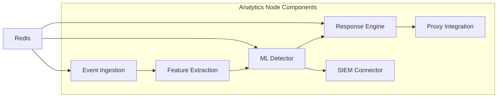
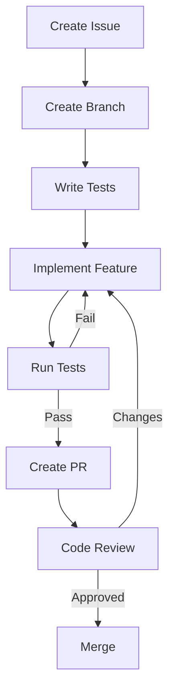

<!--
title: Analytics Development
audience: Developers
last_reviewed: 2026-03-27
phase: 21
-->

> **[DEPRECATED]** This draft document has been superseded by the analytics architecture documentation
> in [architecture/analytics-node-architecture.md](../architecture/analytics-node-architecture.md)
>
> The new document provides comprehensive, up-to-date information about the analytics node
> architecture, stream processing pipeline, and implementation details.
> This draft is retained for historical reference only.

# Analytics Node Development Guide (Deprecated)

## Overview

**Note:** This content is outdated. See [analytics-node-architecture.md](../architecture/analytics-node-architecture.md) for current information.

This guide provides comprehensive development information for the JA4Proxy Analytics Node (Phase 12). It covers architecture, APIs, testing, debugging, and best practices.

## Architecture Overview



## Development Environment Setup

### Prerequisites

**Required Tools:**
- Python 3.10+
- Docker 20.10+
- Redis 6.2+
- pytest 7.0+
- prometheus_client 0.14+

**Recommended Tools:**
- PyCharm/VSCode with Python extensions
- Docker Compose for local development
- Grafana for metrics visualization
- RedisInsight for data inspection

### Local Development Setup

```bash
# Clone repository
git clone https://github.com/yourorg/ja4proxy.git
cd ja4proxy

# Set up virtual environment
python -m venv venv
source venv/bin/activate
pip install -r requirements-dev.txt

# Start development services
docker-compose -f docker-compose.dev.yml up -d

# Run analytics node
python -m src.analytics.main --config config/dev.yaml
```

### Configuration

**Development Configuration (`config/dev.yaml`):**
```yaml
analytics:
  enabled: true
  event_stream: "ja4proxy:events:dev"
  batch_size: 100
  batch_interval_ms: 100
  
ml:
  enabled: true
  model_path: "/tmp/ml_model.pkl"
  feature_config:
    version: 1
    include_geo: false
    include_asn: false
  
automated_response:
  enabled: true
  manual_approval_required: true
  playbooks_dir: "playbooks/dev"
  
siem:
  enabled: false
  # Enable for SIEM integration testing
  # type: "splunk"
  # endpoint: "https://splunk.dev.example.com"
```

## Component Development

### 1. Event Ingestion

**Key Classes:**
- `EventConsumer`: Redis Stream consumer
- `EventValidator`: Schema validation
- `EventBatchProcessor`: Batch processing

**Development Tips:**
```python
# Example: Custom event processor
class CustomEventProcessor:
    async def process(self, event: Dict) -> Dict:
        # Add custom processing logic
        event['custom_field'] = self._calculate_custom_field(event)
        return event
    
    def _calculate_custom_field(self, event: Dict) -> Any:
        # Your custom logic here
        return event['score'] * 2
```

**Testing:**
```bash
# Run event ingestion tests
pytest tests/unit/test_event_ingestion.py -v

# Test with real Redis
pytest tests/integration/test_redis_integration.py -v
```

### 2. Feature Extraction

**FeatureExtractor Class:**
```python
class FeatureExtractor:
    def __init__(self, config: Dict):
        self.config = config
        self.geo_db = self._load_geo_database() if config.get('include_geo') else None
    
    def extract(self, fingerprint: Dict) -> List[float]:
        """Extract 20+ features from JA4 fingerprint"""
        features = [
            # Basic features
            fingerprint['score'],
            len(fingerprint.get('extensions', [])),
            len(fingerprint.get('ciphers', [])),
            
            # Advanced features
            self._calculate_entropy(fingerprint.get('ja4', '')),
            self._calculate_cipher_strength(fingerprint.get('ciphers', [])),
        ]
        
        # Conditional features
        if self.geo_db:
            features.extend(self._extract_geo_features(fingerprint))
            
        return self._normalize(features)
```

**Adding New Features:**
1. Add feature calculation method
2. Update `extract()` method to include new feature
3. Update feature count in documentation
4. Add unit tests for new feature

**Feature Testing:**
```bash
# Test feature extraction
pytest tests/unit/test_feature_extraction.py -v

# Test with edge cases
pytest tests/unit/test_feature_extraction.py::TestFeatureExtractor::test_edge_cases -v
```

### 3. ML Detector Development

**Model Interface:**
```python
class MLModel(ABC):
    @abstractmethod
    def predict(self, features: List[List[float]]) -> List[float]:
        """Predict anomaly scores for feature vectors"""
        pass
    
    @abstractmethod
    def save(self, path: str):
        """Save model to file"""
        pass
    
    @abstractmethod
    def load(self, path: str):
        """Load model from file"""
        pass
```

**Current Implementation (ThresholdModel):**
```python
class ThresholdModel(MLModel):
    def __init__(self, threshold: float = 0.7):
        self.threshold = threshold
    
    def predict(self, features: List[List[float]]) -> List[float]:
        # Simple threshold-based prediction
        return [min(1.0, max(0.0, f[0] / 100.0)) for f in features]
```

**Upgrading to ML Model:**
```python
from sklearn.ensemble import IsolationForest

class IsolationForestModel(MLModel):
    def __init__(self):
        self.model = IsolationForest(n_estimators=100, contamination=0.01)
        self.trained = False
    
    def train(self, X: List[List[float]], y: List[int]):
        self.model.fit(X)
        self.trained = True
    
    def predict(self, features: List[List[float]]) -> List[float]:
        if not self.trained:
            raise RuntimeError("Model not trained")
        return self.model.decision_function(features).tolist()
```

**ML Testing:**
```bash
# Test ML detector
pytest tests/unit/test_ml_detector.py -v

# Test with different models
pytest tests/unit/test_ml_detector.py -k "test_anomaly_detection" -v
```

### 4. Automated Response Engine

**Playbook Development:**
```yaml
# playbooks/custom_response.yaml
name: custom_response
description: Custom response playbook for specific threats
disabled: false

triggers:
  - anomaly_score > 0.85
  - fingerprint.ja4 matches "t13d.*h2.*"

actions:
  - name: log_event
    type: automatic
    params:
      level: warning
      message: "Custom threat detected: {{ fingerprint.ja4 }}"
  
  - name: enrich_threat
    type: automatic
    params:
      services: [virustotal, abuseipdb]
      timeout: 5
  
  - name: notify_team
    type: automatic
    params:
      channel: "#security-alerts"
      template: "custom_threat_notification"
```

**Custom Action Development:**
```python
from src.analytics.response_engine import BaseAction

class CustomAction(BaseAction):
    def __init__(self, params: Dict):
        super().__init__(params)
        self.api_key = params.get('api_key')
    
    async def execute(self, context: Dict) -> Dict:
        # Custom action logic
        result = await self._call_external_api(context)
        
        return {
            'status': 'success',
            'data': result,
            'action': 'custom_action'
        }
    
    async def _call_external_api(self, context: Dict) -> Dict:
        # Implement API call logic
        return {'custom_result': 'success'}
    
    async def rollback(self, execution_id: str) -> Dict:
        # Implement rollback logic
        return {'status': 'rolled_back'}
```

**Response Engine Testing:**
```bash
# Test response engine
pytest tests/unit/test_response_engine.py -v

# Test playbook execution
pytest tests/integration/test_playbook_execution.py -v
```

### 5. SIEM Integration

**SIEM Connector Interface:**
```python
class SIEMConnector(ABC):
    @abstractmethod
    async def send_alert(self, alert: Dict) -> Dict:
        """Send alert to SIEM"""
        pass
    
    @abstractmethod
    async def query_threat_intel(self, ioc: str) -> Dict:
        """Query threat intelligence"""
        pass
    
    @abstractmethod
    async def get_health(self) -> Dict:
        """Check SIEM connection health"""
        pass
```

**Splunk Connector Example:**
```python
class SplunkConnector(SIEMConnector):
    def __init__(self, config: Dict):
        self.endpoint = config['endpoint']
        self.token = config['token']
        self.session = aiohttp.ClientSession()
    
    async def send_alert(self, alert: Dict) -> Dict:
        headers = {
            'Authorization': f'Splunk {self.token}',
            'Content-Type': 'application/json'
        }
        
        async with self.session.post(
            f'{self.endpoint}/services/collector',
            headers=headers,
            json=alert
        ) as response:
            return await response.json()
```

**SIEM Testing:**
```bash
# Test SIEM connectors (mocked)
pytest tests/unit/test_siem_connector.py -v

# Test with real SIEM (integration tests)
pytest tests/integration/test_siem_integration.py -v --siem-type=splunk
```

## Testing Strategy

### Unit Testing

**Test Coverage Requirements:**
- 100% code coverage for core logic
- Edge case testing for all public methods
- Mock external dependencies (Redis, SIEM, etc.)

**Example Test Structure:**
```python
import pytest
from unittest.mock import AsyncMock
from src.analytics.ml_detector import MLDetector

@pytest.mark.asyncio
class TestMLDetector:
    async def test_detector_initialization(self):
        mock_redis = AsyncMock()
        config = {'ml_model_path': '/tmp/test_model.pkl'}
        
        detector = MLDetector(mock_redis, config)
        
        assert detector.config == config
        assert detector.redis == mock_redis
        assert hasattr(detector, 'extractor')
        assert hasattr(detector, 'model')
    
    async def test_anomaly_detection(self):
        # Test with mock data
        pass
```

**Running Unit Tests:**
```bash
# Run all analytics tests
pytest tests/unit/analytics/ -v

# Run specific test
pytest tests/unit/test_ml_detector.py::TestMLDetector::test_detector_initialization -v

# Test with coverage
pytest --cov=src/analytics --cov-report=html tests/unit/analytics/
```

### Integration Testing

**Integration Test Requirements:**
- Test with real Redis instance
- Test component interactions
- Test error handling and recovery

**Example Integration Test:**
```python
@pytest.mark.asyncio
@pytest.mark.integration
class TestAnalyticsIntegration:
    async def test_full_pipeline(self, redis_container):
        # Set up real Redis connection
        redis_conn = await create_redis_connection(redis_container.get_address())
        
        # Create analytics node
        config = load_test_config()
        analytics = AnalyticsNode(redis_conn, config)
        
        # Send test events
        test_events = generate_test_events(100)
        for event in test_events:
            await analytics.process_event(event)
        
        # Verify results
        results = await analytics.get_detection_results()
        assert len(results) == 100
        
        # Clean up
        await analytics.shutdown()
```

**Running Integration Tests:**
```bash
# Run integration tests
pytest tests/integration/ -v

# Run with Docker services
pytest tests/integration/ --docker-services

# Test specific integration
pytest tests/integration/test_full_pipeline.py -v
```

### Performance Testing

**Performance Test Requirements:**
- Latency measurements for all components
- Throughput testing under load
- Memory usage profiling

**Performance Test Example:**
```python
@pytest.mark.asyncio
@pytest.mark.performance
class TestPerformance:
    async def test_ml_inference_latency(self, benchmark):
        detector = MLDetector(mock_redis, test_config)
        test_data = generate_test_data(1000)
        
        def inference_task():
            return detector.detect(test_data)
        
        result = benchmark(inference_task)
        
        # Assert performance requirements
        assert result < 50  # <50ms latency
        
    async def test_memory_usage(self):
        # Test memory usage
        pass
```

**Running Performance Tests:**
```bash
# Run performance tests
pytest tests/performance/ -v

# Run with benchmarking
pytest --benchmark-autosave --benchmark-columns=min,max,mean,stddev

# Generate performance report
pytest --benchmark-compare
```

## Debugging Guide

### Common Issues and Solutions

**Issue: ML Model Not Loading**
```bash
# Check model path configuration
grep ml_model_path config/*.yaml

# Verify model file exists
ls -la /path/to/model.pkl

# Test model loading
python -c "
import pickle
with open('/path/to/model.pkl', 'rb') as f:
    model = pickle.load(f)
    print('Model loaded successfully')
"
```

**Issue: Redis Connection Failures**
```bash
# Test Redis connection
redis-cli -h localhost -p 6379 ping

# Check Redis logs
docker logs redis-container

# Test with Python
python -c "
import asyncio
from src.utils.redis import create_redis_connection

async def test():
    try:
        redis = await create_redis_connection('redis://localhost:6379')
        print(await redis.ping())
    except Exception as e:
        print(f'Error: {e}')

asyncio.run(test())
"
```

**Issue: High Latency in ML Inference**
```bash
# Profile ML inference
python -m cProfile -s time src/analytics/ml_detector.py

# Check feature extraction time
pytest tests/performance/test_feature_extraction.py -v

# Optimize model
python -c "
from sklearn.ensemble import IsolationForest
import joblib

# Load and optimize model
model = joblib.load('model.pkl')
model.n_estimators = 50  # Reduce for faster inference
joblib.dump(model, 'model_optimized.pkl')
"
```

### Debugging Tools

**Logging:**
```python
# Enable debug logging
import logging
logging.basicConfig(level=logging.DEBUG)
logger = logging.getLogger('analytics')

# Add file logging
file_handler = logging.FileHandler('analytics.debug.log')
file_handler.setLevel(logging.DEBUG)
logger.addHandler(file_handler)
```

**Metrics Monitoring:**
```bash
# Start Prometheus
docker run -d -p 9090:9090 prom/prometheus

# Start Grafana
docker run -d -p 3000:3000 grafana/grafana

# View metrics
curl http://localhost:8080/metrics
```

**Tracing:**
```python
# Add tracing to critical paths
import time
from functools import wraps

def trace_function(func):
    @wraps(func)
    async def wrapper(*args, **kwargs):
        start = time.time()
        try:
            result = await func(*args, **kwargs)
            elapsed = time.time() - start
            print(f'{func.__name__} took {elapsed:.3f}s')
            return result
        except Exception as e:
            print(f'{func.__name__} failed after {time.time() - start:.3f}s: {e}')
            raise
    return wrapper

# Apply to critical functions
@trace_function
async def detect_anomalies(self, fingerprints):
    # ... existing code ...
```

## Best Practices

### Code Quality

**Type Hints:**
```python
# Always use type hints
def extract_features(fingerprint: Dict[str, Any]) -> List[float]:
    # Implementation
    return []
```

**Error Handling:**
```python
# Comprehensive error handling
async def process_event(self, event: Dict) -> Dict:
    try:
        validated = self._validate_event(event)
        features = self.extractor.extract(validated)
        return await self.detect(features)
    except ValidationError as e:
        logger.warning(f'Invalid event: {e}')
        return {'status': 'error', 'error': 'invalid_event'}
    except Exception as e:
        logger.error(f'Processing error: {e}', exc_info=True)
        return {'status': 'error', 'error': 'processing_failed'}
```

**Documentation:**
```python
# Comprehensive docstrings
def calculate_entropy(data: str) -> float:
    """
    Calculate Shannon entropy of input data.
    
    Args:
        data: Input string to analyze
        
    Returns:
        Entropy value in range [0, 1]
        
    Examples:
        >>> calculate_entropy('aaaa')
        0.0
        >>> calculate_entropy('abcd')
        1.0
    """
    # Implementation
    return entropy_value
```

### Performance Optimization

**Batch Processing:**
```python
# Process events in batches
async def process_batch(self, events: List[Dict]) -> List[Dict]:
    # Extract features for all events at once
    features = [self.extractor.extract(e) for e in events]
    
    # Batch ML inference
    predictions = self.model.predict(features)
    
    # Batch result formatting
    return [self._format_result(e, p) for e, p in zip(events, predictions)]
```

**Caching:**
```python
# Cache frequent calculations
from functools import lru_cache

@lru_cache(maxsize=1000)
def calculate_cipher_strength(cipher: str) -> float:
    # Expensive calculation
    return strength_value
```

**Async I/O:**
```python
# Use async/await for all I/O operations
async def fetch_threat_intel(self, ioc: str) -> Dict:
    async with aiohttp.ClientSession() as session:
        async with session.get(f'{self.api_url}/ioc/{ioc}') as response:
            return await response.json()
```

### Security Best Practices

**Input Validation:**
```python
# Validate all external inputs
def validate_event(event: Dict) -> Dict:
    required_fields = ['timestamp', 'fingerprint', 'proxy_id']
    
    for field in required_fields:
        if field not in event:
            raise ValidationError(f'Missing required field: {field}')
    
    # Validate fingerprint structure
    fingerprint = event['fingerprint']
    if 'ja4' not in fingerprint or not fingerprint['ja4']:
        raise ValidationError('Invalid JA4 fingerprint')
    
    return event
```

**Secure Configuration:**
```python
# Never hardcode secrets
# Use environment variables or secret management

import os
from dotenv import load_dotenv

load_dotenv()

SIEM_API_KEY = os.getenv('SIEM_API_KEY')
if not SIEM_API_KEY:
    raise RuntimeError('SIEM_API_KEY not configured')
```

**Principle of Least Privilege:**
```python
# Limit Redis access
async def create_redis_connection(config: Dict):
    # Use read-only connection for analytics
    if config.get('read_only'):
        return await aioredis.from_url(
            config['url'],
            readonly=True
        )
    else:
        return await aioredis.from_url(config['url'])
```

## API Reference

### ML Detector API

**detect(fingerprints: List[Dict]) -> List[Dict]**
```python
# Detect anomalies in fingerprints
results = await detector.detect([
    {'ja4': 't13d1234h2_1234_1234', 'score': 75.5},
    {'ja4': 't13d5678h2_5678_5678', 'score': 30.0}
])

# Returns:
# [
#   {'fingerprint_id': '0', 'anomaly_score': 0.95, 'is_anomaly': True},
#   {'fingerprint_id': '1', 'anomaly_score': 0.10, 'is_anomaly': False}
# ]
```

**get_model_info() -> Dict**
```python
# Get current model information
info = await detector.get_model_info()
# Returns: {'version': '1.0.0', 'type': 'threshold', 'features': 20}
```

**update_model_version(version: str) -> Dict**
```python
# Update to new model version
result = detector.update_model_version('1.1.0')
# Returns: {'status': 'updated', 'version': '1.1.0'}
```

### Response Engine API

**execute_playbook(playbook_name: str, threat: Dict) -> Dict**
```python
# Execute a playbook
result = await engine.execute_playbook('ddos_mitigation', {
    'anomaly_score': 0.98,
    'client_ip': '192.168.1.100'
})
# Returns: {'status': 'completed', 'actions': [...]}
```

**get_playbook_status(execution_id: str) -> Dict**
```python
# Check playbook execution status
status = await engine.get_playbook_status('exec_12345')
# Returns: {'status': 'completed', 'actions': [...]}
```

**list_playbooks() -> List[Dict]**
```python
# List available playbooks
playbooks = engine.list_playbooks()
# Returns: [{'name': 'ddos_mitigation', 'enabled': True}, ...]
```

### SIEM Connector API

**send_alert(alert: Dict) -> Dict**
```python
# Send alert to SIEM
response = await siem.send_alert({
    'severity': 'high',
    'message': 'ML anomaly detected',
    'source_ip': '192.168.1.100',
    'anomaly_score': 0.98
})
# Returns: {'status': 'sent', 'alert_id': 'alert_12345'}
```

**query_threat_intel(ioc: str) -> Dict**
```python
# Query threat intelligence
intel = await siem.query_threat_intel('192.168.1.100')
# Returns: {'ioc': '192.168.1.100', 'reputation': 'malicious', 'sources': [...]}
```

## Deployment Guide

### Container Deployment

**Dockerfile:**
```dockerfile
FROM python:3.10-slim

WORKDIR /app
COPY requirements.txt .
RUN pip install --no-cache-dir -r requirements.txt

COPY src/analytics /app/src/analytics
COPY config /app/config

ENV PYTHONPATH=/app/src
ENV CONFIG_FILE=/app/config/prod.yaml

HEALTHCHECK --interval=30s --timeout=3s \
  CMD curl -f http://localhost:8080/health || exit 1

CMD ["python", "-m", "src.analytics.main"]
```

**Build and Run:**
```bash
# Build container
docker build -t ja4proxy-analytics:latest .

# Run container
docker run -d \
  --name analytics \
  -p 8080:8080 \
  -e REDIS_URL=redis://redis:6379 \
  -e CONFIG_FILE=/app/config/prod.yaml \
  --network ja4proxy_network \
  ja4proxy-analytics:latest
```

### Kubernetes Deployment

**Deployment YAML:**
```yaml
apiVersion: apps/v1
kind: Deployment
metadata:
  name: ja4proxy-analytics
spec:
  replicas: 2
  selector:
    matchLabels:
      app: ja4proxy-analytics
  template:
    metadata:
      labels:
        app: ja4proxy-analytics
    spec:
      containers:
      - name: analytics
        image: ja4proxy-analytics:1.0.0
        ports:
        - containerPort: 8080
        env:
        - name: REDIS_URL
          value: "redis://ja4proxy-redis:6379"
        - name: CONFIG_FILE
          value: "/app/config/k8s.yaml"
        resources:
          requests:
            cpu: "1"
            memory: "2Gi"
          limits:
            cpu: "2"
            memory: "4Gi"
        livenessProbe:
          httpGet:
            path: /health
            port: 8080
          initialDelaySeconds: 30
          periodSeconds: 10
        readinessProbe:
          httpGet:
            path: /ready
            port: 8080
          initialDelaySeconds: 5
          periodSeconds: 5
```

**Service YAML:**
```yaml
apiVersion: v1
kind: Service
metadata:
  name: ja4proxy-analytics
spec:
  selector:
    app: ja4proxy-analytics
  ports:
  - protocol: TCP
    port: 80
    targetPort: 8080
  type: ClusterIP
```

### Configuration Management

**Production Configuration:**
```yaml
# config/prod.yaml
analytics:
  enabled: true
  event_stream: "ja4proxy:events"
  batch_size: 1000
  batch_interval_ms: 100
  workers: 4
  
ml:
  enabled: true
  model_path: "/models/production_v1.pkl"
  feature_config:
    version: 2
    include_geo: true
    include_asn: true
    geo_db_path: "/data/GeoLite2-City.mmdb"
  
automated_response:
  enabled: true
  manual_approval_required: true
  approval_timeout_seconds: 300
  playbooks_dir: "/playbooks"
  
siem:
  enabled: true
  type: "splunk"
  endpoint: "https://splunk.example.com:8088"
  token: "${SIEM_TOKEN}"
  timeout: 30
  
redis:
  url: "redis://ja4proxy-redis:6379"
  pool_min_size: 5
  pool_max_size: 20
  
monitoring:
  prometheus_port: 8080
  metrics_prefix: "ja4proxy_analytics"
```

## Monitoring and Operations

### Health Checks

**Health Endpoint:**
```bash
# Check health
curl http://localhost:8080/health

# Expected response:
{
  "status": "healthy",
  "components": {
    "redis": "healthy",
    "ml_detector": "healthy",
    "response_engine": "healthy",
    "siem_connector": "healthy"
  },
  "metrics": {
    "events_processed": 12345,
    "anomalies_detected": 42,
    "uptime_seconds": 3600
  }
}
```

**Readiness Endpoint:**
```bash
# Check readiness
curl http://localhost:8080/ready

# Expected response:
{
  "status": "ready",
  "dependencies": {
    "redis": true,
    "ml_model_loaded": true
  }
}
```

### Logging

**Log Configuration:**
```yaml
# config/logging.yaml
version: 1
disable_existing_loggers: False
formatters:
  standard:
    format: '%(asctime)s - %(name)s - %(levelname)s - %(message)s'
  json:
    (): pythonjsonlogger.jsonlogger.JsonFormatter
    format: '%(asctime) %(levelname) %(name) %(message) %(funcName) %(lineno)'

handlers:
  console:
    class: logging.StreamHandler
    level: INFO
    formatter: standard
    stream: ext://sys.stdout
  
  file:
    class: logging.handlers.RotatingFileHandler
    level: DEBUG
    formatter: json
    filename: /var/log/ja4proxy/analytics.log
    maxBytes: 10485760
    backupCount: 5
  
  error_file:
    class: logging.handlers.RotatingFileHandler
    level: ERROR
    formatter: json
    filename: /var/log/ja4proxy/analytics_errors.log
    maxBytes: 10485760
    backupCount: 10

loggers:
  analytics:
    level: DEBUG
    handlers: [console, file, error_file]
    propagate: no
```

**Log Rotation:**
```bash
# Logrotate configuration
/var/log/ja4proxy/*.log {
    daily
    missingok
    rotate 30
    compress
    delaycompress
    notifempty
    create 0640 analytics analytics
}
```

### Metrics and Alerting

**Key Metrics to Monitor:**

| Metric | Description | Alert Threshold |
|--------|-------------|-----------------|
| `ja4proxy_analytics_events_processed_total` | Total events processed | Rate < 1000/min (warning) |
| `ja4proxy_analytics_ml_detection_duration` | ML inference latency | > 100ms (critical) |
| `ja4proxy_analytics_anomalies_detected` | Anomalies detected | Rate > 100/min (warning) |
| `ja4proxy_analytics_response_actions_total` | Automated actions executed | Error rate > 5% (critical) |
| `ja4proxy_analytics_siem_alerts_sent` | SIEM alerts sent | Error rate > 1% (warning) |

**Alertmanager Rules:**
```yaml
groups:
- name: analytics-alerts
  rules:
  - alert: HighMLLatency
    expr: histogram_quantile(0.95, sum(rate(ja4proxy_analytics_ml_detection_duration_bucket[5m])) by (le)) > 0.1
    for: 5m
    labels:
      severity: critical
      component: ml_detector
    annotations:
      summary: "High ML inference latency detected"
      description: "ML inference latency is {{ $value }}s (target: <0.05s)"
  
  - alert: AnomalyDetectionFailure
    expr: rate(ja4proxy_analytics_ml_detection_errors_total[1m]) / rate(ja4proxy_analytics_events_processed_total[1m]) > 0.1
    for: 1m
    labels:
      severity: critical
      component: ml_detector
    annotations:
      summary: "High ML detection failure rate"
      description: "{{ $value | printf "%.2f" }}% of ML detections are failing"
```

## Troubleshooting Guide

### Common Deployment Issues

**Issue: Analytics node not processing events**
```bash
# Check Redis stream
redis-cli XLEN ja4proxy:events

# Check consumer group
redis-cli XINFO GROUPS ja4proxy:events

# Check logs
tail -f /var/log/ja4proxy/analytics.log | grep ERROR
```

**Issue: High memory usage**
```bash
# Check memory usage
docker stats ja4proxy-analytics

# Profile memory
python -m memory_profiler src/analytics/main.py

# Check for memory leaks
pytest tests/performance/test_memory_leak.py -v
```

**Issue: SIEM integration failures**
```bash
# Test SIEM connection
curl -X POST https://splunk.example.com:8088/services/collector \
  -H "Authorization: Splunk $(SIEM_TOKEN)" \
  -H "Content-Type: application/json" \
  -d '{"event": "test"}'

# Check SIEM connector logs
grep -i siem /var/log/ja4proxy/analytics.log

# Test with mock SIEM
pytest tests/unit/test_siem_connector.py -v
```

## Upgrade Guide

### Version Compatibility

| Analytics Version | Proxy Version | Redis Version |
|------------------|---------------|---------------|
| 1.0.x | 2.1.x | 6.2+ |
| 1.1.x | 2.2.x | 6.2+ |
| 2.0.x | 3.0.x | 7.0+ |

### Upgrade Procedure

**Minor Version Upgrade (1.0.x → 1.1.x):**
```bash
# 1. Backup current configuration
cp /app/config/prod.yaml /app/config/prod.yaml.bak

# 2. Pull new image
docker pull ja4proxy-analytics:1.1.0

# 3. Update configuration (if needed)
# Compare config/prod.yaml with new template

# 4. Rolling update (Kubernetes)
kubectl set image deployment/ja4proxy-analytics analytics=ja4proxy-analytics:1.1.0

# 5. Monitor rollout
kubectl rollout status deployment/ja4proxy-analytics

# 6. Verify health
curl http://localhost:8080/health
```

**Major Version Upgrade (1.x → 2.x):**
```bash
# 1. Backup everything
# - Configuration files
# - ML models
# - Playbooks
# - Redis data (if applicable)

# 2. Review breaking changes in release notes

# 3. Update infrastructure requirements
# - Redis 7.0+
# - Python 3.11+

# 4. Test in staging environment

# 5. Blue-green deployment
# - Deploy new version alongside old
# - Test with production traffic
# - Switch traffic when ready

# 6. Monitor for 24 hours
# - Check error rates
# - Verify performance
# - Confirm all integrations working

# 7. Rollback plan ready
```

### Model Migration

**Export Current Model:**
```python
from src.analytics.ml_detector import MLDetector
import pickle

async def export_model():
    detector = MLDetector(redis_conn, config)
    model_data = detector.model.serialize()
    
    with open('model_export.pkl', 'wb') as f:
        pickle.dump(model_data, f)
    
    print(f"Model exported: version {detector.model_version}")
```

**Import Model to New Version:**
```python
async def import_model():
    with open('model_export.pkl', 'rb') as f:
        model_data = pickle.load(f)
    
    detector = MLDetector(redis_conn, config)
    detector.model.deserialize(model_data)
    
    # Save to new format
    await detector.save_model()
    
    print(f"Model imported: version {detector.model_version}")
```

## Contributing Guide

### Development Workflow



### Branch Naming Convention

| Type | Format | Example |
|------|--------|---------|
| Feature | `feature/<issue>-<description>` | `feature/123-ml-model` |
| Bugfix | `bugfix/<issue>-<description>` | `bugfix/456-memory-leak` |
| Docs | `docs/<description>` | `docs/analytics-guide` |
| Refactor | `refactor/<component>` | `refactor/feature-extractor` |

### Commit Message Format

```
<type>(<scope>): <subject>

<body>

<footer>
```

**Examples:**
```
feat(ml): add isolation forest model support

Implements IsolationForestModel class with:
- Training and prediction methods
- Model serialization
- Performance optimization

Fixes #123
Refs #456

BREAKING CHANGE: Requires scikit-learn 1.0+
```

### Pull Request Requirements

1. **Tests:** All tests passing (100% coverage for new code)
2. **Documentation:** Updated docs for new features
3. **Changelog:** Entry added to CHANGELOG.md
4. **Code Review:** At least 1 approval required
5. **CI/CD:** All checks passing

### Code Review Checklist

- [ ] Code follows project style guidelines
- [ ] All tests passing
- [ ] Documentation updated
- [ ] Error handling comprehensive
- [ ] Performance considerations addressed
- [ ] Security implications reviewed
- [ ] Backward compatibility maintained
- [ ] Logging appropriate for operations

## Resources

### Learning Resources

**Machine Learning:**
- scikit-learn documentation
- Practical ML for Security (O'Reilly)
- Interpretable ML Book

**Python Async:**
- Python asyncio documentation
- Effective Python Async
- Async Python patterns

**Security:**
- OWASP Security Principles
- NIST Security Guidelines
- CIS Controls

### Community

**Slack:** `#ja4proxy-analytics`
**GitHub Discussions:** https://github.com/yourorg/ja4proxy/discussions
**Weekly Sync:** Fridays 10:00 AM PST

### Related Projects

- **JA4:** https://github.com/foxio/ja4
- **TLS Fingerprinting:** https://tls-fingerprint.io
- **ML Security:** https://github.com/elastic/ecs

## Appendix

### Glossary

| Term | Definition |
|------|-----------|
| **JA4** | TLS fingerprinting standard |
| **Anomaly Score** | ML-generated threat score (0-1) |
| **Playbook** | Automated response workflow |
| **SIEM** | Security Information and Event Management |
| **SOAR** | Security Orchestration, Automation and Response |
| **IOC** | Indicator of Compromise |
| **TTP** | Tactics, Techniques, and Procedures |

### Acronyms

| Acronym | Expansion |
|---------|-----------|
| ML | Machine Learning |
| AI | Artificial Intelligence |
| EPS | Events Per Second |
| RPS | Requests Per Second |
| MTTR | Mean Time To Respond |
| MTTD | Mean Time To Detect |
| CEF | Common Event Format |
| STIX | Structured Threat Information eXpression |
| TAXII | Trusted Automated eXchange of Indicator Information |

### References

- [Phase 12 — Analytics Node](../phases/complete/PHASE_12.md)
- [System Architecture](../architecture/system-architecture.md)
- [Security Guide](../security/COMPREHENSIVE_SECURITY_AUDIT.md)
- [Testing Strategy](testing-analysis.md)