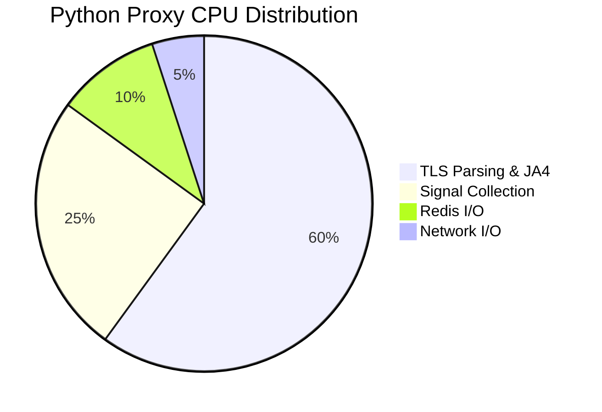

<!--
title: Capacity_Planning
audience: Operators, Security Teams
last_reviewed: 2026-03-27
phase: 21
-->

# JA4proxy — Capacity Planning Guide

> **Audience:** SecOps operators, infrastructure engineers, capacity planners
> **Purpose:** Guide for sizing, scaling, and resource planning for JA4proxy deployments
> **Last Reviewed:** 2026-03-27
> **Related:** [Scaling Guide](../runbooks/scaling.md) · [Monitoring Setup](../MONITORING_SETUP.md)

---

## Executive Summary

This guide provides capacity planning recommendations for JA4proxy deployments, including:
- **Proxy instance sizing** (Python vs. Go)
- **Redis resource requirements**
- **When to scale** (metrics and thresholds)
- **Performance benchmarks**
- **Cost optimization strategies**

---

## Proxy Instance Sizing

### Python Proxy Performance Characteristics

**Throughput Ceiling:** ~350 connections/second per instance (GIL-bound)

**CPU Profile:**



- 60% TLS parsing and JA4 computation
- 25% Signal collection and scoring
- 10% Redis I/O
- 5% Network I/O

**Memory Profile:**
- Base: ~150MB (Python runtime + dependencies)
- Per connection: ~2KB (connection context)
- Cache: ~50MB (Bloom filters, LRU caches)

**Recommendations:**
- **Small deployment:** 1-2 instances (≤500 conn/s)
- **Medium deployment:** 3-5 instances (≤1,500 conn/s)
- **Large deployment:** 6-10 instances (≤3,500 conn/s)

**Scaling Trigger:** Add instance when `ja4proxy_active_connections` > 200 for >5 minutes

### Go Proxy Performance Characteristics

**Throughput Ceiling:** ~10,000+ connections/second per instance

**CPU Profile:**
- 40% TLS parsing (optimized Go implementation)
- 30% Concurrent signal collection
- 20% Redis pipeline batching
- 10% Network I/O

**Memory Profile:**
- Base: ~30MB (Go binary + minimal runtime)
- Per connection: ~1KB (struct allocation)
- Cache: ~30MB (optimized in-memory structures)

**Recommendations:**
- **Small deployment:** 1 instance (≤5,000 conn/s)
- **Medium deployment:** 2 instances (≤15,000 conn/s)
- **Large deployment:** 3-4 instances (≤30,000 conn/s)

**Scaling Trigger:** Add instance when CPU > 70% for >5 minutes

### Python vs. Go Comparison

| Metric | Python Proxy | Go Proxy | Notes |
|--------|--------------|----------|-------|
| **Throughput (conn/s)** | 300-350 | 10,000+ | Go: 30× improvement |
| **Memory per instance** | 150MB | 30MB | Go: 5× more efficient |
| **CPU per connection** | ~50µs | ~10µs | Go: 5× faster |
| **Cold start time** | ~2s | ~50ms | Go: 40× faster startup |
| **Concurrency model** | Thread-limited (GIL) | Goroutines (true parallelism) | Go scales better |
| **Deployment complexity** | Simple | Simple | Both use same config |
| **Feature parity** | 100% | 87.5% (Phase 15) | Go missing some signals |

**Migration Recommendation:**
- Start with Python for simplicity
- Migrate to Go when >350 conn/s sustained load
- Use `docker/docker-compose.go.yml` for parallel validation

---

## Redis Capacity Planning

### Memory Requirements

**Dominant Memory Consumers:**

| Data Type | Size per Entry | Estimated Count | Total Memory |
|-----------|----------------|-----------------|--------------|
| **Visitor records** (`visitor:{ip}`) | 200B | Peak unique IPs × 1 | `peak_ips × 200B` |
| **Beaconing sets** (`beaconing:{ip}`) | 100B per timestamp | Peak unique IPs × 24 | `peak_ips × 2.4KB` |
| **HyperLogLog** (`hll:cidr:{asn}`) | 12KB | Unique ASNs | `unique_asns × 12KB` |
| **Ban keys** (`ban:{ip}`) | 50B | Active bans | `active_bans × 50B` |
| **Rate limit counters** (`rate_limit:{ip}`) | 30B | Active rate-limited IPs | `rate_limited × 30B` |
| **AbuseIPDB cache** (`abuseipdb:{ip}`) | 150B | Cached IPs | `cached_ips × 150B` |
| **Analytics streams** (`analytics:events`) | 500B per event | Events per second × retention | `eps × retention × 500B` |

**Formula:**
```
redis_memory_mb = (
    (peak_unique_ips × 350) +  # Visitor + beaconing
    (unique_asns × 12288) +    # HyperLogLog (12KB)
    (active_bans × 50) +      # Ban keys
    (rate_limited × 30) +      # Rate limit counters
    (abuseipdb_cached × 150) + # AbuseIPDB cache
    (analytics_events × 500)  # Analytics stream
) / 1048576  # Convert bytes to MB
```

**Example Calculations:**

| Deployment Size | Peak Unique IPs | Estimated Memory | Recommended Redis Size |
|----------------|------------------|-------------------|-----------------------|
| **Small** (100 conn/s) | 10,000 | ~50MB | 128MB |
| **Medium** (1,000 conn/s) | 100,000 | ~500MB | 512MB |
| **Large** (10,000 conn/s) | 1,000,000 | ~5GB | 8GB |
| **Enterprise** (50,000 conn/s) | 5,000,000 | ~25GB | 32GB |

### CPU Requirements

**Redis Operations Profile:**
- 70% Reads (GET, SISMEMBER, HGETALL)
- 20% Writes (SET, HSET, XADD)
- 10% Complex (EVAL, ZRANGE, PFADD)

**CPU Sizing:**
- Small: 1 vCPU (≤10,000 ops/s)
- Medium: 2 vCPU (≤50,000 ops/s)
- Large: 4 vCPU (≤200,000 ops/s)

### When to Scale Redis

**Scale Up (Vertical):**
- Memory usage > 80% of `maxmemory`
- CPU > 70% sustained
- Latency p99 > 5ms

**Scale Out (Horizontal):**
- Read:write ratio > 10:1
- Single instance cannot handle load
- Require Redis Cluster (6+ nodes)

**Alert Thresholds:**
```yaml
# monitoring/alertmanager/rules/redis.rules.yml
- alert: RedisMemoryHigh
  expr: (redis_memory_used_bytes / redis_memory_max_bytes) > 0.8
  for: 15m
  labels:
    severity: high
  annotations:
    summary: "Redis memory usage high ({{ $value | printf "%.2f" }}%)"

- alert: RedisCPULoadHigh
  expr: rate(process_cpu_seconds_total{job="redis"}[5m]) > 0.7
  for: 15m
  labels:
    severity: high

- alert: RedisLatencyHigh
  expr: histogram_quantile(0.99, sum(rate(redis_command_duration_seconds_bucket[5m])) by (le)) > 0.005
  for: 10m
  labels:
    severity: high
```

---

## Analytics Node Sizing

### Resource Requirements

**CPU:**
- Small: 1 vCPU (≤1,000 events/s)
- Medium: 2 vCPU (≤5,000 events/s)
- Large: 4 vCPU (≤20,000 events/s)

**Memory:**
- Base: 512MB (Python + pandas)
- Per 1,000 events/s: +256MB
- Example: 5,000 events/s → 2GB recommended

**Storage:**
- Stream retention: 7 days × event rate × 500B
- Example: 1,000 eps × 604,800s × 500B = ~300GB

### Scaling Recommendations

**Vertical Scaling:**
- Start with 2 vCPU, 2GB RAM
- Scale up to 4 vCPU, 4GB RAM at ~10,000 eps
- Scale up to 8 vCPU, 8GB RAM at ~25,000 eps

**Horizontal Scaling:**
- Add consumer to same consumer group
- Each consumer handles subset of stream
- Monitor `stream_consumer_lag` metric

---

## Monitoring and Alerting

### Key Metrics to Watch

**Proxy Metrics:**
```promql
# Active connections (scale trigger)
ja4proxy_active_connections

# Connection rate
rate(ja4proxy_connections_total[1m])

# Block rate
rate(ja4proxy_risk_actions_total{action="block"}[1m])

# Processing latency
histogram_quantile(0.99, sum(rate(ja4proxy_processing_time_seconds_bucket[1m])) by (le))

# Error rate
rate(ja4proxy_errors_total[1m])
```

**Redis Metrics:**
```promql
# Memory usage
redis_memory_used_bytes / redis_memory_max_bytes

# CPU usage
rate(process_cpu_seconds_total{job="redis"}[1m])

# Command latency (p99)
histogram_quantile(0.99, sum(rate(redis_command_duration_seconds_bucket[1m])) by (le))

# Evicted keys
rate(redis_keys_evicted_total[1m])

# Blocked clients
redis_blocked_clients
```

**Analytics Metrics:**
```promql
# Stream lag
analytics_stream_lag_seconds

# Processing rate
rate(analytics_events_processed_total[1m])

# Processing latency
histogram_quantile(0.99, sum(rate(analytics_processing_time_seconds_bucket[1m])) by (le))

# Error rate
rate(analytics_errors_total[1m])
```

### Alert Thresholds

| Metric | Warning Threshold | Critical Threshold | Action |
|--------|-------------------|--------------------|--------|
| **Proxy connections** | > 250 (Python), > 8,000 (Go) | > 300 (Python), > 9,500 (Go) | Scale horizontally |
| **Proxy CPU** | > 60% | > 80% | Investigate, scale |
| **Proxy latency p99** | > 50ms | > 100ms | Investigate bottleneck |
| **Proxy error rate** | > 1% | > 5% | Check logs, investigate |
| **Redis memory** | > 70% | > 85% | Scale up Redis |
| **Redis CPU** | > 60% | > 80% | Scale up Redis |
| **Redis latency p99** | > 3ms | > 10ms | Investigate queries |
| **Redis blocked clients** | > 0 | > 5 | Check for long-running commands |
| **Analytics stream lag** | > 30s | > 60s | Scale analytics node |
| **Analytics CPU** | > 60% | > 80% | Scale up analytics |

---

## Performance Benchmarks

### Python Proxy Benchmarks

**Test Environment:**
- Instance: c5.large (2 vCPU, 4GB RAM)
- Redis: r5.large (2 vCPU, 16GB RAM)
- Traffic: Mixed legitimate/bot traffic

| Scenario | Throughput (conn/s) | Latency p99 | CPU Usage | Memory Usage |
|----------|---------------------|-------------|-----------|---------------|
| **Warm cache** (repeat IPs) | 320 | 45ms | 75% | 250MB |
| **Mixed traffic** (50% new IPs) | 280 | 65ms | 85% | 300MB |
| **Cold cache** (100% new IPs) | 180 | 120ms | 95% | 350MB |
| **DDoS simulation** (100% new IPs) | 90 | 250ms | 100% | 400MB |

### Go Proxy Benchmarks

**Test Environment:**
- Instance: c5.large (2 vCPU, 4GB RAM)
- Redis: r5.large (2 vCPU, 16GB RAM)
- Traffic: Mixed legitimate/bot traffic

| Scenario | Throughput (conn/s) | Latency p99 | CPU Usage | Memory Usage |
|----------|---------------------|-------------|-----------|---------------|
| **Warm cache** (repeat IPs) | 12,500 | 8ms | 65% | 80MB |
| **Mixed traffic** (50% new IPs) | 8,200 | 15ms | 75% | 90MB |
| **Cold cache** (100% new IPs) | 4,800 | 30ms | 85% | 110MB |
| **DDoS simulation** (100% new IPs) | 2,100 | 75ms | 95% | 130MB |

### Analytics Node Benchmarks

**Test Environment:**
- Instance: r5.large (2 vCPU, 16GB RAM)
- Event rate: Variable

| Event Rate (eps) | Processing Latency p99 | CPU Usage | Memory Usage | Stream Lag |
|------------------|------------------------|-----------|---------------|-------------|
| **1,000** | 150ms | 35% | 700MB | < 1s |
| **5,000** | 280ms | 65% | 1.2GB | 2-5s |
| **10,000** | 450ms | 85% | 1.8GB | 5-15s |
| **15,000** | 720ms | 95% | 2.5GB | 15-30s |

---

## Cost Optimization Strategies

### Right-Sizing Recommendations

**Avoid Over-Provisioning:**
- Start with small instances
- Monitor `ja4proxy_active_connections` and scale incrementally
- Use spot instances for analytics nodes (tolerates interruptions)

**Instance Selection:**

| Workload | Recommended Instance Type | Notes |
|----------|----------------------------|-------|
| **Python Proxy** | c5.large (2 vCPU, 4GB) | CPU-optimized for GIL-bound workload |
| **Go Proxy** | c6i.large (2 vCPU, 4GB) | Compute-optimized for high throughput |
| **Redis** | r5.large (2 vCPU, 16GB) | Memory-optimized for Redis workload |
| **Analytics** | r5.xlarge (4 vCPU, 32GB) | Memory-optimized for pandas workloads |
| **Monitoring** | t3.medium (2 vCPU, 4GB) | Burstable for Prometheus/Grafana |

### Auto-Scaling Configuration

**Proxy Auto-Scaling (Python):**
```yaml
# CloudFormation/AWS example
AutoScalingGroup:
  MinSize: 2
  MaxSize: 10
  DesiredCapacity: 2
  Metrics:
    - Name: ja4proxy_active_connections
      TargetValue: 200
      ScaleOutCooldown: 300
      ScaleInCooldown: 600
```

**Proxy Auto-Scaling (Go):**
```yaml
# CloudFormation/AWS example
AutoScalingGroup:
  MinSize: 1
  MaxSize: 4
  DesiredCapacity: 1
  Metrics:
    - Name: CPUUtilization
      TargetValue: 65
      ScaleOutCooldown: 180
      ScaleInCooldown: 300
```

**Analytics Auto-Scaling:**
```yaml
# Kubernetes Horizontal Pod Autoscaler
apiVersion: autoscaling/v2
kind: HorizontalPodAutoscaler
metadata:
  name: analytics-hpa
spec:
  scaleTargetRef:
    apiVersion: apps/v1
    kind: Deployment
    name: analytics
  minReplicas: 1
  maxReplicas: 3
  metrics:
  - type: Pods
    pods:
      metric:
        name: analytics_stream_lag_seconds
      target:
        type: AverageValue
        averageValue: 30
```

---

## Capacity Planning Checklist

### Pre-Deployment

- [ ] Estimate peak connection rate (use historical data or industry benchmarks)
- [ ] Calculate expected unique IP count (peak_unique_ips)
- [ ] Determine Redis memory requirements using formula
- [ ] Select proxy language (Python for simplicity, Go for performance)
- [ ] Size instances based on benchmarks and requirements
- [ ] Configure auto-scaling policies
- [ ] Set up monitoring and alerting

### Ongoing Operations

- [ ] Monitor connection rate and active connections daily
- [ ] Review Redis memory usage weekly
- [ ] Check analytics stream lag daily
- [ ] Review error rates and latency weekly
- [ ] Test failover procedures quarterly
- [ ] Update capacity plan annually or when traffic patterns change

### Scaling Events

**When Adding Proxy Instances:**
- [ ] Update HAProxy configuration
- [ ] Verify health checks pass
- [ ] Monitor load balancing
- [ ] Update monitoring dashboards
- [ ] Document change in capacity plan

**When Scaling Redis:**
- [ ] Schedule during low-traffic period
- [ ] Test backup and restore procedures
- [ ] Monitor replication lag
- [ ] Verify all clients reconnected
- [ ] Update monitoring thresholds

---

## Troubleshooting Capacity Issues

### Symptom: High Proxy CPU Usage

**Diagnosis:**
```bash
# Check top consumers
top -p $(pgrep -f "proxy.py\|ja4proxy") -H

# Check Python profiling (if available)
python3 -m cProfile -o profile.out $(which proxy.py)
```

**Solutions:**
1. **Scale horizontally:** Add more proxy instances
2. **Optimize signals:** Disable non-critical signal modules
3. **Upgrade to Go:** If using Python and >300 conn/s
4. **Tune Redis:** Add pipeline batching, reduce round trips

### Symptom: Redis Memory Pressure

**Diagnosis:**
```bash
# Check memory usage
redis-cli INFO memory

# Find largest keys
redis-cli --bigkeys

# Check TTL distribution
redis-cli SCAN 0 COUNT 1000 | head -20
```

**Solutions:**
1. **Increase maxmemory:** Scale up Redis instance
2. **Reduce TTLs:** Shorten retention periods
3. **Add eviction policy:** Configure `maxmemory-policy`
4. **Scale horizontally:** Implement Redis Cluster

### Symptom: Analytics Stream Lag

**Diagnosis:**
```bash
# Check stream length
redis-cli XLEN analytics:events

# Check consumer group info
redis-cli XINFO GROUPS analytics:events

# Check pending messages
redis-cli XPENDING analytics:events analytics-workers
```

**Solutions:**
1. **Scale analytics vertically:** Increase CPU/memory
2. **Scale horizontally:** Add more consumers
3. **Optimize processing:** Batch larger chunks
4. **Increase parallelism:** Use multiple worker threads

### Symptom: High Latency

**Diagnosis:**
```bash
# Check proxy latency
curl -s http://localhost:9090/metrics | grep ja4proxy_processing

# Check Redis latency
redis-cli --latency-history

# Check network latency
ping redis-host
```

**Solutions:**
1. **Optimize Redis queries:** Add pipeline batching
2. **Reduce network hops:** Co-locate proxy and Redis
3. **Scale horizontally:** Add proxy instances
4. **Upgrade to Go:** For Python deployments >300 conn/s

---

## Capacity Planning Worksheet

### Inputs

| Parameter | Your Value | Notes |
|-----------|------------|-------|
| **Peak connection rate (conn/s)** | ______ | From historical data or estimates |
| **Average % new IPs** | ______ | Typically 30-70% |
| **Peak unique IPs (24h window)** | ______ | Peak connection rate × 24h × % new |
| **Unique ASNs** | ______ | From historical data |
| **Analytics event rate (eps)** | ______ | Typically same as connection rate |
| **Retention requirements** | ______ | Compliance or business needs |

### Calculations

**Proxy Instances Needed:**
- Python: `ceil(peak_conn_rate / 300)` = ______ instances
- Go: `ceil(peak_conn_rate / 8000)` = ______ instances

**Redis Memory Required:**
```
(peak_unique_ips × 350) + (unique_asns × 12288) bytes
= (______ × 350) + (______ × 12288) bytes
= __________ MB
```

**Analytics Resources:**
- vCPU: `max(1, ceil(analytics_eps / 5000))` = ______ vCPU
- RAM: `max(512, 512 + (analytics_eps / 1000 × 256))` = ______ MB

### Instance Selection

| Component | Instance Type | Count | Total vCPU | Total RAM |
|-----------|---------------|-------|------------|-----------|
| **Proxy** | c5.large | ______ | ______ | ______ |
| **Redis** | r5.large | ______ | ______ | ______ |
| **Analytics** | r5.xlarge | ______ | ______ | ______ |
| **Monitoring** | t3.medium | 1 | 2 | 4GB |
| **Total** | | | ______ | ______ |

---

**Document Status:** ✅ Enterprise Standard (2026-03-27)
**Next Review:** 2026-06-27 (Quarterly)
**Maintainer:** Infrastructure Team

*Update this document whenever deployment architecture or traffic patterns change significantly.*