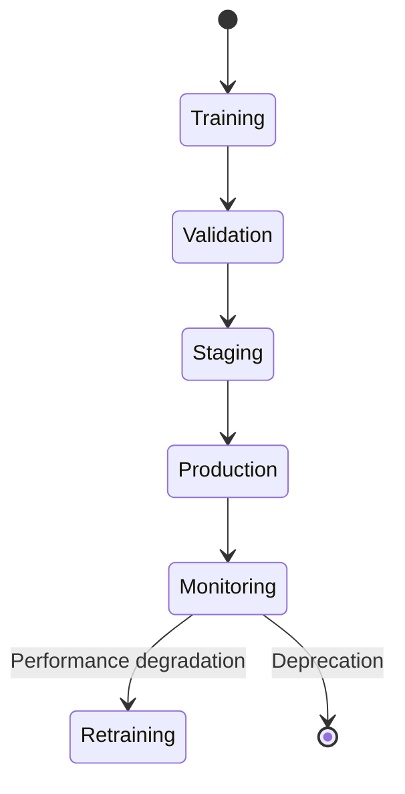
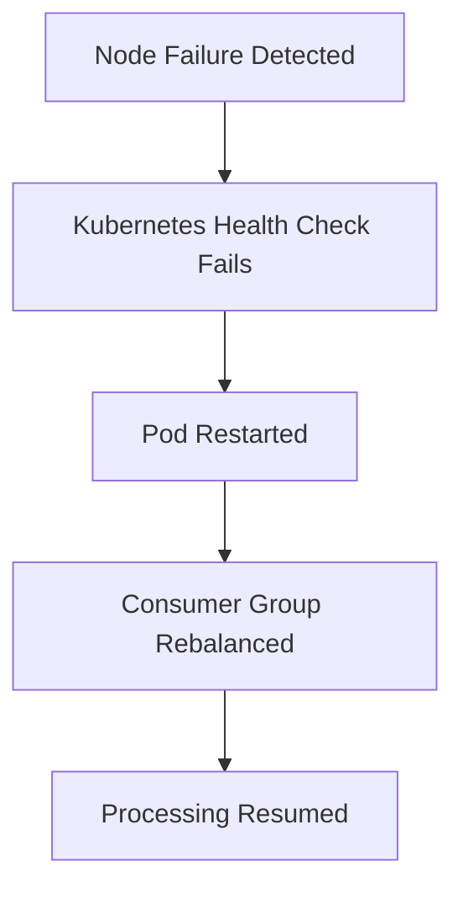
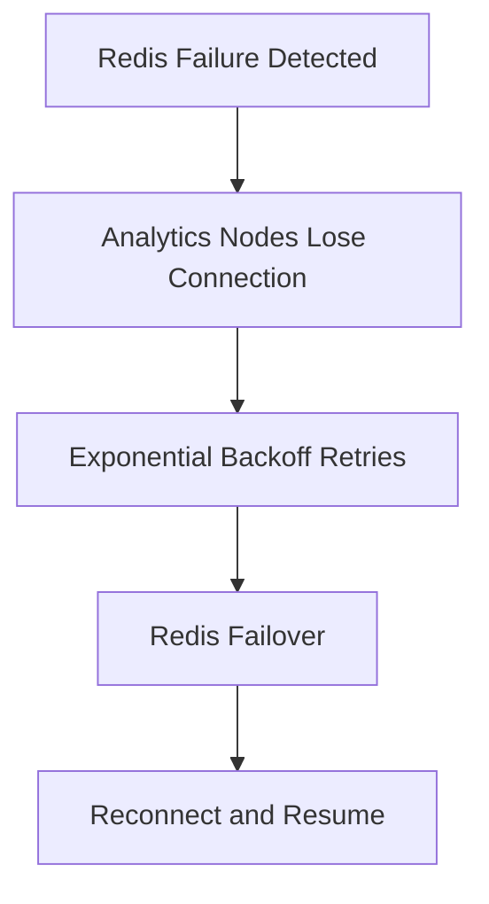
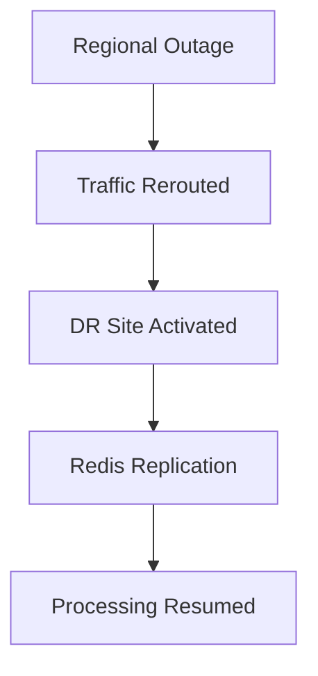
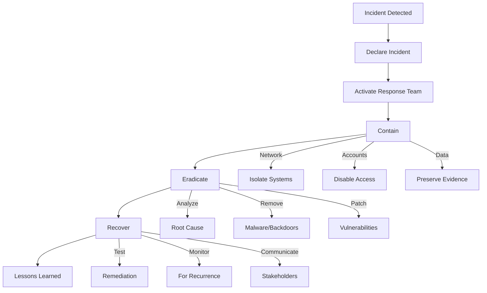

# Analytics Node Operations Guide

## Overview

This guide provides operational procedures for deploying, monitoring, and maintaining the JA4Proxy Analytics Node (Phase 12). It covers day-to-day operations, troubleshooting, and maintenance tasks.

## Deployment

### Prerequisites

**Infrastructure Requirements:**
- **Compute:** 4 vCPUs, 8GB RAM minimum
- **Storage:** 50GB SSD (10GB for models, 40GB for logs)
- **Network:** 1Gbps bandwidth, low latency to Redis
- **Dependencies:** Redis 6.2+, Python 3.10+

**Port Requirements:**
- **8080/TCP:** Analytics API and metrics
- **6379/TCP:** Redis communication
- **9090/TCP:** Prometheus (optional)

### Installation Methods

#### 1. Docker Deployment

**Single Container:**
```bash
# Pull image
docker pull ghcr.io/yourorg/ja4proxy-analytics:latest

# Run container
docker run -d \
  --name ja4proxy-analytics \
  -p 8080:8080 \
  -e REDIS_URL="redis://redis-host:6379" \
  -e CONFIG_FILE="/app/config/prod.yaml" \
  -v /path/to/config:/app/config \
  -v /path/to/models:/app/models \
  -v /path/to/logs:/var/log/ja4proxy \
  --restart unless-stopped \
  ghcr.io/yourorg/ja4proxy-analytics:latest
```

**Docker Compose:**
```yaml
version: '3.8'

services:
  analytics:
    image: ghcr.io/yourorg/ja4proxy-analytics:latest
    container_name: ja4proxy-analytics
    ports:
      - "8080:8080"
    environment:
      - REDIS_URL=redis://redis:6379
      - CONFIG_FILE=/app/config/prod.yaml
      - LOG_LEVEL=INFO
    volumes:
      - ./config:/app/config
      - ./models:/app/models
      - ./logs:/var/log/ja4proxy
    restart: unless-stopped
    healthcheck:
      test: ["CMD", "curl", "-f", "http://localhost:8080/health"]
      interval: 30s
      timeout: 5s
      retries: 3
    depends_on:
      redis:
        condition: service_healthy

  redis:
    image: redis:6.2-alpine
    container_name: ja4proxy-redis
    ports:
      - "6379:6379"
    volumes:
      - redis-data:/data
    healthcheck:
      test: ["CMD", "redis-cli", "ping"]
      interval: 10s
      timeout: 5s
      retries: 5

volumes:
  redis-data:
```

#### 2. Kubernetes Deployment

**Helm Chart:**
```bash
# Add Helm repo
helm repo add ja4proxy https://yourorg.github.io/ja4proxy-helm
helm repo update

# Install analytics node
helm install ja4proxy-analytics ja4proxy/analytics \
  --namespace ja4proxy \
  --values values-prod.yaml \
  --set redis.host="ja4proxy-redis" \
  --set image.tag="1.0.0"
```

**Values Example (`values-prod.yaml`):**
```yaml
replicaCount: 2

image:
  repository: ghcr.io/yourorg/ja4proxy-analytics
  tag: "1.0.0"
  pullPolicy: IfNotPresent

resources:
  requests:
    cpu: "2"
    memory: "4Gi"
  limits:
    cpu: "4"
    memory: "8Gi"

autoscaling:
  enabled: true
  minReplicas: 2
  maxReplicas: 10
  targetCPUUtilizationPercentage: 70
  targetMemoryUtilizationPercentage: 80

redis:
  host: "ja4proxy-redis"
  port: 6379
  password: ""

config:
  ml:
    enabled: true
    model_path: "/models/production_v1.pkl"
  automated_response:
    enabled: true
    manual_approval_required: true
  siem:
    enabled: true
    type: "splunk"
    endpoint: "https://splunk.example.com:8088"

persistence:
  enabled: true
  size: 50Gi
  accessModes: ["ReadWriteOnce"]

monitoring:
  prometheus:
    enabled: true
    serviceMonitor: true
  grafana:
    enabled: true
    dashboard: true
```

#### 3. Bare Metal Deployment

**System Requirements:**
- **OS:** Ubuntu 22.04 LTS or RHEL 8+
- **Python:** 3.10+
- **Dependencies:** libssl-dev, libffi-dev, build-essential

**Installation Steps:**
```bash
# Install dependencies
sudo apt update
sudo apt install -y python3 python3-pip python3-venv \
                   redis-server libssl-dev libffi-dev \
                   build-essential

# Create user
sudo useradd -r -s /bin/false ja4proxy
sudo mkdir -p /opt/ja4proxy /var/log/ja4proxy /var/lib/ja4proxy
sudo chown -R ja4proxy:ja4proxy /opt/ja4proxy /var/log/ja4proxy /var/lib/ja4proxy

# Set up virtual environment
sudo -u ja4proxy python3 -m venv /opt/ja4proxy/venv
source /opt/ja4proxy/venv/bin/activate
pip install --upgrade pip
pip install -r requirements.txt

# Install as service
sudo cp packaging/systemd/ja4proxy-analytics.service /etc/systemd/system/
sudo systemctl daemon-reload
sudo systemctl enable ja4proxy-analytics
sudo systemctl start ja4proxy-analytics
```

**Systemd Service (`ja4proxy-analytics.service`):**
```ini
[Unit]
Description=JA4Proxy Analytics Node
After=network.target redis-server.service
Requires=redis-server.service

[Service]
User=ja4proxy
Group=ja4proxy
WorkingDirectory=/opt/ja4proxy
Environment="PYTHONPATH=/opt/ja4proxy/src"
Environment="CONFIG_FILE=/opt/ja4proxy/config/prod.yaml"
ExecStart=/opt/ja4proxy/venv/bin/python -m src.analytics.main
Restart=always
RestartSec=5s
LimitNOFILE=65535

[Install]
WantedBy=multi-user.target
```

### Configuration

**Configuration File Structure:**
```yaml
# Main configuration
analytics:
  enabled: true
  event_stream: "ja4proxy:events"
  batch_size: 1000
  batch_interval_ms: 100
  workers: 4

# ML detector configuration
ml:
  enabled: true
  model_path: "/models/production_v1.pkl"
  feature_config:
    version: 2
    include_geo: true
    include_asn: true
    geo_db_path: "/data/GeoLite2-City.mmdb"

# Automated response configuration
automated_response:
  enabled: true
  manual_approval_required: true
  approval_timeout_seconds: 300
  playbooks_dir: "/playbooks"

# SIEM integration
siem:
  enabled: true
  type: "splunk"
  endpoint: "https://splunk.example.com:8088"
  token: "${SIEM_TOKEN}"
  timeout: 30

# Redis configuration
redis:
  url: "redis://localhost:6379"
  pool_min_size: 5
  pool_max_size: 20
  ssl: false

# Monitoring configuration
monitoring:
  prometheus_port: 8080
  metrics_prefix: "ja4proxy_analytics"
  health_check_interval: 30

# Logging configuration
logging:
  level: "INFO"
  file: "/var/log/ja4proxy/analytics.log"
  error_file: "/var/log/ja4proxy/analytics_errors.log"
  max_size: 10485760  # 10MB
  backup_count: 5

# Security configuration
security:
  event_signing: true
  model_signing_key: "${MODEL_SIGNING_KEY}"
  rate_limiting:
    events_per_minute: 10000
    burst_capacity: 2000
```

**Environment Variables:**
```bash
# Set environment variables
export REDIS_URL="redis://redis-host:6379"
export CONFIG_FILE="/opt/ja4proxy/config/prod.yaml"
export LOG_LEVEL="INFO"
export SIEM_TOKEN="your-siem-token"
export MODEL_SIGNING_KEY="your-model-signing-key"
```

## Operations

### Startup and Shutdown

**Starting the Service:**
```bash
# Docker
docker start ja4proxy-analytics

# Systemd
sudo systemctl start ja4proxy-analytics

# Kubernetes
kubectl scale deployment ja4proxy-analytics --replicas=2
```

**Stopping the Service:**
```bash
# Docker
docker stop ja4proxy-analytics

# Systemd
sudo systemctl stop ja4proxy-analytics

# Kubernetes
kubectl scale deployment ja4proxy-analytics --replicas=0
```

**Graceful Shutdown:**
```bash
# Send SIGTERM for graceful shutdown
kill -TERM $(cat /var/run/ja4proxy-analytics.pid)

# Or via API
curl -X POST http://localhost:8080/shutdown \
  -H "Authorization: Bearer $ADMIN_TOKEN"
```

### Health Monitoring

**Health Check Endpoints:**

| Endpoint | Description | Example |
|----------|-------------|---------|
| `/health` | Overall health status | `curl http://localhost:8080/health` |
| `/ready` | Readiness status | `curl http://localhost:8080/ready` |
| `/metrics` | Prometheus metrics | `curl http://localhost:8080/metrics` |

**Health Check Response:**
```json
{
  "status": "healthy",
  "timestamp": "2024-03-10T19:03:01.123456Z",
  "uptime": "2h34m12s",
  "components": {
    "redis": {
      "status": "healthy",
      "response_time_ms": 2.3,
      "connected": true
    },
    "ml_detector": {
      "status": "healthy",
      "model_loaded": true,
      "model_version": "1.0.0",
      "last_trained": "2024-03-01T10:00:00Z"
    },
    "response_engine": {
      "status": "healthy",
      "playbooks_loaded": 5,
      "pending_approvals": 0
    },
    "siem_connector": {
      "status": "healthy",
      "last_contact": "2024-03-10T18:59:45Z",
      "queue_size": 0
    }
  },
  "metrics": {
    "events_processed": 12345,
    "anomalies_detected": 42,
    "ml_inference_latency_ms": 12.5,
    "response_actions_executed": 15,
    "siem_alerts_sent": 30
  }
}
```

### Logging

**Log Files:**
- `/var/log/ja4proxy/analytics.log` - Main application logs
- `/var/log/ja4proxy/analytics_errors.log` - Error logs
- `/var/log/ja4proxy/audit.log` - Audit logs

**Log Rotation:**
```bash
# Check log size
du -h /var/log/ja4proxy/*.log

# Rotate logs manually
logrotate -f /etc/logrotate.d/ja4proxy-analytics

# View recent logs
tail -f /var/log/ja4proxy/analytics.log

# Filter errors
grep ERROR /var/log/ja4proxy/analytics.log

# JSON log querying
jq '.level == "ERROR"' /var/log/ja4proxy/analytics.log
```

**Logrotate Configuration:**
```conf
/var/log/ja4proxy/*.log {
    daily
    missingok
    rotate 30
    compress
    delaycompress
    notifempty
    create 0640 ja4proxy ja4proxy
    postrotate
        systemctl reload ja4proxy-analytics 2>/dev/null || true
    endscript
}
```

### Monitoring and Alerting

**Key Metrics to Monitor:**

| Metric | Description | Alert Threshold |
|--------|-------------|-----------------|
| `ja4proxy_analytics_up` | Service availability | < 1 (critical) |
| `ja4proxy_analytics_events_processed_total` | Events processed | Rate < 100/min (warning) |
| `ja4proxy_analytics_ml_detection_duration_seconds` | ML latency | > 0.1s (critical) |
| `ja4proxy_analytics_anomalies_detected_total` | Anomalies detected | Rate > 100/min (warning) |
| `ja4proxy_analytics_response_actions_total` | Actions executed | Error rate > 5% (critical) |
| `ja4proxy_analytics_siem_alerts_sent_total` | SIEM alerts | Error rate > 1% (warning) |
| `ja4proxy_analytics_redis_connection_errors_total` | Redis errors | > 0 (warning) |
| `ja4proxy_analytics_memory_usage_bytes` | Memory usage | > 80% of limit (warning) |

**Grafana Dashboard:**

```json
{
  "title": "JA4Proxy Analytics Overview",
  "panels": [
    {
      "title": "Event Processing",
      "type": "graph",
      "targets": [
        {
          "expr": "rate(ja4proxy_analytics_events_processed_total[1m])",
          "legendFormat": "Events/s"
        }
      ]
    },
    {
      "title": "ML Detection Latency",
      "type": "graph",
      "targets": [
        {
          "expr": "histogram_quantile(0.95, sum(rate(ja4proxy_analytics_ml_detection_duration_seconds_bucket[5m])) by (le))",
          "legendFormat": "P95 Latency"
        },
        {
          "expr": "histogram_quantile(0.50, sum(rate(ja4proxy_analytics_ml_detection_duration_seconds_bucket[5m])) by (le))",
          "legendFormat": "P50 Latency"
        }
      ]
    },
    {
      "title": "Anomaly Detection",
      "type": "graph",
      "targets": [
        {
          "expr": "rate(ja4proxy_analytics_anomalies_detected_total[1m])",
          "legendFormat": "Anomalies/s"
        }
      ]
    },
    {
      "title": "System Resources",
      "type": "graph",
      "targets": [
        {
          "expr": "ja4proxy_analytics_memory_usage_bytes / ja4proxy_analytics_memory_limit_bytes",
          "legendFormat": "Memory Usage"
        }
      ]
    }
  ]
}
```

**Alertmanager Rules:**
```yaml
groups:
- name: analytics-alerts
  rules:
  - alert: AnalyticsServiceDown
    expr: ja4proxy_analytics_up == 0
    for: 5m
    labels:
      severity: critical
      component: analytics
    annotations:
      summary: "Analytics service is down"
      description: "Analytics service has been down for 5 minutes"
  
  - alert: HighMLErrorRate
    expr: rate(ja4proxy_analytics_ml_detection_errors_total[1m]) / rate(ja4proxy_analytics_events_processed_total[1m]) > 0.1
    for: 1m
    labels:
      severity: critical
      component: ml_detector
    annotations:
      summary: "High ML detection error rate"
      description: "{{ $value | printf "%.2f" }}% of ML detections are failing"
  
  - alert: HighMLLatency
    expr: histogram_quantile(0.95, sum(rate(ja4proxy_analytics_ml_detection_duration_seconds_bucket[5m])) by (le)) > 0.1
    for: 5m
    labels:
      severity: warning
      component: ml_detector
    annotations:
      summary: "High ML inference latency"
      description: "ML inference latency is {{ $value }}s (target: <0.05s)"
  
  - alert: RedisConnectionIssues
    expr: rate(ja4proxy_analytics_redis_connection_errors_total[1m]) > 0
    for: 1m
    labels:
      severity: warning
      component: redis
    annotations:
      summary: "Redis connection errors detected"
      description: "{{ $value }} Redis connection errors in the last minute"
```

## Maintenance Tasks

### Regular Maintenance

**Daily Tasks:**
- [ ] Check service health (`/health` endpoint)
- [ ] Review error logs
- [ ] Monitor resource usage
- [ ] Verify SIEM integration

**Weekly Tasks:**
- [ ] Review anomaly detection performance
- [ ] Check for stalled automated actions
- [ ] Verify model performance metrics
- [ ] Review rate limiting effectiveness

**Monthly Tasks:**
- [ ] Rotate API keys and tokens
- [ ] Review audit logs for anomalies
- [ ] Test backup and restore procedure
- [ ] Review and update playbooks

**Quarterly Tasks:**
- [ ] Review access control lists
- [ ] Test disaster recovery procedure
- [ ] Review security configuration
- [ ] Update dependencies

### Model Management

**Model Lifecycle:**



**Model Deployment:**
```bash
# 1. Train new model
./train_model.py --input data/training.csv --output models/v2.pkl

# 2. Validate model
./validate_model.py --model models/v2.pkl --test data/test.csv

# 3. Sign model
./sign_model.py --model models/v2.pkl --output models/v2_signed.pkl

# 4. Deploy to staging
curl -X POST http://staging-analytics:8080/models \
  -H "Authorization: Bearer $ADMIN_TOKEN" \
  -F "model=@models/v2_signed.pkl" \
  -F "version=v2" \
  -F "environment=staging"

# 5. Test in staging
# Monitor performance for 24 hours

# 6. Promote to production
curl -X POST http://prod-analytics:8080/models/promote \
  -H "Authorization: Bearer $ADMIN_TOKEN" \
  -d '{"version": "v2", "from": "staging"}'

# 7. Monitor production performance
# Rollback if issues detected
```

**Model Rollback:**
```bash
# List available models
curl http://analytics:8080/models \
  -H "Authorization: Bearer $ADMIN_TOKEN"

# Rollback to previous version
curl -X POST http://analytics:8080/models/rollback \
  -H "Authorization: Bearer $ADMIN_TOKEN" \
  -d '{"version": "v1"}'
```

### Backup and Restore

**Backup Procedure:**
```bash
# 1. Backup configuration
sudo cp -r /opt/ja4proxy/config /backup/ja4proxy/config_$(date +%Y%m%d)

# 2. Backup models
sudo cp -r /opt/ja4proxy/models /backup/ja4proxy/models_$(date +%Y%m%d)

# 3. Backup playbooks
sudo cp -r /opt/ja4proxy/playbooks /backup/ja4proxy/playbooks_$(date +%Y%m%d)

# 4. Backup Redis data (if applicable)
sudo redis-cli SAVE
sudo cp /var/lib/redis/dump.rdb /backup/ja4proxy/redis_$(date +%Y%m%d).rdb

# 5. Compress and encrypt
sudo tar czf /backup/ja4proxy/backup_$(date +%Y%m%d).tar.gz \
  /backup/ja4proxy/config_$(date +%Y%m%d) \
  /backup/ja4proxy/models_$(date +%Y%m%d) \
  /backup/ja4proxy/playbooks_$(date +%Y%m%d) \
  /backup/ja4proxy/redis_$(date +%Y%m%d).rdb

# 6. Transfer to secure storage
aws s3 cp /backup/ja4proxy/backup_$(date +%Y%m%d).tar.gz \
  s3://ja4proxy-backups/analytics/
```

**Restore Procedure:**
```bash
# 1. Download backup
aws s3 cp s3://ja4proxy-backups/analytics/backup_20240310.tar.gz \
  /tmp/backup.tar.gz

# 2. Extract backup
sudo tar xzf /tmp/backup.tar.gz -C /tmp/

# 3. Stop service
sudo systemctl stop ja4proxy-analytics

# 4. Restore configuration
sudo cp -r /tmp/config_20240310/* /opt/ja4proxy/config/

# 5. Restore models
sudo cp -r /tmp/models_20240310/* /opt/ja4proxy/models/

# 6. Restore playbooks
sudo cp -r /tmp/playbooks_20240310/* /opt/ja4proxy/playbooks/

# 7. Restore Redis (if needed)
sudo cp /tmp/redis_20240310.rdb /var/lib/redis/dump.rdb
sudo chown redis:redis /var/lib/redis/dump.rdb
sudo systemctl restart redis

# 8. Start service
sudo systemctl start ja4proxy-analytics

# 9. Verify health
curl http://localhost:8080/health
```

### Scaling Operations

**Horizontal Scaling:**
```bash
# Kubernetes - Scale up
kubectl scale deployment ja4proxy-analytics --replicas=5

# Docker Swarm - Scale up
docker service scale ja4proxy-analytics=5

# Verify scaling
kubectl get pods -w
```

**Vertical Scaling:**
```bash
# Kubernetes - Increase resources
kubectl set resources deployment ja4proxy-analytics \
  --limits=cpu=4,memory=8Gi \
  --requests=cpu=2,memory=4Gi

# Docker - Update container
docker service update \
  --limit-cpu 4 \
  --limit-memory 8G \
  ja4proxy-analytics
```

**Consumer Group Scaling:**
```bash
# Add additional consumer groups
redis-cli XGROUP CREATE ja4proxy:events analytics-2 $ MKSTREAM

# Monitor consumer group lag
redis-cli XINFO GROUPS ja4proxy:events

# Rebalance consumers
./scripts/rebalance_consumers.py --stream ja4proxy:events --group analytics
```

## Troubleshooting

### Common Issues

**Issue: Service not starting**
```bash
# Check service status
sudo systemctl status ja4proxy-analytics

# View logs
journalctl -u ja4proxy-analytics -n 50 --no-pager

# Check port conflicts
sudo netstat -tulnp | grep 8080

# Test configuration
python -m src.analytics.main --config /opt/ja4proxy/config/prod.yaml --validate
```

**Issue: High CPU usage**
```bash
# Check process CPU
top -p $(pgrep -f analytics.main)

# Profile CPU usage
py-spy top --pid $(pgrep -f analytics.main)

# Check for hot loops
pytest tests/performance/test_cpu_usage.py -v

# Adjust batch size
# Reduce batch_size in config.yaml
```

**Issue: Memory leaks**
```bash
# Monitor memory usage
watch -n 5 "docker stats ja4proxy-analytics --no-stream"

# Heap analysis
python -m memory_profiler src/analytics/main.py

# Check object counts
pyrasite-shell $(pgrep -f analytics.main)
>>> from guppy import hpy
>>> h = hpy()
>>> h.heap()
```

**Issue: Redis connection errors**
```bash
# Test Redis connection
redis-cli -h redis-host -p 6379 ping

# Check Redis logs
sudo tail -f /var/log/redis/redis-server.log

# Test connection from app
python -c "
import asyncio
from src.utils.redis import create_redis_connection

async def test():
    try:
        redis = await create_redis_connection('redis://redis-host:6379')
        print('PONG:', await redis.ping())
    except Exception as e:
        print('Error:', e)

asyncio.run(test())
"

# Check network connectivity
ping redis-host
nc -zv redis-host 6379
```

**Issue: ML model not loading**
```bash
# Check model file
ls -la /opt/ja4proxy/models/production_v1.pkl

# Test model loading
python -c "
import pickle
try:
    with open('/opt/ja4proxy/models/production_v1.pkl', 'rb') as f:
        model = pickle.load(f)
    print('Model loaded successfully')
except Exception as e:
    print('Error loading model:', e)
"

# Check model signature
./verify_model_signature.py --model /opt/ja4proxy/models/production_v1.pkl

# Check permissions
ls -la /opt/ja4proxy/models/
chmod 644 /opt/ja4proxy/models/production_v1.pkl
```

**Issue: High anomaly detection latency**
```bash
# Check ML metrics
curl http://localhost:8080/metrics | grep ml_detection

# Profile ML inference
python -m cProfile -s time src/analytics/ml_detector.py

# Check feature extraction time
pytest tests/performance/test_feature_extraction.py -v

# Optimize model
./optimize_model.py --input models/v1.pkl --output models/v1_optimized.pkl
```

**Issue: SIEM integration failures**
```bash
# Test SIEM connection
curl -X POST https://splunk.example.com:8088/services/collector \
  -H "Authorization: Splunk $SIEM_TOKEN" \
  -H "Content-Type: application/json" \
  -d '{"event": "test"}'

# Check SIEM connector logs
grep -i siem /var/log/ja4proxy/analytics_errors.log

# Test with mock SIEM
pytest tests/unit/test_siem_connector.py -v

# Check network connectivity
nc -zv splunk.example.com 8088
```

### Diagnostic Commands

**Service Diagnostics:**
```bash
# Check service health
curl -s http://localhost:8080/health | jq .

# Check readiness
curl -s http://localhost:8080/ready | jq .

# Get metrics
curl -s http://localhost:8080/metrics | grep analytics

# Check configuration
curl -s http://localhost:8080/config \
  -H "Authorization: Bearer $ADMIN_TOKEN" | jq .
```

**Redis Diagnostics:**
```bash
# Check Redis health
redis-cli -h redis-host ping

# Check stream info
redis-cli -h redis-host XINFO STREAM ja4proxy:events

# Check consumer groups
redis-cli -h redis-host XINFO GROUPS ja4proxy:events

# Check consumer info
redis-cli -h redis-host XINFO CONSUMERS ja4proxy:events analytics

# Check memory usage
redis-cli -h redis-host INFO memory
```

**Performance Diagnostics:**
```bash
# CPU profiling
py-spy record -o profile.svg --pid $(pgrep -f analytics.main)

# Memory profiling
python -m memory_profiler src/analytics/main.py --interval 0.1

# Network profiling
sudo tcpdump -i eth0 -w analytics.pcap port 8080 or port 6379

# I/O profiling
sudo iotop -o -p $(pgrep -f analytics.main)
```

## Performance Tuning

### Configuration Tuning

**Batch Processing:**
```yaml
# Optimize batch settings
analytics:
  batch_size: 1000      # Increase for higher throughput
  batch_interval_ms: 50 # Decrease for lower latency
  workers: 8           # Match CPU cores
```

**Redis Pool:**
```yaml
# Optimize Redis connection pool
redis:
  pool_min_size: 10    # Minimum connections
  pool_max_size: 50    # Maximum connections
  max_retries: 3       # Retry failed commands
  retry_interval: 0.1   # Retry interval (seconds)
```

**ML Detector:**
```yaml
# Optimize ML performance
ml:
  inference_timeout: 0.05 # 50ms timeout
  cache_size: 10000       # Feature cache size
  max_concurrent: 100     # Max concurrent inferences
```

### Resource Optimization

**CPU Optimization:**
- Use all available CPU cores
- Match worker count to CPU cores
- Use async I/O to maximize CPU utilization
- Avoid CPU-bound operations in event loop

**Memory Optimization:**
- Limit batch sizes to control memory usage
- Use generators instead of lists for large datasets
- Implement object pooling for frequently created objects
- Monitor and tune garbage collection

**Network Optimization:**
- Use connection pooling for Redis and SIEM
- Implement batching for SIEM alerts
- Compress large payloads
- Use efficient serialization (MessagePack, Protocol Buffers)

### Benchmarking

**Benchmarking Procedure:**
```bash
# 1. Baseline measurement
./benchmark.py --duration 60 --rate 1000 > baseline.txt

# 2. Test configuration change
# Edit config.yaml

# 3. Measure with new config
./benchmark.py --duration 60 --rate 1000 > optimized.txt

# 4. Compare results
./compare_benchmarks.py baseline.txt optimized.txt
```

**Benchmark Script:**
```python
#!/usr/bin/env python3
import asyncio
import time
import aiohttp
import random
from datetime import datetime

def generate_test_event():
    return {
        "timestamp": int(time.time()),
        "proxy_id": f"proxy-{random.randint(1, 10):02d}",
        "fingerprint": {
            "ja4": f"t13d{random.randint(1000, 9999)}h2_{random.randint(1000, 9999)}_{random.randint(1000, 9999)}",
            "score": random.uniform(0, 100),
            "extensions": [f"ext-{i}" for i in range(random.randint(1, 5))],
            "ciphers": [f"TLS_AES_{random.choice([128, 256])}_GCM_SHA{random.choice([256, 384])}"]
        },
        "action": random.choice(["allow", "block", "monitor"]),
        "client_ip": f"192.168.{random.randint(1, 254)}.{random.randint(1, 254)}"
    }

async def send_event(session, url, event):
    async with session.post(url, json=event) as response:
        return response.status

async def benchmark(rate, duration, url):
    events_sent = 0
    errors = 0
    start_time = time.time()
    
    async with aiohttp.ClientSession() as session:
        interval = 1.0 / rate
        next_event = time.time()
        
        while time.time() - start_time < duration:
            # Send event
            try:
                status = await send_event(session, url, generate_test_event())
                if status != 200:
                    errors += 1
                events_sent += 1
            except Exception:
                errors += 1
            
            # Rate limiting
            next_event += interval
            sleep_time = next_event - time.time()
            if sleep_time > 0:
                await asyncio.sleep(sleep_time)
    
    elapsed = time.time() - start_time
    return {
        "duration": elapsed,
        "events_sent": events_sent,
        "errors": errors,
        "rate": events_sent / elapsed,
        "error_rate": errors / events_sent if events_sent > 0 else 0
    }

if __name__ == "__main__":
    import argparse
    
    parser = argparse.ArgumentParser()
    parser.add_argument('--rate', type=int, default=1000, help='Events per second')
    parser.add_argument('--duration', type=int, default=60, help='Duration in seconds')
    parser.add_argument('--url', default='http://localhost:8080/events', help='Endpoint URL')
    
    args = parser.parse_args()
    
    print(f"Starting benchmark: {args.rate} EPS for {args.duration} seconds")
    result = asyncio.run(benchmark(args.rate, args.duration, args.url))
    
    print(f"\nResults:")
    print(f"  Duration: {result['duration']:.2f}s")
    print(f"  Events sent: {result['events_sent']}")
    print(f"  Errors: {result['errors']}")
    print(f"  Actual rate: {result['rate']:.2f} EPS")
    print(f"  Error rate: {result['error_rate']*100:.2f}%")
```

**Tuning Recommendations:**

| Symptom | Possible Cause | Solution |
|---------|----------------|----------|
| **High CPU, Low Throughput** | Too many workers | Reduce worker count |
| **High Latency** | Large batch size | Reduce batch size |
| **High Memory Usage** | Feature cache too large | Reduce cache size |
| **High Error Rate** | Rate limiting | Increase batch interval |
| **Redis Timeouts** | Connection pool exhausted | Increase pool size |

## Disaster Recovery

### Failure Scenarios

**Scenario 1: Single Node Failure**


**Recovery Steps:**
1. Kubernetes automatically restarts failed pod
2. Consumer group rebalances among remaining nodes
3. Failed node rejoins group when healthy
4. Monitor for complete recovery

**Scenario 2: Redis Failure**


**Recovery Steps:**
1. Redis Sentinel promotes replica to master
2. Analytics nodes detect connection loss
3. Exponential backoff retry mechanism activates
4. Nodes reconnect to new master
5. Consumer groups rebalanced
6. Verify event stream continuity

**Scenario 3: Regional Outage**


**Recovery Steps:**
1. Activate disaster recovery site
2. Restore Redis data from backup
3. Start analytics nodes in DR site
4. Reconfigure proxies to send to DR site
5. Monitor for full recovery
6. Failback when primary site restored

### Recovery Procedures

**Cold Start Recovery:**
```bash
# 1. Restore from backup
./restore_from_backup.sh --backup 20240310

# 2. Start Redis
sudo systemctl start redis

# 3. Verify Redis data
redis-cli INFO keyspace

# 4. Start analytics nodes
sudo systemctl start ja4proxy-analytics

# 5. Verify health
curl http://localhost:8080/health

# 6. Monitor recovery
watch -n 5 "curl -s http://localhost:8080/metrics | grep events_processed"
```

**Warm Standby Recovery:**
```bash
# 1. Promote standby Redis
redis-cli --csv SENTINEL failover analytics-master

# 2. Update analytics configuration
# Edit config to point to new Redis master

# 3. Rolling restart analytics nodes
kubectl rollout restart deployment ja4proxy-analytics

# 4. Verify consumer group status
redis-cli XINFO GROUPS ja4proxy:events

# 5. Monitor for data consistency
./verify_data_consistency.py
```

**Data Loss Recovery:**
```bash
# 1. Identify data loss window
./analyze_event_gap.py --stream ja4proxy:events

# 2. Replay events from backup
./replay_events.py --start 2024-03-10T18:00:00 --end 2024-03-10T19:00:00

# 3. Verify data integrity
./verify_data_integrity.py --checksums checksums_20240310.txt

# 4. Manual review if needed
# Check specific time window for anomalies

# 5. Update monitoring
# Adjust alerts for recovered period
```

## Compliance Operations

### GDPR Operations

**Data Subject Requests:**
```bash
# 1. Receive request
# Record request in compliance system

# 2. Identify data
./find_subject_data.py --identifier 192.168.1.100

# 3. Export data
./export_subject_data.py --identifier 192.168.1.100 --output gdpr_export.json

# 4. Review and redact
# Manual review for sensitive information

# 5. Fulfill request
# Send export to requester via secure channel

# 6. Log fulfillment
audit_logger.log(
    event_type="gdpr_request_fulfilled",
    identifier="192.168.1.100",
    request_id="GDPR-2024-1234",
    action="export"
)
```

**Right to Erasure:**
```bash
# 1. Receive erasure request
# Validate request authenticity

# 2. Identify data locations
./find_subject_data.py --identifier 192.168.1.100 --detailed

# 3. Backup before deletion
./backup_subject_data.py --identifier 192.168.1.100

# 4. Execute deletion
./delete_subject_data.py --identifier 192.168.1.100 --reason "GDPR request #1234"

# 5. Verify deletion
./verify_deletion.py --identifier 192.168.1.100

# 6. Log erasure
audit_logger.log(
    event_type="gdpr_data_erased",
    identifier="192.168.1.100",
    request_id="GDPR-2024-1234",
    data_locations=["events", "fingerprints", "audit_logs"],
    verification_result="success"
)
```

### Audit Operations

**Audit Log Management:**
```bash
# 1. Daily audit log review
./review_audit_logs.py --since "24 hours ago" --severity high

# 2. Weekly compliance reporting
./generate_compliance_report.py --period weekly --output compliance_weekly.pdf

# 3. Monthly access review
./review_access_logs.py --period monthly --output access_review.csv

# 4. Quarterly audit
./run_comprehensive_audit.py --quarter Q1-2024 --output audit_Q1_2024.pdf
```

**Audit Log Retention:**
```bash
# Check audit log size
redis-cli XLEN ja4proxy:audit

# Archive old logs
./archive_audit_logs.py --older-than 365 --output audit_archive_2023.tar.gz

# Verify archive integrity
./verify_audit_archive.py --archive audit_archive_2023.tar.gz

# Secure transfer to cold storage
aws s3 cp audit_archive_2023.tar.gz s3://ja4proxy-compliance/audit/2023/
```

## Security Operations

### Incident Response

**Incident Response Playbook:**



**Analytics-Specific Incidents:**

| Incident Type | Response Procedure |
|---------------|---------------------|
| **Model Tampering** | 1. Isolate affected node<br>2. Rollback to previous model<br>3. Analyze tampering method<br>4. Rotate signing keys<br>5. Review access logs |
| **Event Poisoning** | 1. Identify source proxy<br>2. Quarantine source<br>3. Analyze poisoned events<br>4. Purge affected data<br>5. Update detection rules |
| **Credential Leak** | 1. Rotate all credentials<br>2. Review access logs<br>3. Force re-authentication<br>4. Update monitoring rules<br>5. Notify affected parties |
| **DoS Attack** | 1. Identify attack source<br>2. Apply rate limiting<br>3. Block malicious IPs<br>4. Scale resources<br>5. Review attack patterns |
| **Data Exfiltration** | 1. Contain breach<br>2. Preserve logs<br>3. Analyze exfiltrated data<br>4. Notify compliance<br>5. Implement additional controls |

### Security Monitoring

**Security Dashboard:**
```json
{
  "title": "Analytics Security Dashboard",
  "panels": [
    {
      "title": "Authentication Events",
      "type": "graph",
      "targets": [
        {
          "expr": "sum(rate(ja4proxy_analytics_auth_failures_total[5m])) by (reason)",
          "legendFormat": "{{reason}}"
        }
      ]
    },
    {
      "title": "Anomaly Detection Anomalies",
      "type": "graph",
      "targets": [
        {
          "expr": "rate(ja4proxy_analytics_anomaly_detection_anomalies_total[1m])",
          "legendFormat": "Anomalies/s"
        }
      ]
    },
    {
      "title": "Rate Limit Events",
      "type": "graph",
      "targets": [
        {
          "expr": "rate(ja4proxy_analytics_rate_limit_hits_total[1m])",
          "legendFormat": "Rate Limited/s"
        }
      ]
    },
    {
      "title": "Security Events",
      "type": "table",
      "targets": [
        {
          "expr": "ja4proxy_analytics_security_events_total",
          "format": "table",
          "instant": true
        }
      ]
    }
  ]
}
```

**Security Alerts:**
```yaml
groups:
- name: analytics-security
  rules:
  - alert: SuspiciousAnomalyPattern
    expr: rate(ja4proxy_analytics_anomaly_detection_anomalies_total[5m]) > 100
    for: 5m
    labels:
      severity: warning
      team: security
    annotations:
      summary: "Suspicious anomaly pattern detected"
      description: "{{ $value }} anomalies detected in last 5 minutes (threshold: 100)"
  
  - alert: AuthenticationBruteForce
    expr: rate(ja4proxy_analytics_auth_failures_total{reason="invalid_credentials"}[1m]) > 10
    for: 1m
    labels:
      severity: critical
      team: security
    annotations:
      summary: "Brute force authentication attempt"
      description: "{{ $value }} failed authentication attempts in last minute"
  
  - alert: UnusualEventSource
    expr: sum by (proxy_id) (rate(ja4proxy_analytics_events_processed_total[1m])) > 1000
    for: 1m
    labels:
      severity: warning
      team: security
    annotations:
      summary: "Unusual event rate from proxy {{ $labels.proxy_id }}"
      description: "{{ $value }} events/s from proxy (threshold: 1000)"
```

## Integration Operations

### SIEM Integration

**SIEM Health Monitoring:**
```bash
# Check SIEM connection health
curl http://localhost:8080/siem/health

# Test SIEM connectivity
./test_siem_connectivity.py --siem-type splunk

# Monitor SIEM queue
redis-cli LLEN ja4proxy:siem:queue

# Check SIEM alert delivery
curl http://localhost:8080/metrics | grep siem_alerts
```

**SIEM Troubleshooting:**
```bash
# 1. Check SIEM connector logs
grep -i siem /var/log/ja4proxy/analytics_errors.log

# 2. Test SIEM endpoint
curl -X POST https://splunk.example.com:8088/services/collector \
  -H "Authorization: Splunk $SIEM_TOKEN" \
  -H "Content-Type: application/json" \
  -d '{"event": "test"}'

# 3. Check network connectivity
nc -zv splunk.example.com 8088
telnet splunk.example.com 8088

# 4. Test with mock SIEM
pytest tests/unit/test_siem_connector.py -v

# 5. Check certificate validity
openssl s_client -connect splunk.example.com:8088 -showcerts
```

### Proxy Integration

**Proxy Health Monitoring:**
```bash
# Check proxy connections
redis-cli SCARD ja4proxy:proxies:active

# List active proxies
redis-cli SMEMBERS ja4proxy:proxies:active

# Check event rates by proxy
redis-cli --csv HGETALL ja4proxy:metrics:proxy_rates
```

**Proxy Troubleshooting:**
```bash
# 1. Check proxy event rates
./check_proxy_rates.py --proxy proxy-01

# 2. Verify proxy registration
redis-cli HGET ja4proxy:proxies:info proxy-01

# 3. Test proxy event
./send_test_event.py --proxy proxy-01

# 4. Check proxy health
curl http://proxy-01:8080/health

# 5. Review proxy logs
ssh proxy-01 "tail -f /var/log/ja4proxy/proxy.log"
```

## Best Practices

### Operational Best Practices

**Monitoring:**
- Monitor all key metrics with appropriate thresholds
- Set up comprehensive alerting with escalation policies
- Regularly review and update monitoring rules
- Test monitoring and alerting periodically

**Logging:**
- Maintain comprehensive logs for all operations
- Implement log rotation and retention policies
- Secure log access and storage
- Regularly review logs for anomalies

**Backup:**
- Regular backup schedule (daily minimum)
- Test restore procedures quarterly
- Secure backup storage (encrypted, offline)
- Document backup and restore procedures

**Security:**
- Regular security audits
- Prompt security patch application
- Principle of least privilege for all access
- Regular access reviews
- Comprehensive audit logging

### Performance Best Practices

**Configuration:**
- Tune batch sizes for optimal throughput/latency
- Match worker count to available CPU cores
- Size connection pools appropriately
- Configure timeouts conservatively

**Resource Management:**
- Monitor resource usage continuously
- Set appropriate resource limits
- Implement graceful degradation under load
- Test performance under realistic loads

**Scaling:**
- Scale horizontally for increased capacity
- Use auto-scaling for variable loads
- Monitor scaling events and performance
- Test scaling procedures regularly

### Compliance Best Practices

**Data Protection:**
- Implement data classification
- Apply appropriate protection measures
- Regular data protection audits
- Document data flows and processing

**Audit:**
- Comprehensive audit logging
- Regular audit log reviews
- Secure audit log storage
- Implement audit log retention policies

**GDPR:**
- Implement pseudonymization where possible
- Document data retention policies
- Implement right to erasure procedures
- Regular GDPR compliance reviews

**PCI-DSS:**
- Regular vulnerability scanning
- Strong access controls
- Comprehensive audit trails
- Regular compliance assessments

## References

### Operational Documentation

- [System Architecture](../architecture/system-architecture.md)
- [Analytics Architecture](../architecture/analytics-node-architecture.md)
- [Developer Guide](../developer/analytics-development.md)
- [Security Guide](../security/analytics-security.md)
- [Phase 12 Planning](phases/PHASE_12*.md)

### Tools and Resources

- **Monitoring:** Prometheus, Grafana, Alertmanager
- **Logging:** ELK Stack, Fluentd, Loki
- **Tracing:** Jaeger, OpenTelemetry
- **Security:** OWASP ZAP, Bandit, Safety
- **Performance:** py-spy, memory-profiler, cProfile

### Support

- **Slack:** `#ja4proxy-operations`
- **Email:** `operations@ja4proxy.example.com`
- **PagerDuty:** `ja4proxy-operations`
- **Documentation:** https://docs.ja4proxy.example.com
- **GitHub Issues:** https://github.com/yourorg/ja4proxy/issues

### Training

- **Onboarding:** 2-day operations training
- **Advanced:** 1-week deep dive
- **Certification:** JA4Proxy Certified Operator
- **Refreshers:** Quarterly updates
- **Drills:** Quarterly incident response exercises