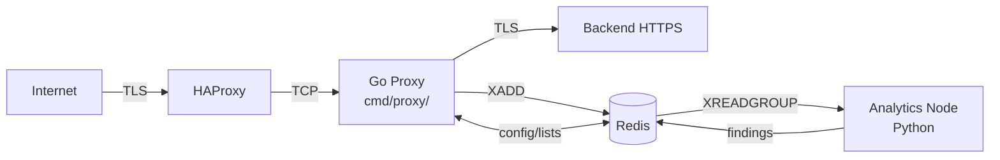

# Phase 21 — Documentation Excellence & Knowledge Architecture

> **Status: OPEN**
>
> Read this phase file fully before starting. Then read `docs/DOCUMENTATION_STANDARDS.md`
> and skim `docs/STYLE_GUIDE.md §3`. This phase has no code changes — all work is
> documentation, so every task is independently verifiable.

---

## Goal

Elevate JA4proxy's documentation from **good** (4.2/5) to **world-class** (5/5) by
doing five things:

1. **Fix every known broken or stale reference** — no reader should follow a link to
   something that no longer exists or no longer reflects reality.
2. **Redesign navigation around reader personas** — an operator, a security architect,
   a contributing developer, a SecOps analyst, and a compliance auditor each need a
   different entry point and a different reading order. Give them one.
3. **Fill every documented gap** — missing ADRs, thin GDPR coverage, absent architecture
   diagrams for Go, undocumented Phase 15 completion status.
4. **Consolidate overlapping content** — eliminate duplicate coverage that forces readers
   to reconcile two documents when one should be authoritative.
5. **Make documentation a living discipline** — add CI checks, freshness stamps, and
   a maintenance checklist so documentation debt cannot silently accumulate again.

The bar is: a **senior DevSecOps engineer encountering this project for the first time
should be able to go from zero to confident production operator without asking a single
question.** A **security auditor** should find every claim backed by a reference. A
**new contributor** should know exactly how to get started, what standards to meet, and
where to find answers.

---

## Context — Audit Findings Summary

A full documentation audit (March 2026) found 106 Markdown files across the project.
The distribution and quality grades are:

| Category | Files | Current grade | Target |
|----------|-------|--------------|--------|
| Strategic (CLAUDE.md, README, CHANGELOG) | 3 | 5/5 ✅ | 5/5 |
| Standards (style, testing, observability) | 5 | 4.5/5 | 5/5 |
| Phase planning (00–20) | 38 | 4/5 | 5/5 |
| Security & compliance | 5 | 4/5 | 5/5 |
| Operator runbooks | 9 | 4/5 | 5/5 |
| Architecture & design | 7 | 3.5/5 | 5/5 |
| ADRs | 5 | 3/5 | 5/5 |
| Developer guides | 4 | 3.5/5 | 5/5 |
| Reports & status | 8 | 2.5/5 | 4/5 |
| Miscellaneous / stale | 22 | 2/5 | Cleaned up |

**Critical problems found:**
- `docs/runbooks/management_ui.md` describes a component removed in v13.2.0.
- Phase 15 status contradicts itself across CLAUDE.md, CHANGELOG.md, and PHASE_15.md.
- `docs/OBSERVABILITY_STANDARDS.md §4` references a single alert file; Phase 14e split
  it into three files.
- `docs/TEST_ORGANIZATION.md` states 1,174 tests; actual suite has 1,536.
- `PHASE_04A.md` and `PHASE_05A.md` are undocumented sub-files with no index entry.
- ADR-004 through ADR-012 are required by `docs/DOCUMENTATION_STANDARDS.md §5` but
  do not exist.
- `docs/GEMINI.md` has no stated purpose.
- `docs/compliance/GDPR_COMPLIANCE.md` is two pages for a topic that needs ten.
- `docs/enterprise/` files are aspirational prose with no concrete guidance.
- `docs/developer/traffic-generator-fix.md` is a development scratch note, not a guide.
- `docs/security/threat-model.md` is minimal (3/5) — lacks STRIDE analysis, attack vectors, and mitigations.
- `docs/architecture/system-architecture.md` describes the Python architecture; no Go architecture documented despite Phase 15 rewrite being underway.
- Existing ADRs (001, 002, 003, 013, 015) have not been reviewed for accuracy post-Phase 14/15.
- `tests/mocks/` mock servers (AbuseIPDB, RDAP, DNS, etc.) have no developer documentation.

---

## Effort Guide

Rough per-stream sizing to aid sprint planning:

| Stream | Effort | Parallelisable? |
|--------|--------|----------------|
| 21a — Critical fixes | S (~4h) | Yes — each sub-task is independent |
| 21b — Navigation | M (~1 day) | Partially — INDEX.md after audience stamps |
| 21c — ADRs (9 documents) | L (~2 days) | Yes — each ADR is independent |
| 21d — Compliance | M (~1 day) | Yes |
| 21e — Operator pack | M (~1 day) | Yes — each runbook independent |
| 21f — Developer pack | M (~1 day) | Yes |
| 21g — Consolidation | S (~3h) | Yes — mechanical changes |
| 21h — Docs as code | M (~4h) | No — scripts before CI integration |

S = half day or less. M = 1 day. L = 2 days.

---

## Reader Personas

Every task in this phase is framed against five personas. Before writing or rewriting
any document, identify which persona(s) it primarily serves and write for them.

### P1 — New Operator (first 30 minutes)

**Who:** Infrastructure engineer or platform SRE deploying JA4proxy for the first time.
**Knowledge:** Comfortable with Docker and systemd. Not a security expert. May not
know what JA4 fingerprinting is.
**Goal:** Get the proxy running, confirm it is doing something, and understand how to
change its behavior safely.
**Reading order:** README → POC_QUICKSTART → SECOPS_OPERATIONS → INCIDENT_RESPONSE.
**Failure mode:** Confused by jargon, can't find the right command, accidentally
enables blocking on first deploy.

### P2 — SecOps Analyst (daily operator)

**Who:** Security analyst who owns the running proxy. May have deployed it months ago.
Comes back to diagnose an incident, adjust the dial, add a JA4 blacklist entry.
**Knowledge:** Knows the system, reads logs, uses Redis CLI. Not a developer.
**Goal:** Find the right runbook fast, execute the right command, confirm it worked.
**Reading order:** QUICK_REFERENCE → specific runbook → INCIDENT_RESPONSE.
**Failure mode:** Has to read three docs to find one command. Runbook is outdated and
the command it shows no longer works.

### P3 — Security Architect (evaluating or designing)

**Who:** Principal engineer evaluating JA4proxy for adoption, or designing how to
integrate it with HAProxy, GeoIP, and the SIEM.
**Knowledge:** Deep networking and security. Wants to understand trade-offs, failure
modes, and trust assumptions — not how to run `docker compose`.
**Goal:** Understand *why* decisions were made, what the threat model is, where the
risk is, and how to extend the system.
**Reading order:** README (architecture section) → system-architecture.md →
COMPREHENSIVE_SECURITY_AUDIT.md → threat-model.md → ADR index.
**Failure mode:** Can't find why a key decision was made (no ADR). Architecture doc
doesn't match code.

### P4 — Contributing Developer

**Who:** Developer making a code contribution — adding a new signal, fixing a bug,
porting a module to Go.
**Knowledge:** Python / Go. May be new to the project.
**Goal:** Understand the conventions, write code that matches the existing style, write
tests that pass the completion gate, get their PR merged without rework.
**Reading order:** CONTRIBUTING.md → STYLE_GUIDE.md → TEST_ORGANIZATION.md → the
specific phase file for what they're building.
**Failure mode:** Writes a module without Prometheus metrics (violates STYLE_GUIDE).
Writes tests that don't meet the ratio (fails the gate). Doesn't know PR requirements.

### P5 — Compliance Auditor

**Who:** Internal or external auditor reviewing JA4proxy as part of a security programme
or regulatory audit (ISO 27001, SOC 2, GDPR, PCI-DSS).
**Knowledge:** Policy, controls, audit evidence. Not a developer. Wants documents they
can cite.
**Goal:** Find documented controls for data retention, access logging, encryption in
transit, IP data handling, incident response.
**Reading order:** GDPR_COMPLIANCE.md → SECURITY_CHECKLIST.md →
COMPREHENSIVE_SECURITY_AUDIT.md → INCIDENT_RESPONSE.md → policy audit log reference.
**Failure mode:** GDPR doc is 2 pages and doesn't address data subject rights. Can't
find documented retention periods. No evidence of access control.

---

## Phase 21a — Critical Fixes (Broken & Stale Content)

These are blockers. A reader following the current documentation hits these immediately.
Fix them in order before anything else.

### 21a-1 Deprecate `management_ui.md`

**Problem:** `docs/runbooks/management_ui.md` documents a component removed in
CHANGELOG v13.2.0. A SecOps analyst following the runbook index will find instructions
for a component that does not exist.

**Action:** Add the following header to `docs/runbooks/management_ui.md`:

```markdown
> **[DEPRECATED — Phase 13 Management UI was removed in v13.2.0]**
>
> The Management UI will be re-implemented after the Go rewrite (Phase 15) completes.
> See `docs/phases/PHASE_13b.md` for the deferred implementation plan.
> This runbook is retained as a reference for the planned future implementation.
> **Do not follow these instructions against a running proxy — the endpoints do not exist.**
```

Also remove `management_ui.md` from any runbook index that lists it without a
deprecation notice (check `docs/operator/`, `README.md`, `docs/docs/README.md`).

### 21a-2 Resolve Phase 15 Status Contradiction

**Problem:** Three documents give different signals about Phase 15 completion:
- `CLAUDE.md` Phase Index: "in progress"
- `CHANGELOG.md` v15.0.0: "Ported all Phase 0–14 signals"
- `PHASE_15_subplan.md` §What's NOT done: lists signal modules as missing

**Action:** Conduct a factual code review (read `src/go/` or `cmd/`), establish the
single true list of what is and is not implemented in Go, then:

1. Update `PHASE_15.md` header table to show per-subsystem status (✅/❌) with date.
2. Reconcile `CHANGELOG.md` v15.0.0 entry to be accurate (do not overstate completion).
3. Update `CLAUDE.md` Phase Index row for Phase 15 to read:
   `"in progress — {N}/{M} signal modules ported"` where N and M are the actual counts.
4. Add a `## Current Status` section to `PHASE_15.md` that is the single authoritative
   reference for Phase 15 progress; all other documents link to it.

The `PHASE_15_subplan.md` is the detailed implementation roadmap and should be linked
prominently from `PHASE_15.md` as `"See [PHASE_15_subplan.md] for the detailed
per-subsystem Go implementation plan."` Do not remove it or merge it.

### 21a-3 Fix Alert Rules Reference in OBSERVABILITY_STANDARDS.md

**Problem:** `docs/OBSERVABILITY_STANDARDS.md §4` references a single alert file:
`config/alertmanager/rules/ja4proxy.yml`. Phase 14e split this into three files
(`../../monitoring/alertmanager/rules/proxy.rules.yml`, `../../monitoring/alertmanager/rules/redis.rules.yml`, `../../monitoring/alertmanager/rules/security.rules.yml`) in the new location
`monitoring/alertmanager/rules/`.

**Action:** Update §4 (Alert Rules) to:
- State the correct directory: `monitoring/alertmanager/rules/`
- List all three files with a one-line description of each:

```markdown
| File | Covers |
|------|--------|
| `../../monitoring/alertmanager/rules/proxy.rules.yml` | Active connections, block rate, latency, dial anomalies |
| `../../monitoring/alertmanager/rules/redis.rules.yml` | Redis availability, memory, command latency |
| `../../monitoring/alertmanager/rules/security.rules.yml` | High score rate, bypass disabled, blacklist size anomalies |
```

### 21a-4 Update Test Count in TEST_ORGANIZATION.md

**Problem:** `docs/TEST_ORGANIZATION.md` states the test suite has ~1,174 tests.
The actual count (as of March 2026) is 1,536.

**Action:** Replace the specific count with a query-derived reference:

```markdown
The current test count can be verified with:
```bash
python3 -m pytest tests/ --collect-only -q 2>/dev/null | tail -1
```

The suite targets a **1.3× test-to-code ratio** (lines of test code ÷ lines of
production code). Run `make test-ratio` to check the current ratio.
```

This prevents the number going stale again. Also update the module-to-test mapping
table (§10) to add the Phase 10–12 modules (AbuseIPDB, RDAP, Analytics) that are
listed as "not built."

### 21a-5 Clarify or Remove GEMINI.md

**Problem:** `docs/GEMINI.md` exists with no stated purpose. Readers don't know if
it's a competitor comparison, an AI assistant configuration, or a mistake.

**Action:** Determine the file's actual purpose. Either:
- Add a clear header explaining what it is and who should read it; or
- If it is an AI assistant configuration (like CLAUDE.md for Google Gemini), move it
  to the repo root and add it to `.gitignore` if it contains anything sensitive; or
- Remove it if it serves no purpose.

### 21a-6 Address PHASE_04A.md and PHASE_05A.md

**Problem:** Two phase sub-files exist (`PHASE_04A.md`, `PHASE_05A.md`) that are not
listed in the CLAUDE.md Phase Index and have no links from their parent phase files.

**Action:**
- Read each file to understand its purpose.
- If it is a test-specific supplement: add a `## Test Supplement` section to the parent
  phase file that links to the sub-file and explains its scope.
- If it duplicates the parent: merge unique content into the parent and delete the sub-file.
- If it is a work-in-progress scratch note: delete it.
- Update `CLAUDE.md` Phase Index if any sub-phase deserves its own entry.

Same treatment for `PHASE_12A.md` through `PHASE_12F.md` and `PHASE_15b.md`,
`PHASE_15c.md` — each should either be linked from its parent with a clear scope
statement or be merged and removed.

### 21a-7 Review Existing ADRs for Post-Phase-14/15 Accuracy

**Problem:** ADR-001, 002, 003, 013, and 015 were written at specific phases of the
project. Phases 14 and 15 made significant changes (Go rewrite, graceful shutdown,
tarpit self-protection, secrets handling) that may have altered or confirmed decisions
in these ADRs. They have not been reviewed since.

**Action:**
- Read each existing ADR and compare its "Decision" and "Consequences" sections against
  the current codebase and CHANGELOG.
- If the decision stands and consequences are accurate: add a line
  `**Last reviewed:** YYYY-MM-DD — confirmed accurate post-Phase 15.`
- If the decision has been modified (e.g., a follow-up phase changed the approach):
  update the Consequences section to reflect what actually happened, or write a
  superseding ADR and link it via `Superseded-by:`.
- Do not rewrite history — record what the decision was and what actually happened.

### 21a-8 Update System Architecture for Go (Phase 15)

**Problem:** `docs/architecture/system-architecture.md` describes the Python
architecture. Phase 15 introduced a Go proxy binary that replaces `proxy.py` on the
hot path while Python analytics and config remain. The architecture document does not
reflect this split-language deployment model.

**Action:**
- Add a `## Phase 15+ Architecture` section to `docs/architecture/system-architecture.md`
  that shows:
  - Go proxy binary (`cmd/proxy/`) replacing `proxy.py` on the hot path.
  - Python analytics node remaining as a separate container.
  - Python config loader still in use (Go reads the same `config/proxy.yml`).
  - Shared Redis infrastructure unchanged.
  - The migration/rollback path (Docker Compose flag to switch between Python and Go).
- Add a Mermaid diagram alongside the existing ASCII art diagram:



- Update the deployment model table to show both Python (current) and Go (Phase 15+)
  options and how to switch between them.

### 21a-9 Document tests/mocks/ Mock Servers

**Problem:** `tests/mocks/` contains mock servers for AbuseIPDB, RDAP, DNS, Spamhaus
feeds, and potentially others. A contributor writing a chaos test or adding a new signal
must discover these by browsing the directory. They are not documented anywhere.

**Action:** Create `docs/developer/MOCK_SERVERS.md`:

```markdown
# Test Mock Servers

> **Audience:** Contributing developers, test authors
> **Location:** `tests/mocks/`

All external service calls in tests use local mock servers, never real APIs.
This document lists each mock, its purpose, and how to use it in tests.

## Available Mocks

| Mock | File | Simulates | How to use |
|------|------|-----------|-----------|
| AbuseIPDB | `tests/mocks/abuseipdb_mock.py` | AbuseIPDB v2 `/check` endpoint | `@pytest.fixture` in conftest |
| ... | | | |

## Adding a New Mock

1. Create `tests/mocks/{service}_mock.py` using `aiohttp.web` (async) or
   `http.server` (sync).
2. Implement only the endpoints your module calls — no need to be exhaustive.
3. Add a `pytest.fixture` to `tests/conftest.py` that starts/stops the server.
4. All chaos tests for the service should import the mock and test failure modes:
   connection refused, timeout, 500 error, malformed response, rate limit (429).
```

---

## Phase 21b — Information Architecture & Navigation

Once broken content is fixed, make the documentation navigable for each persona. The
goal is **zero "where do I find…?" questions** from any of the five personas.

### 21b-1 Add Persona Navigation to README.md

The README currently gives one reading order. Add a **"Start here by role"** section
immediately after the one-paragraph introduction:

```markdown
## Start here by role

| You are… | Read this first |
|----------|----------------|
| **Deploying for the first time** | [Quick-start (5 min)](docs/POC_QUICKSTART.md) |
| **Daily operator / SecOps** | [Quick reference card](docs/QUICK_REFERENCE.md) |
| **Investigating an incident** | [Incident response](docs/INCIDENT_RESPONSE.md) |
| **Security architect / evaluator** | [Architecture overview](docs/architecture/system-architecture.md) |
| **Contributing code** | [Contributing guide](CONTRIBUTING.md) |
| **Compliance / audit** | [GDPR & compliance](docs/compliance/GDPR_COMPLIANCE.md) |
```

This costs six lines and eliminates the most common navigation failure.

### 21b-2 Add Audience Stamp to Each Document

Every non-trivial document should declare its intended audience in the first ten lines.
Establish this as the standard:

```markdown
> **Audience:** SecOps analysts, infrastructure operators
> **Prerequisites:** JA4proxy deployed and running; Redis accessible
> **Related:** [Incident response](../INCIDENT_RESPONSE.md) · [Alert rules](../monitoring/alertmanager/rules/)
```

Apply this header to every document in:
- `docs/runbooks/` (all 8 active runbooks)
- `docs/operator/` (all 6 files)
- `docs/security/` (all 5 files)
- `docs/compliance/` (all files)
- `docs/architecture/` (all files)
- `docs/developer/` (all active files)

This is mechanical but high-value: any reader opening a document immediately knows if
they're in the right place.

### 21b-3 Create a Documentation Index (docs/INDEX.md)

Create `docs/INDEX.md` as the single navigable map of all documentation. Structure it
by persona rather than by file type. This is the document a new reader should find
first if they open the `docs/` directory.

```markdown
# JA4proxy Documentation Index

## By Role

### Operators & SecOps
- [Quick-start (5 min)](...) — deploy and confirm the proxy is working
- [Quick reference card](...) — day-to-day commands
- [SecOps operations guide](...) — configuration, dial, lists
- [Incident response](...) — step-by-step for common scenarios
- [Monitoring setup](...) — Prometheus, Grafana, Loki
- Runbooks: [Redis](...) · [Feed management](...) · [Scaling](...) ·
  [External API failures](...) · [Security policy](...) · [Analytics](...) ·
  [Go proxy migration](...) · [Go proxy operations](...)

### Architects & Evaluators
- [System architecture](...) — data flow, component boundaries, trust model
- [Analytics node architecture](...) — stream processing pipeline
- [Comprehensive security audit](...) — 18-finding audit with remediation status
- [Threat model](...) — threat actors, attack vectors, mitigations
- [ADR index](...) — all architectural decisions with rationale
- [DMZ deployment readiness](...) — production hardening checklist

### Contributing Developers
- [Contributing guide](...) — branch, commit, PR, review process
- [Style guide](...) — Python + Go conventions, naming, log format
- [Test organisation](...) — file layout, conftest patterns, parametrize
- [Testing strategy](...) — categories, ratios, CI gates
- [Observability standards](...) — Prometheus metrics, health endpoint
- [Phase plans](...) — per-feature implementation specs with acceptance criteria

### Compliance & Audit
- [GDPR compliance](...) — data handling, retention, subject rights
- [Security checklist](...) — pre-production control verification
- [Security policy runbook](...) — policy audit log, change management
- [Incident response](...) — escalation paths, evidence preservation

## By Topic

### Architecture
... (cross-links to above)

### Testing
...

### Operations
...

### Security
...
```

Link `docs/INDEX.md` from `README.md` as `"Full documentation index → docs/INDEX.md"`.

### 21b-4 Add a Unified ADR Index (docs/decisions/INDEX.md)

The five existing ADRs are discoverable only by listing the directory. Create
`docs/decisions/INDEX.md`:

```markdown
# Architectural Decision Records

| ADR | Title | Status | Phase |
|-----|-------|--------|-------|
| [ADR-001](../decisions/ADR-001.md) | ... | Accepted | 0 |
| [ADR-002](../decisions/ADR-002.md) | ... | Accepted | 1 |
| ...all completed ADRs... |
| ADR-004 | Dial as post-scorer control | Proposed | 2 |
| ... |
```

Include both existing and planned ADRs. Mark planned ones as "Proposed" so readers
understand what decisions have been documented vs. what still needs documentation.

---

## Phase 21c — Missing Architectural Decision Records

`docs/DOCUMENTATION_STANDARDS.md §5` requires ADR-001 through ADR-007 plus ADR-013
and ADR-015. Currently only ADR-001, ADR-002, ADR-003, ADR-013, ADR-015 exist.
The missing ADRs are not optional documentation — they are the explanation for design
choices that every architect and senior contributor needs.

Each ADR must follow the template in `docs/DOCUMENTATION_STANDARDS.md §5.2`:

```markdown
# ADR-NNN — Title

**Date:** YYYY-MM-DD
**Status:** Accepted
**Deciders:** (roles, not names)
**Supersedes / Superseded-by:** (if applicable)

## Context
What situation prompted this decision?

## Decision
What was decided?

## Consequences
What are the trade-offs? What does this enable? What does it foreclose?

## Alternatives Considered
What else was evaluated and why was it rejected?
```

### ADR-004 — Dial as a Post-Scorer Control

**Context:** Why does the dial control scoring *threshold* rather than controlling which
signals run? Two obvious designs: (a) dial=0 skips scoring; (b) dial=0 runs all scoring
but never acts. The project chose (b).

**Key points to document:**
- Retrospective analysis requires scores even in monitor mode.
- `../../src/security/action_decider.py` applies dial to the scored output, not to signal collection.
- Counterfactual logging (what *would* have been blocked at dial=100) requires full scores.
- Risk: dial=0 does not mean "no overhead" — it means "full overhead, no blocking."

### ADR-005 — RDAP Block Expansion Off by Default

**Context:** Expanding a single bad IP to its /24 blocks 255 IPs. Why off by default?

**Key points to document:**
- A single bad actor on a shared hosting /24 would block hundreds of legitimate users.
- ISP/cloud CIDR ranges can span thousands of real customers at a /16 or larger.
- Admin must consciously opt in — they accept the FP risk when they enable it.
- Hard caps (/24 IPv4, /48 IPv6) are non-negotiable even when enabled.
- Hourly cap prevents runaway expansion during a botnet campaign.

### ADR-006 — Analytics Node as a Separate Container

**Context:** Why not embed analytics in the proxy process?

**Key points to document:**
- numpy/pandas/scipy would bloat the proxy image by ~300MB.
- A crash or OOM in scipy/pandas must not kill the proxy.
- Allows independent scaling (N proxy instances, 1 analytics node).
- Redis Streams as the interface: persistent, replayable, decoupled lifecycle.
- Downside: added operational complexity (two containers, stream consumer lag).

### ADR-007 — mTLS as a Hard Bypass, Not a Score Reduction

**Context:** Why does a valid mTLS client cert bypass the scorer entirely rather than
producing a large negative risk adjustment?

**Key points to document:**
- A client cert is cryptographic proof of identity, not a confidence signal.
- Score-based bypass would require a threshold; cert validity is binary.
- Bypass can be disabled — routes mTLS clients through scorer if admin wants to observe.
- Reducing score instead of bypassing creates ambiguity: what score reduction is "enough"?

### ADR-008 — JA4 Auto-Classify Produces Candidate List Only

**Context:** Why doesn't the analytics node automatically add high-frequency unrecognised
JA4 fingerprints to the blacklist?

**Key points to document:**
- A JA4 shared by both bots and a legitimate browser version cannot be auto-blacklisted.
- High frequency alone is not evidence of malicious intent (popular libraries share JA4).
- Human review is required before any auto-classification enters the blacklist.
- Auto-classification to whitelist is similarly prohibited.

### ADR-009 — Redis Streams for Cross-Instance Events, Not Pub/Sub

**Context:** Why Redis Streams rather than Pub/Sub for the analytics event bus?

**Key points to document:**
- Pub/Sub is fire-and-forget: events sent while the analytics node is down are lost.
- Streams persist events with consumer group acknowledgement — replay after downtime.
- Pub/Sub is still used for one purpose: config reload propagation (low-stakes, should be fast).
- Downside: Streams require consumer group management and trimming; Pub/Sub does not.

### ADR-010 — Fail-Open for Every External Service

**Context:** JA4proxy calls AbuseIPDB, RDAP, DNS, and Spamhaus feeds. Why always
fail open (allow the connection) rather than fail closed (block the connection) when
these services are unavailable?

**Key points to document:**
- Core asymmetry: blocking a real user costs more than allowing a bad bot.
- A Spamhaus CDN outage should not take down a customer-facing website.
- Every external call has an explicit catch → log + Prometheus counter + neutral return.
- Exception: Spamhaus DROP is pre-loaded in-process; if the feed update fails, the
  *previous* feed data continues to work (not a fail-open, a graceful stale tolerance).

### ADR-011 — In-Process Trie for CIDR Matching, Never Redis

**Context:** Why use `pytricia` / Go's `net/netip` prefix tables rather than Redis
for CIDR matching?

**Key points to document:**
- Redis has no native CIDR matching primitive.
- Emulating CIDR matching in Redis requires iterating prefix lengths (≤32 for IPv4) —
  O(32) round trips per lookup on the hot path is unacceptable.
- `pytricia` is an O(log n) radix trie; a lookup of 200,000 prefixes takes ~2µs.
- Memory cost: 200,000 IPv4 CIDR prefixes ≈ 15MB in-process; acceptable.
- CIDR data (Spamhaus DROP, trusted upstream CIDRs) changes infrequently — in-process
  reload on SIGHUP is sufficient.

### ADR-012 — Score Always, Even at Dial=0

**Context:** At dial=0, no connection is ever blocked. Why run the full signal
collection and scoring pipeline at all?

**Key points to document:**
- Scores feed the analytics node, which needs real signal data to detect campaigns.
- Counterfactual logs (what would have been blocked) require real scores.
- Operator raising dial from 0 for the first time needs assurance that the scorer has
  been running and calibrating — not starting from zero.
- CPU cost of scoring ~1,500 connections/sec is negligible vs. the TLS handshake cost.
- Alternative (skip scoring at dial=0) would require a "warm-up" period every time dial
  is raised, defeating the value of the score history.

---

## Phase 21d — Compliance Documentation Hardening

### 21d-1 Expand GDPR_COMPLIANCE.md

The current document is two pages. For a proxy that processes IP addresses (personal
data under GDPR), this is inadequate for any production compliance review.

Expand `docs/compliance/GDPR_COMPLIANCE.md` to cover:

**§1 — Data Inventory**
Table of every piece of data the proxy stores, with:
- Data element (IP address, JA4 fingerprint, ASN, country code, …)
- Storage location (Redis key, log line, Prometheus label)
- Retention period (TTL or indefinite)
- Legal basis for processing (legitimate interest, contract)
- Whether it constitutes personal data under GDPR Article 4(1)

**§2 — Data Minimisation**
- JA4 fingerprints are derived from TLS metadata, not from decrypted content.
- No HTTP headers, cookies, request paths, or user-identifiable content is processed.
- IP addresses stored in Redis use configurable TTLs; ban keys default to 24h.
- Long-term analytics aggregates are keyed on fingerprint+ASN, not on IP.

**§3 — Data Subject Rights**
- Right of access: IP-based lookups can be performed by an operator via Redis CLI.
  Document the exact commands.
- Right to erasure: document `DEL ban:{ip}`, `DEL visitor:{ip}`, etc.
- Right to object: proxy has no user consent mechanism — document the controller's
  responsibility to provide this externally.
- Automated decision-making: blocking decisions are automated. Document the basis
  (legitimate interest, fraud prevention) and the manual override path (whitelist).

**§4 — Data Transfers**
- AbuseIPDB: IP addresses are transmitted to a US processor. Document the mechanism
  (SCC, adequacy decision, or other) used by the controller.
- MaxMind GeoIP: database is downloaded locally; no IP transmitted to MaxMind at
  lookup time.
- RDAP: IP ranges are queried against RIR RDAP endpoints; individual IPs are not
  transmitted.

**§5 — Retention Periods (Authoritative Table)**

| Data type | Default TTL | Config key | Rationale |
|-----------|-------------|------------|-----------|
| IP ban | 24h | `redis.ban_ttl_seconds` | Time-limited enforcement; revisit on next connection |
| Rate limit window | 60s | `rate_limit.window_seconds` | Window-bounded by design |
| Visitor record | 30d | `redis.visitor_ttl_seconds` | Return visitor classification |
| AbuseIPDB cache | 24h | `abuseipdb.cache_ttl_seconds` | API quota preservation |
| Beaconing timestamps | 24h | `beaconing.long_window_hours` | Detection window |
| Analytics stream events | 7d | `redis.stream_max_age_seconds` | Replay window |
| Proxy access logs | Operator-defined | `logging.access_log_retention` | Operator's responsibility |

**§6 — Security of Processing (GDPR Article 32)**
Reference existing controls: TLS in transit, Redis `requirepass`, no TLS key storage,
`SensitiveDataFilter` suppressing credentials from logs.

**§7 — Incident and Breach Notification**
Reference `docs/INCIDENT_RESPONSE.md §breach-notification` (create this subsection if
it doesn't exist).

### 21d-2 Add Breach Notification Subsection to INCIDENT_RESPONSE.md

Add `## Breach Notification` after the existing incident steps:

```markdown
## Breach Notification

If a JA4proxy compromise results in unauthorised access to the Redis datastore
(which contains IP addresses, ban records, and AbuseIPDB API key):

1. Immediately rotate the AbuseIPDB API key via the AbuseIPDB dashboard.
2. Rotate the Redis `requirepass` and update `secrets/redis_password.txt`.
3. Flush the Redis datastore (`FLUSHALL`) after backing up any live ban records.
4. Notify your Data Protection Officer within 72 hours if IP addresses of EU
   data subjects may have been exfiltrated (GDPR Article 33).
5. Preserve proxy access logs and Redis `MONITOR` output as forensic evidence.
6. Document the timeline in a post-incident report.
```

### 21d-3 Create docs/compliance/SECURITY_CONTROLS_MAPPING.md

A compliance auditor checking against a framework (ISO 27001, SOC 2 Type II) needs to
map controls. Create a document that maps the 14 ISO 27001:2022 control domains to
JA4proxy's implemented controls, with references to supporting documentation.

This does not need to be exhaustive — scope it to controls that JA4proxy directly
implements or contributes to:
- A.8 (Technological controls): TLS enforcement, access control (Redis auth), logging,
  data masking, capacity management.
- A.12 (Operations security): monitoring, vulnerability management (Dependabot / Trivy),
  backup (Phase 19).
- A.16 (Information security incident management): INCIDENT_RESPONSE.md.
- A.17 (Business continuity): graceful shutdown, drain timeout, fail-open behaviour.

### 21d-4 Expand and Formalise threat-model.md

**Problem:** `docs/security/threat-model.md` lists threat actors (botnets, APTs) but
has no structured threat analysis. A security architect or compliance auditor needs a
document that maps threats to attack vectors to mitigations. Currently 3/5 quality.

**Action:** Rewrite `docs/security/threat-model.md` using a lightweight STRIDE
structure. For each system component (proxy hot path, Redis, analytics node, config
API), document:

```markdown
## Component: Go/Python Proxy Hot Path

### Threats

| STRIDE | Threat | Attack vector | Current mitigation | Residual risk |
|--------|--------|---------------|--------------------|---------------|
| Spoofing | Client claims trusted IP via X-Forwarded-For | Forged header | Trusted upstream CIDR check; PROXY protocol enforcement | Low — only if haproxy is misconfigured |
| Tampering | ClientHello mutation to evade JA4 detection | Modified TLS handshake | JA4 computed from raw bytes before parsing | Low — parser handles all valid TLS |
| Repudiation | Attacker denies connection activity | No logging | Structured JSON access log with full IP + JA4 | Medium — logs are not tamper-evident |
| Information disclosure | TLS private key exposure | Key stored on filesystem | Proxy never holds backend TLS key; passthrough only | Low |
| Denial of service | Tarpit exhaustion — fill all tarpit slots | Mass slow connections | max_concurrent_connections cap + per-IP cap | Low — capped at 500 total |
| Elevation of privilege | Bypass scorer via ALPN manipulation | Fake h2 ALPN | ALPN bypass is configurable; disabled → scored | Medium if ALPN bypass left enabled for API traffic |
```

Complete the table for all four components: proxy hot path, Redis, analytics node,
management config (future Phase 13).

**Also add:**
- A trust boundary diagram showing what JA4proxy trusts (HAProxy upstream, Redis,
  configured external APIs) vs. what it doesn't (client TLS, client IP claims).
- A one-paragraph "What this proxy cannot protect against" section — honesty about
  scope is part of a good threat model.

---

## Phase 21e — Operator Excellence Pack

The runbooks and operator guides are good but not consistent. Apply this treatment to
every document in `docs/runbooks/` and `docs/operator/`:

### 21e-1 Runbook Consistency Pass

Each runbook must have all of these sections. Add missing sections; do not change
sections that already meet the standard.

```markdown
# {Component} Operations Runbook

> **Audience:** SecOps analysts, infrastructure operators
> **Prerequisites:** ...
> **Related:** ...

## When to use this runbook
(One paragraph: what problem does this document solve?)

## Quick commands
(Copy-paste commands for the 80% case, with no preamble)

## Step-by-step procedures
### {Procedure name}
1. ...
2. ...
Expected output: `...`

## Troubleshooting
| Symptom | Likely cause | Action |
|---------|-------------|--------|

## Escalation
When to escalate, and to whom.
```

Apply this to: `../runbooks/redis_operations.md`, `../runbooks/scaling.md`, `../runbooks/feed_management.md`,
`../runbooks/go_proxy_migration.md`, `../runbooks/go_proxy_operations.md`, `analytics_operations.md`,
`../runbooks/external_api_failures.md`, `../runbooks/security_policy.md`.

### 21e-2 Add Incident Severity Matrix to INCIDENT_RESPONSE.md

Before the step-by-step scenarios, add a severity classification table:

```markdown
## Incident Severity

| Severity | Definition | Example | SLA |
|----------|------------|---------|-----|
| **P1 — Critical** | Proxy down; all traffic blocked or all traffic passing unscored | Redis connection lost; tarpit overflow blocking all connections | Respond in 15 min |
| **P2 — High** | Major function impaired; false positive rate elevated | External enrichment API down; Spamhaus feed stale >4h | Respond in 1h |
| **P3 — Medium** | Single signal module failing; metrics missing | AbuseIPDB quota exhausted; DNS enrichment queue backed up | Respond in 4h |
| **P4 — Low** | Cosmetic or informational | Alert rule false-positive; dashboard panel broken | Next business day |
```

### 21e-3 Add a Capacity Planning Guide (docs/operator/CAPACITY_PLANNING.md)

New document. Operators need to know when to scale, what limits to watch, and how to
size Redis. Cover:

**Proxy instance sizing:**
- Python proxy: ~350 conn/s ceiling (GIL bound). Add instances when
  `ja4proxy_active_connections` consistently > 200.
- Go proxy: ~10,000+ conn/s per instance. Monitor CPU saturation instead.
- Memory per instance: ~150MB Python, ~30MB Go. Factor in Redis connection pool.

**Redis sizing:**
- Dominant consumers: visitor records (200B each), beaconing sorted sets (100B per IP),
  HyperLogLog per CIDR (12KB each), ban keys (50B each).
- Formula: `(peak_unique_ips × 350B) + (active_cidrs × 12KB) + overhead`
- Recommend: start with 512MB dedicated; monitor `redis_memory_used_bytes` against
  `maxmemory`.
- Alert threshold: 80% of `maxmemory` → provision more memory or tune TTLs.

**When to scale Redis to a replica:**
- Read:write ratio > 10:1 (analytics reads dominate).
- Single Redis latency p99 > 2ms.

### 21e-4 Add a Deployment Troubleshooting Guide (docs/operator/TROUBLESHOOTING.md)

New document. Consolidate common deployment problems from:
- `scripts/docker-troubleshooting/README.md`
- `docs/developer/traffic-generator-fix.md` (extract anything useful)
- CLAUDE.md memory notes (Docker DNS, GOROOT bug, etc.)

Structure as a symptom → cause → fix table with detailed subsections for the most
common failures:
- Containers cannot reach internet (DNS/iptables)
- `snap` Go sets wrong GOROOT
- Redis authentication failing on first run
- TLS cert errors when using self-signed certs
- Proxy not forwarding (backend unreachable)
- `make test` hangs (conftest Docker isolation)

---

## Phase 21f — Developer Excellence Pack

### 21f-1 Overhaul CONTRIBUTING.md

The current CONTRIBUTING.md is two generic pages. Rewrite it to be project-specific
and cover everything a new contributor needs:

**§1 — Before You Start**
- Read CLAUDE.md (explains the project philosophy and phase system).
- Read STYLE_GUIDE.md (code style you must follow).
- Confirm your environment: Python 3.11+, Go 1.22+, Docker, Redis.

**§2 — Branch Strategy**
```
main          — always deployable; protected
feat/phase-N-description   — feature work for a specific phase
fix/short-description      — bug fixes
docs/short-description     — documentation-only changes
```
No force-push to `main`. PRs require one approval.

**§3 — Commit Message Style**
Follow Conventional Commits. Required prefixes:
- `feat(phase-N):` — new functionality for a phase
- `fix:` — bug fix
- `docs:` — documentation only
- `test:` — test only
- `refactor:` — no behaviour change
- `chore:` — tooling, CI, build

**§4 — PR Checklist**
Every PR must satisfy:
- [ ] All 1,536+ tests pass (`make test`)
- [ ] Test-to-code ratio ≥ 1.3× (`make test-ratio`)
- [ ] No new Prometheus metrics outside the naming convention
  (`ja4proxy_{subsystem}_{metric}_{unit}`)
- [ ] `CHANGELOG.md` updated if this is a phase milestone
- [ ] `docs/REDIS_SCHEMA.md` updated if any new Redis keys introduced
- [ ] New signal module: FP corpus test added (`tests/fp_corpus/`)
- [ ] New external service: chaos test added (`tests/chaos/`)
- [ ] Config key added: inline YAML comment added to `config/proxy.yml`

**§5 — Adding a New Signal Module**

Step-by-step guide for the most common contribution:
1. Create `src/security/{name}.py` following the pattern in `src/security/abuseipdb.py`.
2. Implement `get_signal(connection_info) → list[RiskSignal]`.
3. Register in `src/security/pipeline.py` (`_collect_signals()`).
4. Add Prometheus metrics in `__init__` following `OBSERVABILITY_STANDARDS.md §1d`.
5. Add config key in `config/proxy.yml` with inline comment.
6. Write unit tests in `tests/unit/test_{name}.py` — minimum 20 tests.
7. Write chaos test in `tests/chaos/test_external_api_failure.py` (if external service).
8. Write FP test in `tests/fp_corpus/test_{name}_fp.py` against Tranco top-10k.
9. Update `docs/REDIS_SCHEMA.md` with any new keys.
10. Add a row to the phase's acceptance criteria table.

**§6 — Go Contributions (Phase 15+)**

- Build: `GOROOT=/snap/go/current go build ./...`
- Test: `GOROOT=/snap/go/current go test ./...`
- Lint: `golangci-lint run`
- Follow `../developer/go_proxy_guide.md` for environment setup.
- Every Go signal module must be a port of the Python equivalent, not a reimplementation.
  Read the Python module first, then port the exact semantics.

### 21f-2 Create a Signal Development Guide (docs/developer/SIGNAL_DEVELOPMENT.md)

A developer adding a new risk signal needs more than the contributing guide. Create a
dedicated guide that explains:
- The `RiskSignal` data model (name, score, reason, confidence).
- Score calibration: what score is appropriate for what behaviour? Reference the
  calibration table in `STYLE_GUIDE.md`.
- The bypass rules and why signals must never hard-block (only score; action decider
  acts on the total).
- How to write parametrized tests for signal edge cases.
- How to validate that a new signal doesn't break the FP corpus tests.
- The `fail_open` pattern: show the exact try/except structure required.
- How to add a new signal to the analytics node stream consumer (Phase 12).

### 21f-3 Create docs/developer/GO_PORT_GUIDE.md

For contributors porting Python signal modules to Go (Phase 15 work):
- Parity testing requirement: Python and Go must produce identical scores for identical
  inputs. Reference `tests/parity/` test framework.
- How to create binary ClientHello fixtures (`tests/fixtures/clienthello/`).
- The Go signal interface (`SignalModule` interface in Go).
- How to register a new module in the Go pipeline.
- Known differences to be aware of: Go's `crypto/tls` ClientHello struct vs. raw bytes;
  Go's `net/netip` vs. Python's `ipaddress`.

---

## Phase 21g — Consolidation & Cleanup

### 21g-1 Consolidate Readiness Documents

`docs/DMZ_DEPLOYMENT_READINESS.md` and `docs/reports/ENTERPRISE_READINESS_REPORT.md`
cover overlapping content (production hardening gaps, remediation status). Merge them:

- Keep `docs/DMZ_DEPLOYMENT_READINESS.md` as the authoritative source (more detailed,
  better structured, referenced from CLAUDE.md).
- Add a `## Enterprise Readiness` section to `../DMZ_DEPLOYMENT_READINESS.md` that absorbs
  any non-overlapping content from `ENTERPRISE_READINESS_REPORT.md`.
- Replace `docs/reports/ENTERPRISE_READINESS_REPORT.md` with a redirect notice:
  `> This document has been merged into [DMZ_DEPLOYMENT_READINESS.md](../DMZ_DEPLOYMENT_READINESS.md).`

### 21g-2 Mark Old TESTING.md as Superseded

`docs/TESTING.md` is superseded by `docs/TESTING_STRATEGY.md`. Add to the top of
`docs/TESTING.md`:

```markdown
> **[SUPERSEDED]** This document has been replaced by
> [TESTING_STRATEGY.md](../TESTING_STRATEGY.md), which is the authoritative
> testing reference. This file is retained only for historical context.
```

### 21g-3 Move or Remove developer/ Scratch Notes

- `docs/developer/traffic-generator-fix.md`: extract any operational content into
  `docs/operator/TROUBLESHOOTING.md` (Phase 21e-4), then delete the file.
- `docs/developer/test-audit.md`: replace with a pointer to `make test-ratio` and
  delete (outdated counts are worse than no counts).
- `docs/docker_container_test_layers_expanded.md`: evaluate whether this belongs in
  `docs/TEST_ORGANIZATION.md` (merge) or is obsolete (delete).

### 21g-4 Consolidate Enterprise/ Docs

`docs/enterprise/deployment.md` and `docs/enterprise/security-architecture.md` are
aspirational prose. Two options:

**Option A (preferred if enterprise deployment is a real near-term goal):** Rewrite
them with concrete guidance: Kubernetes manifest structure, namespace isolation,
network policy, secrets management with Vault. Reference realistic cloud providers
(AWS ECS, GKE).

**Option B (honest deferral):** Add a header:
```markdown
> **[ASPIRATIONAL]** This document describes a target enterprise architecture that has
> not yet been validated in production. Treat as a starting point, not a specification.
> See `docs/DMZ_DEPLOYMENT_READINESS.md` for the validated single-node deployment model.
```

Choose Option B unless enterprise Kubernetes deployment is actively being built.

### 21g-5 Evaluate and Clean Phase Sub-Files

The following files need explicit disposition decisions (do not leave them as-is):

| File | Options |
|------|---------|
| `PHASE_15b.md` | Link from PHASE_15.md §subsection, or merge if short |
| `PHASE_15c.md` | Same |
| `PHASE_16b.md` | Same |
| `PHASE_16_ATOMIC.md` | Same |
| `PHASE_17b.md` | Same |
| `PHASE_19b.md` | Same |
| `PHASE_12A.md` through `PHASE_12F.md` | Summarise in PHASE_12.md §subsections; these detail sub-tasks that are now complete |

For each: if the content is still useful for understanding what was built, merge it as
a subsection of the parent. If it is only useful as a historical task list for completed
work, delete it (the CHANGELOG captures what was done).

---

## Phase 21h — Documentation as Code

Documentation rot is the result of no process. These changes make documentation a
first-class engineering artefact.

### 21h-1 Frontmatter Standard

Every document in `docs/` should carry YAML frontmatter (as an HTML comment so it
doesn't render as content in GitHub):

```html
<!--
title: Redis Operations Runbook
audience: secops, operator
last_reviewed: 2026-03-20
phase: 0
-->
```

Write a script (`scripts/check_doc_frontmatter.py`) that:
- Scans all `.md` files in `docs/` (excluding `phases/`, `decisions/`).
- Warns for any file missing the frontmatter block.
- Warns for any file with `last_reviewed` older than 180 days.

Add to `Makefile` as `make lint-docs`.

### 21h-2 Link Checker in CI

Broken internal links are a leading cause of documentation confusion. Add a link check
to the CI pipeline:

```yaml
# .github/workflows/ci.yml
- name: Check doc links
  run: |
    pip install markdown-link-check
    find docs/ -name '*.md' | xargs markdown-link-check --config .mlc.json
```

`.mlc.json` configuration:
```json
{
  "ignorePatterns": [
    {"pattern": "^https://"},
    {"pattern": "^http://localhost"}
  ],
  "retryOn429": true,
  "retryCount": 3,
  "timeout": "20s",
  "aliveStatusCodes": [200, 206]
}
```

This catches broken internal links on every PR. External links are excluded (they
change without our knowledge and would create CI flakiness).

### 21h-3 Documentation Review as Part of Phase Gate

Update `docs/DOCUMENTATION_STANDARDS.md §7` (per-phase documentation gate) to include:

```markdown
### Documentation gate checklist (add to every phase completion review)

- [ ] All documents updated by this phase carry correct `last_reviewed` frontmatter.
- [ ] New documents have audience stamp (§21b-2 format).
- [ ] `make lint-docs` passes with zero warnings.
- [ ] `make link-check` passes with zero broken internal links.
- [ ] New Redis keys documented in `docs/REDIS_SCHEMA.md`.
- [ ] New Prometheus metrics in `docs/OBSERVABILITY_STANDARDS.md §1d`.
- [ ] CHANGELOG.md entry added.
- [ ] If any ADR was promised and not written, an entry added to `docs/decisions/INDEX.md`
  with status "Proposed" and a GitHub issue number.
```

### 21h-4 Add Documentation Health to Makefile

```makefile
## Docs
lint-docs:         ## Check all docs have frontmatter and aren't stale
	python3 scripts/check_doc_frontmatter.py

link-check:        ## Check all internal Markdown links are valid
	find docs/ -name '*.md' | xargs markdown-link-check --config .mlc.json

doc-health:        ## Run all documentation quality checks
	make lint-docs link-check

test-ratio:        ## Show current test-to-code ratio
	python3 scripts/test_ratio.py
```

### 21h-5 Extension Process for Future Phases

This section defines how Phase 21 stays current as new phases (16–20 and beyond)
complete. Without this, documentation debt silently re-accumulates.

**Rule: Every new phase completion must include the following documentation steps
(enforce via the gate checklist updated in 21h-3):**

1. **New documents** created by the phase → add entry to `docs/INDEX.md` and apply
   the audience-stamp format (21b-2). Do not merge the PR until this is done.

2. **New architectural decisions** → either write an ADR or add a "Proposed" entry to
   `docs/decisions/INDEX.md` with a GitHub issue number for follow-up. Unwritten ADRs
   that have no tracking entry constitute documentation debt.

3. **New Redis keys** → document in `docs/REDIS_SCHEMA.md` before the PR merges.

4. **New Prometheus metrics** → add to `docs/OBSERVABILITY_STANDARDS.md §1d`.

5. **New runbooks or operator commands** → apply the runbook template (21e-1) and link
   from the relevant persona section of `docs/INDEX.md`.

6. **If a phase modifies an existing architectural decision** (e.g., changes a config
   default, changes a signal score, changes a bypass rule) → review and update the
   relevant ADR, or write a superseding ADR.

**Extending Phase 21 itself:** If new documentation debt is identified after Phase 21
is marked complete, create a `## Phase 21i — {Description}` section following the
existing lettered pattern. Do not create a new phase document — keep all documentation
improvement work in Phase 21 so it remains the single reference. Increment the suffix
(21i, 21j, 21k) indefinitely. Update the Effort Guide table when adding new streams.

---

## Acceptance Criteria

All of the following must be true before Phase 21 is complete.

### Critical Fixes (21a)

- [ ] `docs/runbooks/management_ui.md` has a DEPRECATED header; no active runbook
  index links to it without noting it is deprecated.
- [ ] `PHASE_15.md` has a `## Current Status` table showing per-subsystem Go
  completion (✅/❌); `CHANGELOG.md` v15.0.0 entry is accurate.
- [ ] `docs/OBSERVABILITY_STANDARDS.md §4` references all three alert rule files in
  `monitoring/alertmanager/rules/`.
- [ ] `docs/TEST_ORGANIZATION.md` no longer contains a hard-coded test count; it
  contains a `make` command to derive the live count.
- [ ] `docs/GEMINI.md` either has a clear header explaining its purpose or is removed.
- [ ] Every PHASE_NNa.md sub-file either has an explicit link from its parent or is
  merged/removed.
- [ ] All five existing ADRs (001, 002, 003, 013, 015) have a `Last reviewed:` line
  confirming accuracy post-Phase 15, or a `Superseded-by:` link to a new ADR.
- [ ] `docs/architecture/system-architecture.md` has a `## Phase 15+ Architecture`
  section with a Mermaid diagram showing the Go/Python split-language deployment.
- [ ] `docs/developer/MOCK_SERVERS.md` exists and documents every mock in `tests/mocks/`.

### Navigation (21b)

- [ ] `README.md` contains a "Start here by role" table with links to six role-specific
  entry points.
- [ ] Every document in `docs/runbooks/`, `docs/operator/`, `docs/security/`,
  `docs/compliance/`, `docs/architecture/`, `docs/developer/` has an audience stamp.
- [ ] `docs/INDEX.md` exists, is structured by persona, and links to every active
  document in `docs/`.
- [ ] `docs/decisions/INDEX.md` exists and lists all ADRs (existing and planned).

### ADRs (21c)

- [ ] ADR-004 through ADR-012 exist in `docs/decisions/` and follow the template.
- [ ] Each ADR is listed in `docs/decisions/INDEX.md`.

### Compliance (21d)

- [ ] `docs/compliance/GDPR_COMPLIANCE.md` covers all seven sections defined in 21d-1.
  Minimum length: 600 words (10 pages of substance, not padding).
- [ ] `docs/INCIDENT_RESPONSE.md` contains a Breach Notification subsection.
- [ ] `docs/compliance/SECURITY_CONTROLS_MAPPING.md` exists and maps JA4proxy controls
  to at least 10 ISO 27001:2022 Annex A controls.
- [ ] `docs/security/threat-model.md` has a STRIDE table for the proxy hot path and
  Redis components, a trust boundary section, and a "what this proxy cannot protect
  against" paragraph.

### Operator Pack (21e)

- [ ] All eight active runbooks have the consistent structure defined in 21e-1.
- [ ] `docs/INCIDENT_RESPONSE.md` contains an Incident Severity Matrix.
- [ ] `docs/operator/CAPACITY_PLANNING.md` exists with Python and Go sizing guidance.
- [ ] `docs/operator/TROUBLESHOOTING.md` exists with ≥10 common problems.

### Developer Pack (21f)

- [ ] `CONTRIBUTING.md` covers all six sections defined in 21f-1.
- [ ] `docs/developer/SIGNAL_DEVELOPMENT.md` exists.
- [ ] `docs/developer/GO_PORT_GUIDE.md` exists.
- [ ] `docs/developer/MOCK_SERVERS.md` exists and documents every file in `tests/mocks/`.

### Consolidation (21g)

- [ ] `docs/reports/ENTERPRISE_READINESS_REPORT.md` redirects to
  `docs/DMZ_DEPLOYMENT_READINESS.md`.
- [ ] `docs/TESTING.md` has a SUPERSEDED header.
- [ ] `docs/developer/traffic-generator-fix.md` and `docs/developer/test-audit.md`
  are deleted or have DEPRECATED headers with all useful content extracted.
- [ ] `docs/enterprise/` files are either rewritten with concrete guidance or have
  ASPIRATIONAL headers.
- [ ] Every PHASE_NNb / PHASE_NNc sub-file has an explicit disposition (merged,
  linked, or deleted).

### Documentation as Code (21h)

- [ ] `scripts/check_doc_frontmatter.py` exists and runs without error.
- [ ] `make lint-docs` runs and reports zero warnings against the updated docs/.
- [ ] `.mlc.json` exists and `make link-check` reports zero broken internal links.
- [ ] `docs/DOCUMENTATION_STANDARDS.md §7` includes the Phase 21 gate checklist.
- [ ] `Makefile` has `lint-docs`, `link-check`, `doc-health`, and `test-ratio` targets.

---

## Documentation Gate

Before marking Phase 21 complete:

1. **Reader test:** Give the documentation to someone unfamiliar with the project and
   ask them to complete the Quick-start (5 min). They should succeed without asking for
   help. Time them. Document the result.

2. **Broken-link audit:** `make link-check` returns zero errors.

3. **Frontmatter audit:** `make lint-docs` returns zero warnings.

4. **ADR completeness:** `docs/decisions/INDEX.md` lists all ADRs with no "missing"
   entries.

5. **Compliance review:** Have someone unfamiliar with the codebase read
   `docs/compliance/GDPR_COMPLIANCE.md` and confirm they can answer these questions
   without reading any other document:
   - What personal data does JA4proxy store?
   - How long is an IP address retained?
   - What is the process for erasing a data subject's IP from Redis?
   - What happens if the AbuseIPDB service is unavailable?

---

## Priority Order

Work streams are independent unless noted. Suggested order:

1. **Phase 21a** (critical fixes) — unblock documentation correctness.
2. **Phase 21c** (ADRs) — high value, low effort per ADR; write one per session.
3. **Phase 21b** (navigation) — requires 21a to be correct first.
4. **Phase 21f-1** (CONTRIBUTING.md) — needed for any new contributor now.
5. **Phase 21e** (operator pack) — systematic runbook consistency pass.
6. **Phase 21d** (compliance) — GDPR and threat model are highest priority within 21d.
7. **Phase 21c** (ADRs) — write one per session; parallelise across contributors.
8. **Phase 21g** (cleanup) — do after 21b confirms what should remain.
9. **Phase 21h** (docs as code) — do last; requires all docs to be stable.
10. **Phase 21h-5** (extension process) — write this before closing the phase so future
    phases have a documented contract for keeping docs current.

---

## Notes on Scope

**This phase does not change any code.** All changes are documentation only. There are
no new tests required (though `scripts/check_doc_frontmatter.py` is a script that
should be tested by running it and verifying output).

**This phase does not require phases 16–20 to be complete.** Documentation improvement
is independent of feature work and can proceed in parallel.

**Phase 21 is also a model.** This document itself follows every standard it requires
of other documents — audience stamps, clear acceptance criteria, concrete rather than
vague tasks, and a defined documentation gate. If any section of this document is
unclear, that is itself a documentation bug and should be fixed.
