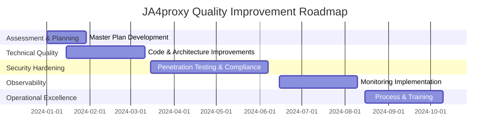
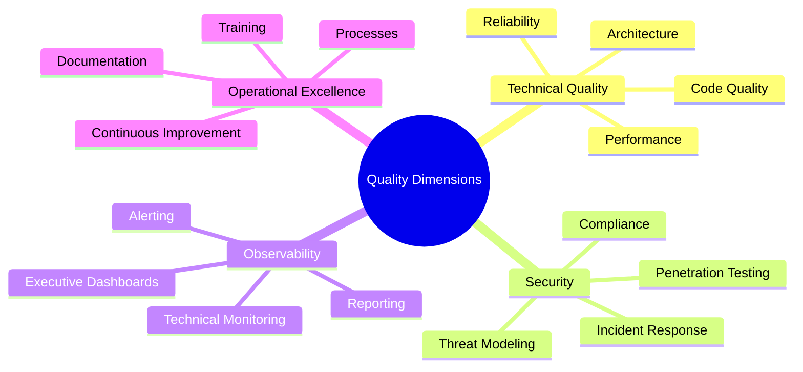
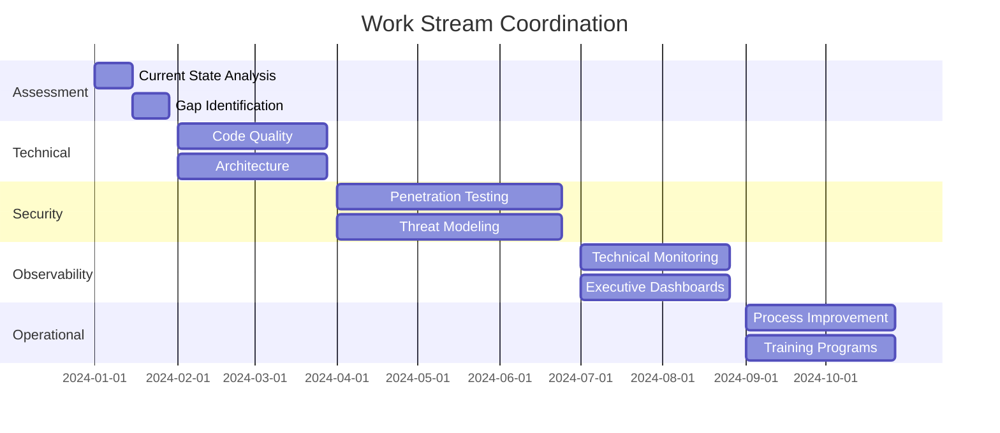
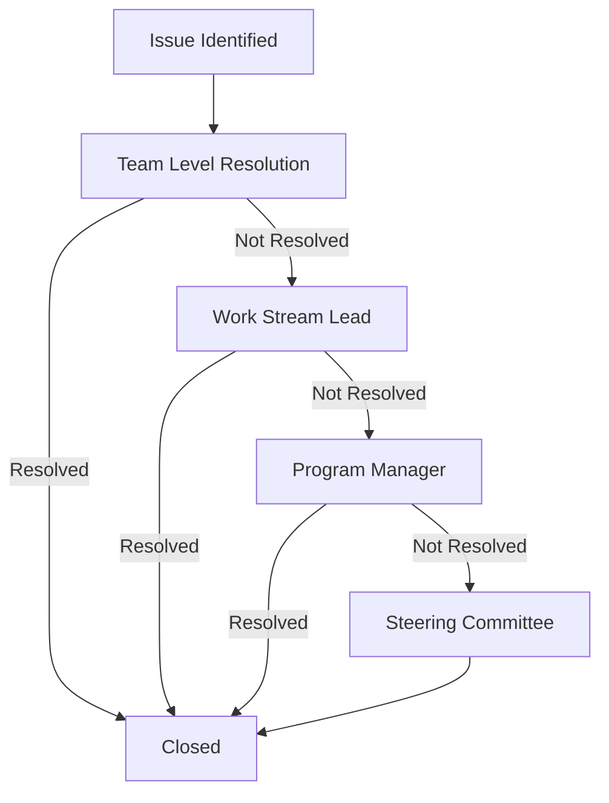

# PHASE 60: Master Plan and Executive Summary

## Overview

This master plan document provides a comprehensive roadmap for the JA4proxy project, outlining the strategic vision, assessment findings, and implementation approach across multiple phases. It serves as the executive summary and governance framework for all subsequent phases.

## Status

- **Status**: APPROVED
- **Epic**: Comprehensive Quality Improvement
- **Dependencies**: None
- **Size**: XL (Master Plan)
- **Duration**: 32 weeks (Overall Program)

## Executive Summary

### Project Vision
To elevate the JA4proxy project to exemplary standards of security, quality, and operational excellence through comprehensive assessment and systematic remediation across all software engineering dimensions.

### Strategic Objectives
1. **Comprehensive Assessment**: Evaluate all aspects of the project against industry best practices
2. **Systematic Remediation**: Address identified gaps through structured implementation phases
3. **Quality Improvement**: Enhance code quality, security, and operational excellence
4. **Continuous Improvement**: Establish processes for ongoing quality enhancement

### Key Benefits
- **Enhanced Security**: Comprehensive security hardening and threat protection
- **Improved Quality**: Systematic code quality and architectural improvements
- **Operational Excellence**: Robust observability and incident response capabilities
- **Compliance Assurance**: Full compliance with relevant standards and regulations
- **Stakeholder Confidence**: Clear visibility and reporting for all stakeholders

## Assessment Findings Summary

### Strengths
1. **Clear Objectives**: Well-defined project aims and comprehensive roadmap
2. **Excellent Documentation**: Organized structure with good coverage
3. **Robust Architecture**: Well-designed, scalable architecture with good security practices
4. **Comprehensive Testing**: Extensive test suite with good coverage
5. **Strong Observability**: Good performance testing and monitoring setup

### Gap Analysis
1. **Documentation**: Needs formal update process and technical enhancements
2. **Architecture**: Requires better decision documentation and component interaction maps
3. **Testing**: Some areas need additional performance and security testing
4. **Code Quality**: Opportunities for type hints, error handling, and validation
5. **Security**: Comprehensive penetration testing and threat modeling needed
6. **Compliance**: Full regulatory compliance implementation required
7. **Observability**: Dual-layer observability for technical and executive needs

## Strategic Roadmap

### Phase Structure



### Phase Breakdown

| Phase | Focus Area | Duration | Size |
|-------|------------|----------|------|
| 60 | Master Plan & Governance | 4 weeks | XL |
| 61 | Technical Quality Improvements | 8 weeks | L |
| 62 | Security Hardening | 12 weeks | XL |
| 63 | Observability & Monitoring | 8 weeks | L |
| 64 | Operational Excellence | 8 weeks | M |

## Resource Planning

### Team Structure

```mermaid
orgChart
    BT --> CT
    BT --> ST
    BT --> OT
    CT --> DA
    CT --> QA
    ST --> SE
    ST --> PT
    OT --> OM
    OT --> TR
    BT[Board/Leadership]
    CT[Core Team]
    ST[Security Team]
    OT[Operations Team]
    DA[Development & Architecture]
    QA[Quality Assurance]
    SE[Security Engineering]
    PT[Penetration Testing]
    OM[Observability & Monitoring]
    TR[Training & Documentation]
```

### Resource Allocation

| Phase | Developers | Security | QA | Documentation | Training | Management |
|-------|------------|----------|----|---------------|----------|-------------|
| 60 | 1.0 | 0.5 | 0.5 | 0.5 | 0.2 | 0.5 |
| 61 | 2.0 | 1.0 | 1.0 | 0.5 | 0.5 | 0.5 |
| 62 | 1.0 | 3.0 | 1.0 | 0.5 | 0.5 | 0.5 |
| 63 | 1.0 | 1.0 | 1.0 | 0.5 | 0.5 | 0.5 |
| 64 | 0.5 | 0.5 | 0.5 | 1.0 | 1.0 | 0.5 |

### Budget Overview

| Category | Estimated Budget |
|----------|------------------|
| Personnel | $500,000 |
| Tools & Licenses | $150,000 |
| Consulting | $200,000 |
| Training | $50,000 |
| Infrastructure | $100,000 |
| **Total** | **$1,000,000** |

## Governance Framework

### Decision Making
- **Steering Committee**: Monthly reviews and strategic decisions
- **Technical Review Board**: Bi-weekly technical architecture reviews
- **Security Council**: Weekly security posture reviews
- **Change Control Board**: As-needed change approvals

### Reporting Structure
- **Executive Reports**: Monthly to leadership
- **Technical Reports**: Bi-weekly to development teams
- **Security Reports**: Weekly to security team
- **Progress Updates**: Weekly to all stakeholders

### Risk Management
- **Risk Register**: Maintained and reviewed monthly
- **Risk Assessment**: Quarterly comprehensive assessments
- **Mitigation Planning**: Continuous risk treatment
- **Contingency Planning**: Annual review and updates

## Quality Dimensions Coverage

### Comprehensive Quality Model



### Coverage Matrix

| Dimension | Phase 60 | Phase 61 | Phase 62 | Phase 63 | Phase 64 |
|-----------|---------|---------|---------|---------|---------|
| Code Quality | Assessment | Implementation | Maintenance | Monitoring | Improvement |
| Architecture | Assessment | Implementation | Review | Monitoring | Documentation |
| Performance | Assessment | Implementation | Validation | Monitoring | Optimization |
| Security | Assessment | Basics | Comprehensive | Monitoring | Culture |
| Compliance | Assessment | Basics | Comprehensive | Monitoring | Training |
| Observability | Assessment | Basics | Security | Comprehensive | Improvement |
| Processes | Assessment | Basics | Integration | Monitoring | Maturity |
| Training | Assessment | Basics | Security | Basics | Comprehensive |
| Documentation | Assessment | Technical | Security | Executive | Comprehensive |

## Implementation Approach

### Phased Implementation Strategy

1. **Assessment & Planning (Phase 60)**
   - Comprehensive current state analysis
   - Gap identification and prioritization
   - Strategic roadmap development
   - Resource and budget planning

2. **Technical Foundation (Phase 61)**
   - Code quality improvements
   - Architecture enhancements
   - Performance optimization
   - Reliability engineering

3. **Security Hardening (Phase 62)**
   - Penetration testing
   - Threat modeling
   - Incident response
   - Compliance implementation

4. **Observability Implementation (Phase 63)**
   - Technical monitoring
   - Executive dashboards
   - Alerting strategy
   - Reporting framework

5. **Operational Maturity (Phase 64)**
   - Process optimization
   - Training programs
   - Documentation excellence
   - Continuous improvement

### Work Stream Coordination



## Success Metrics

### Overall Program Metrics

1. **Quality Improvement**: 95% overall quality score achievement
2. **Security Posture**: 90% reduction in critical vulnerabilities
3. **Compliance Coverage**: 100% of applicable regulations addressed
4. **Observability Maturity**: Level 4 observability capability achieved
5. **Operational Excellence**: 95% process maturity score

### Phase-Specific Metrics

**Phase 61 - Technical Quality:**
- 95% code quality score
- 100% architecture decisions documented
- 20% performance improvement
- 99.9% system uptime

**Phase 62 - Security Hardening:**
- 90% vulnerability remediation
- 95% test coverage of attack surface
- 100% compliance requirements addressed
- Comprehensive incident response capability

**Phase 63 - Observability:**
- 100% critical component instrumentation
- Real-time executive dashboards
- <5% false positive alert rate
- Comprehensive reporting coverage

**Phase 64 - Operational Excellence:**
- Mature process documentation
- 95% training completion rate
- Comprehensive documentation coverage
- Established continuous improvement processes

## Risk Management

### Top Risks and Mitigation

| Risk | Impact | Likelihood | Mitigation Strategy |
|------|--------|------------|---------------------|
| Resource constraints | High | Medium | Prioritize critical path, use contractors |
| Scope creep | Medium | High | Strict change control, phase boundaries |
| Technical debt | High | Low | Systematic reduction plan |
| Security vulnerabilities | Critical | Medium | Comprehensive testing and remediation |
| Compliance gaps | High | Medium | Expert consultation, phased implementation |
| Adoption resistance | Medium | High | Stakeholder engagement, training |
| Tool limitations | Medium | Low | Pilot testing, fallback options |
| Integration challenges | High | Medium | Early integration testing, interface standards |

### Risk Monitoring

- **Monthly Risk Reviews**: Steering committee risk assessment
- **Bi-weekly Technical Risks**: Architecture review board
- **Weekly Security Risks**: Security council meetings
- **Continuous Monitoring**: Automated risk tracking

## Stakeholder Communication

### Communication Plan

| Audience | Frequency | Format | Content Focus |
|----------|-----------|--------|---------------|
| Executive Leadership | Monthly | Presentation | Strategic progress, ROI, risk summary |
| Technical Teams | Bi-weekly | Technical Review | Implementation details, challenges, solutions |
| Security Team | Weekly | Security Briefing | Threat landscape, vulnerabilities, incidents |
| Operations | Bi-weekly | Operations Review | Process improvements, tooling, metrics |
| All Staff | Quarterly | Town Hall | Overall progress, achievements, recognition |

### Reporting Standards

1. **Executive Reports**: High-level summary with visual indicators
2. **Technical Reports**: Detailed implementation status
3. **Security Reports**: Threat landscape and vulnerability status
4. **Progress Updates**: Standardized format with RAG status

## Program Governance

### Decision Rights

| Decision Type | Authority | Process |
|---------------|----------|---------|
| Strategic Direction | Steering Committee | Monthly review |
| Technical Architecture | Technical Review Board | Bi-weekly review |
| Security Policies | Security Council | Weekly review |
| Budget Changes | Steering Committee | As needed |
| Scope Changes | Change Control Board | Bi-weekly review |
| Resource Allocation | Program Manager | Continuous |

### Escalation Path



## Continuous Improvement

### Feedback Loops

1. **Phase Retrospectives**: Lessons learned from each phase
2. **Quarterly Reviews**: Overall program effectiveness
3. **User Feedback**: Continuous stakeholder input
4. **Metrics Analysis**: Data-driven improvement identification

### Improvement Processes

1. **Kaizen Events**: Focused improvement workshops
2. **Process Optimization**: Continuous process refinement
3. **Tool Enhancement**: Regular tooling improvements
4. **Training Updates**: Continuous training material updates

## Conclusion

This master plan provides a comprehensive governance framework and strategic roadmap for the JA4proxy quality improvement program. By following this structured approach, the project will systematically address all identified quality dimensions and achieve exemplary standards across security, technical quality, observability, and operational excellence.

### Key Outcomes

1. **Comprehensive Quality Improvement**: Systematic enhancement across all dimensions
2. **Enhanced Security Posture**: Robust protection against evolving threats
3. **Operational Excellence**: Mature processes and continuous improvement
4. **Stakeholder Confidence**: Clear visibility and effective communication
5. **Future Readiness**: Architecture and processes prepared for evolution

### Next Steps

1. **Steering Committee Approval**: Finalize master plan
2. **Resource Allocation**: Secure team and budget
3. **Phase 61 Kickoff**: Begin technical quality improvements
4. **Governance Establishment**: Implement review boards and councils
5. **Stakeholder Communication**: Initiate reporting and updates

## Related Phase Documents

- **PHASE 61**: Technical Quality Improvements
- **PHASE 62**: Security Hardening
- **PHASE 63**: Observability and Monitoring
- **PHASE 64**: Operational Excellence

## Document Version History

| Version | Date | Author | Changes |
|---------|------|--------|---------|
| 1.0 | 2024-01-01 | Project Team | Initial comprehensive assessment |
| 1.1 | 2024-01-15 | Project Team | Added penetration testing strategy |
| 1.2 | 2024-01-30 | Project Team | Enhanced with additional quality dimensions |
| 2.0 | 2024-02-15 | Project Team | Restructured as master plan |