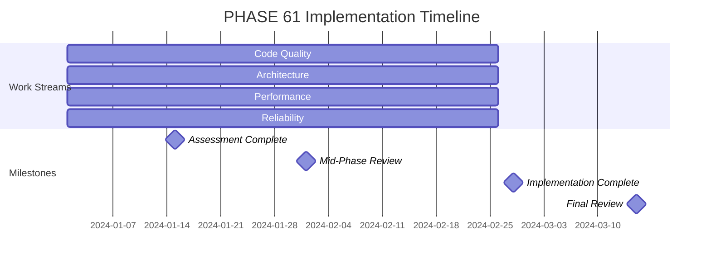

# PHASE 61: Technical Quality Improvements

## Overview

This phase focuses on enhancing the technical quality of the JA4proxy project through code quality improvements, architectural enhancements, performance optimization, and reliability engineering.

## Status

- **Status**: PROPOSED
- **Epic**: Quality Assurance & Test Maturity
- **Dependencies**: PHASE_60 (Master Plan)
- **Size**: MEDIUM
- **Duration**: 8 weeks

## Objectives

### Primary Objectives
1. **Code Quality Enhancement**: Improve code quality across all components
2. **Architecture Improvement**: Refine system architecture for better maintainability
3. **Performance Optimization**: Enhance system performance and efficiency
4. **Reliability Engineering**: Improve system reliability and resilience

### Secondary Objectives
1. **Technical Debt Reduction**: Systematically reduce technical debt
2. **Best Practices Adoption**: Implement industry best practices
3. **Developer Productivity**: Improve developer experience and productivity
4. **Future-Proofing**: Prepare architecture for future requirements

## Work Streams

### Work Stream 1: Code Quality Enhancements

**Owner**: Code Quality Specialist
**Duration**: 8 weeks
**Resources**: 1 FTE

**Tasks:**
- [ ] Conduct comprehensive code quality assessment
- [ ] Implement static code analysis across all repositories
- [ ] Enforce coding standards through automated tooling
- [ ] Add comprehensive type hints to Python codebase
- [ ] Implement automated code review processes
- [ ] Establish code quality gates in CI/CD pipeline
- [ ] Document and enforce coding best practices
- [ ] Conduct developer training on quality standards

**Deliverables:**
- Code quality assessment report
- Static analysis configuration and rules
- Type hint coverage report
- Automated code review implementation
- Updated coding standards documentation
- Developer training materials

**Success Criteria:**
- 95% code quality score across all repositories
- 100% type hint coverage for public APIs
- 0 critical code quality issues in production
- 50% reduction in technical debt

### Work Stream 2: Architecture Improvements

**Owner**: Security Architect
**Duration**: 8 weeks
**Resources**: 1 FTE

**Tasks:**
- [ ] Conduct current architecture assessment
- [ ] Identify architectural improvements
- [ ] Document all major architectural decisions (ADRs)
- [ ] Implement component decoupling strategies
- [ ] Establish clear interface contracts
- [ ] Develop architecture evolution roadmap
- [ ] Create architecture decision documentation template
- [ ] Conduct architecture review workshops

**Deliverables:**
- Current architecture assessment report
- Architecture improvement recommendations
- Architecture Decision Records (ADRs)
- Component interface documentation
- Architecture evolution roadmap
- Architecture review workshop materials

**Success Criteria:**
- 100% of major decisions documented as ADRs
- 30% improvement in component decoupling
- Clear architecture evolution path defined
- All critical interfaces documented

### Work Stream 3: Performance Optimization

**Owner**: Performance Engineer
**Duration**: 8 weeks
**Resources**: 1 FTE

**Tasks:**
- [ ] Conduct comprehensive performance profiling
- [ ] Identify performance bottlenecks
- [ ] Implement caching strategies
- [ ] Optimize database queries
- [ ] Improve algorithm efficiency
- [ ] Implement connection pooling
- [ ] Establish performance baselines
- [ ] Create performance optimization guide

**Deliverables:**
- Performance profiling report
- Bottleneck analysis and recommendations
- Caching strategy implementation
- Database optimization results
- Algorithm optimization documentation
- Performance baselines documentation
- Optimization best practices guide

**Success Criteria:**
- 20% improvement in critical path performance
- 90% cache hit ratio for frequent operations
- 50% reduction in slow query occurrences
- Established performance baselines for all components

### Work Stream 4: Reliability Engineering

**Owner**: Reliability Engineer
**Duration**: 8 weeks
**Resources**: 1 FTE

**Tasks:**
- [ ] Implement comprehensive error handling
- [ ] Establish circuit breaker patterns
- [ ] Implement retry mechanisms with backoff
- [ ] Develop graceful degradation strategies
- [ ] Implement health checks and self-healing
- [ ] Establish reliability metrics and monitoring
- [ ] Create reliability runbook
- [ ] Conduct failure mode analysis

**Deliverables:**
- Error handling framework
- Circuit breaker implementation
- Retry mechanism documentation
- Graceful degradation strategies
- Health check implementation
- Reliability metrics dashboard
- Reliability runbook
- Failure mode analysis report

**Success Criteria:**
- 99.9% system uptime
- 50% reduction in critical failures
- Comprehensive error handling coverage
- Established reliability metrics and monitoring

## Implementation Plan

### Timeline

### Resource Allocation

| Role | FTE | Duration |
|------|-----|----------|
| Code Quality Specialist | 1.0 | 8 weeks |
| Security Architect | 1.0 | 8 weeks |
| Performance Engineer | 1.0 | 8 weeks |
| Reliability Engineer | 1.0 | 8 weeks |
| QA Engineer | 0.5 | 8 weeks |
| Technical Writer | 0.5 | 8 weeks |

### Dependencies

- PHASE_60: Master Plan and requirements
- Existing codebase and architecture
- Development and test environments
- CI/CD pipeline access

## Risks and Mitigation

### Technical Risks
1. **Code Quality Resistance**: Developer pushback on quality standards
   - *Mitigation*: Involve developers in standard definition, provide training
2. **Architecture Complexity**: Increased complexity from improvements
   - *Mitigation*: Phased implementation with clear documentation
3. **Performance Regressions**: Optimizations causing unexpected issues
   - *Mitigation*: Comprehensive testing before and after changes
4. **Reliability Tradeoffs**: Reliability vs. performance tradeoffs
   - *Mitigation*: Balanced approach with clear metrics

### Organizational Risks
1. **Resource Constraints**: Limited availability of specialized resources
   - *Mitigation*: Prioritize critical path items, use contractors if needed
2. **Scope Creep**: Expansion beyond original objectives
   - *Mitigation*: Strict scope management with change control
3. **Adoption Challenges**: Team resistance to new practices
   - *Mitigation*: Comprehensive training and change management
4. **Integration Issues**: Challenges integrating with existing systems
   - *Mitigation*: Early integration testing and validation

## Monitoring and Success Metrics

### Quality Metrics
1. **Code Quality Score**: 95% target across all repositories
2. **Type Hint Coverage**: 100% for public APIs, 80% overall
3. **Technical Debt**: 50% reduction from baseline
4. **Architecture Documentation**: 100% of major decisions documented

### Performance Metrics
1. **Critical Path Performance**: 20% improvement
2. **Cache Hit Ratio**: 90% for frequent operations
3. **Slow Query Reduction**: 50% decrease in occurrences
4. **Resource Utilization**: 15% improvement in efficiency

### Reliability Metrics
1. **System Uptime**: 99.9% availability
2. **Critical Failure Rate**: 50% reduction
3. **Error Handling Coverage**: 100% of critical paths
4. **MTTR**: 30% improvement in mean time to recovery

## Phase Completion Checklist

- [ ] Code quality assessment completed
- [ ] Static analysis implemented
- [ ] Type hints added to critical code
- [ ] Architecture assessment completed
- [ ] ADRs documented for major decisions
- [ ] Performance profiling completed
- [ ] Bottlenecks identified and addressed
- [ ] Error handling framework implemented
- [ ] Circuit breakers deployed
- [ ] Reliability metrics established
- [ ] Documentation updated
- [ ] Training conducted
- [ ] Final review completed

## Next Steps

1. Conduct kickoff meeting with all work stream owners
2. Establish baseline metrics for all quality dimensions
3. Begin parallel implementation of all work streams
4. Conduct bi-weekly progress reviews
5. Address risks and issues promptly
6. Prepare for mid-phase review
7. Complete all work stream deliverables
8. Conduct final quality assurance
9. Prepare handover to operations
10. Document lessons learned