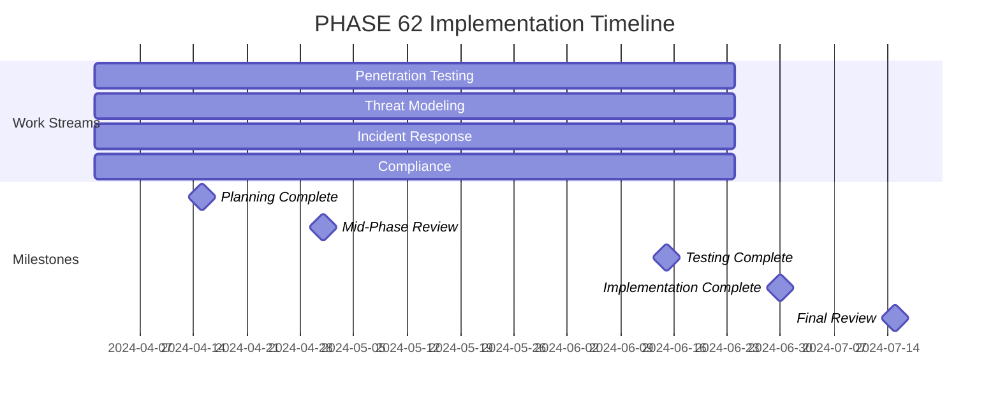

# PHASE 62: Security Hardening

## Overview

This phase focuses on comprehensive security hardening of the JA4proxy project through penetration testing, threat modeling, incident response preparation, and compliance implementation.

## Status

- **Status**: PROPOSED
- **Epic**: Security Hardening
- **Dependencies**: PHASE_60 (Master Plan), PHASE_61 (Technical Quality)
- **Size**: LARGE
- **Duration**: 12 weeks

## Objectives

### Primary Objectives
1. **Penetration Testing**: Comprehensive security testing and vulnerability assessment
2. **Threat Modeling**: Systematic threat identification and mitigation
3. **Incident Response**: Mature incident response capabilities
4. **Compliance Implementation**: Full compliance with relevant standards

### Secondary Objectives
1. **Security Culture**: Foster strong security culture across teams
2. **Security Awareness**: Improve security awareness among all stakeholders
3. **Security Documentation**: Comprehensive security documentation
4. **Continuous Security**: Establish continuous security monitoring

## Work Streams

### Work Stream 1: Penetration Testing

**Owner**: Security Engineer (Penetration Testing)
**Duration**: 12 weeks
**Resources**: 2 FTE (1 internal, 1 external consultant)

**Tasks:**
- [ ] Develop comprehensive penetration testing plan
- [ ] Select and configure testing tools
- [ ] Conduct network layer testing
- [ ] Perform application layer testing
- [ ] Execute proxy-specific testing
- [ ] Conduct configuration testing
- [ ] Perform API security testing
- [ ] Implement automated security scanning
- [ ] Develop remediation plan for findings
- [ ] Conduct retesting and validation

**Deliverables:**
- Penetration testing plan and methodology
- Tool configuration and setup documentation
- Network layer test results and report
- Application layer test results and report
- Proxy-specific test results and report
- Configuration test results and report
- API security test results and report
- Automated scanning implementation
- Remediation plan with prioritized findings
- Retesting results and validation report

**Success Criteria:**
- 100% coverage of defined test areas
- 90% of critical vulnerabilities remediated
- Automated scanning integrated into CI/CD
- Comprehensive penetration testing report

### Work Stream 2: Threat Modeling

**Owner**: Security Architect
**Duration**: 12 weeks
**Resources**: 1 FTE

**Tasks:**
- [ ] Conduct STRIDE analysis for all components
- [ ] Perform DREAD analysis for critical assets
- [ ] Develop attack trees for key scenarios
- [ ] Create data flow diagrams
- [ ] Identify and prioritize threats
- [ ] Develop mitigation strategies
- [ ] Document threat models
- [ ] Integrate with architecture decisions
- [ ] Conduct threat modeling workshops
- [ ] Establish ongoing threat review process

**Deliverables:**
- STRIDE analysis documentation
- DREAD analysis results
- Attack tree diagrams
- Data flow documentation
- Threat prioritization matrix
- Mitigation strategy documentation
- Threat model documentation
- Architecture integration guide
- Workshop materials and recordings
- Threat review process documentation

**Success Criteria:**
- 100% of critical components analyzed
- Comprehensive threat documentation
- Mitigation strategies for all high-risk threats
- Integrated threat modeling process

### Work Stream 3: Incident Response

**Owner**: Incident Response Manager
**Duration**: 12 weeks
**Resources**: 1 FTE

**Tasks:**
- [ ] Develop incident response plan
- [ ] Define incident classification scheme
- [ ] Establish incident response team
- [ ] Create response playbooks
- [ ] Implement detection capabilities
- [ ] Develop containment strategies
- [ ] Establish eradication procedures
- [ ] Create recovery processes
- [ ] Implement post-incident review
- [ ] Conduct incident response training

**Deliverables:**
- Incident response plan documentation
- Incident classification scheme
- Team structure and roles documentation
- Response playbooks for common scenarios
- Detection capability implementation
- Containment strategy documentation
- Eradication procedure guides
- Recovery process documentation
- Post-incident review template
- Training materials and exercises

**Success Criteria:**
- Comprehensive incident response plan
- Trained incident response team
- Response playbooks for all critical scenarios
- Detection capabilities covering all attack vectors

### Work Stream 4: Compliance Implementation

**Owner**: Compliance Specialist
**Duration**: 12 weeks
**Resources**: 1 FTE

**Tasks:**
- [ ] Conduct compliance gap analysis
- [ ] Develop compliance roadmap
- [ ] Implement ISO 27001 controls
- [ ] Establish NIST CSF alignment
- [ ] Implement CIS controls
- [ ] Ensure PCI DSS compliance
- [ ] Address GDPR requirements
- [ ] Implement HIPAA controls (if applicable)
- [ ] Develop compliance documentation
- [ ] Conduct compliance training

**Deliverables:**
- Compliance gap analysis report
- Compliance roadmap and timeline
- ISO 27001 implementation documentation
- NIST CSF alignment documentation
- CIS controls implementation guide
- PCI DSS compliance documentation
- GDPR compliance documentation
- HIPAA compliance documentation (if applicable)
- Compliance policy documentation
- Training materials and records

**Success Criteria:**
- 100% of applicable regulations addressed
- Comprehensive compliance documentation
- All required controls implemented
- Compliance training completed

## Implementation Plan

### Timeline

### Resource Allocation

| Role | FTE | Duration |
|------|-----|----------|
| Security Engineer (Pen Testing) | 1.0 | 12 weeks |
| External Penetration Tester | 1.0 | 8 weeks |
| Security Architect | 1.0 | 12 weeks |
| Incident Response Manager | 1.0 | 12 weeks |
| Compliance Specialist | 1.0 | 12 weeks |
| Legal Counsel | 0.2 | 12 weeks |
| Technical Writer | 0.5 | 12 weeks |

### Dependencies

- PHASE_60: Master Plan and security requirements
- PHASE_61: Technical quality improvements
- Existing security infrastructure
- Development and production environments
- Legal and compliance resources

## Risks and Mitigation

### Technical Risks
1. **False Positives**: High rate of false positive findings
   - *Mitigation*: Thorough validation and triage process
2. **False Negatives**: Missed critical vulnerabilities
   - *Mitigation*: Multiple testing techniques and tools
3. **System Disruption**: Testing causing production issues
   - *Mitigation*: Controlled testing environment and rollback plans
4. **Tool Limitations**: Tool constraints affecting coverage
   - *Mitigation*: Supplement with manual testing where needed

### Organizational Risks
1. **Resource Constraints**: Limited security expertise availability
   - *Mitigation*: Use external consultants for specialized tasks
2. **Scope Creep**: Expansion beyond security hardening scope
   - *Mitigation*: Strict scope management with change control
3. **Adoption Resistance**: Team resistance to security changes
   - *Mitigation*: Comprehensive training and change management
4. **Compliance Complexity**: Complex regulatory requirements
   - *Mitigation*: Engage legal counsel and compliance experts

## Monitoring and Success Metrics

### Security Metrics
1. **Vulnerability Reduction**: 90% of critical vulnerabilities remediated
2. **Test Coverage**: 95% of attack surface tested
3. **Detection Rate**: 95% detection rate for known threats
4. **False Positive Rate**: Less than 5% false positives

### Threat Modeling Metrics
1. **Coverage**: 100% of critical components analyzed
2. **Mitigation Rate**: 100% of high-risk threats have mitigation strategies
3. **Documentation**: Complete threat model documentation
4. **Integration**: Threat modeling integrated with architecture process

### Incident Response Metrics
1. **MTTD**: Mean Time to Detect incidents
2. **MTTR**: Mean Time to Respond to incidents
3. **MTTC**: Mean Time to Contain incidents
4. **Training Completion**: 100% of IR team trained

### Compliance Metrics
1. **Coverage**: 100% of applicable regulations addressed
2. **Control Implementation**: 100% of required controls implemented
3. **Documentation**: Complete compliance documentation
4. **Training**: 100% of relevant staff trained

## Phase Completion Checklist

- [ ] Penetration testing plan developed
- [ ] All testing areas covered
- [ ] Critical vulnerabilities identified
- [ ] Remediation plan implemented
- [ ] STRIDE analysis completed
- [ ] DREAD analysis completed
- [ ] Threat models documented
- [ ] Incident response plan developed
- [ ] Response playbooks created
- [ ] IR team trained
- [ ] Compliance gap analysis completed
- [ ] All applicable regulations addressed
- [ ] Compliance documentation completed
- [ ] Final security review completed

## Next Steps

1. Conduct security hardening kickoff meeting
2. Finalize penetration testing scope and approach
3. Begin parallel implementation of all work streams
4. Establish security working group
5. Conduct bi-weekly security reviews
6. Address critical findings immediately
7. Prepare for mid-phase security review
8. Complete all remediation activities
9. Conduct final security validation
10. Document lessons learned and best practices