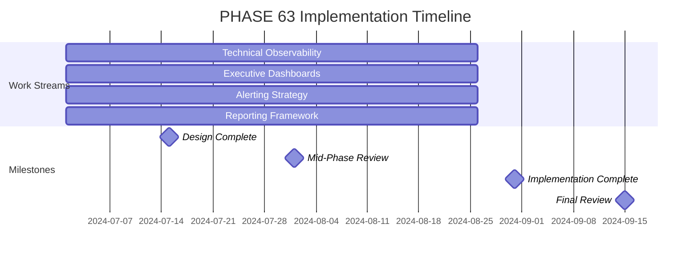

# PHASE 63: Observability and Monitoring

## Overview

This phase implements a comprehensive observability and monitoring solution for the JA4proxy project, providing both technical visibility for SecOps teams and executive dashboards for management.

## Status

- **Status**: PROPOSED
- **Epic**: Operational Excellence
- **Dependencies**: PHASE_60 (Master Plan), PHASE_61 (Technical Quality)
- **Size**: MEDIUM
- **Duration**: 8 weeks

## Objectives

### Primary Objectives
1. **Technical Observability**: Comprehensive monitoring for security operations
2. **Executive Dashboards**: High-level visibility for management
3. **Alerting Strategy**: Effective alerting for all stakeholders
4. **Reporting Framework**: Comprehensive reporting capabilities

### Secondary Objectives
1. **Performance Monitoring**: Real-time performance tracking
2. **Security Monitoring**: Integrated security event monitoring
3. **Incident Correlation**: Correlation of observability data with incidents
4. **Continuous Improvement**: Feedback loops for observability enhancement

## Work Streams

### Work Stream 1: Technical Observability Implementation

**Owner**: Observability Engineer
**Duration**: 8 weeks
**Resources**: 1 FTE

**Tasks:**
- [ ] Implement comprehensive metrics collection
- [ ] Deploy structured logging pipeline
- [ ] Set up distributed tracing
- [ ] Develop technical dashboards
- [ ] Configure technical alert rules
- [ ] Integrate with existing monitoring tools
- [ ] Implement data retention policies
- [ ] Establish performance baselines
- [ ] Create observability runbook
- [ ] Conduct observability training

**Deliverables:**
- Metrics collection implementation
- Structured logging pipeline
- Distributed tracing setup
- Technical dashboard collection
- Alert rule configuration
- Integration documentation
- Data retention policy
- Performance baselines
- Observability runbook
- Training materials

**Success Criteria:**
- 100% of critical components instrumented
- 95% of operations with complete logs
- 80% of requests with end-to-end traces
- Comprehensive technical dashboards

### Work Stream 2: Executive Dashboard Implementation

**Owner**: Dashboard Developer
**Duration**: 8 weeks
**Resources**: 1 FTE

**Tasks:**
- [ ] Design executive dashboard architecture
- [ ] Implement data aggregation layer
- [ ] Develop status dashboards
- [ ] Create alert summary views
- [ ] Build incident overview displays
- [ ] Implement risk posture indicators
- [ ] Develop compliance status views
- [ ] Integrate with incident management
- [ ] Establish communication channels
- [ ] Conduct executive training

**Deliverables:**
- Executive dashboard architecture
- Data aggregation implementation
- Status dashboard collection
- Alert summary views
- Incident overview displays
- Risk posture indicators
- Compliance status views
- Incident management integration
- Communication channel setup
- Executive training materials

**Success Criteria:**
- Real-time executive dashboards
- Clear status indicators
- Actionable insights for management
- Integrated incident views

### Work Stream 3: Alerting Strategy

**Owner**: Alerting Specialist
**Duration**: 8 weeks
**Resources**: 1 FTE

**Tasks:**
- [ ] Develop alerting framework
- [ ] Define alert severity levels
- [ ] Create alert routing rules
- [ ] Implement alert deduplication
- [ ] Establish escalation policies
- [ ] Develop alert suppression rules
- [ ] Implement alert correlation
- [ ] Create alert documentation
- [ ] Conduct alerting training
- [ ] Establish alert metrics

**Deliverables:**
- Alerting framework documentation
- Severity level definitions
- Routing rule configuration
- Deduplication implementation
- Escalation policy documentation
- Suppression rule configuration
- Correlation implementation
- Alert documentation
- Training materials
- Alert metrics dashboard

**Success Criteria:**
- Comprehensive alert coverage
- Less than 5% false positives
- Effective alert routing
- Clear escalation paths

### Work Stream 4: Reporting Framework

**Owner**: Reporting Specialist
**Duration**: 8 weeks
**Resources**: 1 FTE

**Tasks:**
- [ ] Design reporting architecture
- [ ] Implement data warehouse
- [ ] Develop standard reports
- [ ] Create ad-hoc reporting capabilities
- [ ] Implement scheduled report delivery
- [ ] Develop compliance reports
- [ ] Create performance reports
- [ ] Implement security reports
- [ ] Establish report governance
- [ ] Conduct reporting training

**Deliverables:**
- Reporting architecture design
- Data warehouse implementation
- Standard report collection
- Ad-hoc reporting tools
- Scheduled delivery setup
- Compliance report templates
- Performance report templates
- Security report templates
- Report governance policy
- Training materials

**Success Criteria:**
- Comprehensive report coverage
- Automated report delivery
- Ad-hoc reporting capabilities
- Compliance reporting completeness

## Implementation Plan

### Timeline

### Resource Allocation

| Role | FTE | Duration |
|------|-----|----------|
| Observability Engineer | 1.0 | 8 weeks |
| Dashboard Developer | 1.0 | 8 weeks |
| Alerting Specialist | 1.0 | 8 weeks |
| Reporting Specialist | 1.0 | 8 weeks |
| Data Analyst | 0.5 | 8 weeks |
| Technical Writer | 0.5 | 8 weeks |

### Dependencies

- PHASE_60: Master Plan and observability requirements
- PHASE_61: Technical quality improvements
- Existing monitoring infrastructure
- Development and production environments
- Incident management system access

## Risks and Mitigation

### Technical Risks
1. **Data Volume**: High volume of observability data
   - *Mitigation*: Implement sampling and aggregation strategies
2. **Performance Impact**: Observability affecting system performance
   - *Mitigation*: Optimize instrumentation and collection processes
3. **Tool Integration**: Challenges integrating diverse tools
   - *Mitigation*: Use standard interfaces and APIs
4. **Data Quality**: Incomplete or inaccurate observability data
   - *Mitigation*: Implement data validation and quality checks

### Organizational Risks
1. **Stakeholder Buy-in**: Lack of engagement from management
   - *Mitigation*: Demonstrate clear business value and ROI
2. **Skill Gaps**: Limited observability expertise
   - *Mitigation*: Provide comprehensive training and documentation
3. **Scope Creep**: Expansion beyond observability scope
   - *Mitigation*: Strict scope management with change control
4. **Adoption Challenges**: Team resistance to new monitoring
   - *Mitigation*: Involve teams in design and provide training

## Monitoring and Success Metrics

### Observability Metrics
1. **Instrumentation Coverage**: 100% of critical components
2. **Log Completeness**: 95% of operations with complete logs
3. **Trace Coverage**: 80% of requests with end-to-end traces
4. **Dashboard Uptime**: 99.9% availability

### Alerting Metrics
1. **Alert Accuracy**: Less than 5% false positives
2. **Coverage**: 100% of critical scenarios covered
3. **Response Time**: 90% of alerts acknowledged within 5 minutes
4. **Resolution Time**: 80% of alerts resolved within SLA

### Reporting Metrics
1. **Report Completeness**: 100% of required reports available
2. **Delivery Reliability**: 99% of scheduled reports delivered on time
3. **Usage**: 80% of target audience using reports regularly
4. **Satisfaction**: 90% stakeholder satisfaction with reporting

## Phase Completion Checklist

- [ ] Technical observability implemented
- [ ] Executive dashboards deployed
- [ ] Alerting strategy configured
- [ ] Reporting framework established
- [ ] All critical components instrumented
- [ ] Comprehensive dashboard collection created
- [ ] Alert rules covering all critical scenarios
- [ ] Standard reports developed
- [ ] Training conducted for all users
- [ ] Documentation completed
- [ ] Final review completed

## Next Steps

1. Conduct observability kickoff meeting
2. Finalize observability architecture
3. Begin parallel implementation of work streams
4. Establish observability working group
5. Conduct bi-weekly progress reviews
6. Address data quality issues promptly
7. Prepare for mid-phase review
8. Complete all implementation activities
9. Conduct final validation
10. Document lessons learned