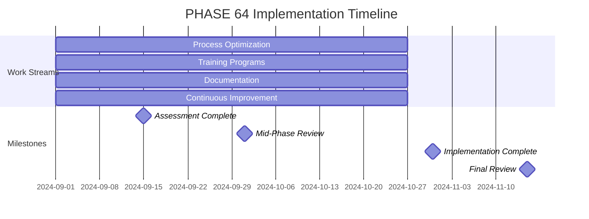

# PHASE 64: Operational Excellence

## Overview

This phase focuses on achieving operational excellence for the JA4proxy project through process optimization, comprehensive training programs, documentation excellence, and establishing continuous improvement processes.

## Status

- **Status**: PROPOSED
- **Epic**: Operational Excellence
- **Dependencies**: PHASE 60 (Master Plan), PHASE 61 (Technical Quality), PHASE 62 (Security), PHASE 63 (Observability)
- **Size**: MEDIUM
- **Duration**: 8 weeks

## Objectives

### Primary Objectives
1. **Process Optimization**: Streamline and mature all operational processes
2. **Training Programs**: Develop and deliver comprehensive training
3. **Documentation Excellence**: Achieve highest standards in documentation
4. **Continuous Improvement**: Establish sustainable improvement processes

### Secondary Objectives
1. **Knowledge Management**: Implement effective knowledge sharing systems
2. **Team Empowerment**: Enable teams through training and resources
3. **Quality Culture**: Foster a culture of continuous quality improvement
4. **Operational Resilience**: Enhance ability to adapt and improve

## Work Streams

### Work Stream 1: Process Optimization

**Owner**: Process Engineer
**Duration**: 8 weeks
**Resources**: 1 FTE

**Tasks:**
- [ ] Map all current processes
- [ ] Identify process inefficiencies
- [ ] Design optimized process flows
- [ ] Implement process automation
- [ ] Establish process metrics
- [ ] Create process documentation
- [ ] Develop process ownership model
- [ ] Implement continuous process review
- [ ] Conduct process training
- [ ] Establish process improvement feedback loop

**Deliverables:**
- Current process inventory
- Process optimization recommendations
- Automated process implementations
- Process metrics dashboard
- Process documentation
- Process ownership model
- Training materials
- Process improvement framework

**Success Criteria:**
- 30% reduction in process cycle times
- 90% process automation coverage
- Comprehensive process documentation
- Established process ownership

### Work Stream 2: Training Programs

**Owner**: Training Manager
**Duration**: 8 weeks
**Resources**: 1 FTE

**Tasks:**
- [ ] Conduct training needs assessment
- [ ] Develop training curriculum
- [ ] Create training materials
- [ ] Implement training delivery platform
- [ ] Establish training schedule
- [ ] Develop training metrics
- [ ] Create certification programs
- [ ] Implement mentorship program
- [ ] Conduct train-the-trainer sessions
- [ ] Establish training feedback system

**Deliverables:**
- Training needs assessment report
- Comprehensive training curriculum
- Training materials (videos, docs, exercises)
- Training platform implementation
- Training schedule and calendar
- Training metrics dashboard
- Certification program framework
- Mentorship program guide
- Trainer materials
- Training feedback system

**Success Criteria:**
- 95% employee training completion rate
- 90% training satisfaction score
- Comprehensive training coverage
- Established certification programs

### Work Stream 3: Documentation Excellence

**Owner**: Technical Writer
**Duration**: 8 weeks
**Resources**: 1 FTE

**Tasks:**
- [ ] Conduct documentation audit
- [ ] Develop documentation standards
- [ ] Implement documentation templates
- [ ] Establish documentation review process
- [ ] Create documentation style guide
- [ ] Implement documentation automation
- [ ] Develop documentation metrics
- [ ] Create documentation governance
- [ ] Conduct documentation training
- [ ] Establish documentation improvement process

**Deliverables:**
- Documentation audit report
- Documentation standards guide
- Documentation templates
- Review process documentation
- Style guide
- Automation implementation
- Documentation metrics
- Governance framework
- Training materials
- Improvement process documentation

**Success Criteria:**
- 100% documentation standards compliance
- 95% documentation completeness
- Automated documentation processes
- Established governance framework

### Work Stream 4: Continuous Improvement

**Owner**: Continuous Improvement Manager
**Duration**: 8 weeks
**Resources**: 1 FTE

**Tasks:**
- [ ] Establish continuous improvement framework
- [ ] Implement suggestion system
- [ ] Develop improvement metrics
- [ ] Create improvement prioritization process
- [ ] Implement improvement tracking
- [ ] Develop recognition program
- [ ] Establish improvement communities
- [ ] Create improvement documentation
- [ ] Conduct improvement training
- [ ] Implement improvement feedback loops

**Deliverables:**
- Continuous improvement framework
- Suggestion system implementation
- Improvement metrics dashboard
- Prioritization process documentation
- Tracking system
- Recognition program framework
- Community of practice guides
- Improvement documentation templates
- Training materials
- Feedback loop implementation

**Success Criteria:**
- 20% improvement in key metrics
- Active suggestion system participation
- Established improvement communities
- Sustainable improvement culture

## Implementation Plan

### Timeline

### Resource Allocation

| Role | FTE | Duration |
|------|-----|----------|
| Process Engineer | 1.0 | 8 weeks |
| Training Manager | 1.0 | 8 weeks |
| Technical Writer | 1.0 | 8 weeks |
| Continuous Improvement Manager | 1.0 | 8 weeks |
| Instructional Designer | 0.5 | 8 weeks |
| Quality Assurance | 0.5 | 8 weeks |

### Dependencies

- PHASE 60: Master Plan and operational requirements
- PHASE 61: Technical quality improvements
- PHASE 62: Security hardening
- PHASE 63: Observability implementation
- Existing operational processes
- Team availability for training

## Risks and Mitigation

### Technical Risks
1. **Process Resistance**: Team resistance to process changes
   - *Mitigation*: Involve teams in process design, demonstrate benefits
2. **Training Effectiveness**: Training not achieving desired outcomes
   - *Mitigation*: Pilot testing, continuous feedback, iterative improvement
3. **Documentation Quality**: Maintaining high documentation standards
   - *Mitigation*: Automated quality checks, peer review, training
4. **Improvement Fatigue**: Team burnout from continuous change
   - *Mitigation*: Pace improvements, celebrate successes, balance workload

### Organizational Risks
1. **Resource Constraints**: Limited availability of specialized resources
   - *Mitigation*: Prioritize critical path, use contractors for peak periods
2. **Adoption Challenges**: Difficulty in adopting new processes
   - *Mitigation*: Comprehensive change management, leadership support
3. **Sustainability**: Maintaining improvements over time
   - *Mitigation*: Establish ownership, metrics, and accountability
4. **Measurement Difficulties**: Challenges in measuring improvement impact
   - *Mitigation*: Clear baseline metrics, regular tracking, adjust as needed

## Monitoring and Success Metrics

### Process Metrics
1. **Cycle Time Reduction**: 30% improvement in key processes
2. **Automation Coverage**: 90% of repetitive processes automated
3. **Process Compliance**: 100% adherence to defined processes
4. **Process Maturity**: Level 4 capability maturity achieved

### Training Metrics
1. **Completion Rate**: 95% of employees completing required training
2. **Satisfaction Score**: 90% positive feedback on training programs
3. **Knowledge Retention**: 85% knowledge retention rate
4. **Application Rate**: 80% of training applied in practice

### Documentation Metrics
1. **Standards Compliance**: 100% adherence to documentation standards
2. **Completeness**: 95% of required documentation available
3. **Quality Score**: 90% quality score on documentation reviews
4. **Findability**: 95% of users can find needed documentation

### Improvement Metrics
1. **Suggestion Rate**: 5 suggestions per employee per quarter
2. **Implementation Rate**: 70% of suggestions implemented
3. **Impact**: 20% improvement in key operational metrics
4. **Participation**: 80% of team members engaged in improvement activities

## Phase Completion Checklist

- [ ] Process optimization completed
- [ ] Training programs implemented
- [ ] Documentation excellence achieved
- [ ] Continuous improvement established
- [ ] All processes mapped and optimized
- [ ] Comprehensive training delivered
- [ ] Documentation standards met
- [ ] Improvement framework operational
- [ ] Metrics and tracking implemented
- [ ] Final review completed

## Next Steps

1. Conduct operational excellence kickoff meeting
2. Finalize process optimization plan
3. Begin parallel implementation of work streams
4. Establish operational excellence working group
5. Conduct bi-weekly progress reviews
6. Address adoption challenges promptly
7. Prepare for mid-phase review
8. Complete all implementation activities
9. Conduct final validation
10. Document lessons learned and best practices