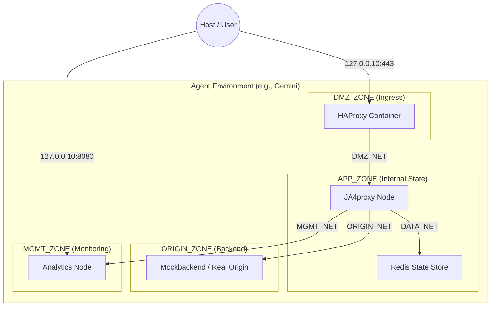

# PHASE 71 — Docker Environment Isolation

## Status: OPEN

---

## Goal

Enable multiple AI agents (Gemini, Claude, Ollama, Mistral, etc.) to run independent, production-mirrored JA4proxy instances on the same host (i9-9900K, 64GB RAM). This phase implements strict logical boundary isolation, minimizing the host-exposed surface area to a "Two-Port Policy" and partitioning system resources to prevent lateral movement or resource exhaustion.

---

## 71a. Project & Network Isolation

### Finding

Default Docker Compose behavior uses a single project namespace and shared bridge networks, allowing any container to potentially discover or attack another bot's services via the Docker gateway.

### Fix

Implement strict **Three-Tier Network Zones** for every agent project. Every network is private and isolated by default.



---

## 71b. The "Two-Port Policy" (Surface Area Reduction)

### Finding

Exposing every service port (Redis, Proxy, Metrics, etc.) to the host loopback (`127.0.0.1`) creates a massive attack surface and leads to port collisions.

### Fix

Limit host exposure to only **two ports per agent** (Ingress and Analytics) and bind them to unique agent-specific loopback IPs.

**Agent Loopback Mapping:**
| Agent | Loopback IP | Ingress (Host) | Analytics (Host) |
| :--- | :--- | :--- | :--- |
| **Gemini** | `127.0.0.10` | 443 | 8080 |
| **Claude** | `127.0.0.11` | 443 | 8080 |
| **Ollama** | `127.0.0.12` | 443 | 8080 |
| **Mistral** | `127.0.0.13` | 443 | 8080 |

---

## 71c. Resource Management & Hardening

### CPU Pinning (i9-9900K Partitioning)

The 16 logical threads are partitioned to prevent one agent from starving another during high-intensity benchmarks.

- **Gemini**: `0-3`
- **Claude**: `4-7`
- **Ollama**: `8-11`
- **Mistral**: `12-15`

### Storage & Log Quotas

Prevent Disk-Full DoS by enforcing strict logging limits in `docker-compose.yml`:
```yaml
logging:
  driver: "json-file"
  options:
    max-size: "100m"
    max-file: "3"
```

---

## 71d. Environment Initialization Script

### Implementation: `scripts/agent-env.sh`

This script generates the `.env` file required to spin up an isolated agent environment.

```bash
#!/bin/bash
# scripts/agent-env.sh <agent_name>

case $1 in
  "gemini")  IP="127.0.0.10"; CPUS="0-3" ;;
  "claude")  IP="127.0.0.11"; CPUS="4-7" ;;
  "ollama")  IP="127.0.0.12"; CPUS="8-11" ;;
  "mistral") IP="127.0.0.13"; CPUS="12-15" ;;
  *) echo "Usage: $0 gemini|claude|ollama|mistral"; exit 1 ;;
esac

cat <<EOF > .env.$1
COMPOSE_PROJECT_NAME=ja4_$1
AGENT_BIND_IP=${IP}
AGENT_CPU_SET=${CPUS}
HOST_PORT_INGRESS=443
HOST_PORT_ANALYTICS=8080
ENVIRONMENT=development
REDIS_PASSWORD=$(openssl rand -hex 16)
EOF
```

---

## Acceptance Criteria

- [ ] **Two-Port Policy**: Only ports 443 and 8080 are exposed to the host for a running agent.
- [ ] **Interface Isolation**: Bot Alpha (`127.0.0.10`) cannot reach Bot Beta (`127.0.0.11`) via host loopback.
- [ ] **Zone Isolation**: `redis` container has no route to `mockbackend` (Origin Zone).
- [ ] **Egress Hardening**: `internal: true` verified on `data_net` and `origin_net`.
- [ ] **Non-Root Execution**: All containers run as non-root users (`user: "1000:1000"`).
- [ ] **Log Quotas**: Log files are capped and rotated correctly.

---

## Files to Modify

| File | Change |
|------|--------|
| `docker-compose.poc.yml` | Implement 3-tier zones, bind to `AGENT_BIND_IP`, add logging quotas |
| `docker/docker-compose.prod.yml` | Mirror zone isolation for production parity |
| `scripts/agent-env.sh` | New file — Secure environment generator |
| `docs/phases/manifest.yaml` | Update Phase 71 metadata |
| `README.md` | Update "Getting Started" for multi-agent support |
| `docs/architecture/ISOLATION_MODEL.md` | New file — Detailed security/isolation documentation |

---

## Notes for Implementer

- Ensure the host has the additional loopback IPs configured (usually automatic on Linux for `127.0.0.x`).
- The Proxy must be configured to use internal DNS names (e.g., `REDIS_HOST=redis`) rather than IPs to maintain zone transparency.
- **NEVER** mount `/var/run/docker.sock` in any agent container.
