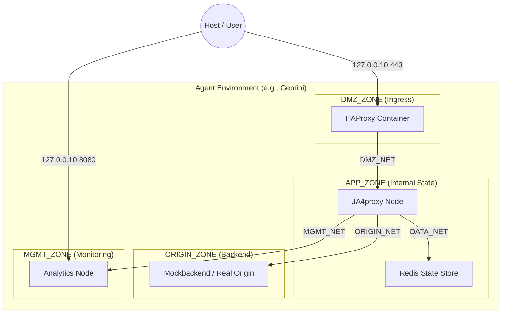

# PHASE 71 — Docker Environment Isolation

## Status: OPEN

---

## Goal

Enable multiple AI agents (Gemini, Claude, Ollama, Mistral, etc.) to run independent,
production-mirrored JA4proxy instances on the same host (i9-9900K, 64GB RAM). This phase
implements strict logical boundary isolation, minimising the host-exposed surface area to
a "Two-Port Policy" and partitioning system resources to prevent lateral movement or
resource exhaustion.

---

## 71a. Project & Network Isolation

### Finding

Default Docker Compose behaviour uses a single project namespace and shared bridge
networks, allowing any container to potentially discover or attack another bot's services
via the Docker gateway.

### Fix

Implement strict **Three-Tier Network Zones** for every agent project. Every network is
private and isolated by default. Full zone spec is in Phase 72; this phase establishes
the project namespace and environment generator.



---

## 71b. The "Two-Port + Management" Policy

### Finding

Exposing every service port (Redis, Proxy, Metrics, etc.) to the host loopback
(`127.0.0.1`) creates a massive attack surface and leads to port collisions between
concurrent agent environments.

### Fix

**Public ports** (accessible without auth, from outside the agent environment):

| Port | Service | Purpose |
|------|---------|---------|
| `${AGENT_BIND_IP}:443` | HAProxy | TLS ingress |
| `${AGENT_BIND_IP}:8080` | Analytics | Dashboard / telemetry |

**Management ports** (admin access only, loopback-bound, not public):

| Port | Service | Purpose |
|------|---------|---------|
| `${AGENT_BIND_IP}:9090` | Proxy | Prometheus metrics scrape |
| `${AGENT_BIND_IP}:8404` | HAProxy | HAProxy stats page |

**Not exposed to host** (internal Docker networks only):

| Service | Port | Reason |
|---------|------|--------|
| Redis | 6379 | Internal state — `data_net` only |
| Backend | 443 | Isolated origin — `origin_net` only |
| Tarpit | 8888, 9099 | Internal target — `origin_net` only |

**Agent Loopback Mapping:**

| Agent | Loopback IP | Ingress | Analytics | Metrics | Stats |
|-------|------------|---------|-----------|---------|-------|
| **Gemini** | `127.0.0.10` | :443 | :8080 | :9090 | :8404 |
| **Claude** | `127.0.0.11` | :443 | :8080 | :9090 | :8404 |
| **Ollama** | `127.0.0.12` | :443 | :8080 | :9090 | :8404 |
| **Mistral** | `127.0.0.13` | :443 | :8080 | :9090 | :8404 |

Since each agent uses a distinct loopback IP, the same port numbers can be reused without
collision. An agent cannot reach another agent's services because container processes
cannot resolve host loopback addresses other than `127.0.0.1` (which maps only to their
own container loopback).

---

## 71c. Resource Management & Hardening

### CPU Pinning (i9-9900K Partitioning)

The 16 logical threads are partitioned to prevent one agent from starving another during
high-intensity benchmarks.

| Agent | cpuset |
|-------|--------|
| Gemini | `0-3` |
| Claude | `4-7` |
| Ollama | `8-11` |
| Mistral | `12-15` |

`cpuset` is a top-level service key in Docker Compose (not under `deploy`). It coexists
with `deploy.resources.limits.cpus` which controls the CPU share weight — both are set.

### Storage & Log Quotas

Prevent Disk-Full DoS by enforcing strict logging limits in `docker-compose.poc.yml`:

```yaml
logging:
  driver: "json-file"
  options:
    max-size: "100m"
    max-file: "3"
```

Applied to every service in the compose file (300 MB cap per container).

---

## 71d. Environment Initialisation Script

### Implementation: `scripts/agent-env.sh`

Generates the `.env.<agent>` file required to spin up an isolated agent environment.
Must generate **all** variables referenced in `docker-compose.poc.yml`, not just the
isolation-specific ones.

```bash
#!/usr/bin/env bash
# scripts/agent-env.sh — Generate isolated .env file for a named agent
#
# Usage: ./scripts/agent-env.sh <agent_name>
# Output: .env.<agent_name> (never overwrites an existing file without -f)
#
# After generating, start the stack with:
#   docker compose --project-name ja4_<name> --env-file .env.<name> up -d

set -euo pipefail

AGENT="${1:-}"
FORCE="${2:-}"

usage() {
    echo "Usage: $0 <agent_name> [-f]"
    echo "  agent_name: gemini | claude | ollama | mistral"
    echo "  -f: overwrite existing .env.<agent_name>"
    exit 1
}

[[ -n "$AGENT" ]] || usage

case "$AGENT" in
  gemini)  IP="127.0.0.10"; CPUS="0-3"   ;;
  claude)  IP="127.0.0.11"; CPUS="4-7"   ;;
  ollama)  IP="127.0.0.12"; CPUS="8-11"  ;;
  mistral) IP="127.0.0.13"; CPUS="12-15" ;;
  *) echo "Unknown agent: $AGENT"; usage ;;
esac

OUTFILE=".env.${AGENT}"

if [[ -f "$OUTFILE" && "$FORCE" != "-f" ]]; then
    echo "✗ $OUTFILE already exists. Use -f to overwrite." >&2
    exit 1
fi

cat > "$OUTFILE" <<EOF
# ── Agent identity ──────────────────────────────────────────────────────────
COMPOSE_PROJECT_NAME=ja4_${AGENT}
AGENT_BIND_IP=${IP}
AGENT_CPU_SET=${CPUS}

# ── Host port assignments ────────────────────────────────────────────────────
HOST_PORT_INGRESS=443
HOST_PORT_ANALYTICS=8080

# ── Secrets (auto-generated) ─────────────────────────────────────────────────
REDIS_PASSWORD=$(openssl rand -hex 32)
GRAFANA_PASSWORD=$(openssl rand -hex 16)

# ── Backend ──────────────────────────────────────────────────────────────────
BACKEND_HOST=backend
BACKEND_PORT=443

# ── Environment ──────────────────────────────────────────────────────────────
ENVIRONMENT=development
LOG_LEVEL=INFO
EOF

chmod 600 "$OUTFILE"
echo "✓ Created $OUTFILE (agent=${AGENT}, ip=${IP}, cpus=${CPUS})"
echo ""
echo "  Start:  docker compose --project-name ja4_${AGENT} --env-file $OUTFILE up -d"
echo "  Admin:  ./scripts/ja4-admin.sh --agent ${AGENT} status"
echo "  Stop:   docker compose --project-name ja4_${AGENT} --env-file $OUTFILE down"
```

---

## Acceptance Criteria

- [ ] `scripts/agent-env.sh gemini` creates `.env.gemini` with all required vars.
- [ ] `scripts/agent-env.sh gemini` (second run, no `-f`) exits non-zero without overwriting.
- [ ] `docker compose --project-name ja4_gemini --env-file .env.gemini up -d` starts successfully.
- [ ] Two-Port Policy: only ports 443 and 8080 are publicly intended per agent; 9090 and 8404 exposed as management-only.
- [ ] Interface Isolation: Bot Alpha (`127.0.0.10`) cannot reach Bot Beta (`127.0.0.11`) via host loopback from within a container.
- [ ] Zone Isolation: `redis` container has no route to `mockbackend` (Origin Zone).
- [ ] Egress Hardening: `internal: true` verified on `data_net` and `origin_net`.
- [ ] Non-Root Execution: All containers run as non-root users (`user: "1000:1000"`).
- [ ] Log Quotas: Log files are capped and rotated correctly.

---

## Files to Modify

| File | Change |
|------|--------|
| `docker-compose.poc.yml` | 3-tier zones, `AGENT_BIND_IP` port binding, `cpuset`, logging quotas, `user:` |
| `scripts/agent-env.sh` | New file — Secure environment generator (full script above) |
| `docs/architecture/ISOLATION_MODEL.md` | Update to reflect implemented model |
| `README.md` | Update "Getting Started" for multi-agent support |

---

## Notes for Implementer

- Linux `127.0.0.x` addresses all route to the loopback interface automatically — no
  extra `ip addr add` is needed.
- The `haproxy.cfg` does NOT need changes. It uses `bind *:443` inside the container;
  host-level filtering is entirely controlled by the compose `ports:` section.
- Service DNS names (`redis`, `proxy`, `backend`) resolve within shared Docker networks
  and are unaffected by network zone changes — as long as the service pairs share a network.
- `COMPOSE_PROJECT_NAME` ensures Docker names all resources with the agent prefix
  (e.g. `ja4_gemini-redis-1`). This prevents volume and network collisions.
- **NEVER** mount `/var/run/docker.sock` in any agent container.
- The `.env.<agent>` file contains secrets. Add `.env.*` to `.gitignore` (check it is
  already there — `.env` is; `.env.*` may not be).
