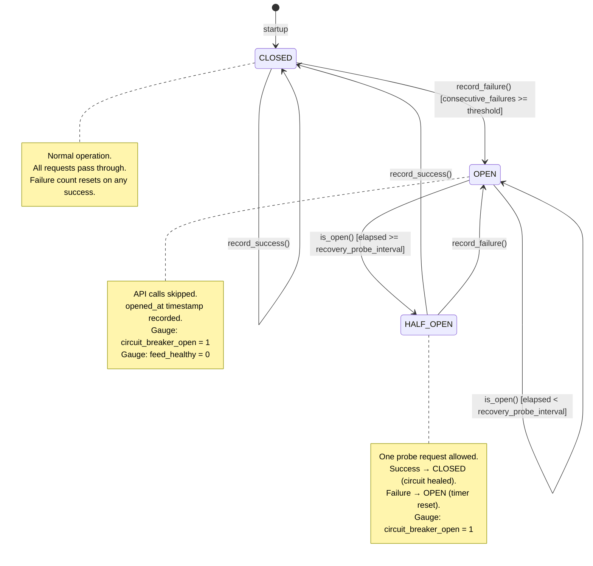

<!--
title: TI_Feed_Health_Monitoring
audience: Security Analysts, DevOps/SRE, Administrators, Data Scientists
last_reviewed: 2026-04-03
phase: 59
-->

# TI Feed Health Monitoring — Runbook

## Quick Reference

| Feed | Circuit breaker metric | Config key | Default failure threshold |
|------|------------------------|------------|--------------------------|
| MISP | `ja4proxy_ti_circuit_breaker_open{feed="misp"}` | `misp.enabled` | 5 consecutive failures |
| GreyNoise | `ja4proxy_ti_circuit_breaker_open{feed="greynoise"}` | `greynoise.enabled` | 5 consecutive failures |
| AlienVault OTX | `ja4proxy_ti_circuit_breaker_open{feed="alienvault_otx"}` | `alienvault.enabled` | 5 consecutive failures |
| VirusTotal | `ja4proxy_ti_circuit_breaker_open{feed="virustotal"}` | `threat_intelligence.virustotal.enabled` | 5 consecutive failures |
| ThreatFox | `ja4proxy_ti_circuit_breaker_open{feed="threatfox"}` | `threat_intelligence.threatfox.enabled` | 5 consecutive failures |

Shared circuit breaker thresholds (all feeds): `threat_intelligence.circuit_breaker_failure_threshold`
(default: 5) and `threat_intelligence.circuit_breaker_recovery_probe_interval` (default: 60s).
Background probe interval (MISP, GreyNoise, AlienVault OTX, ThreatFox):
`threat_intelligence.health_probe_interval_seconds` (default: 30s). VirusTotal has no probe.

All circuit breakers default to CLOSED on startup. Recovery probe interval defaults to
60 seconds. The proxy fails open on every circuit breaker trip — traffic continues to
flow; the affected feed's score contribution drops to zero.

---

## 1. Security Analyst Guide

### What confidence scores mean

Each TI feed contributes a `RiskSignal` to the composite risk scorer. The signal carries
a `weight` field (0.0–1.0) set by the `ConfidenceManager` based on historical accuracy
for that feed.

| Weight range | Interpretation | Effect on composite score |
|-------------|----------------|--------------------------|
| 0.90–1.00 | High confidence — feed historically accurate | Full signal score applied |
| 0.70–0.89 | Moderate confidence — occasional false positives | Score scaled down proportionally |
| 0.50–0.69 | Low confidence — significant FP history | Signal contributes at half strength or less |
| < 0.50 | Degraded — manual review recommended | Signal included but with strong discount |

The Prometheus gauge `ja4proxy_feed_accuracy_score{feed_name="..."}` exposes the current
accuracy score for each feed. Values below 0.7 should prompt a review of that feed's
output.

### How circuit breakers affect risk scoring

When a circuit breaker is OPEN for a feed, that feed contributes zero score to all
connections. The composite score is computed from the remaining healthy feeds only.

Practical consequence: if MISP opens its circuit, connections that would have been
flagged solely due to MISP associations may score below the `flag` threshold (20 points)
and pass unlogged. This is the correct fail-open behaviour — a missed bad request is
recoverable, a blocked legitimate user is not.

To check whether any feed is currently open:

```promql
ja4proxy_ti_circuit_breaker_open == 1
```

If multiple feeds are open simultaneously, assess whether the remaining signals are
sufficient for your threat model. If not, consider temporarily lowering thresholds or
raising the dial setting under active monitoring.

### Reading the feed health dashboard

Recommended Grafana panels for the TI health overview:

| Panel | Query | Description |
|-------|-------|-------------|
| Feed healthy count | `sum(ja4proxy_ti_feed_healthy)` | How many feeds are currently healthy |
| Open circuit breakers | `sum(ja4proxy_ti_circuit_breaker_open)` | Feeds currently tripped open |
| Consecutive failure trend | `ja4proxy_ti_feed_consecutive_failures` | Rising trend precedes a trip |
| Response time per feed | `ja4proxy_ti_feed_last_response_time_seconds` | Latency increase can indicate imminent failure |
| Accuracy score per feed | `ja4proxy_feed_accuracy_score` | Long-term signal quality |

A healthy deployment shows all `ja4proxy_ti_feed_healthy` values at 1 and
`ja4proxy_ti_feed_consecutive_failures` near zero.

### When to manually intervene

Automatic recovery handles most outages. Intervene manually when:

- A circuit has been OPEN for more than 30 minutes with no HALF_OPEN probe succeeding.
  This suggests the upstream service has a structural issue that automatic probing will
  not resolve (e.g. expired API key, changed endpoint URL).
- `ja4proxy_feed_accuracy_score` drops below 0.5 for a production feed. The feed may be
  producing systematically bad data and should be investigated or disabled.
- Multiple feeds open simultaneously during a non-incident period. Investigate whether
  Redis, DNS, or outbound network connectivity is degraded.

### Interpreting reduced-confidence alerts

An alert on `ja4proxy_feed_accuracy_score < 0.7` means the ConfidenceManager has
recorded a pattern of false positives for that feed. Steps:

1. Review recent false positive events in the audit log or SIEM.
2. Identify whether the FPs are concentrated on a specific IP range, ASN, or time window.
3. If the feed data is wrong for a known-good IP range, record a true negative via the
   admin API to adjust the accuracy calculation.
4. If the feed is systematically wrong, disable it (see Administrator Reference §3.2)
   until the upstream provider investigates.

---

## 2. DevOps / SRE Guide

### Deploying with feed health monitoring

`FeedHealthMonitor` is instantiated once at proxy startup and injected into each
`TIProvider`. No additional infrastructure is required — circuit breaker state is
in-process only (not persisted to Redis). On restart, all circuit breakers reset to
CLOSED.

If you run multiple proxy instances, each instance maintains its own independent
circuit breakers. A feed that is failing may trip one instance's breaker before
another's. This is by design: each instance fails open independently, preventing a
single Redis-stored state from simultaneously disabling a feed across all instances.

### Startup integration

`FeedHealthMonitor` is created once in `ProxyServer.__init__` and passed to all five
providers (MISP, GreyNoise, AlienVault OTX, VirusTotal, ThreatFox) via the
`health_monitor=` constructor parameter.

Each provider that supports background probing calls
`health_monitor.register_probe(feed_name, probe_fn, interval_seconds)` during its
`start()` method. After all providers have started, `ProxyServer` calls
`await health_monitor.start_probing()` to launch the background probe tasks.

Before shutdown, `ProxyServer` calls `await health_monitor.stop_probing()` which
cancels all probe tasks and awaits their completion.

**VirusTotal does not register a probe.** VirusTotal's API has strict daily quotas;
probing it independently of actual lookups would consume quota with no benefit. Its
circuit breaker still operates normally — it is updated by `record_success()` /
`record_failure()` calls inside `_process_lookup()`.

Circuit breakers are pre-registered at startup via `get_circuit_breaker()` with
thresholds read from the `threat_intelligence.*` config section:
- `threat_intelligence.circuit_breaker_failure_threshold` — defaults to 5
- `threat_intelligence.circuit_breaker_recovery_probe_interval` — defaults to 60.0s
- `threat_intelligence.health_probe_interval_seconds` — per-feed probe interval default

If a provider is instantiated without `health_monitor` (the parameter defaults to
`None`), the circuit breaker guard inside `_process_lookup` is silently skipped and
the provider behaves as if no circuit breaker is present. This preserves backwards
compatibility for deployments or tests that do not pass a monitor instance.

### Prometheus metrics reference

| Metric | Type | Labels | Description |
|--------|------|--------|-------------|
| `ja4proxy_ti_feed_healthy` | Gauge | `feed` | 1=healthy (CLOSED), 0=unhealthy (OPEN or HALF_OPEN) |
| `ja4proxy_ti_circuit_breaker_open` | Gauge | `feed` | 1=open or half-open, 0=closed |
| `ja4proxy_ti_feed_consecutive_failures` | Gauge | `feed` | Current consecutive failure count; resets to 0 on any success |
| `ja4proxy_ti_feed_last_response_time_seconds` | Gauge | `feed` | Wall-clock seconds for the last successful API call |
| `ja4proxy_ti_circuit_transitions_total` | Counter | `feed`, `to_state` | Cumulative state transitions; `to_state` is `open`, `half_open`, or `closed` |
| `ja4proxy_ti_feed_probe_interval_seconds` | Gauge | `feed` | Configured background probe interval for this feed (set by `register_probe`; absent if no probe registered) |
| `ja4proxy_feed_accuracy_score` | Gauge | `feed_name` | Current confidence weight, 0.0–1.0 (from ConfidenceManager) |
| `ja4proxy_confidence_adjustments_total` | Counter | `feed_name`, `direction` | Confidence weight changes; `direction` is `up`, `down`, or `manual` |
| `ja4proxy_feed_validations_total` | Counter | `feed_name`, `result` | Outcome feedback events; `result` is `tp`, `fp`, `tn`, or `fn` |
| `ja4proxy_adaptive_cache_current_ttl_seconds` | Gauge | `feed_name` | Current cache TTL set by adaptive caching system |
| `ja4proxy_adaptive_cache_volatility_score` | Gauge | `feed_name` | Volatility score 0.0–1.0 driving TTL adjustment |
| `ja4proxy_misp_lookup_total` | Counter | `result` | MISP API calls by outcome: `success`, `not_found`, `error`, `timeout` |
| `ja4proxy_greynoise_lookup_total` | Counter | `result` | GreyNoise API calls by outcome |
| `ja4proxy_alienvault_lookup_total` | Counter | `result` | AlienVault OTX API calls by outcome |
| `ja4proxy_virustotal_lookup_total` | Counter | `result` | VirusTotal API calls by outcome |
| `ja4proxy_threatfox_lookup_total` | Counter | `result` | ThreatFox API calls by outcome |
| `ja4proxy_misp_enrichment_queue_depth` | Gauge | — | Pending MISP lookup queue depth |
| `ja4proxy_greynoise_enrichment_queue_depth` | Gauge | — | Pending GreyNoise lookup queue depth |
| `ja4proxy_alienvault_enrichment_queue_depth` | Gauge | — | Pending AlienVault lookup queue depth |
| `ja4proxy_virustotal_enrichment_queue_depth` | Gauge | — | Pending VirusTotal lookup queue depth |
| `ja4proxy_threatfox_enrichment_queue_depth` | Gauge | — | Pending ThreatFox lookup queue depth |

### Alerting rules (recommended Prometheus Alertmanager rules)

```yaml
groups:
  - name: ja4proxy_ti_feed_health
    rules:

      # A feed circuit breaker has been open for more than 5 minutes.
      # This is normal for transient outages; 5 min indicates a structural problem.
      - alert: TIFeedCircuitBreakerOpen
        expr: ja4proxy_ti_circuit_breaker_open == 1
        for: 5m
        labels:
          severity: warning
          team: secops
        annotations:
          summary: "TI feed circuit breaker open: {{ $labels.feed }}"
          description: >
            The circuit breaker for feed {{ $labels.feed }} has been open for over 5
            minutes. The feed is not contributing to risk scoring. Investigate API key
            validity, network connectivity, and upstream service status.
          runbook: "docs/runbooks/ti_feed_health.md#diagnosing-a-stuck-circuit-breaker"

      # All feeds are unhealthy simultaneously — likely a network or Redis issue.
      - alert: AllTIFeedsUnhealthy
        expr: sum(ja4proxy_ti_feed_healthy) == 0
        for: 2m
        labels:
          severity: critical
          team: sre
        annotations:
          summary: "All TI feeds are unhealthy"
          description: >
            Zero TI feeds are healthy. Risk scoring is operating on non-TI signals only.
            Check outbound network connectivity, Redis availability, and proxy logs.
          runbook: "docs/runbooks/ti_feed_health.md"

      # Consecutive failures climbing — circuit breaker trip imminent.
      - alert: TIFeedFailuresRising
        expr: ja4proxy_ti_feed_consecutive_failures >= 3
        for: 0m
        labels:
          severity: info
          team: secops
        annotations:
          summary: "TI feed {{ $labels.feed }} approaching failure threshold"
          description: >
            Feed {{ $labels.feed }} has {{ $value }} consecutive failures.
            Default threshold is 5. Investigate before the circuit opens.

      # Feed accuracy has dropped below the reliability floor.
      - alert: TIFeedAccuracyDegraded
        expr: ja4proxy_feed_accuracy_score < 0.7
        for: 30m
        labels:
          severity: warning
          team: secops
        annotations:
          summary: "TI feed accuracy degraded: {{ $labels.feed_name }}"
          description: >
            Feed {{ $labels.feed_name }} accuracy score is {{ $value | humanizePercentage }}.
            This feed is producing a higher-than-expected false positive rate and its
            signals are weighted down proportionally.

      # Enrichment queue depth indicates workers are falling behind.
      - alert: TIFeedQueueBacklog
        expr: >
          ja4proxy_misp_enrichment_queue_depth > 400
          or ja4proxy_greynoise_enrichment_queue_depth > 400
          or ja4proxy_alienvault_enrichment_queue_depth > 400
          or ja4proxy_virustotal_enrichment_queue_depth > 400
          or ja4proxy_threatfox_enrichment_queue_depth > 400
        for: 5m
        labels:
          severity: warning
          team: sre
        annotations:
          summary: "TI feed enrichment queue backlog"
          description: >
            A TI feed enrichment queue exceeds 400 items (queue size is 500). New lookup
            requests will be silently dropped when full. Check worker health and API latency.
```

### Diagnosing a stuck circuit breaker

A circuit is "stuck open" when the Gauge `ja4proxy_ti_circuit_breaker_open{feed="..."}` 
stays at 1 for longer than two probe intervals (`recovery_probe_interval`, default 60s).

**Step 1 — confirm the circuit is open and check failure count:**

```promql
ja4proxy_ti_circuit_breaker_open{feed="misp"}
ja4proxy_ti_feed_consecutive_failures{feed="misp"}
```

**Step 2 — check the lookup error counter for recent errors:**

```promql
rate(ja4proxy_misp_lookup_total{result="error"}[5m])
rate(ja4proxy_misp_lookup_total{result="timeout"}[5m])
```

**Step 3 — check proxy logs for the underlying error:**

```bash
docker compose logs proxy --since 10m | grep 'ti_feed\|misp.*error\|misp.*exception'
```

Expected log patterns and their meanings (see Log Event Reference below for full list).

**Step 4 — test API reachability manually:**

```bash
# MISP example — replace with your instance URL and key
curl -s -o /dev/null -w "%{http_code}" \
  -H "Authorization: <MISP_API_KEY>" \
  https://your-misp-instance/attributes/restSearch/json
```

Common causes:

| Symptom | Cause | Fix |
|---------|-------|-----|
| HTTP 401 | API key expired or rotated | Rotate key (see §3.3) |
| HTTP 403 | Account disabled or IP-restricted | Contact feed provider |
| HTTP 429 | Rate limit exceeded | Increase `lookup_timeout_seconds` or reduce `worker_count` |
| Connection timeout | Network policy blocking egress | Check firewall rules for proxy container |
| DNS resolution failure | Resolver misconfigured | Check `dns_enrichment.resolver_nameservers` |

### Forcing circuit breaker reset (config reload vs restart)

Circuit breaker state is in-process only. There are two ways to force a reset:

**Option A — restart the proxy container (hard reset):**

```bash
docker compose restart proxy
```

All circuit breakers reset to CLOSED. Use this when you have fixed the underlying
cause and want to restore scoring immediately without waiting for a probe cycle.

**Option B — wait for automatic recovery:**

After `recovery_probe_interval` seconds (default 60s), the circuit transitions to
HALF_OPEN and allows one probe request. A successful probe closes the circuit without
operator action. This is the preferred path for transient outages.

Config reload (`SIGHUP`) does not reset circuit breakers — it updates configuration
values such as timeouts and API keys, but the in-process state machine persists.
A config reload followed by a restart is the recommended sequence when rotating an
API key for a tripped feed:

```bash
# 1. Update the key in config/proxy.yml
# 2. Reload config to apply the new key
docker compose kill -s SIGHUP proxy
# 3. Verify the key works (manual curl test)
# 4. Restart to reset the circuit breaker
docker compose restart proxy
```

### Log event reference

All TI feed health log lines use the `ti_feed` subsystem prefix.

| Log line pattern | Level | Meaning |
|-----------------|-------|---------|
| `ti_feed \| event=circuit_opened \| feed=<name> \| consecutive_failures=<n>` | WARN | Circuit tripped open after N consecutive failures |
| `ti_feed \| event=circuit_half_open \| feed=<name> \| probe_after=<s>s` | INFO | Circuit transitioning to HALF_OPEN; one probe allowed |
| `ti_feed \| event=circuit_closed \| feed=<name> \| from=<state>` | INFO | Circuit recovered; feed contributing to scoring again |
| `misp \| event=circuit_open_skip \| ip=<ip>` | DEBUG | Lookup skipped because circuit is open (per IP, high volume — use DEBUG level) |
| `misp \| event=api_error \| status=<code> \| ip=<ip>` | WARN | API returned non-200, non-404 response |
| `misp \| event=api_exception \| ip=<ip> \| error=<msg>` | ERROR | Unhandled exception during API call |
| `misp \| event=redis_read_error \| ip=<ip> \| error=<msg>` | WARN | Redis read failed during cache lookup |
| `misp \| event=worker_error \| error=<msg>` | ERROR | Worker loop crashed; will restart on next queue item |
| `confidence_manager \| event=initialized \| feed_count=<n>` | INFO | ConfidenceManager loaded historical accuracy data |

Replace `misp` with `greynoise`, `alienvault`, `virustotal`, or `threatfox` for those feeds.

---

## 3. Administrator Reference

### Configuration options

The following config keys under `config/proxy.yml` control TI feed health behaviour.
All keys are hot-reloadable via SIGHUP unless noted.

**Per-feed settings** (shown for MISP; identical pattern for greynoise, alienvault,
virustotal, threatfox):

```yaml
misp:
  enabled: false                     # Master switch. hot-reloadable.
  api_key: ""                        # Set via MISP_API_KEY env var. hot-reloadable.
  base_url: ""                       # Set via MISP_BASE_URL env var. hot-reloadable.
  cache_ttl_seconds: 3600            # Static TTL; overridden by adaptive cache when enabled.
  lookup_timeout_seconds: 5          # Per-request timeout. hot-reloadable.
  score_cap: 50                      # Max score contribution (0-100). hot-reloadable.
  queue_size: 500                    # Lookup queue depth. Requires restart to change.
  worker_count: 2                    # Background workers. Requires restart to change.
  attribute_score: 20                # Score per matched MISP attribute.
```

**Circuit breaker and probe parameters** are configured under a top-level
`threat_intelligence:` section in `config/proxy.yml`. These apply to all feeds
uniformly; per-feed overrides are not supported without a code change.

```yaml
threat_intelligence:
  circuit_breaker_failure_threshold: 5       # Consecutive failures before tripping open. hot-reloadable.
  circuit_breaker_recovery_probe_interval: 60.0  # Seconds before OPEN transitions to HALF_OPEN. hot-reloadable.
  health_probe_interval_seconds: 30.0        # Background probe cadence (per feed that registers a probe). hot-reloadable.
  # Individual feed sections (shown for misp; same pattern for virustotal, threatfox):
  misp:
    enabled: false                           # Master switch. hot-reloadable.
  virustotal:
    enabled: false
  threatfox:
    enabled: false
```

Note: VirusTotal does not register a background probe — quota constraints make
independent probing wasteful. Its circuit breaker parameters still read from the
shared `threat_intelligence.circuit_breaker_*` keys.

**Confidence manager state** is persisted to Redis under the key `ja4proxy:confidence:state`.
This key survives restarts and is loaded at startup. Default accuracy scores at first
startup:

| Feed | Default accuracy |
|------|-----------------|
| misp | 0.90 |
| threatfox | 0.85 |
| virustotal | 0.95 |
| greynoise | 0.92 |
| alienvault_otx | 0.88 |

**Adaptive cache settings** control how TTLs adjust based on data volatility. Default
profiles (not currently YAML-configurable; modify `adaptive_cache.py` defaults):

| Feed | Base TTL | Default volatility |
|------|----------|--------------------|
| misp | 3600s | 0.3 (stable) |
| threatfox | 21600s | 0.5 (moderate) |
| virustotal | 7200s | 0.4 (moderate) |
| greynoise | 21600s | 0.2 (stable) |
| alienvault_otx | 3600s | 0.3 (stable) |

### Enabling and disabling individual feeds

**Enable a feed:**

1. Set the API key via environment variable (preferred) or in `config/proxy.yml`.
2. Set `enabled: true` in the feed's config section.
3. Send SIGHUP: `docker compose kill -s SIGHUP proxy`

Note: `worker_count` and `queue_size` changes require a full restart. A WARN is logged
if these are changed via SIGHUP without restart.

**Disable a feed:**

1. Set `enabled: false` in the feed's config section.
2. Send SIGHUP: `docker compose kill -s SIGHUP proxy`

The feed stops contributing signals immediately. In-flight lookups already queued will
complete but results will not be scored. No data is lost from Redis.

**Verify the change:**

```bash
docker compose logs proxy --since 1m | grep 'event=started\|event=disabled\|enabled=false'
```

### Tuning thresholds for high-noise vs low-noise environments

**High-noise environments** (many scanners, high connection volume):

- Increase `lookup_timeout_seconds` to tolerate slower feed responses under load.
- Increase `queue_size` and `worker_count` to handle the throughput (restart required).
- Lower `score_cap` on feeds with high FP rates to reduce the blast radius of incorrect
  attribution.
- Consider increasing `cache_ttl_seconds` for feeds with stable data to reduce API call
  volume and preserve quota.

**Low-noise environments** (conservative deployments, emphasis on detection):

- Decrease `cache_ttl_seconds` to ensure fresher threat data drives decisions.
- Lower `confidence_minimum` (in `rate_limiter.adaptive`) to apply adaptive signals
  more aggressively.
- Enable all available feeds to maximise signal coverage.

**Circuit breaker sensitivity:**

The default `failure_threshold=5` is appropriate for most environments. Raise it via
`threat_intelligence.circuit_breaker_failure_threshold` in `config/proxy.yml` and send
SIGHUP — the change is hot-reloadable.

If a feed is intermittently unreliable (e.g., rate-limited frequently), raising the
threshold buys more tolerance before a trip. Alternatively, wrap quota-exhaustion
errors differently in the provider code so they do not count as circuit-breaker
failures — that requires a code change; document it as a deployment-specific patch.

### API key rotation procedure (zero-downtime)

API keys for TI feeds are hot-reloadable. No restart or traffic interruption is required.

1. Obtain the new API key from the feed provider.
2. Update the environment variable (e.g., `MISP_API_KEY=<new-key>`) in the deployment
   `.env` file or secrets manager.
3. If setting the key directly in `config/proxy.yml` (not recommended for production):
   update the `api_key` field in the feed's config section.
4. Send SIGHUP to the proxy:
   ```bash
   docker compose kill -s SIGHUP proxy
   ```
5. The proxy logs a config reload and the new key takes effect for the next API call:
   ```
   INFO | config | event=reloaded
   ```
6. If the old key was already causing failures and the circuit is open, restart the
   proxy to reset the circuit breaker immediately:
   ```bash
   docker compose restart proxy
   ```
7. Verify successful lookups:
   ```promql
   rate(ja4proxy_misp_lookup_total{result="success"}[5m]) > 0
   ```

Revoke the old key at the feed provider after confirming the new key is working.

---

## 4. Data Scientist / Feed Quality Notes

### Circuit breaker state machine diagram



**Key implementation details:**

- State is in-process only (not in Redis). Restarts reset all states to CLOSED.
- The OPEN → HALF_OPEN transition is a side-effect of `is_open()` — calling `is_open()`
  after the probe interval has elapsed causes the transition. This means the first
  request after the interval triggers the probe attempt.
- In HALF_OPEN, a failure immediately re-opens the circuit and resets `opened_at`. The
  probe interval restarts from zero.
- `failure_threshold` counts consecutive failures only. A single success at any point
  resets the counter to zero (even in CLOSED state). This prevents slow ratcheting
  toward a trip from random single failures.

### Historical ring buffer: what's tracked, size limit, how to query

Each `CircuitBreaker` instance maintains an in-process ring buffer of the last 100
events (`CircuitBreaker._history`, a `collections.deque(maxlen=100)`). Each entry is
a dict with four fields:

| Field | Type | Description |
|-------|------|-------------|
| `ts` | float | `time.monotonic()` timestamp of the event |
| `event` | str | `"success"`, `"failure"`, or `"state_change"` |
| `state` | str | Circuit state at the time of the event (`"closed"`, `"open"`, `"half_open"`) |
| `response_time` | float | Seconds for the API call (0.0 for failures and state changes) |

This buffer is in-process only — it is not persisted to Redis and resets on every
proxy restart. Access it programmatically via `cb.history` (returns a list copy) on
a live instance. It is not currently exposed via any HTTP endpoint.

The `ConfidenceManager` tracks outcome feedback events separately in Redis under the
key `ja4proxy:confidence:state`. This is a JSON snapshot, not a ring buffer — it
stores cumulative counters (`true_positives`, `false_positives`) per feed and is
unrelated to the circuit breaker history.

For time-series queries, the Prometheus metrics exposed by `CircuitBreaker` provide
the queryable history:

```promql
# Transition history: how often has a feed opened in the last 24h?
increase(ja4proxy_ti_circuit_transitions_total{to_state="open"}[24h])

# Total lookups by outcome over the last hour
increase(ja4proxy_misp_lookup_total[1h])

# Response time trend (last successful response per feed)
ja4proxy_ti_feed_last_response_time_seconds

# Consecutive failure gauge over time (requires Prometheus recording rule for history)
ja4proxy_ti_feed_consecutive_failures
```

The `ConfidenceManager` accuracy state stored in Redis (`ja4proxy:confidence:state`) is
limited by the cumulative TP/FP counters — there is no automatic eviction or ring buffer
of individual events. For a historical audit of confidence changes, rely on:

1. Prometheus recording rules sampling `ja4proxy_feed_accuracy_score` at 1-minute intervals.
2. The `ja4proxy_confidence_adjustments_total` counter for change frequency.
3. The `ja4proxy_feed_validations_total` counter for cumulative TP/FP/TN/FN breakdown.

To inspect the current confidence state directly:

```bash
redis-cli GET ja4proxy:confidence:state | python3 -m json.tool
```

### Confidence weighting interaction with circuit state

Confidence weights (from `ConfidenceManager`) and circuit state (from `CircuitBreaker`)
are orthogonal mechanisms:

| Circuit state | Confidence weight | Result |
|---------------|-------------------|--------|
| CLOSED | 1.0 (high) | Full signal score applied |
| CLOSED | 0.6 (degraded) | Signal applied at 60% strength |
| OPEN or HALF_OPEN | any | Signal score = 0 (lookup skipped entirely) |

The composite scorer multiplies `RiskSignal.score × RiskSignal.weight`. A feed with
accuracy 0.7 and a raw score of 30 contributes 21 points to the composite. The circuit
breaker is a harder gate — when open, no `RiskSignal` is produced at all.

Confidence weights are adjusted by `ConfidenceManager` when outcome feedback is recorded
via `record_true_positive()` / `record_false_positive()` / `record_true_negative()` /
`record_false_negative()`. The accuracy formula is:

```
accuracy = true_positives / (true_positives + false_positives)
           (floored at 0.0, bounded to 1.0)
```

When `true_positives + false_positives = 0` (no feedback recorded yet), the accuracy
defaults to the feed's `_default_confidence` value from `ConfidenceManager.__init__`.

### How probe intervals affect latency measurements

The `ja4proxy_ti_feed_last_response_time_seconds` gauge reflects the wall-clock time
of the last *successful* API call. This value is written by `CircuitBreaker.record_success()`.

In OPEN state, no API calls are made, so the gauge is stale. Do not use it as a
real-time latency signal during an outage — it reflects pre-outage performance.

When the circuit transitions to HALF_OPEN and the probe succeeds, `record_success()` 
updates the gauge with the probe's response time. This is the first fresh measurement
after recovery and may be unrepresentative if the feed's infrastructure was under stress
during recovery.

For reliable latency trending, use Prometheus recording rules to capture the gauge
value on a 30-second interval and exclude timestamps when
`ja4proxy_ti_circuit_breaker_open == 1`:

```promql
# Response time only when circuit is closed (healthy)
ja4proxy_ti_feed_last_response_time_seconds
  unless on(feed) (ja4proxy_ti_circuit_breaker_open == 1)
```

**Probe interval tuning:**

The default `recovery_probe_interval` of 60 seconds is a balance between:
- Fast recovery detection (shorter interval → quicker scoring restoration)
- Avoiding hammering a degraded upstream (longer interval → politer backoff)

For feeds with known rate limits or slow recovery characteristics, consider increasing
`threat_intelligence.circuit_breaker_recovery_probe_interval` to 300 (5 minutes) in
`config/proxy.yml`. The change is hot-reloadable via SIGHUP and takes effect on the
next state transition — already-open circuits use the updated value for their
remaining timer.

---

## Related

- `docs/runbooks/external_api_failures.md` — AbuseIPDB, RDAP, DNS failure handling
- `docs/runbooks/feed_management.md` — Spamhaus DROP/EDROP and GeoIP feed management
- `docs/phases/PHASE_59.md` — Phase 59 implementation spec
- `docs/phases/PHASE_58.md` — Confidence weighting and adaptive caching background
- `src/security/feed_health.py` — `CircuitBreaker` and `FeedHealthMonitor` implementation
- `src/security/confidence_manager.py` — `ConfidenceManager` and accuracy tracking
- `src/security/adaptive_cache.py` — Adaptive TTL system
