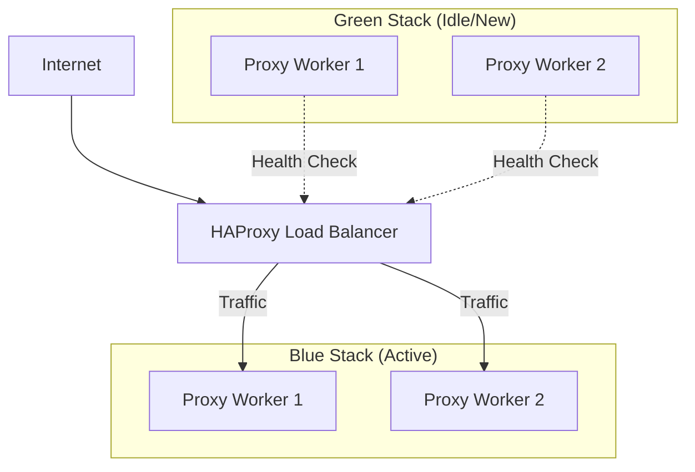

<!--
title: Zero-Downtime Blue/Green Rollouts
audience: DevOps, SecOps, SRE Teams
last_reviewed: 2026-04-03
phase: 43
-->

# Runbook: Zero-Downtime Blue/Green Rollouts

> **Audience:** DevOps, SecOps, SRE Teams
> **Scope:** Production proxy infrastructure upgrades
> **Trigger:** Deployment of new proxy versions, security patches, or configuration changes requiring a restart.

---

## 1. Overview

JA4proxy utilizes a **Blue/Green Deployment** strategy to ensure 100% availability during infrastructure updates. Two identical environments ("stacks") exist: **Blue** and **Green**. Only one is "Active" (receiving traffic) at any given time.

### Architecture



---

## 2. Performing a Rollout

To perform an automated blue/green rollout, use the `blue-green-deploy.sh` script.

### Step 1: Preparation
Ensure your environment variables (e.g., `BACKEND_HOST`) are correctly set in your shell or `.env` file.

### Step 2: Execute Deployment
```bash
./scripts/blue-green-deploy.sh deploy
```

### Automated Workflow:
1. **Identify**: Determines the currently idle color (e.g., if Blue is active, Green is next).
2. **Launch**: Starts the new stack using `docker compose -p ja4proxy-green`.
3. **Verify**: Polls the **Phase 41 Health API** (`:9090/health`) for every container in the new stack.
4. **Shift**: Atomically updates `config/haproxy.cfg` and reloads HAProxy (`SIGHUP`).
5. **Drain**: Waits 60 seconds for active connections on the old stack to complete.
6. **Cleanup**: Stops the old stack to free up resources.

---

## 3. Monitoring the Transition

During the **Drain** phase (60s), monitor the following in your Grafana dashboard:

1. **Connections per Stack**: You should see a sharp drop in `ja4proxy_connections_total` for the old color and a corresponding rise for the new color.
2. **HAProxy Stats**: Visit `http://<LB_IP>:8404/stats` to verify that all workers in the new backend are marked `UP`.
3. **Error Rates**: Ensure `ja4proxy_tls_handshake_errors_total` does not spike during the shift.

---

## 4. Emergency Rollback

If the new version exhibits issues (e.g., memory spikes, increased latency) after the traffic shift, perform an instant rollback.

### Execute Rollback:
```bash
./scripts/blue-green-deploy.sh rollback
```

### Rollback Workflow:
1. **Restore**: Immediately starts the previous stack (if stopped).
2. **Verify**: Ensures the previous stack is still healthy.
3. **Revert**: Swaps HAProxy backends back to the original color.
4. **Reload**: Triggers HAProxy hot-reload.

---

## 5. Troubleshooting

### "Deployment failed: stack is unhealthy"
*   **Cause**: New containers started but the Health API returned non-200 or timed out.
*   **Fix**: Check `docker compose -p ja4proxy-<color> logs proxy`. Common issues include invalid `proxy.yml` settings or Redis connection failures.

### "HAProxy reload failed"
*   **Cause**: HAProxy container is not running or the config is invalid.
*   **Fix**: Run `docker compose ps` to verify the load balancer status. Check `config/haproxy.cfg` for syntax errors.

### "Lock held" (Concurrent Deployments)
*   **Cause**: Another deployment or a backup/restore operation is in progress.
*   **Fix**: Verify no other engineers are deploying. If a lock is stale in Redis, clear it: `redis-cli DEL backup:operation_lock`.

---

## 6. Verification Checklist (Post-Deploy)

- [ ] `curl -sf http://localhost:9090/health` returns `{"status": "healthy"}`.
- [ ] HAProxy stats page shows all workers `UP`.
- [ ] No `CRITICAL` or `ERROR` events in the proxy logs.
- [ ] Prometheus is successfully scraping metrics from the new instances.
