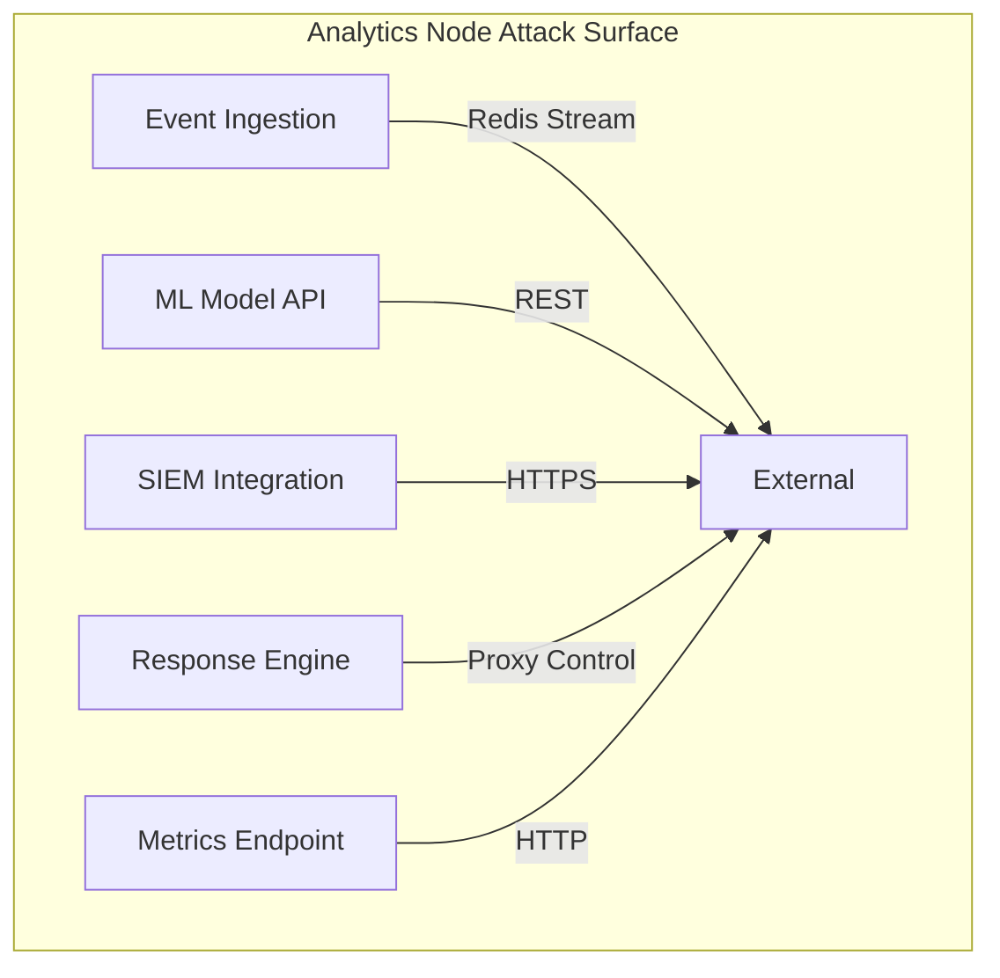
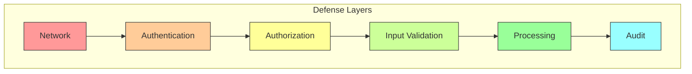
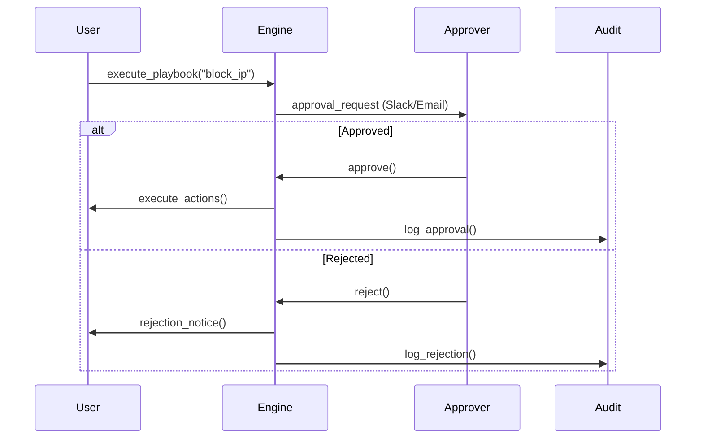
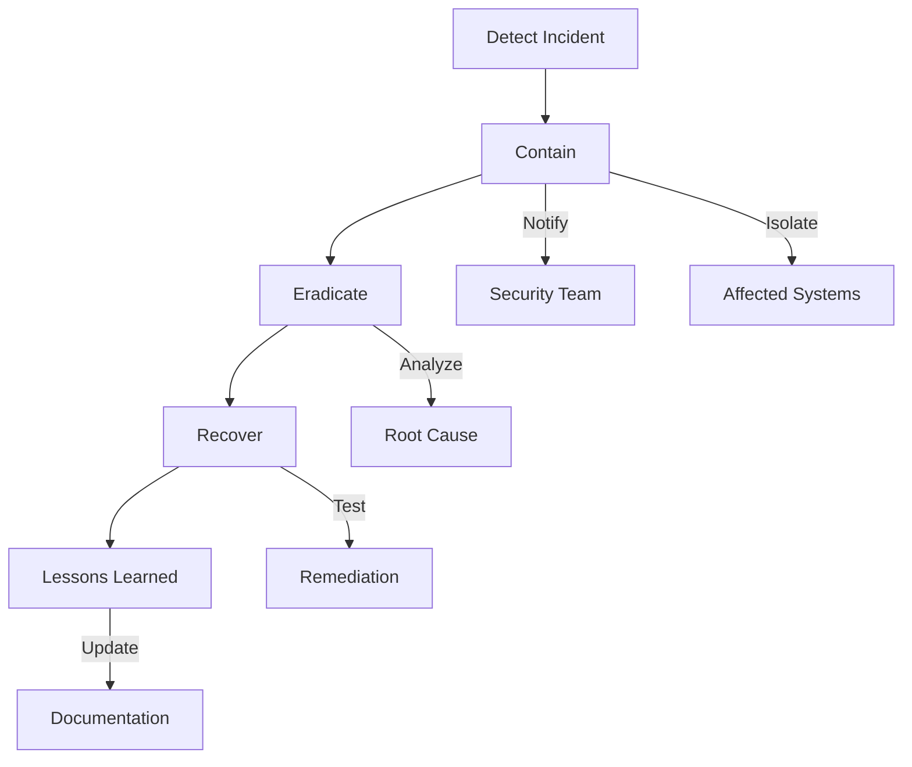
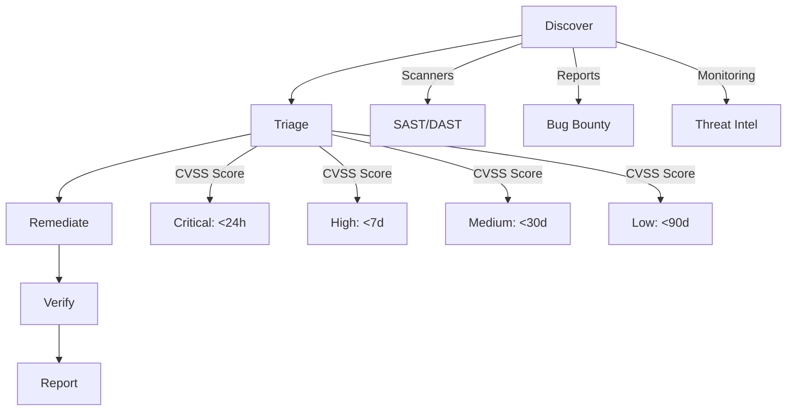

<!--
title: Analytics Security
audience: Security Teams, Auditors
last_reviewed: 2026-03-27
phase: 21
-->

# Analytics Node Security Guide

## Overview

This document provides comprehensive security guidance for the JA4Proxy Analytics Node (Phase 12). It covers threat modeling, security controls, compliance, and operational security procedures.

## Threat Model

### Attack Surface Analysis



### Threat Actors

| Actor | Motivation | Capabilities |
|-------|------------|--------------|
| **External Attackers** | Disrupt operations, steal data | Internet access, exploit kits |
| **Insider Threats** | Data exfiltration, sabotage | Internal access, privileges |
| **Compromised Proxies** | Poison analytics, evade detection | Proxy-level access |
| **Supply Chain** | Backdoor insertion | Code repository access |

### STRIDE Analysis

| Threat Type | Examples | Mitigation |
|-------------|----------|------------|
| **Spoofing** | Fake events from compromised proxies | Event signing, source validation |
| **Tampering** | Modify ML models or results | Model checksums, immutable storage |
| **Repudiation** | Deny automated actions | Comprehensive audit logging |
| **Information Disclosure** | Leak sensitive data | Data classification, encryption |
| **Denial of Service** | Overload analytics node | Rate limiting, resource isolation |
| **Elevation of Privilege** | Gain admin access | RBAC, least privilege |

## Security Architecture

### Defense in Depth Strategy



### Security Controls Matrix

| Control | Implementation | Responsibility |
|---------|----------------|---------------|
| **Authentication** | JWT tokens, API keys | Security Team |
| **Authorization** | RBAC with least privilege | Security Team |
| **Encryption** | TLS 1.2+, AES-256 | Infrastructure |
| **Audit Logging** | Immutable logs, 1-year retention | Compliance |
| **Input Validation** | Schema validation, sanitization | Development |
| **Rate Limiting** | 1000 req/min per source | Operations |

## Component-Specific Security

### 1. Event Ingestion Security

**Threats:**
- Event poisoning from compromised proxies
- Replay attacks with old events
- Event stream flooding (DoS)

**Controls:**

```python
# Event validation with signing
class SecureEventValidator:
    def __init__(self, shared_secret: str):
        self.shared_secret = shared_secret
    
    def validate(self, event: Dict) -> bool:
        # 1. Check required fields
        required = ['timestamp', 'fingerprint', 'proxy_id', 'signature']
        if not all(field in event for field in required):
            return False
        
        # 2. Validate signature
        expected_sig = self._calculate_signature(event)
        if not secrets.compare_digest(event['signature'], expected_sig):
            return False
        
        # 3. Check timestamp (anti-replay)
        event_age = time.time() - event['timestamp']
        if event_age > 300:  # 5 minute window
            return False
        
        return True
    
    def _calculate_signature(self, event: Dict) -> str:
        # Create signature without signature field
        data = {k: v for k, v in event.items() if k != 'signature'}
        message = json.dumps(data, sort_keys=True).encode()
        return hmac.new(
            self.shared_secret.encode(),
            message,
            hashlib.sha256
        ).hexdigest()
```

**Configuration:**
```yaml
# Event ingestion security settings
event_ingestion:
  # Require event signing
  require_signing: true
  
  # Anti-replay settings
  max_event_age_seconds: 300
  timestamp_tolerance_seconds: 60
  
  # Rate limiting
  max_events_per_minute: 10000
  burst_capacity: 2000
  
  # Source validation
  allowed_proxy_ids: ["proxy-01", "proxy-02", "proxy-03"]
  
  # Quarantine settings
  quarantine_suspicious: true
  quarantine_threshold: 0.95
```

### 2. ML Model Security

**Threats:**
- Model tampering (backdoor insertion)
- Model theft (IP theft)
- Adversarial ML attacks (evading detection)

**Controls:**

```python
# Secure model management
class SecureModelManager:
    def __init__(self, redis_conn, config):
        self.redis = redis_conn
        self.signing_key = config['model_signing_key']
    
    async def load_model(self, version: str) -> MLModel:
        # 1. Load model data
        model_data = await self.redis.get(f'analytics:ml:model:v{version}')
        if not model_data:
            raise ModelNotFoundError(f'Model v{version} not found')
        
        # 2. Verify signature
        signature = await self.redis.get(f'analytics:ml:model:v{version}:sig')
        if not self._verify_signature(model_data, signature):
            raise ModelIntegrityError('Model signature verification failed')
        
        # 3. Deserialize and return
        return self._deserialize_model(model_data)
    
    async def save_model(self, version: str, model: MLModel):
        # 1. Serialize model
        model_data = self._serialize_model(model)
        
        # 2. Calculate signature
        signature = self._calculate_signature(model_data)
        
        # 3. Atomic save
        async with self.redis.pipeline() as pipe:
            pipe.set(f'analytics:ml:model:v{version}', model_data)
            pipe.set(f'analytics:ml:model:v{version}:sig', signature)
            pipe.set(f'analytics:ml:model:v{version}:meta', 
                   json.dumps(model.get_metadata()))
            await pipe.execute()
    
    def _calculate_signature(self, data: bytes) -> str:
        return hmac.new(
            self.signing_key.encode(),
            data,
            hashlib.sha256
        ).hexdigest()
    
    def _verify_signature(self, data: bytes, signature: str) -> bool:
        expected = self._calculate_signature(data)
        return secrets.compare_digest(expected, signature)
```

**Model Security Best Practices:**

1. **Model Signing:** All models signed with HMAC-SHA256
2. **Immutable Storage:** Models stored with write-once semantics
3. **Version Control:** Maximum 3 versions retained
4. **Access Control:** Separate permissions for read/write
5. **Adversarial Testing:** Regular testing with adversarial samples

### 3. Automated Response Security

**Threats:**
- Unauthorized action execution
- Action replay attacks
- Overly aggressive automation

**Controls:**

```python
# Secure response engine
class SecureResponseEngine:
    def __init__(self, config):
        self.approval_required = config.get('manual_approval_required', True)
        self.approval_timeout = config.get('approval_timeout_seconds', 300)
        self.audit_logger = AuditLogger()
    
    async def execute_playbook(self, playbook_name: str, threat: Dict, 
                             requested_by: str) -> Dict:
        # 1. Validate playbook exists and is enabled
        playbook = self._get_playbook(playbook_name)
        if not playbook or playbook.get('disabled'):
            raise PlaybookNotFoundError(f'Playbook {playbook_name} not found or disabled')
        
        # 2. Check authorization
        if not await self._check_authorization(requested_by, playbook):
            raise AuthorizationError(f'User {requested_by} not authorized for {playbook_name}')
        
        # 3. Get manual approval for destructive actions
        execution_id = str(uuid.uuid4())
        if self._requires_approval(playbook):
            approval = await self._request_approval(playbook_name, threat, requested_by)
            if not approval or not approval.get('approved'):
                await self.audit_logger.log(
                    'playbook_rejected',
                    execution_id=execution_id,
                    playbook=playbook_name,
                    reason='manual_rejection'
                )
                return {'status': 'rejected', 'execution_id': execution_id}
        
        # 4. Execute with timeout
        try:
            async with async_timeout.timeout(self.approval_timeout):
                result = await self._execute_actions(playbook, threat, execution_id)
                
                # 5. Audit all actions
                await self.audit_logger.log(
                    'playbook_executed',
                    execution_id=execution_id,
                    playbook=playbook_name,
                    actions=result['actions'],
                    requested_by=requested_by
                )
                
                return {'status': 'completed', 'execution_id': execution_id, **result}
        except asyncio.TimeoutError:
            await self._rollback_actions(execution_id)
            await self.audit_logger.log(
                'playbook_timeout',
                execution_id=execution_id,
                playbook=playbook_name
            )
            return {'status': 'timeout', 'execution_id': execution_id}
    
    def _requires_approval(self, playbook: Dict) -> bool:
        """Check if playbook requires manual approval"""
        for action in playbook.get('actions', []):
            if action.get('type') == 'manual_approval':
                return True
        return False
```

**Approval Workflow:**



### 4. SIEM Integration Security

**Threats:**
- Credential leakage
- Man-in-the-middle attacks
- SIEM impersonation

**Controls:**

```python
# Secure SIEM connector
class SecureSIEMConnector:
    def __init__(self, config):
        self.endpoint = config['endpoint']
        self.token = config['token']
        
        # Certificate pinning
        self.ssl_context = self._create_ssl_context(config.get('cert_pinning'))
        
        # Rate limiting
        self.rate_limiter = RateLimiter(
            config.get('max_requests', 100),
            config.get('time_window', 60)
        )
    
    def _create_ssl_context(self, cert_pinning: Optional[Dict]) -> ssl.SSLContext:
        context = ssl.create_default_context(cafile=cert_pinning.get('ca_bundle') if cert_pinning else None)
        
        # Modern TLS only
        context.minimum_version = ssl.TLSVersion.TLSv1_2
        context.maximum_version = ssl.TLSVersion.TLSv1_3
        
        # Disable weak ciphers
        context.set_ciphers('ECDHE-ECDSA-AES256-GCM-SHA384:ECDHE-RSA-AES256-GCM-SHA384')
        
        if cert_pinning and cert_pinning.get('cert_hash'):
            # Certificate pinning
            context.check_hostname = True
            context.verify_mode = ssl.CERT_REQUIRED
            
            # Load pinned certificate
            def cert_verify_callback(conn, cert, errnum, depth, ok):
                if not ok:
                    return ok
                
                # Verify certificate hash
                cert_der = conn.getpeercert(binary_form=True)
                cert_hash = hashlib.sha256(cert_der).hexdigest()
                
                if cert_hash != cert_pinning['cert_hash']:
                    raise ssl.SSLError("Certificate pinning verification failed")
                
                return True
            
            context.verify_callback = cert_verify_callback
        
        return context
    
    async def send_alert(self, alert: Dict) -> Dict:
        # Apply rate limiting
        with self.rate_limiter:
            # Add request ID for correlation
            request_id = str(uuid.uuid4())
            alert['_request_id'] = request_id
            
            # Sign alert for integrity
            alert['_signature'] = self._sign_alert(alert)
            
            headers = {
                'Authorization': f'Bearer {self.token}',
                'Content-Type': 'application/json',
                'X-Request-ID': request_id,
                'User-Agent': 'JA4Proxy-Analytics/1.0'
            }
            
            async with aiohttp.ClientSession(
                connector=aiohttp.TCPConnector(ssl=self.ssl_context)
            ) as session:
                
                async with session.post(
                    f'{self.endpoint}/services/collector',
                    headers=headers,
                    json=alert,
                    timeout=aiohttp.ClientTimeout(total=30)
                ) as response:
                    
                    # Verify response signature if available
                    response_data = await response.json()
                    if '_signature' in response_data:
                        self._verify_response_signature(response_data)
                    
                    return {
                        'status': 'sent',
                        'request_id': request_id,
                        'siem_response': response_data
                    }
```

**SIEM Security Configuration:**
```yaml
# SIEM integration security settings
siem:
  # Authentication
  token: "${SIEM_TOKEN}"  # From secret management
  token_rotation_hours: 24
  
  # Transport security
  ssl:
    minimum_version: "TLSv1.2"
    cert_pinning:
      enabled: true
      cert_hash: "a1b2c3..."  # SHA256 of SIEM cert
      ca_bundle: "/etc/ssl/certs/ca-bundle.crt"
  
  # Rate limiting
  max_requests: 100
  time_window: 60
  
  # Data protection
  redact_fields: ["password", "api_key", "token"]
  
  # Monitoring
  health_check_interval: 60
  max_failures: 3
```

## Operational Security

### Access Control

**Role-Based Access Control (RBAC):**

| Role | Analytics Permissions | Approval Rights |
|------|----------------------|-----------------|
| **Security Admin** | Read/Write | All actions |
| **Security Analyst** | Read | None |
| **Operator** | Read | Non-destructive |
| **Auditor** | Read (audit only) | None |

**Implementation:**
```yaml
# RBAC configuration
rbac:
  roles:
    security_admin:
      permissions:
        - "analytics:read"
        - "analytics:write"
        - "ml:read"
        - "ml:write"
        - "response:execute"
        - "response:approve:*"
        - "siem:read"
        - "siem:write"
      
    security_analyst:
      permissions:
        - "analytics:read"
        - "ml:read"
        - "response:read"
        - "siem:read"
      
    operator:
      permissions:
        - "analytics:read"
        - "ml:read"
        - "response:execute"
        - "response:approve:non_destructive"
      
    auditor:
      permissions:
        - "audit:read"
        - "analytics:read:audit"
```

### Audit Logging

**Audit Log Requirements:**

| Event Type | Fields Required | Retention |
|------------|-----------------|-----------|
| **Model Load** | version, timestamp, user, result | 1 year |
| **Model Update** | old_version, new_version, user, approval | 7 years |
| **Anomaly Detection** | fingerprint_id, score, threshold, result | 30 days |
| **Automated Action** | action_type, target, user, approval, result | 7 years |
| **SIEM Alert** | alert_id, severity, timestamp, result | 1 year |
| **Configuration Change** | setting, old_value, new_value, user | 7 years |

**Audit Log Implementation:**
```python
class AuditLogger:
    def __init__(self, redis_conn, config):
        self.redis = redis_conn
        self.retention = config.get('retention_days', 365)
        self.stream_key = config.get('stream_key', 'ja4proxy:audit')
        self.max_length = config.get('max_length', 100000)
    
    async def log(self, event_type: str, **kwargs) -> str:
        """Log audit event with immutable timestamp"""
        
        # Generate unique event ID
        event_id = str(uuid.uuid4())
        
        # Create audit record
        record = {
            'id': event_id,
            'timestamp': datetime.utcnow().isoformat() + 'Z',
            'type': event_type,
            'user': kwargs.get('user', 'system'),
            'ip_address': kwargs.get('ip_address'),
            **{k: v for k, v in kwargs.items() if k not in ['user', 'ip_address']}
        }
        
        # Sign record for integrity
        record['_signature'] = self._sign_record(record)
        
        # Store in Redis stream (immutable)
        await self.redis.xadd(
            self.stream_key,
            {'event': json.dumps(record)},
            maxlen=self.max_length,
            approximate=True
        )
        
        # Also store in hash for direct access
        await self.redis.hset(
            f'audit:{event_id}',
            mapping=record
        )
        
        # Set expiration based on retention policy
        if event_type in ['model_update', 'automated_action', 'configuration_change']:
            # 7 years for critical events
            await self.redis.expire(f'audit:{event_id}', 7 * 365 * 24 * 3600)
        else:
            # 1 year for other events
            await self.redis.expire(f'audit:{event_id}', self.retention * 24 * 3600)
        
        return event_id
    
    def _sign_record(self, record: Dict) -> str:
        """Create HMAC signature for audit record"""
        # Create canonical form
        canonical = json.dumps(record, sort_keys=True, separators=(',', ':'))
        return hmac.new(
            b'audit_signing_key',  # Should come from secure config
            canonical.encode(),
            hashlib.sha256
        ).hexdigest()
    
    async def get_audit_record(self, event_id: str) -> Optional[Dict]:
        """Retrieve and verify audit record"""
        record = await self.redis.hgetall(f'audit:{event_id}')
        if not record:
            return None
        
        # Verify signature
        if not self._verify_record(record):
            raise AuditTamperingError(f'Audit record {event_id} signature invalid')
        
        return record
    
    def _verify_record(self, record: Dict) -> bool:
        """Verify audit record signature"""
        # Recreate canonical form (without signature)
        canonical_data = {k: v for k, v in record.items() if not k.startswith('_')}
        canonical = json.dumps(canonical_data, sort_keys=True, separators=(',', ':'))
        
        expected_sig = hmac.new(
            b'audit_signing_key',
            canonical.encode(),
            hashlib.sha256
        ).hexdigest()
        
        return secrets.compare_digest(expected_sig, record.get('_signature', ''))
```

### Incident Response

**Security Incident Response Plan:**



**Analytics-Specific Incidents:**

| Incident Type | Detection | Response |
|---------------|-----------|----------|
| **Model Tampering** | Signature verification failure | Rollback to previous version, investigate |
| **Event Poisoning** | High anomaly rate from source | Quarantine source, alert security |
| **Credential Leak** | Unauthorized API access | Rotate credentials, revoke access |
| **DoS Attack** | High event rate, resource exhaustion | Rate limit source, alert security |
| **Data Exfiltration** | Unusual SIEM query patterns | Disable SIEM access, investigate |

## Compliance

### GDPR Compliance

**Data Protection Measures:**

1. **Pseudonymization:**
   ```python
   def pseudonymize_ip(ip_address: str) -> str:
       """Convert IP to pseudonymized form for GDPR compliance"""
       try:
           # For IPv4
           packed = socket.inet_aton(ip_address)
           hex_form = binascii.hexlify(packed).decode()
           # Use SHA256 with salt
           salted = f"{hex_form}:{GDPR_SALT}"
           return hashlib.sha256(salted.encode()).hexdigest()
       except:
           return "invalid_ip"
   ```

2. **Data Retention:**
   ```yaml
   # GDPR retention policies
   data_retention:
     # Personal data retention
     client_ips: 30  # days
     user_agents: 30
     
     # Non-personal data retention
     fingerprints: 90
     events: 90
     
     # Security data retention
     audit_logs: 365
     security_events: 365
   ```

3. **Right to Erasure:**
   ```bash
   # GDPR deletion command
   ./ja4proxy-gdpr delete \
     --data-type client_ip \
     --identifier 192.168.1.100 \
     --reason "GDPR request #12345"
   ```

### PCI-DSS Compliance

**Security Controls:**

| Requirement | Implementation |
|-------------|----------------|
| **1.1** Network Security | Firewall rules, network segmentation |
| **1.2** Router Security | Secure router configuration |
| **2.2** System Passwords | Strong password policy, rotation |
| **3.5** Protect Cardholder Data | Encryption at rest and in transit |
| **5.1** Anti-Virus | Regular scans, signature updates |
| **6.5** Secure Development | Code reviews, security testing |
| **7.1** Access Control | RBAC, least privilege |
| **8.1** User Authentication | MFA, strong passwords |
| **10.1** Audit Trails | Comprehensive logging |
| **11.1** Vulnerability Scanning | Regular scans, patch management |

**PCI-DSS Specific Configuration:**
```yaml
# PCI-DSS security settings
pci_compliance:
  # Encryption requirements
  encryption:
    minimum_tls: "TLSv1.2"
    cipher_suite: "ECDHE-ECDSA-AES256-GCM-SHA384:ECDHE-RSA-AES256-GCM-SHA384"
    
  # Access control
  access_control:
    mfa_required: true
    password_complexity:
      min_length: 12
      require_upper: true
      require_lower: true
      require_digit: true
      require_special: true
      max_age_days: 90
    
  # Audit requirements
  audit:
    retention_days: 365
    immutable_storage: true
    real_time_alerting: true
    
  # Network security
  network:
    firewall_rules:
      - action: "ALLOW"
        source: "10.0.0.0/8"
        destination: "analytics_service"
        port: 8080
        protocol: "TCP"
      - action: "DENY"
        source: "0.0.0.0/0"
        destination: "analytics_service"
        port: "any"
```

### SOC 2 Compliance

**Trust Services Criteria:**

| Criteria | Implementation |
|----------|----------------|
| **Security** | Comprehensive security controls |
| **Availability** | High availability architecture |
| **Processing Integrity** | Data validation, error handling |
| **Confidentiality** | Encryption, access controls |
| **Privacy** | GDPR compliance, data protection |

**SOC 2 Audit Evidence:**

1. **Security:**
   - Regular vulnerability scans
   - Penetration testing reports
   - Security incident logs
   - Access control reviews

2. **Availability:**
   - Uptime monitoring reports
   - Disaster recovery test results
   - Failover testing documentation
   - Capacity planning reports

3. **Processing Integrity:**
   - Data validation test results
   - Error handling documentation
   - Data integrity verification logs
   - Processing accuracy reports

4. **Confidentiality:**
   - Encryption verification
   - Access control audits
   - Data classification documentation
   - Confidentiality agreement records

5. **Privacy:**
   - GDPR compliance documentation
   - Privacy impact assessments
   - Data retention policy compliance
   - Subject access request logs

## Security Testing

### Penetration Testing Guide

**Scope:**
- Event ingestion API
- ML model endpoints
- Response engine API
- SIEM integration
- Metrics endpoints

**Test Cases:**

| Test Case | Description | Expected Result |
|-----------|-------------|-----------------|
| **Auth Bypass** | Attempt to bypass authentication | Access denied |
| **SQL Injection** | Test for SQLi in API endpoints | Input sanitized |
| **XSS Attack** | Test for XSS in web interfaces | Input escaped |
| **CSRF Attack** | Test for CSRF vulnerabilities | CSRF tokens required |
| **Model Tampering** | Attempt to upload malicious model | Signature verification fails |
| **Event Poisoning** | Send malformed events | Events rejected |
| **Rate Limit Bypass** | Exceed rate limits | Requests blocked |
| **Privilege Escalation** | Attempt to gain admin access | Access denied |

**Automated Testing:**
```bash
# Run security scans
./scripts/run-security-scans.sh

# Static code analysis
bandit -r src/analytics/
safety check

# Dependency scanning
dependency-check --scan .

# Container scanning
docker scan ja4proxy-analytics:latest
```

### Vulnerability Management

**Process:**



**Patch Management:**
```yaml
# Vulnerability management configuration
vulnerability_management:
  # Scanning schedule
  sast_scan: "daily"
  dast_scan: "weekly"
  dependency_scan: "daily"
  container_scan: "on_build"
  
  # Remediation SLAs
  remediation_slas:
    critical: "PT24H"  # 24 hours
    high: "P7D"       # 7 days
    medium: "P30D"    # 30 days
    low: "P90D"      # 90 days
  
  # Notification
  notifications:
    new_vulnerability:
      - "security-team@example.com"
      - "#security-alerts"
    
  # Exceptions
  allowed_exceptions:
    - cve: "CVE-2021-1234"
      reason: "False positive in dependency"
      expires: "2024-12-31"
      
  # Reporting
  reports:
    monthly_vulnerability_report: "security-leadership@example.com"
    quarterly_compliance_report: "compliance@example.com"
```

## Security Checklist

### Pre-Deployment Checklist

- [ ] All secrets stored in secure vault (not in code/config)
- [ ] TLS configured with modern ciphers (TLS 1.2+)
- [ ] All API endpoints require authentication
- [ ] RBAC implemented and tested
- [ ] Audit logging enabled and verified
- [ ] Rate limiting configured and tested
- [ ] Input validation implemented for all endpoints
- [ ] Dependency scanning completed (no critical vulnerabilities)
- [ ] Security headers configured (CSP, HSTS, etc.)
- [ ] Backup and restore procedure tested
- [ ] Incident response plan reviewed

### Operational Checklist

- [ ] Regular vulnerability scans scheduled
- [ ] Secret rotation procedure in place
- [ ] Audit logs monitored and alerted
- [ ] Security patches applied promptly
- [ ] Access reviews conducted quarterly
- [ ] Security training completed by team
- [ ] Disaster recovery plan tested annually
- [ ] Compliance certifications maintained

### Decommissioning Checklist

- [ ] All sensitive data securely erased
- [ ] Secrets rotated or revoked
- [ ] Audit logs archived
- [ ] Access credentials disabled
- [ ] Network access removed
- [ ] Documentation updated
- [ ] Compliance records updated

## References

### Security Standards

- **OWASP Top 10**: https://owasp.org/www-project-top-ten/
- **CIS Controls**: https://www.cisecurity.org/controls/
- **NIST SP 800-53**: https://csrc.nist.gov/publications/detail/sp/800-53/rev-5/final
- **ISO 27001**: https://www.iso.org/isoiec-27001-information-security.html
- **GDPR**: https://gdpr-info.eu/
- **PCI-DSS**: https://www.pcisecuritystandards.org/

### Tools and Resources

- **Static Analysis**: Bandit, Safety, Semgrep
- **Dynamic Analysis**: OWASP ZAP, Burp Suite
- **Dependency Scanning**: Dependabot, Snyk
- **Secret Detection**: GitLeaks, TruffleHog
- **Container Scanning**: Trivy, Clair
- **Compliance**: OpenSCAP, Chef InSpec

### Related Documentation

- [System Architecture](../architecture/system-architecture.md)
- [Analytics Architecture](../architecture/analytics-node-architecture.md)
- [Developer Guide](../developer/analytics-development.md)
- [Comprehensive Security Audit](COMPREHENSIVE_SECURITY_AUDIT.md)
- [Security Checklist](SECURITY_CHECKLIST.md)
- [Phase 12 Planning Documents](phases/PHASE_12*.md)