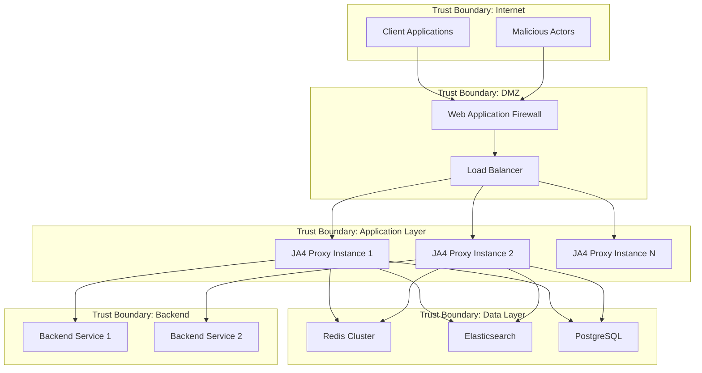

# JA4 Proxy Threat Model

> **Note:** This threat model covers the full target architecture including enterprise components (PostgreSQL, Elasticsearch, Kubernetes) not yet implemented in the POC. See [README](../../README.md) for current POC capabilities.

## Executive Summary

This document provides a comprehensive threat model for the JA4 Proxy system using the STRIDE methodology (Spoofing, Tampering, Repudiation, Information Disclosure, Denial of Service, Elevation of Privilege). The analysis covers threat identification, risk assessment, and mitigation strategies to ensure robust security posture.

## System Overview

### Assets and Data Flows



### Critical Assets

1. **JA4 Fingerprint Database**
   - Contains TLS fingerprints and associated metadata
   - Risk: Privacy breach, competitive intelligence
   - Value: High (contains patterns used for security decisions)

2. **Security Policies and Rules**
   - Whitelist/blacklist configurations
   - Rate limiting and filtering rules
   - Risk: Security bypass, unauthorized access
   - Value: Critical (core security controls)

3. **TLS Traffic Metadata**
   - Connection patterns and analysis results
   - Risk: Privacy violation, traffic analysis
   - Value: Medium (contains behavioral patterns)

4. **Authentication Credentials**
   - API keys, certificates, tokens
   - Risk: Complete system compromise
   - Value: Critical (system access control)

5. **System Configuration**
   - Infrastructure and application settings
   - Risk: Service disruption, security bypass
   - Value: High (operational integrity)

## STRIDE Threat Analysis

### Spoofing (Identity)

#### Threat: Client Identity Spoofing
- **Description**: Attacker impersonates legitimate client using stolen credentials or certificates
- **Impact**: Unauthorized access, security bypass, data manipulation
- **Likelihood**: Medium
- **Attack Vectors**:
  - Certificate theft and replay
  - API key compromise
  - Session hijacking
  - IP address spoofing

**Mitigation Controls**:
```yaml
Authentication:
  - Multi-factor authentication (MFA)
  - Certificate-based authentication with CRL checking
  - Mutual TLS (mTLS) for service communication
  - Regular credential rotation

Network Security:
  - IP allowlist for administrative access
  - Network-level authentication
  - Anti-spoofing filters
  - Source address validation
```

#### Threat: Service Identity Spoofing
- **Description**: Malicious service impersonates legitimate backend services
- **Impact**: Data interception, service disruption, credential theft
- **Likelihood**: Low
- **Attack Vectors**:
  - DNS poisoning
  - Certificate authority compromise
  - Man-in-the-middle attacks

**Mitigation Controls**:
```yaml
Service Authentication:
  - Certificate pinning
  - Mutual TLS verification
  - Service mesh authentication
  - Regular certificate validation
```

### Tampering (Integrity)

#### Threat: Configuration Tampering
- **Description**: Unauthorized modification of security policies and system configuration
- **Impact**: Security bypass, service disruption, compliance violations
- **Likelihood**: Medium
- **Attack Vectors**:
  - Privileged account compromise
  - Configuration file modification
  - Database manipulation
  - Memory corruption attacks

**Mitigation Controls**:
```yaml
Configuration Protection:
  - Configuration signing and verification
  - Immutable infrastructure patterns
  - Version control for all configurations
  - Regular integrity checks
  - Role-based access control (RBAC)

Runtime Protection:
  - Memory protection mechanisms
  - Code signing verification
  - Runtime application self-protection (RASP)
  - Filesystem integrity monitoring
```

#### Threat: Data Tampering
- **Description**: Modification of JA4 fingerprints, security lists, or audit logs
- **Impact**: Security bypass, evidence destruction, compliance violations
- **Likelihood**: Low
- **Attack Vectors**:
  - Database compromise
  - Memory injection attacks
  - Log file modification
  - Cache poisoning

**Mitigation Controls**:
```yaml
Data Integrity:
  - Cryptographic checksums for all data
  - Blockchain-based audit trails
  - Write-once-read-many (WORM) storage
  - Database transaction logging
  - Regular data validation checks
```

### Repudiation (Non-repudiation)

#### Threat: Action Repudiation
- **Description**: Users or administrators deny performing security-relevant actions
- **Impact**: Compliance violations, forensic challenges, accountability gaps
- **Likelihood**: Medium
- **Attack Vectors**:
  - Shared account usage
  - Log tampering or deletion
  - Insufficient audit trails
  - Time synchronization attacks

**Mitigation Controls**:
```yaml
Audit and Logging:
  - Comprehensive audit logging for all actions
  - Immutable audit trails with cryptographic signing
  - Network Time Protocol (NTP) synchronization
  - Individual account requirements
  - Multi-party authorization for critical actions

Evidence Preservation:
  - Tamper-evident logging systems
  - Log correlation across multiple systems
  - Legal hold procedures
  - Chain of custody documentation
```

### Information Disclosure (Confidentiality)

#### Threat: Sensitive Data Exposure
- **Description**: Unauthorized access to TLS fingerprints, personal data, or system information
- **Impact**: Privacy violations, competitive disadvantage, regulatory penalties
- **Likelihood**: High
- **Attack Vectors**:
  - Database breach
  - Memory dumps
  - Log file exposure
  - Side-channel attacks
  - Insider threats

**Mitigation Controls**:
```yaml
Data Protection:
  - Encryption at rest (AES-256)
  - Encryption in transit (TLS 1.3)
  - Data pseudonymization and anonymization
  - Field-level encryption for sensitive data
  - Regular data classification reviews

Access Control:
  - Principle of least privilege
  - Need-to-know basis access
  - Regular access reviews
  - Data loss prevention (DLP) tools
  - Privileged access management (PAM)
```

#### Threat: System Information Disclosure
- **Description**: Exposure of system architecture, vulnerabilities, or operational details
- **Impact**: Targeted attacks, vulnerability exploitation, reconnaissance
- **Likelihood**: Medium
- **Attack Vectors**:
  - Error message leakage
  - Debug information exposure
  - Metadata extraction
  - Timing attacks
  - Network reconnaissance

**Mitigation Controls**:
```yaml
Information Security:
  - Generic error messages
  - Debug mode disabled in production
  - Metadata scrubbing
  - Network segmentation
  - Security headers implementation
```

### Denial of Service (Availability)

#### Threat: Resource Exhaustion Attacks
- **Description**: Overwhelming system resources to cause service degradation or outage
- **Impact**: Service unavailability, performance degradation, business disruption
- **Likelihood**: High
- **Attack Vectors**:
  - Volume-based DDoS attacks
  - Protocol-based attacks
  - Application-layer attacks
  - Resource consumption attacks
  - Amplification attacks

**Mitigation Controls**:
```yaml
DDoS Protection:
  - Rate limiting and throttling
  - Traffic shaping and prioritization
  - CDN and DDoS mitigation services
  - Auto-scaling capabilities
  - Circuit breaker patterns

Resource Management:
  - Connection limits and timeouts
  - Memory and CPU quotas
  - Database connection pooling
  - Graceful degradation mechanisms
  - Health checks and monitoring
```

#### Threat: Service Logic Attacks
- **Description**: Exploiting business logic flaws to cause service disruption
- **Impact**: Service malfunction, data corruption, business logic bypass
- **Likelihood**: Medium
- **Attack Vectors**:
  - Business logic manipulation
  - State confusion attacks
  - Race condition exploitation
  - Input validation bypass

**Mitigation Controls**:
```yaml
Logic Protection:
  - Comprehensive input validation
  - State machine validation
  - Race condition prevention
  - Business rule enforcement
  - Comprehensive testing including edge cases
```

### Elevation of Privilege (Authorization)

#### Threat: Privilege Escalation
- **Description**: Gaining higher privileges than authorized through system vulnerabilities
- **Impact**: Complete system compromise, data breach, service disruption
- **Likelihood**: Medium
- **Attack Vectors**:
  - Buffer overflow exploitation
  - SQL injection attacks
  - Container escape
  - Kernel vulnerabilities
  - Misconfigurations

**Mitigation Controls**:
```yaml
Privilege Management:
  - Principle of least privilege enforcement
  - Regular privilege reviews and attestation
  - Privileged access management (PAM) solutions
  - Just-in-time (JIT) access provisioning
  - Separation of duties implementation

System Hardening:
  - Container security best practices
  - Kernel hardening and patching
  - Security-Enhanced Linux (SELinux) or AppArmor
  - Address Space Layout Randomization (ASLR)
  - Data Execution Prevention (DEP)
```

## Risk Assessment Matrix

### Risk Calculation
Risk = Impact × Likelihood × Asset Value

| Threat Category | Impact | Likelihood | Asset Value | Risk Score | Priority |
|----------------|--------|------------|-------------|------------|----------|
| Client Spoofing | High | Medium | Critical | 9 | P1 |
| Configuration Tampering | High | Medium | Critical | 9 | P1 |
| Data Exposure | High | High | High | 12 | P0 |
| DDoS Attacks | Medium | High | High | 8 | P1 |
| Privilege Escalation | High | Medium | Critical | 9 | P1 |
| Log Tampering | Medium | Low | Medium | 3 | P3 |
| Service Spoofing | Medium | Low | High | 4 | P2 |
| Info Disclosure | Medium | Medium | Medium | 4 | P2 |

### Risk Prioritization

**P0 (Critical - Immediate Action Required)**
- Sensitive Data Exposure
- Authentication Bypass

**P1 (High - Address Within 30 Days)**
- Client Identity Spoofing
- Configuration Tampering
- DDoS Resource Exhaustion
- Privilege Escalation Attacks

**P2 (Medium - Address Within 90 Days)**
- System Information Disclosure
- Service Logic Attacks
- Business Logic Bypass

**P3 (Low - Monitor and Address as Resources Allow)**
- Log File Tampering
- Minor Information Leaks
- Non-critical Service Disruptions

## Attack Trees

### Attack Tree: Data Breach via Database Compromise

```
Goal: Steal JA4 Fingerprint Database
├── OR
    ├── Direct Database Access
    │   ├── AND
    │   │   ├── Credential Compromise
    │   │   │   ├── Password Brute Force
    │   │   │   ├── Credential Stuffing
    │   │   │   └── Social Engineering
    │   │   └── Network Access
    │   │       ├── VPN Compromise
    │   │       ├── Internal Network Access
    │   │       └── Database Port Exposure
    │   └── Database Vulnerability Exploitation
    │       ├── SQL Injection
    │       ├── Unpatched Database Software
    │       └── Weak Database Configuration
    ├── Application Layer Attack
    │   ├── AND
    │   │   ├── Application Vulnerability
    │   │   │   ├── Code Injection
    │   │   │   ├── Authentication Bypass
    │   │   │   └── Authorization Flaws
    │   │   └── Data Access
    │   │       ├── ORM Manipulation
    │   │   │       ├── Cache Poisoning
    │   │       └── Memory Extraction
    └── Infrastructure Compromise
        ├── AND
        │   ├── System Access
        │   │   ├── Container Escape
        │   │   ├── Privilege Escalation
        │   │   └── Host Compromise
        │   └── Data Extraction
        │       ├── Memory Dumps
        │       ├── File System Access
        │       └── Network Sniffing
```

### Attack Tree: Service Disruption via DDoS

```
Goal: Disrupt JA4 Proxy Service
├── OR
    ├── Network Layer DDoS
    │   ├── Volumetric Attacks
    │   │   ├── UDP Flood
    │   │   ├── ICMP Flood
    │   │   └── Spoofed Packet Flood
    │   └── Protocol Attacks
    │       ├── SYN Flood
    │       ├── TCP Reset Attack
    │       └── Fragmentation Attack
    ├── Application Layer DDoS
    │   ├── HTTP Flood
    │   ├── Slowloris Attack
    │   ├── Slow POST Attack
    │   └── Resource Exhaustion
    │       ├── Memory Exhaustion
    │       ├── CPU Exhaustion
    │       └── Connection Exhaustion
    └── Logic Layer Attacks
        ├── Business Logic Abuse
        ├── API Rate Limit Bypass
        ├── Cache Exhaustion
        └── Database Connection Pool Exhaustion
```

## Security Controls Mapping

### NIST Cybersecurity Framework Mapping

| Function | Category | Controls | Implementation |
|----------|----------|----------|----------------|
| Identify | Asset Management | Asset inventory, data classification | CMDB, data flow diagrams |
| Identify | Risk Assessment | Threat modeling, vulnerability assessment | This document, regular scans |
| Protect | Access Control | Authentication, authorization | MFA, RBAC, PAM |
| Protect | Data Security | Encryption, data protection | AES-256, TLS 1.3, DLP |
| Detect | Anomaly Detection | Behavior analysis, monitoring | SIEM, ML-based detection |
| Detect | Security Monitoring | Logging, real-time monitoring | ELK stack, Prometheus |
| Respond | Incident Response | Response planning, communications | IRP, escalation procedures |
| Respond | Mitigation | Containment, eradication | Automated responses, isolation |
| Recover | Recovery Planning | Recovery procedures, improvements | DR plans, lessons learned |
| Recover | Communications | Recovery communications | Status pages, stakeholder updates |

### OWASP Top 10 Mapping

| OWASP Risk | Threat Scenario | Mitigation Controls |
|------------|-----------------|-------------------|
| A01: Broken Access Control | Privilege escalation, unauthorized access | RBAC, access reviews, principle of least privilege |
| A02: Cryptographic Failures | Data exposure, weak encryption | Strong encryption (AES-256), proper key management |
| A03: Injection | SQL injection, command injection | Input validation, parameterized queries, sandboxing |
| A04: Insecure Design | Business logic flaws, architectural issues | Threat modeling, secure design principles |
| A05: Security Misconfiguration | Default passwords, unnecessary services | Security baselines, configuration management |
| A06: Vulnerable Components | Known vulnerabilities in dependencies | Dependency scanning, patch management |
| A07: Authentication Failures | Weak passwords, session management | MFA, strong password policy, session security |
| A08: Software Integrity Failures | Supply chain attacks, unsigned code | Code signing, integrity verification, SCA |
| A09: Logging Failures | Insufficient logging, log tampering | Comprehensive logging, SIEM, log integrity |
| A10: Server-Side Request Forgery | Internal network access, data exfiltration | Input validation, network segmentation, allowlists |

## Recommendations

### Immediate Actions (0-30 days)

1. **Implement Comprehensive Logging**
   - Deploy SIEM solution with real-time monitoring
   - Ensure all security events are logged and correlated
   - Implement log integrity protection mechanisms

2. **Strengthen Authentication**
   - Mandate multi-factor authentication for all accounts
   - Implement certificate-based authentication for services
   - Deploy privileged access management (PAM) solution

3. **Enhance Network Security**
   - Deploy web application firewall (WAF)
   - Implement DDoS protection services
   - Configure network segmentation and micro-segmentation

### Medium-term Actions (30-90 days)

1. **Implement Advanced Threat Detection**
   - Deploy user and entity behavior analytics (UEBA)
   - Implement machine learning-based anomaly detection
   - Integrate threat intelligence feeds

2. **Strengthen Data Protection**
   - Implement field-level encryption for sensitive data
   - Deploy data loss prevention (DLP) solutions
   - Enhance backup and recovery procedures

3. **Improve Incident Response**
   - Develop automated incident response playbooks
   - Conduct regular incident response exercises
   - Implement security orchestration and automated response (SOAR)

### Long-term Actions (90+ days)

1. **Implement Zero Trust Architecture**
   - Deploy identity-based network access controls
   - Implement continuous authentication and authorization
   - Enhance endpoint detection and response (EDR)

2. **Advanced Security Testing**
   - Implement continuous security testing in CI/CD pipeline
   - Conduct regular red team exercises
   - Deploy application security testing tools (SAST/DAST/IAST)

3. **Compliance and Governance**
   - Achieve SOC 2 Type II certification
   - Implement privacy by design principles
   - Establish security governance framework

## Conclusion

This threat model provides a comprehensive analysis of security threats facing the JA4 Proxy system. The identified threats range from common web application vulnerabilities to sophisticated advanced persistent threats. The recommended security controls and mitigation strategies follow industry best practices and regulatory requirements.

Regular review and updates of this threat model are essential as the system evolves and new threats emerge. The threat model should be revisited quarterly or whenever significant changes are made to the system architecture or threat landscape.